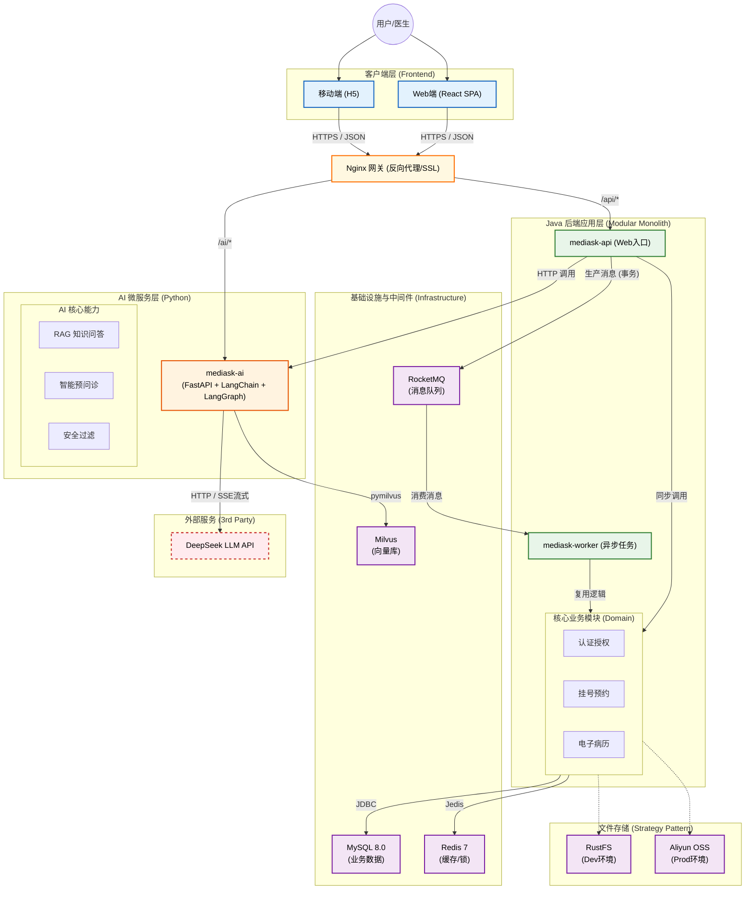
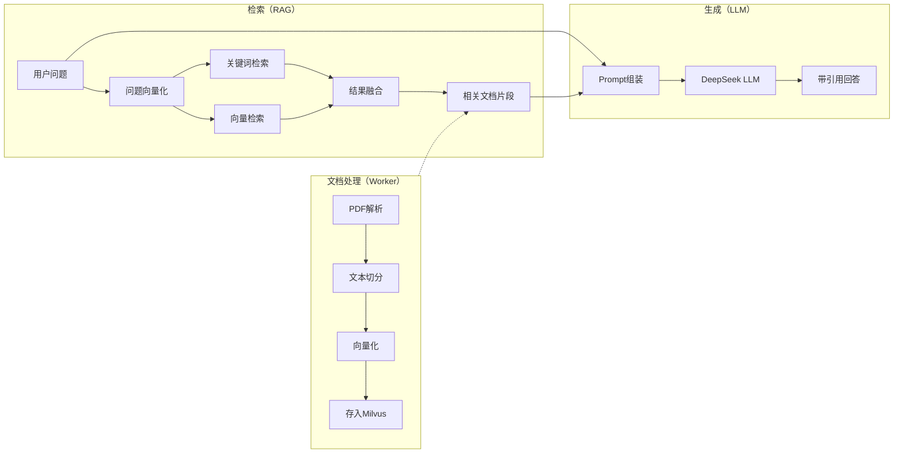
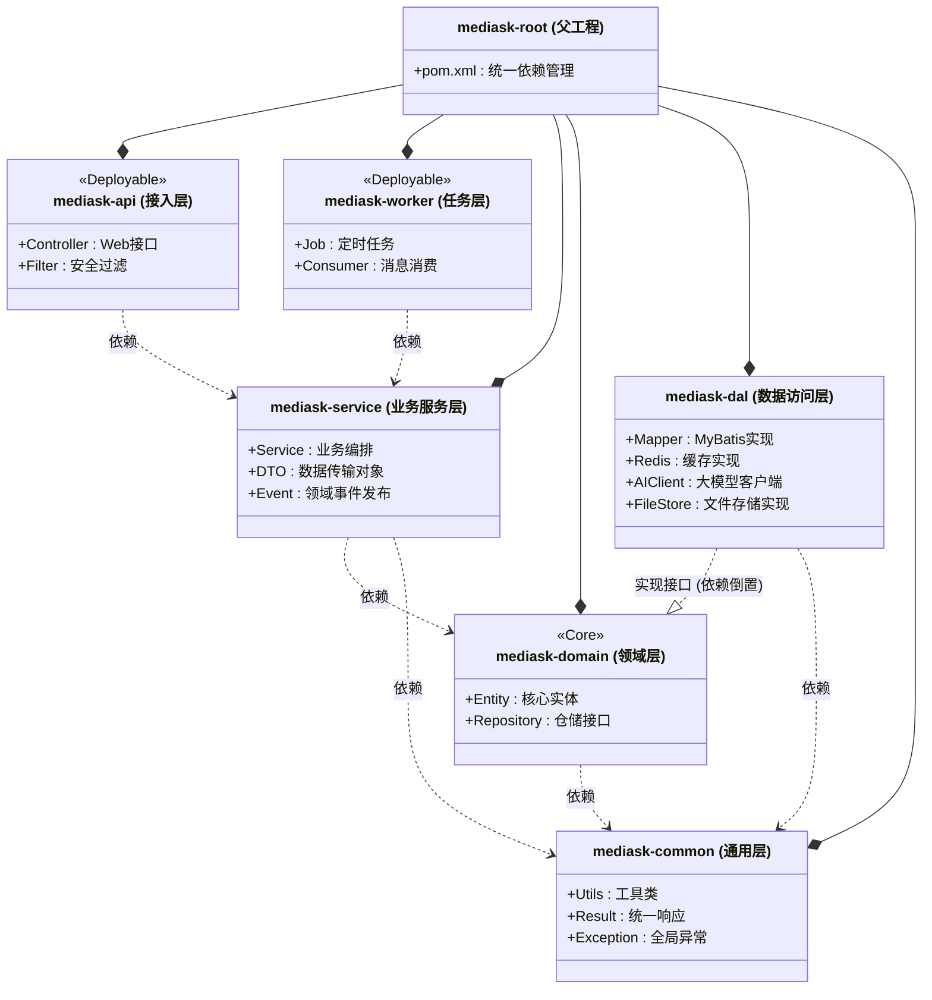

# 智能医疗辅助问诊系统 - 技术选型与架构设计文档

## 1. 系统架构概览 (System Architecture)

本项目采用 **“适度微服务化” (Modular Monolith)** 的架构设计理念。在单体应用的基础上，通过模块化隔离业务逻辑，既保证了毕设开发的便捷性（易于部署、调试），又保留了向微服务演进的能力。

### 1.1 逻辑架构图


## 2. 前端技术选型 (Frontend Stack)

采用目前工业界最主流的 **React 生态**，构建纯客户端渲染 (CSR) 的单页应用 (SPA)，彻底杜绝服务端渲染 (SSR) 可能带来的安全风险 (如 XSS) 和运维复杂度。

> 本项目的**管理员端 & 医生端**统一采用：React + React Router + Ant Design + Tailwind CSS；患者端采用微信公众号内 H5（React）以最大化复用。

### 2.1 多端形态选择（面向毕设：优先保证 AI 核心能力交付）

本系统的亮点与主要工作量在 **AI 能力（对话、RAG、评估、安全）**，因此端侧选型以“**降低前端不确定性、快速跑通闭环**”为第一原则。

**医生端 / 管理员端（Web）**

- 形态：Web SPA
- 技术栈：React + React Router + Ant Design + Tailwind CSS
- 原因：中后台页面复杂（表格/表单/权限），Web 生态成熟，开发效率高。

**患者端（优先：公众号内 H5 Web）**

- 形态：微信公众号菜单/图文入口打开 H5
- 技术栈：同 Web（React）以最大化复用 API SDK、鉴权、组件与工程化能力
- 原因：无需学习小程序体系即可在微信内完成演示与闭环，把主要时间投入到 AI 模块实现与质量。

**可选演进（Phase 2）：微信小程序**

- 当需要更强触达/订阅提醒/扫码入口时，可在后端 API 不变的前提下增加小程序端（可选 Taro/React）。

### 2.2 仓库组织建议（两端同仓：Monorepo）

当前已确定患者端采用“公众号内 H5（React）”，且医生/管理员端同为 Web 技术栈，因此建议将两端前端放在**同一个仓库**，以复用 API SDK、鉴权、类型定义与工程化配置，降低毕设实现风险。

推荐目录（示例）：

```text
mediask-fe/
  apps/
    admin-web/        # 医生端 + 管理员端（React + Antd + Tailwind）
    patient-h5/       # 公众号内 H5（React + Tailwind）
  packages/
    shared/           # 共享：API client、types、auth、utils、error codes
```

*   **渲染模式**: **SPA (Single Page Application)**
    *   所有页面渲染逻辑均在浏览器端执行，构建产物为纯静态 HTML/JS/CSS 文件。
    *   部署时直接托管于 **Nginx** 或对象存储，不涉及 Node.js 服务端运行时。
*   **核心框架**: **React 19** 
*   **开发语言**: **TypeScript** 
*   **构建工具**: **Vite** 
*   **UI 组件库**: **Ant Design 6.x**
*   **状态管理**: **Zustand** (比 Redux 更轻量、现代，代码量少) 或 **React Query** (专门处理服务端状态，如挂号列表的缓存与自动刷新)
*   **路由管理**: **React Router v6**
*   **HTTP 客户端**: **Axios** (封装拦截器，统一处理 Token 和全局错误)
*   **样式方案**: **Tailwind CSS** (原子化 CSS，开发效率极高) 

### 2.3 前端状态与数据流方案（工程最佳实践）

本项目的前端状态按“**服务端状态（Server State）**”与“**纯前端状态（Client/UI State）**”拆分治理：

- **React Query（TanStack Query）**：作为服务端状态的唯一事实来源（请求、缓存、失效、自动刷新、并发去重、分页）。
- **Zustand**：承载纯前端状态（鉴权会话、权限展示态、UI 状态、表单草稿），以及 AI SSE 流式过程中的短生命周期状态。

#### 2.3.1 状态归属原则（必须遵守）

1. **任何来自后端 API 的数据不要长期放进 Zustand 当缓存**。否则你需要自己重建一套缓存失效、并发去重、刷新与一致性策略。
2. Zustand 只存“让 UI 工作”的状态：例如 token、当前用户信息快照、是否登录、菜单折叠、对话输入框草稿、流式输出中的临时文本。
3. React Query 只存“后端资源”的状态：例如医院/科室/医生、排班号源、预约单、病历、处方、知识库文档、AI 会话/消息列表。

#### 2.3.2 推荐的前端目录结构（可在 Monorepo 中复用）

```text
packages/shared/
  api/
    http.ts              # Axios 实例 + 拦截器
    error.ts             # 统一错误结构
    endpoints.ts         # 按领域划分的 API 调用
  query/
    client.ts            # QueryClient 初始化与默认策略
    keys.ts              # queryKey 工厂（强约束）
  stores/
    auth.store.ts        # Zustand：token/用户快照/权限展示态
    aiStream.store.ts    # Zustand：SSE 流式临时态（可选）
```

#### 2.3.3 Axios 拦截器与错误标准化（配合后端统一响应体 R<T>）

后端响应体在架构里定义为 `R<T> { code, msg, data, traceId }`。前端约定：

- **HTTP 失败（网络/超时/5xx）**：归类为“网络错误”，可有限重试。
- **业务失败（HTTP 200 但 code != 0 或非成功码）**：归类为“业务错误”，默认不重试，直接展示 msg，并保留 traceId 便于排障。
- **401/403**：触发登出/跳转登录，并清空敏感缓存。

建议在 Axios 拦截器中把 `R<T>` 转成“要么返回 T，要么抛出统一错误对象”，确保 React Query 的错误处理一致。

#### 2.3.4 React Query 默认策略（建议值，可按端侧调整）

在医疗/挂号场景中，数据一致性比“离线可用”更重要，建议：

- 默认 `retry`：网络错误重试 1-2 次；业务错误 `retry=false`。
- 默认 `refetchOnWindowFocus`：对医生端建议开启（避免工作台停留导致信息过期）；对患者端可关闭减少流量。
- `staleTime` 分级：
  - 字典/低频变更（医院、科室、药品）可设较长（分钟级到小时级）。
  - 排班/号源建议较短（秒级到分钟级），以减少“看到可约但实际已被抢”的落差（真正强一致仍由后端 Redis+DB 兜底）。

#### 2.3.5 queryKey 规范（必须统一，否则会出现缓存污染）

统一使用 **数组 + 结构化对象参数**，严禁字符串拼接。

示例（推荐用 key 工厂集中管理）：

```ts
export const qk = {
  me: () => ['auth', 'me'] as const,
  hospitals: (params?: { keyword?: string }) => ['hospitals', params ?? {}] as const,
  departments: (params: { hospitalId: number }) => ['departments', params] as const,
  doctors: (params: { deptId: number; page: number; pageSize: number }) => ['doctors', params] as const,
  schedules: (params: { doctorId: number; date: string }) => ['schedules', params] as const,
  appointmentsMy: (params: { status?: number; page: number; pageSize: number }) => ['appointments', 'my', params] as const,
  aiMessages: (params: { conversationId: number }) => ['ai', 'messages', params] as const,
} as const;
```

#### 2.3.6 Mutation 与一致性（挂号/病历/处方的失效策略）

原则：**写操作成功后，失效所有可能被影响的“读 query”**，让服务端成为最终事实来源。

- 创建预约成功：
  - `invalidateQueries(qk.appointmentsMy(...))`
  - `invalidateQueries(qk.schedules({ doctorId, date }))`
- 支付/取消预约成功：
  - 同上（列表与号源都可能变化）
- 病历提交/归档、处方开具成功：
  - 失效病历详情、病历列表、处方列表（按你的页面组织来定 key）

对“按钮连点/网络重试”场景：前端仍应生成并携带 `Idempotency-Key`（与你需求里的幂等策略对齐），并在 mutation in-flight 期间禁用重复提交。

#### 2.3.7 AI SSE 流式对话（Zustand 负责“流式过程”，React Query 负责“会话事实”）

结合你在架构中采用的 SSE：

- **流式过程**：使用 Zustand 保存当前会话的 `streamingMessage`（逐 token 追加、可中断、可重连），避免频繁地把“半成品”写入 React Query 缓存。
- **流式结束（done）**：后端落库后，前端执行一次 `invalidateQueries(qk.aiMessages({ conversationId }))` 拉取最终消息列表。
- **断连重试**：由 SSE 客户端负责；重连期间 UI 继续展示上一次的 streaming 内容（Zustand）。

这样可以保证：
- UI 体验顺滑（流式 token 追加不受 query cache 约束）；
- 数据一致性清晰（最终消息列表以 DB 为准，React Query 自动接管）。

#### 2.3.8 鉴权与 RBAC（Zustand 的边界）

你的后端采用 Spring Security + JWT + RBAC（见需求与架构治理部分）。前端建议：

- Zustand `auth.store` 存：`accessToken`、`userSnapshot`、`authorities/roles`（用于菜单/路由守卫的展示逻辑）。
- React Query `qk.me()` 拉取“我的信息/权限”（若后端提供），并在登录成功后 `prefetchQuery`，用于首屏快速渲染。
- 登出时：清空 auth store，并执行 `queryClient.clear()` 或按域失效，避免敏感数据残留。


## 3. 后端技术选型 (Backend Stack)

基于 **Java 21** 新特性构建高性能后端，摒弃过时技术。

*   **开发语言**: **Java 21** (使用 Record 类简化 DTO，使用 Virtual Threads 提升高并发 I/O 性能)
*   **核心框架**: **Spring Boot 3.2+** (原生支持 AOT 编译，启动更快)
*   **ORM 框架**: **MyBatis-Plus** (简化 CRUD) + **MyBatis-Plus-Join** (连表查询增强)
*   **工具库**: 
    *   **Lombok**: 消除样板代码。
    *   **MapStruct**: 高性能 Bean 属性拷贝 (优于 BeanUtils)。
    *   **Knife4j**: 生成美观的接口文档。 

## 3.1 AI 微服务技术选型 (Python Stack)

AI 能力采用**独立 Python 微服务**架构，与 Java 主业务解耦，充分发挥 Python 在 AI/LLM 领域的生态优势。

| 技术分类 | 选型方案 | 选型理由 |
|---------|---------|---------|
| **Web 框架** | FastAPI | 原生 async、自动 OpenAPI 文档、SSE 支持 |
| **AI 编排** | LangChain | RAG Pipeline、Prompt 管理、文档加载器 |
| **对话状态机** | LangGraph | 多轮对话状态管理、比 Memory 更可控 |
| **向量数据库** | pymilvus | Milvus Python SDK |
| **Embedding** | sentence-transformers / API | 文本向量化 |
| **LLM 接入** | OpenAI SDK (DeepSeek 兼容) | 流式输出、Function Calling |
| **服务器** | uvicorn | 高性能 ASGI 服务器 |
| **可观测性** | LangSmith (可选) | LLM 调用追踪与调试 |

### 3.1.1 Python AI 服务核心能力

| 功能模块 | 核心能力 | 技术实现 |
|---------|---------|---------|
| **RAG 检索增强** | 医疗知识库问答，回答可追溯 | LangChain LCEL + Milvus |
| **混合检索** | 向量检索 + BM25 关键词检索 | RRF 结果融合算法 |
| **多轮对话** | 预问诊状态管理，生成预问诊摘要 | LangGraph StateGraph + SSE |
| **安全过滤** | PII 脱敏、敏感内容拦截 | 自定义 Guard Rails |
| **文档解析** | PDF/Markdown/HTML 解析入库 | LangChain DocumentLoaders |

### 3.1.2 服务间通信设计

```
┌─────────────────────────────────────────────────────────────┐
│                         Nginx                               │
│              /api/* → Java    /ai/* → Python                │
└─────────────────────────────────────────────────────────────┘
                │                         │
                ▼                         ▼
┌───────────────────────┐      ┌─────────────────────────────┐
│    mediask-api        │      │      mediask-ai             │
│    (Spring Boot)      │      │      (FastAPI)              │
│                       │      │                             │
│  • 用户认证 (JWT)     │      │  • /ai/chat/stream (SSE)    │
│  • 挂号预约           │ ───▶ │  • /ai/triage (预问诊)      │
│  • 病历处方           │ HTTP │  • /ai/rag/query (知识问答) │
│  • 权限管理           │      │  • /ai/docs/ingest (文档解析)│
└───────────────────────┘      └─────────────────────────────┘
         │                                │
         ▼                                ▼
      MySQL/Redis                      Milvus
``` 

## 4. 数据存储与中间件 (Data & Middleware)

### 4.1 数据库选型方案 (确切方案)

1.  **业务数据库: MySQL 8.0**
    *   **选型理由**: 
        *   **生态兼容性**: MyBatis-Plus 对 MySQL 的支持最完美，社区资源最丰富，遇到问题最容易解决。
        *   **事务稳定性**: InnoDB 引擎在处理挂号扣减库存等高并发事务时表现稳定，符合医疗系统对数据一致性的严苛要求。
    *   **规范**: 字符集统一使用 `utf8mb4`，主键使用 `Snowflake` 雪花算法生成 (BIGINT)。

2.  **向量数据库: Milvus 2.3+ (Standalone Mode)**
    *   **选型理由**: 
        *   **专业性**: 相比于 PgVector 插件，Milvus 是专为向量检索设计的云原生数据库，支持百亿级向量检索，在答辩时更能体现“架构设计的专业度”。
        *   **解耦**: 将 AI 知识库数据与业务数据物理隔离，互不影响性能。
    *   **部署**: 开发环境使用 Docker Compose 一键部署单机版。

### 4.2 文件存储方案 (环境隔离策略)
采用 **策略模式 (Strategy Pattern)** 实现文件服务的无缝切换。

*   **接口定义**: `FileStorageService { upload(File), getUrl(path) }`
*   **Dev 环境 (开发)**: 
    *   **实现类**: `RustFSStorageImpl` (模拟/本地)
    *   **方案**: 使用本地磁盘或轻量级文件服务 (RustFS) 存储文件，避免开发阶段消耗云存储费用，且离线可用。
*   **Prod 环境 (生产)**: 
    *   **实现类**: `AliyunOssStorageImpl`
    *   **方案**: 使用 **阿里云 OSS**。利用其 CDN 加速功能，提高病历图片和药品说明书的加载速度，同时保障数据持久性。
*   **实现技术**: 利用 Spring Boot 的 `@Profile("dev")` 和 `@Profile("prod")` 注解自动注入对应的 Bean。

### 4.3 缓存与中间件
*   **Redis 7**: 核心缓存。
    *   **Key 设计规范**: `app:module:id` (如 `mediask:appt:doctor:1001`)。
    *   **分布式锁**: Redisson。
*   **消息队列: RocketMQ 5.0+**
    *   **选型理由**: 
        *   **事务消息**: RocketMQ 独有的事务消息机制，能完美解决“挂号扣库存”与“发送通知”之间的最终一致性问题，比 RabbitMQ 更适合金融/医疗级业务。
        *   **削峰填谷**: 优秀的抗压能力，保护数据库不被瞬间流量打垮。
    *   **核心 Topic**: 
        *   `TOPIC_APPT_CREATE`: 挂号成功消息 (Tag: `SMS`, `STOCK`)。
        *   `TOPIC_RAG_PARSE`: 知识库文档解析任务。

## 5. 关键工程化实践 (Best Engineering Practices)

### 5.1 API 治理与交互规范 (API Governance)
*   **RESTful 设计**: 遵循资源导向设计 (GET/POST/PUT/DELETE)，URL 使用名词复数，版本化管理 (`/api/v1/...`)。
*   **统一响应体**: 封装 `R<T>` 对象，包含 `code` (业务码), `msg` (提示信息), `data` (载荷), `traceId` (全链路追踪ID)。
*   **接口文档**: 集成 **Knife4j 4.0** (OpenAPI 3)，要求所有 Controller/DTO 必须有 `@Schema` 注解，生产环境自动关闭文档以保障安全。

### 5.2 健壮的异常处理体系 (Robust Error Handling)
*   **异常分层**: 定义 `BizException` (业务逻辑错误) 与 `SysException` (系统级错误)。
*   **全局处理器**: 使用 `@RestControllerAdvice` 统一捕获异常。
    *   对于 `BizException`: 返回对应错误码和提示。
    *   对于 `Exception`: 返回 "系统繁忙"，并打印堆栈日志，**隐藏底层细节**防止泄露。
*   **错误码管理**: 使用枚举 `ErrorCode` 统一管理 (如 `USER_001`, `APPT_002`)，拒绝硬编码字符串。

### 5.3 高并发与异步编程 (Concurrency & Async)
*   **虚拟线程 (Virtual Threads)**: 
    *   启用 JDK 21 虚拟线程 (`spring.threads.virtual.enabled=true`) 处理高并发 I/O (特别是 AI 接口的 HTTP 调用)。
    *   **注意**: 确保使用 **MySQL Connector/J 8.0.33+** 驱动，以避免旧版驱动中 `synchronized` 导致的线程钉住 (Pinning) 问题。
*   **领域事件解耦**: 
    *   **进程内解耦**: 使用 **Spring Event** (`ApplicationEventPublisher`) 处理轻量级副作用 (如记录操作日志)。
    *   **跨进程解耦**: 使用 **RocketMQ** 将耗时任务 (如发送短信、RAG 文档解析) 投递给 `mediask-worker` 模块异步执行，确保 Web 接口毫秒级响应。
    *   *场景*: 挂号成功后 -> `rocketMQTemplate.convertAndSend("TOPIC_APPT", msg)` -> Worker 监听消费。
*   **AI 流式响应**: 使用 Spring MVC 标准的 **SseEmitter** 实现 SSE (Server-Sent Events)，配合前端 `fetch-event-source` 库处理断连重试，实现 ChatGPT 式的打字机体验。避免引入 WebFlux 增加技术栈复杂度。

### 5.4 可观测性与日志 (Observability)
*   **MDC 全链路追踪**: 在 Filter 层生成 `traceId` 放入 MDC (Mapped Diagnostic Context)，所有日志输出自动携带该 ID，串联一次请求的所有日志。
*   **AOP 操作日志**: 自定义 `@Log(module="挂号", action="取消")` 注解，自动记录操作人、IP、耗时、入参出参到数据库，用于审计。

### 5.5 代码质量与规范 (Code Quality)
*   **参数校验**: 严格使用 **JSR-303 (Hibernate Validator)**，配合分组校验 (`@Validated(AddGroup.class)`)，拒绝在 Service 层编写冗余的 `if (obj == null)`。
*   **对象转换**: 强制使用 **MapStruct** 替代 BeanUtils，在编译期生成类型安全的转换代码，性能无损耗。
*   **Git 提交规范**: 遵循 **Conventional Commits** (`feat:`, `fix:`, `docs:`)，保持提交历史清晰。

### 5.6 安全设计落地 (Security Implementation)
1.  **认证与鉴权**: Spring Security 6 + JWT，实现无状态认证与动态权限控制 (`@PreAuthorize`)。
2.  **敏感数据脱敏**: 基于 Jackson 自定义序列化器实现**注解式脱敏** (`@Sensitive(strategy = PHONE)`)，彻底解耦业务代码。
3.  **数据加密**: 密码使用 **BCrypt**，身份证号使用 **AES-128** 加密存储。
4.  **API 防护**: 引入 **Redis Lua 脚本** 实现滑动窗口限流；关键接口引入 `Idempotency-Key` 防止重放攻击。

### 5.7 AI 智能模块设计 (Python 微服务架构)

本项目的 AI 核心模块采用**独立 Python 微服务**架构，基于 **FastAPI + LangChain + LangGraph** 构建，实现 RAG（检索增强生成）与多轮对话能力，解决大语言模型在医疗场景下的"幻觉"问题。

#### 5.7.1 Python 项目结构

```
mediask-ai/
├── pyproject.toml              # 依赖管理 (Poetry/uv)
├── .env                        # 环境变量
├── app/
│   ├── __init__.py
│   ├── main.py                 # FastAPI 入口
│   ├── config.py               # 配置管理
│   ├── api/
│   │   ├── __init__.py
│   │   ├── routes/
│   │   │   ├── chat.py         # 对话接口 (SSE)
│   │   │   ├── rag.py          # RAG 问答接口
│   │   │   ├── triage.py       # 预问诊接口
│   │   │   └── docs.py         # 文档管理接口
│   │   └── deps.py             # 依赖注入
│   ├── core/
│   │   ├── llm.py              # LLM 客户端封装
│   │   ├── embeddings.py       # Embedding 模型
│   │   └── vector_store.py     # Milvus 封装
│   ├── rag/
│   │   ├── pipeline.py         # RAG Pipeline (LCEL)
│   │   ├── retriever.py        # 混合检索器
│   │   ├── reranker.py         # 重排序
│   │   └── prompts.py          # Prompt 模板
│   ├── triage/
│   │   ├── graph.py            # LangGraph 状态机
│   │   ├── nodes.py            # 状态节点
│   │   └── state.py            # 状态定义
│   ├── guard/
│   │   ├── pii_filter.py       # PII 脱敏
│   │   ├── safety_check.py     # 安全检查
│   │   └── disclaimer.py       # 免责声明
│   └── ingest/
│       ├── loader.py           # 文档加载
│       ├── splitter.py         # 文本切分
│       └── indexer.py          # 向量索引
├── tests/
│   └── ...
└── notebooks/                  # Jupyter 实验/演示
    ├── rag_demo.ipynb
    └── evaluation.ipynb
```

#### 5.7.2 核心依赖配置

```toml
# pyproject.toml
[project]
name = "mediask-ai"
version = "0.1.0"
requires-python = ">=3.11"

dependencies = [
    "fastapi>=0.109.0",
    "uvicorn[standard]>=0.27.0",
    "langchain>=0.3.0",
    "langchain-openai>=0.2.0",
    "langchain-community>=0.3.0",
    "langgraph>=0.2.0",
    "pymilvus>=2.4.0",
    "sentence-transformers>=3.0.0",
    "python-dotenv>=1.0.0",
    "pydantic>=2.0.0",
    "pydantic-settings>=2.0.0",
    "sse-starlette>=2.0.0",
    "httpx>=0.27.0",
]

[project.optional-dependencies]
dev = [
    "pytest>=8.0.0",
    "jupyter>=1.0.0",
    "ipykernel>=6.0.0",
]
```

#### 5.7.2 RAG 完整流程设计



#### 5.7.3 医疗知识库构建流程 (Python)

**文档加载与解析**
```python
# app/ingest/loader.py
from langchain_community.document_loaders import (
    PyPDFLoader,
    UnstructuredMarkdownLoader,
    UnstructuredHTMLLoader,
)
from langchain_core.documents import Document

class MedicalDocumentLoader:
    """医疗文档加载器"""
    
    def load(self, file_path: str) -> list[Document]:
        """根据文件类型自动选择加载器"""
        if file_path.endswith('.pdf'):
            loader = PyPDFLoader(file_path)
        elif file_path.endswith('.md'):
            loader = UnstructuredMarkdownLoader(file_path)
        elif file_path.endswith('.html'):
            loader = UnstructuredHTMLLoader(file_path)
        else:
            raise ValueError(f"Unsupported file type: {file_path}")
        
        docs = loader.load()
        # 添加元数据
        for doc in docs:
            doc.metadata["source_file"] = file_path
            doc.metadata["doc_type"] = "medical_knowledge"
        return docs
```

**文本语义切分**
```python
# app/ingest/splitter.py
from langchain.text_splitter import RecursiveCharacterTextSplitter

class MedicalTextSplitter:
    """医疗文档切分器"""
    
    def __init__(self, chunk_size: int = 500, chunk_overlap: int = 50):
        self.splitter = RecursiveCharacterTextSplitter(
            chunk_size=chunk_size,
            chunk_overlap=chunk_overlap,
            separators=["\n\n", "\n", "。", "；", " ", ""],
            length_function=len,
        )
    
    def split(self, documents: list[Document]) -> list[Document]:
        """切分文档，保留元数据"""
        return self.splitter.split_documents(documents)
```

**向量化与存储**
```python
# app/ingest/indexer.py
from langchain_openai import OpenAIEmbeddings
from langchain_community.vectorstores import Milvus

class MedicalIndexer:
    """医疗知识库索引器"""
    
    def __init__(self, collection_name: str = "medical_knowledge"):
        self.embeddings = OpenAIEmbeddings(
            base_url="https://api.deepseek.com",
            model="text-embedding-3-small",
        )
        self.collection_name = collection_name
    
    def index(self, documents: list[Document]) -> None:
        """将文档向量化并存入 Milvus"""
        Milvus.from_documents(
            documents,
            self.embeddings,
            collection_name=self.collection_name,
            connection_args={"host": "localhost", "port": "19530"},
        )
```

#### 5.7.4 混合检索策略 (Python)

```python
# app/rag/retriever.py
from langchain_core.retrievers import BaseRetriever
from langchain_community.retrievers import BM25Retriever
from langchain_community.vectorstores import Milvus

class HybridMedicalRetriever(BaseRetriever):
    """混合检索器：向量检索 + BM25 关键词检索"""
    
    def __init__(
        self,
        vector_store: Milvus,
        bm25_retriever: BM25Retriever,
        k: int = 60,  # RRF 常数
        top_k: int = 5,
    ):
        self.vector_store = vector_store
        self.bm25_retriever = bm25_retriever
        self.k = k
        self.top_k = top_k
    
    def _get_relevant_documents(self, query: str) -> list[Document]:
        # 1. 向量检索（语义相似度）
        vector_results = self.vector_store.similarity_search(query, k=self.top_k)
        
        # 2. BM25 关键词检索（精确匹配）
        bm25_results = self.bm25_retriever.get_relevant_documents(query)[:self.top_k]
        
        # 3. RRF 融合
        return self._rrf_fusion([vector_results, bm25_results])
    
    def _rrf_fusion(self, ranked_lists: list[list[Document]]) -> list[Document]:
        """RRF (Reciprocal Rank Fusion) 融合算法"""
        scores: dict[str, float] = {}
        doc_map: dict[str, Document] = {}
        
        for ranked_list in ranked_lists:
            for rank, doc in enumerate(ranked_list):
                doc_id = doc.page_content[:100]  # 简化的文档 ID
                rrf_score = 1.0 / (self.k + rank + 1)
                scores[doc_id] = scores.get(doc_id, 0) + rrf_score
                doc_map[doc_id] = doc
        
        # 按分数排序
        sorted_ids = sorted(scores.keys(), key=lambda x: scores[x], reverse=True)
        return [doc_map[doc_id] for doc_id in sorted_ids[:self.top_k]]
```

#### 5.7.5 RAG Pipeline (LangChain LCEL)

```python
# app/rag/pipeline.py
from langchain_core.prompts import ChatPromptTemplate
from langchain_core.output_parsers import StrOutputParser
from langchain_core.runnables import RunnablePassthrough
from langchain_openai import ChatOpenAI

RAG_SYSTEM_PROMPT = """你是一位专业的医疗知识助手，请根据以下检索到的医学资料回答用户问题。

检索到的参考资料：
{context}

回答规则：
1. 优先使用检索到的参考资料回答，确保答案有据可查
2. 如参考资料无法覆盖问题，明确告知用户并建议咨询医生
3. 对用药建议、剂量、禁忌等内容特别谨慎
4. 回答需附带参考来源（标注章节或页码）
5. 最后务必添加声明："以上内容仅供参考，具体诊疗请遵医嘱"
"""

def create_rag_chain(retriever: HybridMedicalRetriever):
    """构建 RAG Chain"""
    llm = ChatOpenAI(
        base_url="https://api.deepseek.com",
        model="deepseek-chat",
        streaming=True,
    )
    
    prompt = ChatPromptTemplate.from_messages([
        ("system", RAG_SYSTEM_PROMPT),
        ("human", "{question}"),
    ])
    
    def format_docs(docs: list[Document]) -> str:
        return "\n\n".join(
            f"[来源: {doc.metadata.get('source_file', '未知')}]\n{doc.page_content}"
            for doc in docs
        )
    
    chain = (
        {"context": retriever | format_docs, "question": RunnablePassthrough()}
        | prompt
        | llm
        | StrOutputParser()
    )
    
    return chain
```

#### 5.7.6 多轮对话状态机 (LangGraph)

```python
# app/triage/graph.py
from typing import TypedDict, Annotated
from langgraph.graph import StateGraph, END
from langgraph.graph.message import add_messages

class TriageState(TypedDict):
    """预问诊状态"""
    messages: Annotated[list, add_messages]
    symptoms: list[str]
    onset_time: str | None
    pain_level: int | None
    recommended_department: str | None
    summary: str | None
    is_complete: bool

def create_triage_graph():
    """创建预问诊状态机"""
    
    def collect_symptoms(state: TriageState) -> TriageState:
        """收集症状信息"""
        # 分析用户消息，提取症状
        # 判断是否需要追问
        ...
    
    def ask_followup(state: TriageState) -> TriageState:
        """追问细节"""
        # 生成追问问题
        ...
    
    def recommend_department(state: TriageState) -> TriageState:
        """推荐科室"""
        # 基于症状推荐就诊科室
        ...
    
    def generate_summary(state: TriageState) -> TriageState:
        """生成预问诊摘要"""
        # 结构化输出摘要
        ...
    
    def should_continue(state: TriageState) -> str:
        """判断是否继续收集信息"""
        if state["is_complete"]:
            return "recommend"
        return "followup"
    
    # 构建状态图
    graph = StateGraph(TriageState)
    
    graph.add_node("collect", collect_symptoms)
    graph.add_node("followup", ask_followup)
    graph.add_node("recommend", recommend_department)
    graph.add_node("summarize", generate_summary)
    
    graph.set_entry_point("collect")
    graph.add_conditional_edges("collect", should_continue)
    graph.add_edge("followup", "collect")
    graph.add_edge("recommend", "summarize")
    graph.add_edge("summarize", END)
    
    return graph.compile()
```

#### 5.7.7 安全过滤与 Guard Rails (Python)

```python
# app/guard/pii_filter.py
import re

class PIIFilter:
    """个人敏感信息脱敏过滤器"""
    
    PATTERNS = {
        "phone": (r"1[3-9]\d{9}", "[手机号已隐藏]"),
        "id_card": (r"\d{17}[\dXx]", "[身份证已隐藏]"),
        "name": (r"(?:姓名|患者)[：:]\s*[\u4e00-\u9fa5]{2,4}", "[姓名已隐藏]"),
    }
    
    def filter(self, text: str) -> str:
        """对文本进行 PII 脱敏"""
        result = text
        for pattern, replacement in self.PATTERNS.values():
            result = re.sub(pattern, replacement, result)
        return result


# app/guard/safety_check.py
class MedicalSafetyGuard:
    """医疗安全检查器"""
    
    EMERGENCY_KEYWORDS = ["胸痛", "呼吸困难", "意识不清", "大出血", "昏迷"]
    
    def check_emergency(self, text: str) -> bool:
        """检测是否包含急症关键词"""
        return any(kw in text for kw in self.EMERGENCY_KEYWORDS)
    
    def add_disclaimer(self, response: str) -> str:
        """添加免责声明"""
        disclaimer = "\n\n⚠️ 以上内容仅供参考，不能替代医生诊断。如有不适，请及时就医。"
        return response + disclaimer
```

#### 5.7.8 FastAPI 接口层 (Python)

```python
# app/api/routes/chat.py
from fastapi import APIRouter, Depends
from sse_starlette.sse import EventSourceResponse
from app.rag.pipeline import create_rag_chain
from app.guard.pii_filter import PIIFilter

router = APIRouter(prefix="/ai", tags=["AI"])

@router.get("/chat/stream")
async def stream_chat(
    session_id: str,
    message: str,
    pii_filter: PIIFilter = Depends(),
):
    """SSE 流式对话接口"""
    # 1. PII 脱敏
    sanitized_message = pii_filter.filter(message)
    
    # 2. 获取 RAG Chain
    chain = create_rag_chain()
    
    async def event_generator():
        async for chunk in chain.astream(sanitized_message):
            yield {"event": "message", "data": chunk}
        yield {"event": "done", "data": ""}
    
    return EventSourceResponse(event_generator())


@router.post("/rag/query")
async def rag_query(question: str, top_k: int = 5):
    """RAG 知识问答接口"""
    chain = create_rag_chain()
    result = await chain.ainvoke(question)
    return {"answer": result}


@router.post("/triage/summary")
async def generate_triage_summary(session_id: str):
    """生成预问诊摘要"""
    # 从 Redis/DB 加载对话历史
    # 调用 LLM 生成摘要
    ...
```

#### 5.7.9 Prompt 工程设计

**预问诊 System Prompt**
```python
TRIAGE_SYSTEM_PROMPT = """你是一位专业的医疗预问诊助手，你的任务是：

1. 以自然、友好的语气与患者交流，收集关键症状信息
2. 收集信息包括：发病时间、主要症状、疼痛程度（1-10分）、伴随症状、已做检查、已用药情况
3. 根据收集的信息，推荐合适的就诊科室
4. 生成结构化的预问诊摘要，供医生参考

重要安全规则：
- 明确告知患者，AI 建议仅供参考，不能替代医生诊断
- 如发现急症症状（胸痛、呼吸困难、意识不清等），立即提示患者紧急就医
- 不得给出具体的用药建议或剂量
- 不得诊断具体疾病，只能描述症状

当前时间：{current_time}
"""
```

#### 5.7.10 Docker Compose 部署配置

```yaml
# docker-compose.yml
version: '3.8'

services:
  # Java 主业务服务
  mediask-api:
    build: ./mediask-be
    ports:
      - "8080:8080"
    environment:
      - SPRING_PROFILES_ACTIVE=dev
      - AI_SERVICE_URL=http://mediask-ai:8000
    depends_on:
      - mysql
      - redis
      - mediask-ai

  # Python AI 微服务
  mediask-ai:
    build: ./mediask-ai
    ports:
      - "8000:8000"
    environment:
      - DEEPSEEK_API_KEY=${DEEPSEEK_API_KEY}
      - MILVUS_HOST=milvus
      - MILVUS_PORT=19530
    depends_on:
      - milvus

  # 向量数据库
  milvus:
    image: milvusdb/milvus:v2.4.0
    ports:
      - "19530:19530"
    volumes:
      - milvus_data:/var/lib/milvus

  mysql:
    image: mysql:8.0
    environment:
      MYSQL_ROOT_PASSWORD: root
      MYSQL_DATABASE: mediask
    volumes:
      - mysql_data:/var/lib/mysql

  redis:
    image: redis:7-alpine
    ports:
      - "6379:6379"

volumes:
  milvus_data:
  mysql_data:
```

## 6. 项目目录结构规范 (Maven Multi-Module)

本项目采用 **Maven 多模块 (Multi-Module)** 结构进行管理，遵循 **DDD (领域驱动设计)** 分层思想。



### 6.1 模块职责说明
*   **mediask-api**: 系统的**流量入口**，负责参数校验、身份认证，不包含复杂业务逻辑。
*   **mediask-worker**: 系统的**后台工人**，负责异步处理耗时任务，与 Web 流量物理隔离。
*   **mediask-service**: 系统的**大脑**，负责编排业务流程（如：先扣库存，再生成订单，最后发短信）。
*   **mediask-domain**: 系统的**心脏**，包含最纯粹的业务规则，不依赖任何第三方框架（POJO）。
*   **mediask-dal**: 系统的**四肢**，负责具体的技术实现（连数据库、连 Redis、连 AI）。

### 6.2 部署架构优势
*   **Web 模块独立扩展**: 当挂号流量激增时，只需增加 `mediask-api` 的容器实例数量。
*   **Job 模块隔离**: 繁重的定时任务 (如批量生成排班、RAG 知识库全量更新) 运行在独立进程 `mediask-worker` 中，不会阻塞 Web 接口的响应线程。

---

## 7. 代码规范与工程实践 (Code Standards & Best Practices)

### 7.1 包结构设计（以 mediask-dal 为例）

```
mediask-dal/
├── src/main/java/me/jianwen/mediask/dal/
│   ├── entity/              # 实体类（DO - Data Object）
│   │   ├── UserDO.java
│   │   ├── DoctorDO.java
│   │   └── AppointmentDO.java
│   ├── mapper/              # MyBatis Mapper 接口
│   │   ├── UserMapper.java
│   │   └── DoctorMapper.java
│   ├── enums/               # 枚举类型（状态码、业务类型）
│   │   ├── UserTypeEnum.java
│   │   └── ApptStatusEnum.java
│   └── config/              # 数据源配置
│       └── DataSourceConfig.java
└── src/main/resources/
    └── mapper/              # MyBatis XML 映射文件
        ├── UserMapper.xml
        └── DoctorMapper.xml
```

### 7.2 命名规范（强制执行）

#### 7.2.1 类命名规范
| 类型 | 规范 | 示例 |
|------|------|------|
| **Entity (实体)** | `XxxDO` | `UserDO`, `AppointmentDO` |
| **DTO (传输对象)** | `XxxDTO` | `UserLoginDTO`, `ApptCreateDTO` |
| **VO (视图对象)** | `XxxVO` | `UserInfoVO`, `DoctorDetailVO` |
| **Mapper** | `XxxMapper` | `UserMapper`, `DoctorMapper` |
| **Service** | `XxxService` | `UserService`, `ApptService` |
| **ServiceImpl** | `XxxServiceImpl` | `UserServiceImpl` |
| **Controller** | `XxxController` | `UserController`, `ApptController` |
| **枚举** | `XxxEnum` | `UserTypeEnum`, `ApptStatusEnum` |
| **异常** | `XxxException` | `BizException`, `ApptNotFoundException` |
| **工具类** | `XxxUtil` 或 `XxxHelper` | `DateUtil`, `EncryptHelper` |

#### 7.2.2 方法命名规范
```java
// ✅ 正确示例
public UserVO getUserById(Long id);
public List<DoctorVO> listDoctorsByDeptId(Long deptId);
public boolean checkApptAvailable(Long scheduleId);
public void createAppointment(ApptCreateDTO dto);
public void updateApptStatus(Long apptId, ApptStatusEnum status);
public void deleteUserById(Long id); // 物理删除
public void removeUserById(Long id); // 软删除

// ❌ 错误示例
public UserVO get(Long id);           // 不清晰
public List<DoctorVO> doctors();      // 缺少动词
public void save(ApptCreateDTO dto);  // save含义模糊（新增还是更新？）
```

#### 7.2.3 变量命名规范
```java
// ✅ 正确：清晰表达业务含义
private Long userId;
private String realName;
private LocalDateTime createdAt;
private boolean isDeleted;
private int totalSlots;          // 总号源数
private int availableSlots;      // 剩余号源数

// ❌ 错误：缩写或拼音
private Long uid;
private String xm;               // 姓名拼音缩写
private Date ctime;
private boolean del;
private int num;
```

### 7.3 分层代码示例（典型CRUD流程）

#### 7.3.1 Controller 层（入口层）
```java
@RestController
@RequestMapping("/api/v1/appointments")
@Tag(name = "挂号预约", description = "挂号预约相关接口")
@RequiredArgsConstructor
public class AppointmentController {
    
    private final AppointmentService appointmentService;
    
    /**
     * 创建挂号预约
     * @param dto 预约信息
     * @return 预约单号
     */
    @PostMapping
    @Operation(summary = "创建挂号")
    @PreAuthorize("hasAuthority('appt:create')")
    public R<String> createAppointment(
            @Validated @RequestBody ApptCreateDTO dto) {
        String apptNo = appointmentService.createAppointment(dto);
        return R.ok(apptNo);
    }
    
    /**
     * 分页查询患者挂号记录
     * @param query 查询条件
     * @return 挂号列表
     */
    @GetMapping("/my")
    @Operation(summary = "我的挂号记录")
    public R<PageResult<ApptVO>> listMyAppointments(
            @Validated ApptQueryDTO query) {
        Long patientId = SecurityContextHolder.getUserId();
        PageResult<ApptVO> result = appointmentService
            .listPatientAppointments(patientId, query);
        return R.ok(result);
    }
}
```

#### 7.3.2 Service 层（业务编排层）
```java
@Service
@RequiredArgsConstructor
@Slf4j
public class AppointmentServiceImpl implements AppointmentService {
    
    private final AppointmentMapper appointmentMapper;
    private final DoctorScheduleMapper scheduleMapper;
    private final RedisTemplate<String, Object> redisTemplate;
    private final ApplicationEventPublisher eventPublisher;
    private final SnowflakeIdWorker idWorker;
    
    @Override
    @Transactional(rollbackFor = Exception.class)
    public String createAppointment(ApptCreateDTO dto) {
        // 1. 参数校验（Service层二次校验关键业务逻辑）
        DoctorScheduleDO schedule = scheduleMapper.selectById(dto.getScheduleId());
        if (schedule == null || schedule.getAvailableSlots() <= 0) {
            throw new BizException(ErrorCode.APPT_NO_SLOTS);
        }
        
        // 2. 分布式锁扣减号源（防止超卖）
        String lockKey = RedisKeyConstant.APPT_LOCK + dto.getScheduleId();
        RLock lock = redissonClient.getLock(lockKey);
        try {
            if (!lock.tryLock(3, 10, TimeUnit.SECONDS)) {
                throw new BizException(ErrorCode.APPT_BUSY);
            }
            
            // 3. 扣减库存（乐观锁 + 数据库约束双重保障）
            int updated = scheduleMapper.decreaseSlots(dto.getScheduleId());
            if (updated == 0) {
                throw new BizException(ErrorCode.APPT_NO_SLOTS);
            }
            
            // 4. 生成预约单
            AppointmentDO appointment = AppointmentConverter.INSTANCE
                .toEntity(dto);
            appointment.setId(idWorker.nextId());
            appointment.setApptNo(generateApptNo());
            appointment.setApptStatus(ApptStatusEnum.UNPAID);
            appointmentMapper.insert(appointment);
            
            // 5. 发布领域事件（异步处理短信通知等）
            eventPublisher.publishEvent(new ApptCreatedEvent(appointment));
            
            log.info("创建挂号成功, apptNo={}, patientId={}", 
                appointment.getApptNo(), appointment.getPatientId());
            
            return appointment.getApptNo();
            
        } catch (InterruptedException e) {
            Thread.currentThread().interrupt();
            throw new SysException(ErrorCode.SYSTEM_ERROR);
        } finally {
            lock.unlock();
        }
    }
    
    /**
     * 生成预约单号：APT + yyyyMMdd + 6位递增序列
     */
    private String generateApptNo() {
        String dateStr = LocalDate.now().format(DateTimeFormatter.BASIC_ISO_DATE);
        String seqKey = RedisKeyConstant.APPT_SEQ + dateStr;
        Long seq = redisTemplate.opsForValue().increment(seqKey);
        if (seq == 1) {
            redisTemplate.expire(seqKey, 1, TimeUnit.DAYS);
        }
        return String.format("APT%s%06d", dateStr, seq);
    }
}
```

#### 7.3.3 Mapper 层（数据访问层）
```java
/**
 * 挂号预约 Mapper
 * @author jianwen
 */
@Mapper
public interface AppointmentMapper extends BaseMapper<AppointmentDO> {
    
    /**
     * 查询患者挂号记录（支持分页）
     * @param patientId 患者ID
     * @param query 查询条件
     * @return 挂号列表
     */
    List<ApptVO> selectPatientAppointments(
        @Param("patientId") Long patientId,
        @Param("query") ApptQueryDTO query
    );
    
    /**
     * 统计医生今日挂号数
     * @param doctorId 医生ID
     * @param date 日期
     * @return 挂号数量
     */
    int countTodayAppointments(
        @Param("doctorId") Long doctorId,
        @Param("date") LocalDate date
    );
}
```

```xml
<!-- AppointmentMapper.xml -->
<mapper namespace="me.jianwen.mediask.infrastructure.mapper.AppointmentMapper">
    
    <select id="selectPatientAppointments" resultType="me.jianwen.mediask.application.dto.ApptVO">
        SELECT 
            a.id,
            a.appt_no,
            a.appt_date,
            a.appt_time,
            a.appt_status,
            d.real_name AS doctor_name,
            dept.dept_name,
            a.appt_fee
        FROM appointments a
        LEFT JOIN doctors doc ON a.doctor_id = doc.id
        LEFT JOIN users d ON doc.user_id = d.id
        LEFT JOIN departments dept ON doc.dept_id = dept.id
        WHERE a.patient_id = #{patientId}
          AND a.deleted_at IS NULL
        <if test="query.status != null">
          AND a.appt_status = #{query.status}
        </if>
        <if test="query.startDate != null">
          AND a.appt_date &gt;= #{query.startDate}
        </if>
        ORDER BY a.created_at DESC
    </select>
    
</mapper>
```

### 7.4 统一响应体设计
```java
/**
 * 统一响应体
 * @param <T> 数据类型
 */
@Data
@Builder
@NoArgsConstructor
@AllArgsConstructor
public class R<T> implements Serializable {
    
    /** 业务码（0表示成功） */
    private Integer code;
    
    /** 提示信息 */
    private String msg;
    
    /** 响应数据 */
    private T data;
    
    /** 全链路追踪ID */
    private String traceId;
    
    /** 时间戳 */
    private Long timestamp;
    
    public static <T> R<T> ok(T data) {
        return R.<T>builder()
            .code(0)
            .msg("success")
            .data(data)
            .traceId(MDC.get("traceId"))
            .timestamp(System.currentTimeMillis())
            .build();
    }
    
    public static <T> R<T> fail(ErrorCode errorCode) {
        return R.<T>builder()
            .code(errorCode.getCode())
            .msg(errorCode.getMsg())
            .traceId(MDC.get("traceId"))
            .timestamp(System.currentTimeMillis())
            .build();
    }
}
```

### 7.5 全局异常处理器
```java
@RestControllerAdvice
@Slf4j
public class GlobalExceptionHandler {
    
    /**
     * 业务异常
     */
    @ExceptionHandler(BizException.class)
    public R<Void> handleBizException(BizException e) {
        log.warn("业务异常: code={}, msg={}", e.getCode(), e.getMessage());
        return R.fail(e.getErrorCode());
    }
    
    /**
     * 参数校验异常
     */
    @ExceptionHandler(MethodArgumentNotValidException.class)
    public R<Void> handleValidException(MethodArgumentNotValidException e) {
        String errorMsg = e.getBindingResult().getFieldErrors().stream()
            .map(DefaultMessageSourceResolvable::getDefaultMessage)
            .collect(Collectors.joining(", "));
        log.warn("参数校验失败: {}", errorMsg);
        return R.<Void>builder()
            .code(ErrorCode.PARAM_ERROR.getCode())
            .msg(errorMsg)
            .build();
    }
    
    /**
     * 系统异常（隐藏细节）
     */
    @ExceptionHandler(Exception.class)
    public R<Void> handleException(Exception e) {
        log.error("系统异常", e);
        return R.fail(ErrorCode.SYSTEM_ERROR);
    }
}
```

---

## 8. 配置管理最佳实践 (Configuration Management)

### 8.1 多环境配置结构
```
src/main/resources/
├── application.yml                    # 公共配置
├── application-dev.yml                # 开发环境
├── application-test.yml               # 测试环境
├── application-prod.yml               # 生产环境
├── logback-spring.xml                 # 日志配置
└── mapper/                            # MyBatis XML
```

### 8.2 application.yml 公共配置
```yaml
spring:
  application:
    name: mediask-api
  
  profiles:
    active: @spring.profiles.active@  # Maven Profile 注入
  
  # 虚拟线程配置（JDK 21）
  threads:
    virtual:
      enabled: true
  
  # Jackson 配置
  jackson:
    time-zone: GMT+8
    date-format: yyyy-MM-dd HH:mm:ss
    default-property-inclusion: non_null
    serialization:
      write-dates-as-timestamps: false

# MyBatis-Plus 配置
mybatis-plus:
  configuration:
    log-impl: org.apache.ibatis.logging.slf4j.Slf4jImpl
    map-underscore-to-camel-case: true
  global-config:
    db-config:
      logic-delete-field: deletedAt
      logic-delete-value: NOW()
      logic-not-delete-value: 'NULL'

# 接口文档配置
springdoc:
  api-docs:
    enabled: true
    path: /v3/api-docs
  swagger-ui:
    enabled: ${springdoc.swagger-ui.enabled:true}
    path: /swagger-ui.html

# 日志配置
logging:
  level:
    root: INFO
    me.jianwen.mediask: DEBUG
  pattern:
    console: "%d{yyyy-MM-dd HH:mm:ss} [%thread] %-5level [%X{traceId}] %logger{36} - %msg%n"
```

### 8.3 application-dev.yml 开发环境
```yaml
spring:
  datasource:
    url: jdbc:mysql://localhost:3306/mediask?useUnicode=true&characterEncoding=utf8mb4&serverTimezone=Asia/Shanghai
    username: root
    password: root
    driver-class-name: com.mysql.cj.jdbc.Driver
    hikari:
      maximum-pool-size: 10
      minimum-idle: 5
      connection-timeout: 30000
  
  data:
    redis:
      host: localhost
      port: 6379
      database: 0
      timeout: 3000ms
      lettuce:
        pool:
          max-active: 8
          max-idle: 8
          min-idle: 2

# 文件存储（开发环境使用本地）
file:
  storage:
    type: local
    local-path: /tmp/mediask/upload

# 接口文档（开发环境开启）
springdoc:
  swagger-ui:
    enabled: true

# AI模型配置
ai:
  deepseek:
    api-key: ${DEEPSEEK_API_KEY:sk-xxx}
    base-url: https://api.deepseek.com
    model: deepseek-chat
    timeout: 30s
```

### 8.4 application-prod.yml 生产环境
```yaml
spring:
  datasource:
    url: jdbc:mysql://${DB_HOST:mysql}:3306/mediask?useSSL=true
    username: ${DB_USER}
    password: ${DB_PASSWORD}
    hikari:
      maximum-pool-size: 50
      minimum-idle: 10
  
  data:
    redis:
      host: ${REDIS_HOST:redis}
      port: 6379
      password: ${REDIS_PASSWORD}

# 文件存储（生产环境使用OSS）
file:
  storage:
    type: oss
    oss:
      endpoint: ${OSS_ENDPOINT}
      access-key-id: ${OSS_ACCESS_KEY}
      access-key-secret: ${OSS_SECRET_KEY}
      bucket-name: mediask-prod

# 接口文档（生产环境关闭）
springdoc:
  swagger-ui:
    enabled: false

# 日志级别调整
logging:
  level:
    me.jianwen.mediask: INFO
```

### 8.5 敏感配置加密方案
使用 **Jasypt** 加密敏感配置：

```yaml
# pom.xml 添加依赖
<dependency>
    <groupId>com.github.ulisesbocchio</groupId>
    <artifactId>jasypt-spring-boot-starter</artifactId>
    <version>3.0.5</version>
</dependency>

# application.yml
jasypt:
  encryptor:
    password: ${JASYPT_PASSWORD}  # 环境变量传入密钥
    algorithm: PBEWithMD5AndDES

# 加密后的配置
spring:
  datasource:
    password: ENC(encryptedPassword)
```

---

## 9. DevOps 实践 (持续集成与部署)

### 9.1 Docker 部署方案

#### Dockerfile（多阶段构建优化镜像大小）
```dockerfile
# 构建阶段
FROM maven:3.9-eclipse-temurin-21 AS builder
WORKDIR /app
COPY pom.xml .
COPY mediask-*/pom.xml mediask-*/
RUN mvn dependency:go-offline

COPY . .
RUN mvn clean package -DskipTests -Pprod

# 运行阶段
FROM eclipse-temurin:21-jre-alpine
WORKDIR /app

# 创建非root用户
RUN addgroup -S spring && adduser -S spring -G spring
USER spring:spring

# 复制构建产物
COPY --from=builder /app/mediask-api/target/mediask-api.jar app.jar

# 健康检查
HEALTHCHECK --interval=30s --timeout=3s --retries=3 \
  CMD wget -q --spider http://localhost:8080/actuator/health || exit 1

EXPOSE 8080
ENTRYPOINT ["java", \
  "-Xms512m", "-Xmx1024m", \
  "-XX:+UseZGC", \
  "-Dspring.profiles.active=prod", \
  "-jar", "app.jar"]
```

#### docker-compose.yml（本地开发环境）
```yaml
version: '3.8'

services:
  mysql:
    image: mysql:8.0
    environment:
      MYSQL_ROOT_PASSWORD: root
      MYSQL_DATABASE: mediask
    ports:
      - "3306:3306"
    volumes:
      - mysql-data:/var/lib/mysql
      - ./init.sql:/docker-entrypoint-initdb.d/init.sql
    command: --default-authentication-plugin=mysql_native_password

  redis:
    image: redis:7-alpine
    ports:
      - "6379:6379"
    volumes:
      - redis-data:/data

  milvus:
    image: milvusdb/milvus:v2.3.3
    ports:
      - "19530:19530"
    environment:
      ETCD_ENDPOINTS: etcd:2379
      MINIO_ADDRESS: minio:9000
    depends_on:
      - etcd
      - minio

  mediask-api:
    build: .
    ports:
      - "8080:8080"
    environment:
      SPRING_PROFILES_ACTIVE: dev
      DB_HOST: mysql
      REDIS_HOST: redis
    depends_on:
      - mysql
      - redis

volumes:
  mysql-data:
  redis-data:
```

### 9.2 CI/CD 流程（GitHub Actions）

```yaml
# .github/workflows/deploy.yml
name: Deploy to Production

on:
  push:
    branches: [ main ]

jobs:
  build-and-deploy:
    runs-on: ubuntu-latest
    
    steps:
      - uses: actions/checkout@v3
      
      - name: Set up JDK 21
        uses: actions/setup-java@v3
        with:
          java-version: '21'
          distribution: 'temurin'
          cache: 'maven'
      
      - name: Run Tests
        run: mvn test
      
      - name: Build with Maven
        run: mvn clean package -DskipTests -Pprod
      
      - name: Build Docker Image
        run: |
          docker build -t mediask-api:${{ github.sha }} .
          docker tag mediask-api:${{ github.sha }} mediask-api:latest
      
      - name: Push to Registry
        run: |
          echo ${{ secrets.DOCKER_PASSWORD }} | docker login -u ${{ secrets.DOCKER_USERNAME }} --password-stdin
          docker push mediask-api:latest
      
      - name: Deploy to Server
        uses: appleboy/ssh-action@master
        with:
          host: ${{ secrets.SERVER_HOST }}
          username: ${{ secrets.SERVER_USER }}
          key: ${{ secrets.SSH_PRIVATE_KEY }}
          script: |
            cd /app/mediask
            docker-compose pull
            docker-compose up -d --force-recreate
```

### 9.3 监控与日志

#### 9.3.1 Spring Boot Actuator 配置
```yaml
management:
  endpoints:
    web:
      exposure:
        include: health,info,metrics,prometheus
  endpoint:
    health:
      show-details: always
  metrics:
    tags:
      application: ${spring.application.name}
```

#### 9.3.2 Prometheus 监控指标暴露
```yaml
# docker-compose.yml 增加 Prometheus
prometheus:
  image: prom/prometheus
  ports:
    - "9090:9090"
  volumes:
    - ./prometheus.yml:/etc/prometheus/prometheus.yml

# prometheus.yml
scrape_configs:
  - job_name: 'mediask-api'
    metrics_path: '/actuator/prometheus'
    static_configs:
      - targets: ['mediask-api:8080']
```

---

## 10. 测试策略 (Testing Strategy)

### 10.1 单元测试（JUnit 5 + Mockito）
```java
@ExtendWith(MockitoExtension.class)
class AppointmentServiceTest {
    
    @Mock
    private AppointmentMapper appointmentMapper;
    
    @Mock
    private DoctorScheduleMapper scheduleMapper;
    
    @InjectMocks
    private AppointmentServiceImpl appointmentService;
    
    @Test
    @DisplayName("创建挂号成功")
    void testCreateAppointment_Success() {
        // Given
        ApptCreateDTO dto = new ApptCreateDTO();
        dto.setScheduleId(1L);
        dto.setPatientId(100L);
        
        DoctorScheduleDO schedule = new DoctorScheduleDO();
        schedule.setAvailableSlots(10);
        when(scheduleMapper.selectById(1L)).thenReturn(schedule);
        when(scheduleMapper.decreaseSlots(1L)).thenReturn(1);
        
        // When
        String apptNo = appointmentService.createAppointment(dto);
        
        // Then
        assertNotNull(apptNo);
        assertTrue(apptNo.startsWith("APT"));
        verify(appointmentMapper, times(1)).insert(any());
    }
    
    @Test
    @DisplayName("号源不足抛出异常")
    void testCreateAppointment_NoSlots() {
        // Given
        ApptCreateDTO dto = new ApptCreateDTO();
        dto.setScheduleId(1L);
        
        DoctorScheduleDO schedule = new DoctorScheduleDO();
        schedule.setAvailableSlots(0);
        when(scheduleMapper.selectById(1L)).thenReturn(schedule);
        
        // When & Then
        assertThrows(BizException.class, 
            () -> appointmentService.createAppointment(dto));
    }
}
```

### 10.2 集成测试（TestContainers）
```java
@SpringBootTest
@Testcontainers
class AppointmentIntegrationTest {
    
    @Container
    static MySQLContainer<?> mysql = new MySQLContainer<>("mysql:8.0")
        .withDatabaseName("mediask_test")
        .withUsername("test")
        .withPassword("test");
    
    @Autowired
    private AppointmentService appointmentService;
    
    @Test
    void testCreateAndQueryAppointment() {
        // 创建挂号
        ApptCreateDTO dto = new ApptCreateDTO();
        String apptNo = appointmentService.createAppointment(dto);
        
        // 查询验证
        ApptVO appt = appointmentService.getByApptNo(apptNo);
        assertEquals(apptNo, appt.getApptNo());
    }
}
```

### 10.3 性能测试（JMeter 压测计划）
```xml
<!-- 挂号接口压测：1000并发，持续5分钟 -->
<ThreadGroup>
  <stringProp name="ThreadGroup.num_threads">1000</stringProp>
  <stringProp name="ThreadGroup.ramp_time">60</stringProp>
  <stringProp name="ThreadGroup.duration">300</stringProp>
</ThreadGroup>
```

**预期指标**：
- **TPS**: ≥ 500/s
- **响应时间**: P99 < 500ms
- **错误率**: < 0.1%