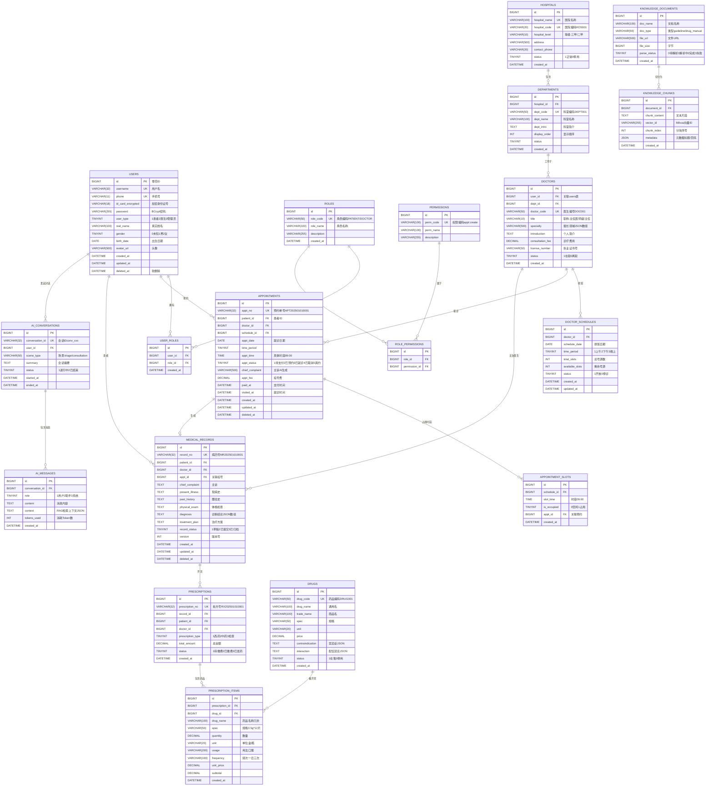

# 智能医疗辅助问诊系统 - 数据库设计文档

## 1. 数据库选型与规范

### 1.1 基础规范
- **数据库**: MySQL 8.0.33+
- **字符集**: `utf8mb4` + `utf8mb4_unicode_ci`
- **存储引擎**: InnoDB
- **主键策略**: 使用雪花算法生成 `BIGINT` 类型 ID
- **时间字段**: 统一使用 `DATETIME` 类型，精度到秒
- **软删除**: 所有业务表必须包含 `deleted_at` 字段（医疗数据合规要求）

### 1.2 命名规范
- **表名**: 小写 + 下划线分隔，复数形式（如 `users`, `appointments`）
- **字段名**: 小写 + 下划线，布尔类型以 `is_` 开头
- **索引命名**: 
  - 普通索引: `idx_字段名`
  - 唯一索引: `uk_字段名`
  - 外键索引: `fk_当前表_关联表`

---

## 2. 实体关系图 (ER Diagram)



---

## 3. 核心表结构 DDL

### 3.1 用户权限域

#### users - 用户表
```sql
CREATE TABLE `users` (
  `id` BIGINT NOT NULL COMMENT '雪花ID',
  `username` VARCHAR(32) NOT NULL COMMENT '用户名',
  `phone` VARCHAR(11) NOT NULL COMMENT '手机号',
  `id_card_encrypted` VARCHAR(18) DEFAULT NULL COMMENT 'AES加密身份证号',
  `password` VARCHAR(255) NOT NULL COMMENT 'BCrypt加密密码',
  `user_type` TINYINT NOT NULL COMMENT '用户类型:1患者2医生3管理员',
  `real_name` VARCHAR(100) DEFAULT NULL COMMENT '真实姓名',
  `gender` TINYINT DEFAULT 0 COMMENT '性别:0未知1男2女',
  `birth_date` DATE DEFAULT NULL COMMENT '出生日期',
  `avatar_url` VARCHAR(500) DEFAULT NULL COMMENT '头像URL',
  `created_at` DATETIME NOT NULL DEFAULT CURRENT_TIMESTAMP,
  `updated_at` DATETIME NOT NULL DEFAULT CURRENT_TIMESTAMP ON UPDATE CURRENT_TIMESTAMP,
  `deleted_at` DATETIME DEFAULT NULL COMMENT '软删除时间',
  PRIMARY KEY (`id`),
  UNIQUE KEY `uk_username` (`username`),
  UNIQUE KEY `uk_phone` (`phone`),
  KEY `idx_user_type` (`user_type`),
  KEY `idx_deleted_at` (`deleted_at`)
) ENGINE=InnoDB DEFAULT CHARSET=utf8mb4 COLLATE=utf8mb4_unicode_ci COMMENT='用户表';
```

#### roles - 角色表
```sql
CREATE TABLE `roles` (
  `id` BIGINT NOT NULL,
  `role_code` VARCHAR(50) NOT NULL COMMENT '角色编码',
  `role_name` VARCHAR(100) NOT NULL COMMENT '角色名称',
  `description` VARCHAR(255) DEFAULT NULL,
  `created_at` DATETIME NOT NULL DEFAULT CURRENT_TIMESTAMP,
  PRIMARY KEY (`id`),
  UNIQUE KEY `uk_role_code` (`role_code`)
) ENGINE=InnoDB DEFAULT CHARSET=utf8mb4 COLLATE=utf8mb4_unicode_ci COMMENT='角色表';
```

#### user_roles - 用户角色关联表
```sql
CREATE TABLE `user_roles` (
  `id` BIGINT NOT NULL,
  `user_id` BIGINT NOT NULL,
  `role_id` BIGINT NOT NULL,
  `created_at` DATETIME NOT NULL DEFAULT CURRENT_TIMESTAMP,
  PRIMARY KEY (`id`),
  UNIQUE KEY `uk_user_role` (`user_id`, `role_id`),
  KEY `idx_role_id` (`role_id`)
) ENGINE=InnoDB DEFAULT CHARSET=utf8mb4 COLLATE=utf8mb4_unicode_ci COMMENT='用户角色关联表';
```

### 3.2 医疗资源域

#### hospitals - 医院表
```sql
CREATE TABLE `hospitals` (
  `id` BIGINT NOT NULL,
  `hospital_name` VARCHAR(100) NOT NULL,
  `hospital_code` VARCHAR(20) NOT NULL COMMENT '医院编码',
  `hospital_level` VARCHAR(10) DEFAULT NULL COMMENT '医院等级',
  `address` VARCHAR(500) DEFAULT NULL,
  `contact_phone` VARCHAR(20) DEFAULT NULL,
  `status` TINYINT NOT NULL DEFAULT 1 COMMENT '状态:1正常0停用',
  `created_at` DATETIME NOT NULL DEFAULT CURRENT_TIMESTAMP,
  PRIMARY KEY (`id`),
  UNIQUE KEY `uk_hospital_code` (`hospital_code`)
) ENGINE=InnoDB DEFAULT CHARSET=utf8mb4 COLLATE=utf8mb4_unicode_ci COMMENT='医院表';
```

#### departments - 科室表
```sql
CREATE TABLE `departments` (
  `id` BIGINT NOT NULL,
  `hospital_id` BIGINT NOT NULL,
  `dept_code` VARCHAR(50) NOT NULL,
  `dept_name` VARCHAR(100) NOT NULL,
  `dept_intro` TEXT COMMENT '科室简介',
  `display_order` INT DEFAULT 0,
  `status` TINYINT NOT NULL DEFAULT 1,
  `created_at` DATETIME NOT NULL DEFAULT CURRENT_TIMESTAMP,
  PRIMARY KEY (`id`),
  UNIQUE KEY `uk_dept_code` (`dept_code`),
  KEY `idx_hospital_id` (`hospital_id`),
  KEY `idx_status_order` (`status`, `display_order`)
) ENGINE=InnoDB DEFAULT CHARSET=utf8mb4 COLLATE=utf8mb4_unicode_ci COMMENT='科室表';
```

#### doctors - 医生表
```sql
CREATE TABLE `doctors` (
  `id` BIGINT NOT NULL,
  `user_id` BIGINT NOT NULL COMMENT '关联用户ID',
  `dept_id` BIGINT NOT NULL,
  `doctor_code` VARCHAR(50) NOT NULL,
  `title` VARCHAR(10) DEFAULT NULL COMMENT '职称',
  `specialty` VARCHAR(500) DEFAULT NULL COMMENT '擅长领域JSON',
  `introduction` TEXT COMMENT '个人简介',
  `consultation_fee` DECIMAL(10,2) DEFAULT 0.00,
  `license_number` VARCHAR(50) DEFAULT NULL COMMENT '执业证书号',
  `status` TINYINT NOT NULL DEFAULT 1 COMMENT '1在职0离职',
  `created_at` DATETIME NOT NULL DEFAULT CURRENT_TIMESTAMP,
  PRIMARY KEY (`id`),
  UNIQUE KEY `uk_doctor_code` (`doctor_code`),
  UNIQUE KEY `uk_user_id` (`user_id`),
  KEY `idx_dept_id` (`dept_id`),
  KEY `idx_status` (`status`)
) ENGINE=InnoDB DEFAULT CHARSET=utf8mb4 COLLATE=utf8mb4_unicode_ci COMMENT='医生表';
```

#### doctor_schedules - 医生排班表
```sql
CREATE TABLE `doctor_schedules` (
  `id` BIGINT NOT NULL,
  `doctor_id` BIGINT NOT NULL,
  `schedule_date` DATE NOT NULL COMMENT '排班日期',
  `time_period` TINYINT NOT NULL COMMENT '时段:1上午2下午3晚上',
  `total_slots` INT NOT NULL DEFAULT 0 COMMENT '总号源数',
  `available_slots` INT NOT NULL DEFAULT 0 COMMENT '剩余号源',
  `status` TINYINT NOT NULL DEFAULT 1 COMMENT '1开放0停诊',
  `created_at` DATETIME NOT NULL DEFAULT CURRENT_TIMESTAMP,
  `updated_at` DATETIME NOT NULL DEFAULT CURRENT_TIMESTAMP ON UPDATE CURRENT_TIMESTAMP,
  PRIMARY KEY (`id`),
  UNIQUE KEY `uk_doctor_date_period` (`doctor_id`, `schedule_date`, `time_period`),
  KEY `idx_date_status` (`schedule_date`, `status`)
) ENGINE=InnoDB DEFAULT CHARSET=utf8mb4 COLLATE=utf8mb4_unicode_ci COMMENT='医生排班表';
```

### 3.3 挂号预约域

#### appointments - 挂号预约表
```sql
CREATE TABLE `appointments` (
  `id` BIGINT NOT NULL,
  `appt_no` VARCHAR(32) NOT NULL COMMENT '预约单号',
  `patient_id` BIGINT NOT NULL,
  `doctor_id` BIGINT NOT NULL,
  `schedule_id` BIGINT NOT NULL,
  `appt_date` DATE NOT NULL,
  `time_period` TINYINT NOT NULL,
  `appt_time` TIME DEFAULT NULL COMMENT '具体时间段',
  `appt_status` TINYINT NOT NULL DEFAULT 1 COMMENT '1待支付2已预约3已就诊4已取消5爽约',
  `chief_complaint` VARCHAR(500) DEFAULT NULL COMMENT 'AI生成主诉',
  `appt_fee` DECIMAL(10,2) DEFAULT 0.00,
  `paid_at` DATETIME DEFAULT NULL,
  `visited_at` DATETIME DEFAULT NULL,
  `created_at` DATETIME NOT NULL DEFAULT CURRENT_TIMESTAMP,
  `updated_at` DATETIME NOT NULL DEFAULT CURRENT_TIMESTAMP ON UPDATE CURRENT_TIMESTAMP,
  `deleted_at` DATETIME DEFAULT NULL,
  PRIMARY KEY (`id`),
  UNIQUE KEY `uk_appt_no` (`appt_no`),
  KEY `idx_patient_id` (`patient_id`),
  KEY `idx_doctor_schedule` (`doctor_id`, `appt_date`),
  KEY `idx_status` (`appt_status`),
  KEY `idx_deleted_at` (`deleted_at`)
) ENGINE=InnoDB DEFAULT CHARSET=utf8mb4 COLLATE=utf8mb4_unicode_ci COMMENT='挂号预约表';
```

### 3.4 诊疗域

#### medical_records - 电子病历表
```sql
CREATE TABLE `medical_records` (
  `id` BIGINT NOT NULL,
  `record_no` VARCHAR(32) NOT NULL COMMENT '病历号',
  `patient_id` BIGINT NOT NULL,
  `doctor_id` BIGINT NOT NULL,
  `appt_id` BIGINT DEFAULT NULL,
  `chief_complaint` TEXT COMMENT '主诉',
  `present_illness` TEXT COMMENT '现病史',
  `past_history` TEXT COMMENT '既往史',
  `physical_exam` TEXT COMMENT '体格检查',
  `diagnosis` TEXT COMMENT '诊断JSON数组',
  `treatment_plan` TEXT COMMENT '治疗方案',
  `record_status` TINYINT NOT NULL DEFAULT 1 COMMENT '1草稿2已提交3已归档',
  `version` INT NOT NULL DEFAULT 1 COMMENT '版本号',
  `created_at` DATETIME NOT NULL DEFAULT CURRENT_TIMESTAMP,
  `updated_at` DATETIME NOT NULL DEFAULT CURRENT_TIMESTAMP ON UPDATE CURRENT_TIMESTAMP,
  `deleted_at` DATETIME DEFAULT NULL,
  PRIMARY KEY (`id`),
  UNIQUE KEY `uk_record_no` (`record_no`),
  KEY `idx_patient_id` (`patient_id`),
  KEY `idx_doctor_id` (`doctor_id`),
  KEY `idx_appt_id` (`appt_id`),
  KEY `idx_status` (`record_status`)
) ENGINE=InnoDB DEFAULT CHARSET=utf8mb4 COLLATE=utf8mb4_unicode_ci COMMENT='电子病历表';
```

#### prescriptions - 处方表
```sql
CREATE TABLE `prescriptions` (
  `id` BIGINT NOT NULL,
  `prescription_no` VARCHAR(32) NOT NULL,
  `record_id` BIGINT NOT NULL,
  `patient_id` BIGINT NOT NULL,
  `doctor_id` BIGINT NOT NULL,
  `prescription_type` TINYINT NOT NULL COMMENT '1西药2中药3检查',
  `total_amount` DECIMAL(10,2) DEFAULT 0.00,
  `status` TINYINT NOT NULL DEFAULT 1 COMMENT '1待缴费2已缴费3已发药',
  `created_at` DATETIME NOT NULL DEFAULT CURRENT_TIMESTAMP,
  PRIMARY KEY (`id`),
  UNIQUE KEY `uk_prescription_no` (`prescription_no`),
  KEY `idx_record_id` (`record_id`),
  KEY `idx_patient_id` (`patient_id`)
) ENGINE=InnoDB DEFAULT CHARSET=utf8mb4 COLLATE=utf8mb4_unicode_ci COMMENT='处方表';
```

#### prescription_items - 处方明细表
```sql
CREATE TABLE `prescription_items` (
  `id` BIGINT NOT NULL,
  `prescription_id` BIGINT NOT NULL,
  `drug_id` BIGINT NOT NULL,
  `drug_name` VARCHAR(100) NOT NULL COMMENT '药品名称冗余',
  `spec` VARCHAR(50) DEFAULT NULL,
  `quantity` DECIMAL(10,2) NOT NULL,
  `unit` VARCHAR(20) DEFAULT NULL,
  `usage` VARCHAR(200) DEFAULT NULL COMMENT '用法',
  `frequency` VARCHAR(100) DEFAULT NULL COMMENT '频次',
  `unit_price` DECIMAL(10,2) NOT NULL,
  `subtotal` DECIMAL(10,2) NOT NULL,
  `created_at` DATETIME NOT NULL DEFAULT CURRENT_TIMESTAMP,
  PRIMARY KEY (`id`),
  KEY `idx_prescription_id` (`prescription_id`),
  KEY `idx_drug_id` (`drug_id`)
) ENGINE=InnoDB DEFAULT CHARSET=utf8mb4 COLLATE=utf8mb4_unicode_ci COMMENT='处方明细表';
```

#### drugs - 药品字典表
```sql
CREATE TABLE `drugs` (
  `id` BIGINT NOT NULL,
  `drug_code` VARCHAR(50) NOT NULL,
  `drug_name` VARCHAR(100) NOT NULL COMMENT '通用名',
  `trade_name` VARCHAR(100) DEFAULT NULL COMMENT '商品名',
  `spec` VARCHAR(50) DEFAULT NULL,
  `unit` VARCHAR(20) DEFAULT NULL,
  `price` DECIMAL(10,2) NOT NULL,
  `contraindication` TEXT COMMENT '禁忌症JSON',
  `interaction` TEXT COMMENT '配伍禁忌JSON',
  `status` TINYINT NOT NULL DEFAULT 1,
  `created_at` DATETIME NOT NULL DEFAULT CURRENT_TIMESTAMP,
  PRIMARY KEY (`id`),
  UNIQUE KEY `uk_drug_code` (`drug_code`),
  KEY `idx_drug_name` (`drug_name`)
) ENGINE=InnoDB DEFAULT CHARSET=utf8mb4 COLLATE=utf8mb4_unicode_ci COMMENT='药品字典表';
```

### 3.5 AI服务域

#### ai_conversations - AI对话会话表
```sql
CREATE TABLE `ai_conversations` (
  `id` BIGINT NOT NULL,
  `conversation_id` VARCHAR(32) NOT NULL COMMENT '会话唯一ID',
  `user_id` BIGINT NOT NULL,
  `scene_type` VARCHAR(50) NOT NULL COMMENT '场景类型:triage/consultation',
  `summary` TEXT COMMENT '会话摘要',
  `status` TINYINT NOT NULL DEFAULT 1 COMMENT '1进行中2已结束',
  `started_at` DATETIME NOT NULL DEFAULT CURRENT_TIMESTAMP,
  `ended_at` DATETIME DEFAULT NULL,
  PRIMARY KEY (`id`),
  UNIQUE KEY `uk_conversation_id` (`conversation_id`),
  KEY `idx_user_id` (`user_id`),
  KEY `idx_scene_type` (`scene_type`)
) ENGINE=InnoDB DEFAULT CHARSET=utf8mb4 COLLATE=utf8mb4_unicode_ci COMMENT='AI对话会话表';
```

#### ai_messages - AI对话消息表
```sql
CREATE TABLE `ai_messages` (
  `id` BIGINT NOT NULL,
  `conversation_id` BIGINT NOT NULL,
  `role` TINYINT NOT NULL COMMENT '角色:1用户2助手3系统',
  `content` TEXT NOT NULL,
  `context` TEXT COMMENT 'RAG检索上下文JSON',
  `tokens_used` INT DEFAULT 0,
  `created_at` DATETIME NOT NULL DEFAULT CURRENT_TIMESTAMP,
  PRIMARY KEY (`id`),
  KEY `idx_conversation_id` (`conversation_id`),
  KEY `idx_created_at` (`created_at`)
) ENGINE=InnoDB DEFAULT CHARSET=utf8mb4 COLLATE=utf8mb4_unicode_ci COMMENT='AI对话消息表';
```

### 3.6 知识库域

#### knowledge_documents - 知识库文档表
```sql
CREATE TABLE `knowledge_documents` (
  `id` BIGINT NOT NULL,
  `doc_name` VARCHAR(100) NOT NULL,
  `doc_type` VARCHAR(50) NOT NULL COMMENT '文档类型:guideline/drug_manual',
  `file_url` VARCHAR(500) NOT NULL,
  `file_size` BIGINT DEFAULT 0,
  `parse_status` TINYINT NOT NULL DEFAULT 0 COMMENT '0待解析1解析中2完成3失败',
  `created_at` DATETIME NOT NULL DEFAULT CURRENT_TIMESTAMP,
  PRIMARY KEY (`id`),
  KEY `idx_doc_type` (`doc_type`),
  KEY `idx_parse_status` (`parse_status`)
) ENGINE=InnoDB DEFAULT CHARSET=utf8mb4 COLLATE=utf8mb4_unicode_ci COMMENT='知识库文档表';
```

#### knowledge_chunks - 知识库分块表
```sql
CREATE TABLE `knowledge_chunks` (
  `id` BIGINT NOT NULL,
  `document_id` BIGINT NOT NULL,
  `chunk_content` TEXT NOT NULL COMMENT '文本片段',
  `vector_id` VARCHAR(255) DEFAULT NULL COMMENT 'Milvus向量ID',
  `chunk_index` INT NOT NULL COMMENT '分块序号',
  `metadata` JSON DEFAULT NULL COMMENT '元数据',
  `created_at` DATETIME NOT NULL DEFAULT CURRENT_TIMESTAMP,
  PRIMARY KEY (`id`),
  KEY `idx_document_id` (`document_id`),
  KEY `idx_vector_id` (`vector_id`)
) ENGINE=InnoDB DEFAULT CHARSET=utf8mb4 COLLATE=utf8mb4_unicode_ci COMMENT='知识库分块表';
```

---

## 4. 索引策略与优化

### 4.1 高频查询索引
| 表名 | 索引 | 说明 |
|------|------|------|
| `appointments` | `idx_doctor_schedule` (doctor_id, appt_date) | 医生当日挂号列表查询 |
| `appointments` | `idx_patient_id` | 患者历史挂号查询 |
| `doctor_schedules` | `uk_doctor_date_period` | 防止重复排班 |
| `medical_records` | `idx_patient_id` | 患者病历历史 |
| `ai_messages` | `idx_conversation_id` | 对话消息加载 |

### 4.2 分库分表策略

#### 病历表按年分表
```sql
-- 2024年病历
CREATE TABLE `medical_records_2024` LIKE `medical_records`;
-- 2025年病历
CREATE TABLE `medical_records_2025` LIKE `medical_records`;
```
**路由规则**: 根据 `created_at` 年份路由到对应分表

#### 挂号表分库（多租户预留）
```sql
-- 医院A的挂号数据
CREATE DATABASE `mediask_hospital_a`;
-- 医院B的挂号数据
CREATE DATABASE `mediask_hospital_b`;
```
**路由规则**: 根据 `hospital_id` 哈希取模

---

## 5. 数据字典

### 5.1 枚举值定义

#### user_type - 用户类型
| 值 | 说明 |
|----|------|
| 1  | 患者 |
| 2  | 医生 |
| 3  | 管理员 |

#### appt_status - 挂号状态
| 值 | 说明 |
|----|------|
| 1  | 待支付 |
| 2  | 已预约 |
| 3  | 已就诊 |
| 4  | 已取消 |
| 5  | 爽约 |

#### time_period - 时间段
| 值 | 说明 |
|----|------|
| 1  | 上午 (08:00-12:00) |
| 2  | 下午 (14:00-18:00) |
| 3  | 晚上 (19:00-21:00) |

#### record_status - 病历状态
| 值 | 说明 |
|----|------|
| 1  | 草稿 |
| 2  | 已提交 |
| 3  | 已归档 |

#### prescription_type - 处方类型
| 值 | 说明 |
|----|------|
| 1  | 西药处方 |
| 2  | 中药处方 |
| 3  | 检查处方 |

---

## 6. 初始化数据SQL

### 6.1 插入默认角色
```sql
INSERT INTO `roles` (`id`, `role_code`, `role_name`, `description`) VALUES
(1, 'PATIENT', '患者', '普通患者角色'),
(2, 'DOCTOR', '医生', '医生角色'),
(3, 'ADMIN', '管理员', '系统管理员');
```

### 6.2 插入默认权限
```sql
INSERT INTO `permissions` (`id`, `perm_code`, `perm_name`, `description`) VALUES
(1, 'appt:create', '创建挂号', '患者预约挂号'),
(2, 'appt:cancel', '取消挂号', '取消自己的预约'),
(3, 'emr:write', '书写病历', '医生书写电子病历'),
(4, 'prescription:create', '开具处方', '医生开具处方'),
(5, 'system:manage', '系统管理', '管理员权限');
```

### 6.3 角色权限关联
```sql
INSERT INTO `role_permissions` (`id`, `role_id`, `permission_id`) VALUES
(1, 1, 1), -- 患者可创建挂号
(2, 1, 2), -- 患者可取消挂号
(3, 2, 3), -- 医生可书写病历
(4, 2, 4), -- 医生可开处方
(5, 3, 5); -- 管理员系统管理
```

---

## 7. 性能优化建议

### 7.1 Redis 缓存方案
| 缓存Key | 数据 | 过期时间 | 说明 |
|---------|------|----------|------|
| `schedule:doctor:{id}:{date}` | 医生排班JSON | 1天 | 减少频繁查询 |
| `slots:schedule:{id}` | 号源池Bitmap | 1天 | 原子扣减库存 |
| `drug:code:{code}` | 药品信息 | 永久 | 药品字典不常变 |
| `faq:{hash}` | 常见问题答案 | 7天 | RAG前置缓存 |

### 7.2 慢查询优化
- **病历查询**: 对 `patient_id + created_at` 建联合索引
- **AI消息**: 按 `conversation_id` 分区存储，单会话消息独立查询

### 7.3 备份策略
- **全量备份**: 每日凌晨3点 `mysqldump`
- **增量备份**: 开启 binlog，保留7天
- **关键表**: `medical_records`, `prescriptions` 需异地备份
