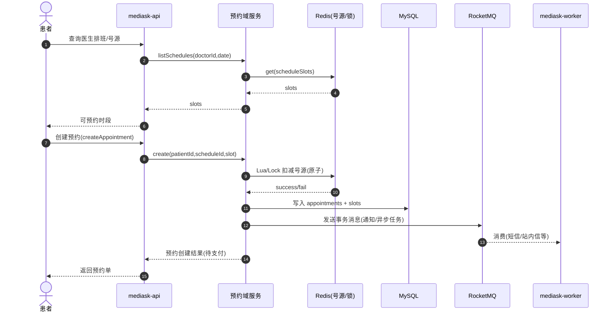
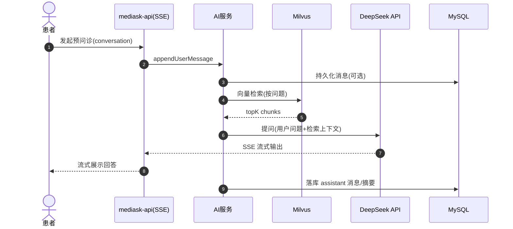

# 基于大语言模型的智能医疗辅助问诊系统 - 设计与实现方案

> 说明：本文档以“工程实现与可验收需求”为主；论文/答辩主线（研究目标、创新点、评测口径、合规审计、演示脚本）以根目录 `THESIS_OUTLINE.md` 为准。

## 1. 项目背景与意义
随着人工智能技术的发展，大语言模型（LLM）在医疗领域的应用潜力巨大。本项目旨在构建一个集成了传统医疗业务流程与先进AI辅助功能的智能问诊系统，解决传统医疗资源分配不均、预问诊效率低等问题，并通过RAG（检索增强生成）技术解决大模型在医疗领域的"幻觉"问题。

## 2. 技术架构选型

### 2.1 后端技术栈
*   **开发语言**: Java (JDK 21) - 利用新特性提高开发效率与性能。
*   **核心框架**: Spring Boot 3.x - 快速构建微服务或单体应用。
*   **ORM框架**: MyBatis-Plus - 简化数据库操作。
*   **数据库**:
    *   MySQL 8.0: 存储用户、病历、挂号等结构化数据。
    *   **Redis**: 用于缓存医生排班信息、用户Session、验证码，提高系统响应速度。
    *   **Vector Database (向量数据库)**: Milvus 用于存储医疗知识库的向量数据，支持RAG检索。
*   **AI模型接口**: DeepSeek API (或其他OpenAI兼容接口)。

### 2.1.1 AI 微服务技术栈 (Python)
AI 能力采用**独立 Python 微服务**架构，与 Java 主业务解耦，充分发挥 Python 在 AI/LLM 领域的生态优势。

*   **Web 框架**: FastAPI - 原生 async、自动 OpenAPI 文档、SSE 支持
*   **AI 编排**: LangChain - RAG Pipeline、Prompt 管理、文档加载器
*   **对话状态机**: LangGraph - 多轮对话状态管理，比 Memory 更可控
*   **向量数据库**: pymilvus - Milvus Python SDK
*   **LLM 接入**: OpenAI SDK (DeepSeek 兼容) - 流式输出、Function Calling
*   **服务器**: uvicorn - 高性能 ASGI 服务器

### 2.2 前端技术栈

**管理员端 / 医生端（固定选型）**
*   **框架**: React 19 + TypeScript + Vite
*   **路由**: react-router v6
*   **UI 组件库**: Ant Design 6
*   **样式**: Tailwind CSS
*   **HTTP**: Axios（统一拦截器处理 Token 与全局错误）

**患者端（已确定：公众号内 H5）**
*   **形态**: 微信公众号菜单/图文消息入口打开 H5（微信内置浏览器）
*   **技术栈**: React + react-router + Tailwind CSS（尽量与 Web 端统一以便复用）
*   **HTTPS/域名**: 需要配置 HTTPS，并在公众号后台配置业务域名（用于正常访问与后续 JS-SDK 能力扩展）

## 3. 需求分析与系统功能描述（待落地的"可验收版本"）

> 目标：把"系统要做什么、由谁做、怎么做、做到什么程度"讲清楚，便于后续接口设计、表结构校验与测试用例编写。

### 3.1 系统目标与范围界定

**系统目标**
- 为患者提供"预问诊/导诊 + 挂号预约 + 就诊记录"的闭环能力，降低重复问诊成本。
- 为医生提供"接诊信息聚合 + 结构化病历 + 处方开具/校验"的提效能力。
- 通过 RAG（检索增强生成）让 AI 回答尽可能"可追溯、有依据"，降低医疗场景幻觉风险。

**范围（In Scope）**
- 用户体系：注册/登录、JWT 鉴权、RBAC 授权。
- 医疗资源：医院/科室/医生、医生排班、号源管理。
- 挂号预约：查号源、创建预约、支付（可先做"模拟支付"）、取消与状态流转。
- 诊疗流程：医生查看预约、书写/提交/归档病历、开具处方。
- AI 能力：预问诊多轮对话（SSE 流式）、生成主诉摘要、知识库问答（RAG）、知识库文档导入与解析。
- 管理能力：基础字典维护（科室/药品等）、知识库文档管理、审计/操作日志查询（可先做最小闭环）。

**不做/暂不做（Out of Scope / Phase 2）**
- 真实线上医保结算、与医院 HIS/EMR 的正式对接。
- 真实支付渠道（微信/支付宝）与对账（可先用模拟支付 + 状态机）。
- 医疗"自动诊断/自动处方"作为最终决策（系统仅提供建议/辅助，必须由医生确认）。

### 3.2 角色与权限模型（RBAC）

| 角色 | 典型用户 | 核心权限范围（示例） |
|------|----------|----------------------|
| 患者（PATIENT） | 普通用户 | 发起 AI 预问诊、查询医生/号源、创建/取消预约、查看本人病历摘要 |
| 医生（DOCTOR） | 医务人员 | 查看本人排班与预约、接诊、创建/修改/归档病历、开具处方 |
| 管理员（ADMIN） | 运维/管理员 | 维护医院/科室/医生、药品字典、知识库文档管理、权限配置、审计日志 |

权限粒度建议按资源与动作拆分（与数据库 `PERMISSIONS.perm_code` 对齐），例如：
- `appt:create`/`appt:cancel`/`appt:pay`
- `emr:write`/`emr:archive`
- `kb:upload`/`kb:reindex`

### 3.3 核心用例清单（按闭环优先级）

> 说明：用例用 "UC-编号" 作为后续接口、测试用例与 PRD 追踪的共同锚点。

| 用例ID | 参与者 | 用例名称 | 结果/产物 | 优先级 |
|--------|--------|----------|-----------|--------|
| UC-01 | 患者 | 登录/鉴权 | 获取 JWT、建立会话 | P0 |
| UC-02 | 患者 | AI 预问诊（多轮） | 生成主诉摘要/科室建议 | P0 |
| UC-03 | 患者 | 查询医生与号源 | 可预约时段列表 | P0 |
| UC-04 | 患者 | 创建预约（占号源） | 预约单 + 号源扣减 | P0 |
| UC-05 | 患者 | 支付预约（可模拟） | 预约状态变更为已确认 | P0 |
| UC-06 | 患者 | 取消预约 | 释放号源、记录原因 | P0 |
| UC-07 | 医生 | 查看今日预约/接诊列表 | 接诊工作台 | P0 |
| UC-08 | 医生 | 书写病历并归档 | 结构化病历、版本记录 | P0 |
| UC-09 | 医生 | 开具处方并校验 | 处方单 + 明细项 | P1 |
| UC-10 | 管理员 | 维护基础数据 | 医院/科室/医生/药品 | P1 |
| UC-11 | 管理员 | 导入知识库文档 | 文档解析、切片入库 | P1 |
| UC-12 | 系统 | RAG 知识问答 | 带引用上下文的回答 | P1 |

### 3.4 关键业务流程分析（主链路 + 边界条件）

#### 3.4.1 挂号预约主流程（UC-03/04/05）

**关键边界/异常（必须在分析与测试里覆盖）**
- 号源不足：创建预约返回"无剩余号源"，不得落库。
- 并发冲突：同一号源高并发下不得超卖（Redis 原子扣减 + DB 兜底校验）。
- 幂等：重复提交创建预约（网络重试）需通过 `Idempotency-Key` 或业务幂等键避免重复订单。
- 支付超时：待支付订单到期自动取消并释放号源（可由 Worker/定时任务实现）。

#### 3.4.2 病历与处方流程（UC-07/08/09）

**病历状态建议**：草稿 → 已提交 → 已归档（归档后仅允许追补/新增版本，不允许覆盖）。

**处方校验建议（最小集）**
- 药品是否有效（上架/停用状态）。
- 处方明细数量/频次格式校验。
- 配伍禁忌：可先做"规则库 + 提示"，后续再引入 RAG/AI 增强。

#### 3.4.3 AI 预问诊与 RAG 主流程（UC-02/12）

**隐私与合规（必须写进需求与实现约束）**
- 发送给 LLM 前对姓名/身份证/手机号等 PII 做脱敏（最小可行：规则替换；可扩展：注解式脱敏）。
- AI 输出明确"仅供参考、不能替代医生诊断"，对高风险内容（急症/用药）增加安全提示。

### 3.5 主要数据对象与存储映射（与现有 ER 对齐）

| 领域对象 | 核心表（示例） | 说明 |
|---------|----------------|------|
| 用户/权限 | `USERS`/`ROLES`/`USER_ROLES`/`PERMISSIONS` | 认证与授权基座 |
| 医疗资源 | `HOSPITALS`/`DEPARTMENTS`/`DOCTORS`/`DOCTOR_SCHEDULES` | 医院组织与排班 |
| 预约挂号 | `APPOINTMENTS`/`APPOINTMENT_SLOTS` | 预约单与号源占用 |
| 诊疗病历 | `MEDICAL_RECORDS` | 结构化病历、版本控制 |
| 处方管理 | `PRESCRIPTIONS`/`PRESCRIPTION_ITEMS`/`DRUGS` | 处方与药品字典 |
| AI 会话 | `AI_CONVERSATIONS`/`AI_MESSAGES` | 对话记录、上下文 |
| 知识库 | `KNOWLEDGE_DOCUMENTS`/`KNOWLEDGE_CHUNKS` | 文档与切片 |

### 3.6 非功能性需求（NFR）

> NFR 会直接决定架构与测试策略：建议与 [docs/05-TESTING.md](./docs/05-TESTING.md) 保持一致口径。

- **性能**：核心交易接口（创建/支付/取消预约）在压测下满足 P99 < 500ms；查询接口 P99 < 200ms；AI 问答 P99 < 3s（含检索）。
- **一致性**：号源扣减强一致；通知类副作用最终一致（MQ/重试）。
- **安全**：JWT + RBAC；敏感数据加密（BCrypt/AES）；接口限流；操作审计。
- **可观测性**：traceId 贯穿日志；关键业务指标（预约成功率、超时率、AI 调用失败率）可监控。
- **可用性**：外部 LLM 超时可降级（提示稍后重试/返回规则库建议）；向量库不可用时可走"无检索"保底回答或直接拒答。

### 3.7 MVP 验收标准（建议用于答辩/里程碑检查）

- 患者：可完成"登录 → AI 预问诊 → 选择科室/医生 → 创建预约 → 支付（模拟）/取消"的闭环。
- 医生：可查看本人预约列表，完成"病历草稿 → 提交 → 归档"，并能开具最小处方。
- 管理员：至少可维护药品字典与知识库文档（上传→解析→可检索）。
- 系统：预约流程无超卖；日志可追踪一次请求；AI 调用失败有可理解的错误提示。

## 4. 系统功能模块设计

### 4.1 核心业务模块 (基础保障 - 详细设计)

1.  **用户中心与权限管理 (RBAC)**
    *   **多角色体系**:
        *   **患者**: 实名认证 (OCR识别身份证)、电子就诊卡生成 (QR Code)、医保类型绑定。
        *   **医生**: 执业资格审核、擅长领域标签管理 (用于推荐算法)、排班偏好设置。
        *   **管理员**: 医院基础数据维护 (科室/诊室/药品字典)、系统日志审计。
    *   **安全架构**:
        *   集成 **Spring Security + JWT** 实现无状态认证。
        *   敏感数据 (密码、身份证号) 使用 **AES/BCrypt** 加密存储。
        *   接口限流 (Rate Limiting) 防止恶意刷号。

2.  **智慧门诊挂号系统**
    *   **排班引擎**:
        *   支持**自动排班** (基于规则生成) 与 **手动调整** (请假/调休)。
        *   号源池管理: 将每天的就诊时间划分为细粒度的时间片 (如每15分钟一个号源)。
    *   **高并发预约流程**:
        *   **状态机管理**: 待支付 -> 锁定中 -> 预约成功 -> 待就诊 -> 已完成/已爽约。
        *   **抗压设计**: 使用 **Redis List/ZSet** 预加载号源，利用 **Lua 脚本** 或 **Redisson 分布式锁** 保证扣减库存的原子性，彻底杜绝"超卖"现象。
        *   **削峰填谷**: 引入 **RabbitMQ/RocketMQ** (可选) 异步处理挂号成功后的短信通知、数据库落库操作，提升接口响应速度。

3.  **电子病历 (EMR) 与 处方管理**
    *   **结构化病历书写**:
        *   提供**标准模板库** (如感冒、高血压模板)，医生可一键导入，减少打字时间。
        *   支持**暂存**功能，防止网络异常导致数据丢失。
    *   **处方开具与校验**:
        *   药品库存实时联动: 开药时自动检查药房库存。
        *   **配伍禁忌自动拦截**: (传统规则库 + AI辅助) 当医生同时开了相冲突的药时，前端弹出红色警告。
    *   **病历归档与版本控制**: 每次修改生成新的版本快照，保留修改痕迹 (医疗合规要求)。

### 4.2 AI 智能核心模块 (毕设亮点)

1.  **智能导诊与预问诊 (Smart Triage)**
    *   **功能**: 患者以自然语言描述症状，AI进行多轮对话，收集关键信息（发病时间、疼痛程度、伴随症状）。
    *   **输出**:
        *   推荐挂号科室。
        *   生成一份**"病情预摘要"**，在医生接诊前展示给医生，减少重复询问时间。
    *   **技术**: Prompt Engineering (角色扮演), 对话状态管理。

2.  **基于 RAG 的本地医疗知识库 (Knowledge Base)**
    *   **数据源**: 导入《临床诊疗指南》、《国家基本药物目录》、常见药品说明书 (PDF/Text)。
    *   **流程**:
        1.  **文档切片**: 将长文档切分为语义完整的Chunk。
        2.  **向量化 (Embedding)**: 使用Embedding模型将文本转为向量存入向量数据库。
        3.  **混合检索 (Hybrid Search)**: 结合关键词检索 (BM25) 和 向量检索 (Semantic Search) 提高召回准确率。
        4.  **生成**: 将检索到的相关医学知识作为 Context 输入大模型，生成回答。
    *   **目的**: 确保AI回答基于权威指南，而非模型自行编造。

3.  **辅助诊疗与用药建议 (CDSS Lite)**
    *   **功能**: 医生在书写病历时，系统实时分析输入内容。
    *   **AI输出**:
        *   **鉴别诊断提示**: 提示医生可能需要排除的其他疾病。
        *   **用药合规性检查**: 检查处方是否存在配伍禁忌（基于知识库）。
        *   **初步处方生成**: 根据诊断生成建议处方（需医生确认）。
    *   **隐私保护**: **关键点** - 在发送给大模型前，对患者姓名、身份证号进行**脱敏处理**。

## 5. 毕设加分项与优化建议

1.  **数据隐私与安全 (Privacy Preserving)**
    *   在论文中重点阐述如何保护患者隐私。例如实现一个**脱敏过滤器 (PII Filter)**，在调用LLM接口前自动替换敏感信息（如将"张三"替换为"患者A"）。

2.  **AI 回答的评估机制 (Evaluation)**
    *   设计一个简单的**反馈机制**：医生可以对AI的建议进行"点赞"或"修改"。
    *   记录AI建议与医生最终处方的**相似度**，作为系统准确性的评估指标写入论文。

3.  **多模态扩展 (可选)**
    *   允许患者上传**化验单图片**或**患处照片**，利用OCR技术提取文字或多模态大模型进行辅助分析（如皮肤科初筛）。

4.  **数据可视化大屏**
    *   管理员端增加一个Dashboard，展示：
        *   今日挂号量/就诊量趋势。
        *   AI 导诊的热门病种/科室分布（基于AI对话日志分析）。

## 6. 论文撰写思路
1.  **绪论**: 医疗资源紧张现状，LLM带来的机遇，RAG技术解决幻觉的必要性。
2.  **相关技术**: SpringBoot, LLM, RAG, Vector Database 原理。
3.  **需求分析**: 角色用例图，非功能性需求（并发、隐私）。
4.  **系统设计**: 架构图，数据库ER图，RAG流程图（重点）。
5.  **系统实现**: 核心代码片段（Prompt设计、向量检索逻辑、并发锁）。
6.  **系统测试与评估**: 功能测试，AI回答准确性的人工评估结果。
7.  **总结与展望**.
