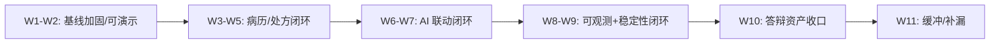

# 后端 Java 开发路线图（周粒度、可验收版）

> 目标：用“周粒度计划 + 明确交付物 + 可验收标准”组织后端开发，确保每周都有可展示产出，并能直接转成论文/答辩证据。
>
> 适用时间：从 **2026-02-16（周一）** 起计算（当前日期：2026-02-15）。
>
> 说明：如果你的答辩时间更早，可以把后面的周合并；但请保留“缓冲周”，避免最后一周爆炸。

## 0. 统一约束（不做这个就别做后面的）

### 0.1 工程与分层约束

- 分层与命名规范：以仓库根 `AGENTS.md` 为准（DDD 分层依赖严格禁止穿透）。
- 事实来源优先级：代码 > 配置 > 文档；数据库结构以 `mediask-dal/src/main/resources/sql/init-dev.sql` 为事实来源。

### 0.2 每周最低交付物（缺一不可）

- `api-docs/openapi.json` 与 `api-docs/README.md`：与 Controller 实现一致（新增/修改接口必同步）。
- 至少 1 条可复现演示脚本（命令/请求/预期输出）或 1 个可复现测试（JUnit/集成测试）。
- 至少 1 份“证据”截图：Swagger/Knife4j、测试报告、Grafana 面板、Loki 查询、关键日志等。

### 0.3 构建/测试命令（平台规则）

- macOS：`./scripts/m21.sh clean verify`
- 非 macOS：`mvn clean verify`

## 1. 路线总览（里程碑）

> 默认 11 周，其中 W11 为缓冲周（强烈建议保留）。如果周期更短：优先保住 W1-W2、W3-W5、W10，其他合并。

## 2. 周计划一览（仅导航）

> 这一节只做“导航”。每周要做的具体事情、交付物、验收方法见第 4 节。

| 周次 | 时间（起始周一） | 主题 | 本周三目标（更具体） | 本周必须产出（可验收） |
|---|---|---|---|---|
| [W1](#w1) | 2026-02-16 | 基线对齐 + 主链路回归 | 走通 1 条主链路 对齐关键 OpenAPI 补 1 个回归证据 | 1 份演示脚本 + 1 份证据截图 |
| [W2](#w2) | 2026-02-23 | 幂等/一致性/安全补洞 | 2 个失败场景可解释 补齐 Redis/本地缓存封装口径 RBAC 与审计最小闭环 | 2 个可复现失败用例 + 对应日志/测试 |
| [W3](#w3) | 2026-03-02 | 病历：最小闭环 | 草稿/提交/查询可演示 状态与权限校验落地 补 1-2 个规则测试 | 病历闭环演示 + 文档/测试 |
| [W4](#w4) | 2026-03-09 | 处方：最小闭环 | 创建/明细/查询可演示 处方校验最小集 补 1-2 个规则测试 | 处方闭环演示 + 文档/测试 |
| [W5](#w5) | 2026-03-16 | 医生工作台整合 | 串联病历+处方+就诊 权限与审计口径对齐 补 1 条工作台脚本 | 工作台演示脚本 + 证据截图 |
| [W6](#w6) | 2026-03-23 | AI：契约与门面 | 契约先定（OpenAPI） 超时/降级/错误码 日志字段口径对齐 | AI 失败可控 + 证据截图 |
| [W7](#w7) | 2026-03-30 | AI：闭环落地 | 问诊→结果回写落库 降级路径可演示 补 1 条回归脚本 | AI 闭环演示 + 文档/证据 |
| [W8](#w8) | 2026-04-06 | 日志闭环（Loki） | 应用日志落盘采集 3 类 Loki 查询固化 定位 1 个预置问题 | Loki 查询截图 + 复现步骤 |
| [W9](#w9) | 2026-04-13 | 指标闭环（Prometheus） | 关键指标落地 1 张 Grafana 面板 本地缓存可观测（hitRate/TTL/maxSize） | 面板截图 + 问题定位过程 |
| [W10](#w10) | 2026-04-20 | 答辩资产收口 | 3 条演示脚本收口 证据目录齐全 风险清单闭环 | 10 分钟演示包（脚本+证据） |
| [W11](#w11) | 2026-04-27 | 缓冲/彩排 | 补漏清零 彩排 2 次 回答追问清单 | 2 次彩排记录 + 问题清零 |

## 3. 阶段任务清单（做什么才算“补全”）

### 3.1 W1-W2：基线加固（可演示、可解释、可回归）

#### A. 业务主链路（必须）

- 主链路回归：认证授权 → 查询号源 → 创建预约 → 支付/取消 → 医生就诊标记。
- 状态流转校验：非法状态转换必须拦截（并返回明确 `ErrorCode`）。
- 幂等与一致性：重复提交、并发抢号、防超卖（至少把“你采用的方案”落到代码与测试）。

#### B. 工程基线建设（必须）

##### 多实例准备（先做约束与可扩展点，不求“一步到位”）

- 无状态化：会话、缓存外置；避免本地内存保存关键业务状态。
- 幂等与重试语义：接口在“重试/重复提交”下语义不变（结合错误码与日志可解释）。
- 优雅启停：允许部署侧做滚动更新（至少不要在 shutdown 时丢关键状态/丢日志）。

#### B. 安全与权限（必须）

- RBAC 口径对齐：角色/权限点/敏感操作（对照 `MediAskDocs/docs/15-PERMISSIONS/00-INDEX.md`）。
- 关键接口鉴权覆盖：确保演示不出现“绕过权限/权限错误报 500”。
- 审计事件最小落地：对敏感操作打点（字段口径以审计文档为准；存储策略可先最小实现）。

#### C. 中间件封装规范（Redis/MQ/文件存储等，必须）

目标：让上层业务只依赖“业务化接口”，不直接依赖底层客户端；同时把 Key/超时/重试/异常转换收敛到 Infra。

**封装标准 Checklist**：

| 原则 | 说明 | 示例 |
|------|------|------|
| 接口抽象 | 定义业务接口，不暴露底层客户端 | `TokenCacheService` 而非 `RedisTemplate` |
| 配置外置 | 配置抽离到 Properties 类 | `JwtProperties` |
| 异常转换 | 技术异常转为业务异常 | `LockException` / `BizException` |
| 命名业务化 | 方法名反映业务含义 | `storeToken` 而非 `set` |
| Key 统一管理 | Key 前缀、格式统一 | `"auth:refresh:" + userId + ":" + tokenId` |
| 超时/重试 | 明确超时、重试策略 | `@Retryable` / Client timeout |

**当前现状（以代码为准）**：

| 组件 | 现状 | 本阶段要补齐的点 |
|------|------|------------------|
| Redis | 已有 `RefreshTokenStore`、`HolidayService` 等封装，但 Key/TTL/序列化与访问模式仍可能分散 | 建立统一 Key 规范、避免在业务层直接注入 Template、为关键缓存增加失效策略与日志 |
| 本地缓存 | 可用于“读多写少、小数据、对 DB 友好”的场景（如正则编译结果、科室列表、权限规则树） | 用 Guava Cache 统一封装：容量/TTL/刷新/失效与命中率指标；不要把一致性要求高的数据放本地缓存 |
| MQ | 已有领域事件发布器（`DomainEventPublisher`）与事件落库，但消息队列异步解耦还未形成可演示闭环 | 保留“事件接口”，后续可选接入 RocketMQ 做异步消费；先把事件语义与审计/追踪字段定口径 |
| 文件存储 | 如未来需要上传/报告/影像等 | 先定义 `OssService`/`FileStorageService` 接口（可用本地实现占位），避免后面改动扩散 |

**待封装清单（W1-W2 至少完成 Redis 相关）**：

| 组件 | 封装目标 | 优先级 |
|------|----------|--------|
| Redis | `CacheService`（缓存）、`RateLimiter`（限流）、统一 Key 管理 | 高 |
| 本地缓存 | `LocalCacheService`（Guava Cache），提供“缓存项定义/命中率/失效策略”统一入口 | 高 |
| MQ | `EventPublisher`（事件发布）、`EventListener`（事件消费）契约 | 中 |
| 文件存储 | `FileStorageService`（占位接口 + 本地实现） | 低 |

当前状态（2026-02）：
- `CacheService`、`RateLimiterService`、`CacheKeyManager` 已落地并在登录/预约场景接入。
- `LocalCacheService`（Guava）已落地，并在 `HolidayService` 使用。
- 本地缓存命中率可通过 `GET /api/test/all` 的 `localCache` 字段查看。

#### D. 可解释性（必须）

- 错误码收敛：业务错误统一 `BizException + ErrorCode`；不允许吞异常/返回空。
- 关键日志：每次请求至少具备 `request_id/request_trace_id/trace_id` 之一（字段口径见日志设计文档）。

#### 本阶段验收

- 1 套“主链路演示脚本”在 10 分钟内可重复完成
- 2 个关键失败场景可解释（错误码 + 日志 + 可复现步骤）
- OpenAPI 与实现一致（字段/必填/枚举/路径参数）

### 3.2 W3-W5：病历/处方闭环（论文核心业务）

#### A. 数据库与文档先行（必须）

- 若缺表：先补齐 `init-dev.sql`，再同步 `MediAskDocs/docs/07-DATABASE.md`。
- 明确聚合边界与状态：病历/处方至少定义“草稿/提交/归档/作废”等必要状态（避免一开始做成“全字段大表”）。

#### B. 病历最小闭环（W3）

- API：创建草稿、提交、查询（医生视角/患者视角）。
- 校验：必填字段、状态校验、权限校验。
- 测试：至少覆盖 1 条核心规则与 1 条非法状态流转。

#### C. 处方最小闭环（W4）

- API：创建、明细、查询、基础校验（如药品数量/禁忌/重复）。
- 测试：至少覆盖 1 条核心规则（可从最简单的“数量/重复/状态”开始）。

#### D. 医生工作台接口与整合（W5）

- 把病历/处方与预约/就诊流程串起来，形成“医生侧完整工作流”。
- 权限与审计口径：医生侧关键操作必须可追踪（日志/审计事件至少一种证据）。

#### 本阶段验收

- 病历闭环 + 处方闭环均可演示（每条 ≤ 5 分钟）
- 关键规则有测试，接口文档一致
- 工作台流程能解释“业务价值 + 规则约束 + 失败如何处理”

### 3.3 W6-W7：AI 联动闭环（可控、可降级、可审计）

#### A. 契约先定（W6）

- 定义 Java 侧门面：超时、重试、熔断/降级、错误码映射。
- 定义跨系统字段口径：`request_id/request_trace_id/trace_id`（与日志设计对齐）。
- OpenAPI 先对齐：避免实现与文档漂移。

#### B. 闭环落地（W7）

- 问诊入口 → AI 调用 → 结果回写（摘要/建议/统计至少落一处可证明的存储）。
- 失败场景：AI 不可用时仍能返回可解释降级（并有日志/指标证据）。

#### 本阶段验收

- 1 条 AI 闭环可演示（含成功与降级两条路径）
- OpenAPI 与实现一致，日志字段可用于排障

### 3.4 W8-W9：可观测与稳定性闭环（证据链）

> 可观测性设计与字段口径以 `MediAskDocs/docs/16-LOGGING_DESIGN/00-INDEX.md`、`MediAskDocs/docs/17-OBSERVABILITY.md` 为准。

#### A. 日志闭环（W8）

- 应用日志落盘到仓库根 `logs/*.log`（Promtail 采集配置以仓库根 `promtail/promtail-config.yml` 为准）。
- Grafana Explore（Loki）能完成 3 类查询：
  1) 按 `level` 过滤错误
  2) 按 `service` 定位模块
  3) 按 `trace_id` 追一次请求

#### B. 指标闭环（W9）

- 关键链路指标：至少覆盖 QPS、错误率、P99（或等价指标）。
- 1 张 Grafana 面板能讲清楚“系统健康状态 + 一次问题定位过程”。

#### 本阶段验收

- 预置 1 个故障（比如 AI 超时/预约冲突）能在 5 分钟内用日志+指标定位并截图

### 3.5 W10-W11：答辩资产收口 + 缓冲

#### 必备资产清单

- 3 条演示脚本：预约闭环、病历处方闭环、AI 闭环（每条含成功/失败说明）。
- 证据目录（可直接放 `MediAskDocs/output/`）：接口文档截图、测试报告、Grafana 面板、关键日志查询结果、架构图/流程图。
- “已完成/未完成/风险”清单：每项给出证据链接或路径。

#### 本阶段验收

- 连续彩排 2 次无卡壳（记录问题并关闭）
- 任意一次演示 10 分钟内完成并能回答追问（为什么这么做、如何验证）

## 4. 每周节奏（防止计划写完不执行）

1. 周一：确认本周 3 个目标（最多 3 个），写到本文件末尾周报区。
2. 周三：做一次“文档/接口一致性复扫”（OpenAPI、README、关键文档链接）。
3. 周五：完成本周验收 + 输出证据截图 + 更新周报。

## 5. 每周详细清单（更具体、可落地）

> 这一节是“每周照着做”的版本：每周最多 3 个目标，每个目标都要有交付物与验收方式。

### W1（2026-02-16）基线对齐 + 主链路回归

**本周目标（≤3）**
1. 固化 1 条主链路演示（成功路径）。
2. 对齐关键接口的 OpenAPI（至少覆盖主链路用到的接口）。
3. 补 1 个可复现回归证据（测试或脚本）。

**本周任务**
- 把主链路“每一步”的请求与预期响应写成脚本（含鉴权 token 获取方式）。
- 对照 Controller 修正 OpenAPI：路径/字段/必填/枚举/错误码。
- 为主链路至少 1 个关键点加回归测试或回归脚本（优先：状态流转/幂等入口）。

**交付物**
- 1 份演示脚本（步骤 + 请求样例 + 预期结果）。
- 1 份证据截图（Swagger/Knife4j 或测试报告均可）。

**验收**
- 10 分钟内稳定跑通主链路，且能够解释每一步的成功条件。

### W2（2026-02-23）幂等/一致性/安全补洞 + 缓存封装

**本周目标（≤3）**
1. 至少 2 个关键失败场景“可解释、可复现、可定位”。
2. 统一 Redis Key/TTL 口径，并补齐“本地缓存（Guava Cache）”的封装入口。
3. RBAC 与审计最小闭环可演示（哪怕只覆盖 1-2 个敏感操作）。

**本周任务**
- 失败场景 A：并发/重复提交（如重复预约或重复支付/取消）——要求：错误码清晰 + 有日志/测试证据。
- 失败场景 B：非法状态流转（如取消已就诊）——要求：错误码清晰 + 有日志/测试证据。
- Redis：把 Key 前缀、TTL、序列化与访问模式收敛到 Infra（避免业务层直接用 Template）。
- Guava Cache：补齐适用场景与清单（建议从“正则编译结果/科室列表/权限规则树”三选一落地），要求包含：
  - 容量上限、TTL（或 refreshAfterWrite）、失效策略、命中率统计
  - 缓存与一致性边界说明（不缓存强一致数据）
- RBAC/审计：选 1-2 个敏感操作做“鉴权 + 审计事件/关键日志”闭环。

**交付物**
- 2 个失败场景的复现步骤（脚本/测试均可）+ 对应证据截图。
- 1 份缓存规范（Redis + Guava Cache）落在本文件或相关文档中（包含 Key/TTL/容量/失效策略）。

**验收**
- 你能在演示时“故意制造失败”，并在 2 分钟内解释：为什么失败、返回什么错误码、去哪看证据（日志/测试）。

### W3（2026-03-02）病历：最小闭环

**本周目标（≤3）**
1. 病历草稿/提交/查询可演示。
2. 状态与权限校验落地（至少 1 条非法路径被拦截）。
3. 至少 1-2 个规则测试。

**本周任务**
- 先核对 `init-dev.sql`：缺表先补 DDL，再同步 `MediAskDocs/docs/07-DATABASE.md`。
- 病历接口：创建草稿、提交、查询（医生/患者至少覆盖一种视角）。
- 状态机：把“允许/禁止”的状态流转写清楚并落到代码。

**交付物/验收**
- 病历闭环演示脚本 + 证据截图；非法路径有错误码与测试证据。

### W4（2026-03-09）处方：最小闭环

**本周目标（≤3）**
1. 处方创建/明细/查询可演示。
2. 处方校验最小集（从数量/重复/状态选 1-2 条）。
3. 至少 1-2 个规则测试。

**交付物/验收**
- 处方闭环演示脚本 + 证据截图；校验失败可解释（错误码/日志/测试）。

### W5（2026-03-16）医生工作台整合

**本周目标（≤3）**
1. 串联预约→就诊→病历→处方（医生侧工作流）。
2. 权限与审计口径对齐（至少覆盖工作流中的关键操作）。
3. 固化 1 条“医生工作台”演示脚本。

**交付物/验收**
- 工作台演示脚本 + 证据截图；关键操作能追踪（日志或审计事件）。

### W6（2026-03-23）AI：契约与门面（降级/超时）

**交付物/验收**
- OpenAPI 先对齐；AI 超时/异常时返回可解释降级；日志字段口径一致。

### W7（2026-03-30）AI：闭环落地

**交付物/验收**
- “问诊→结果回写/统计落库”可演示闭环；成功/降级两条路径均可复现。

### W8（2026-04-06）日志闭环（Loki）

**交付物/验收**
- Grafana Explore（Loki）能按 `level/service/trace_id` 查询并截图；提供 1 个预置问题的定位过程。

### W9（2026-04-13）指标闭环（Prometheus）

**本周目标（≤3）**
1. 关键链路指标落地（QPS/错误率/P99）。
2. 本地缓存可观测性补齐（命中率 + 策略参数）。
3. 形成 1 条完整问题证据链（指标 + 日志 + 缓存统计）。

**本周任务**
- 在统一诊断入口输出本地缓存统计：`size/hitCount/missCount/hitRate/evictionCount`。
- 同步输出缓存定义参数：`expireAfterWrite(TTL)`、`maximumSize`，避免排障时反查代码。
- 对至少 1 个缓存场景给出“命中率不达标时”的调优结论（调 TTL、调容量或下线缓存）。

**交付物/验收**
- 1 张 Grafana 面板覆盖关键链路 QPS/错误率/P99（或等价指标）。
- `GET /api/test/all` 返回 `localCache` 统计且包含 `TTL/maxSize` 信息。
- 提供 1 次问题定位证据链（指标 + 日志 + 缓存统计）。

### W10（2026-04-20）答辩资产收口

**交付物/验收**
- 3 条演示脚本 + 证据目录齐全；10 分钟演示包可复现。

### W11（2026-04-27）缓冲/彩排

**交付物/验收**
- 彩排 2 次记录 + 问题清零；准备追问清单与答案要点。

## 6. 范围控制与风险（避免最后崩盘）

- 任何“看起来很酷但不影响闭环”的东西都放到缓冲周：如全量链路追踪、复杂报表、全链路压测。
- 优先级永远是：可演示闭环 > 可解释失败 > 文档一致 > 性能优化 > 技术炫技。
- 不允许“接口先改了、文档以后再补”：这会在演示前集中爆雷。
