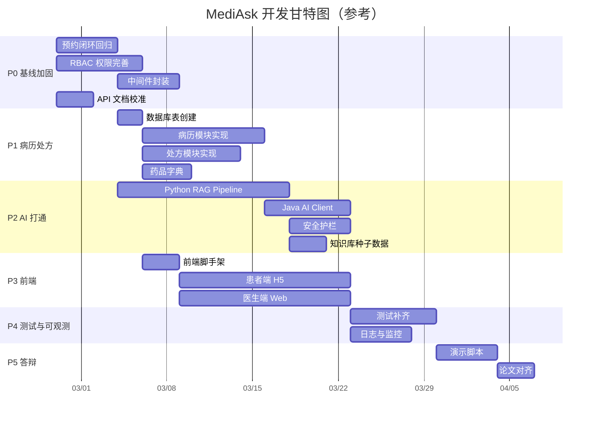

# MediAsk 全栈开发路线图（毕设导向）

> 目标：以"可答辩、可演示、可解释"为终点倒推，让每一轮开发都有明确产出与验收标准。
>
> 适用时间：2026-02-26 起至答辩前。
>
> 基线：以 `mediask-be` 当前代码 + `mediask-ai` 当前代码为出发点；以 `init-dev.sql` 为数据库事实来源。

---

## 0. 全局进度仪表板

> **状态说明**：`待开始` | `进行中` | `已完成` | `已取消`
>
> **更新规则**：每次完成/开始一个任务后，同步修改此表和对应阶段的任务清单。

| 阶段 | 进度 | 状态 | 关键里程碑 |
|------|------|------|------------|
| **P0 基线加固** | 0/12 | 待开始 | 预约闭环可走通、权限树接口可用 |
| **P1 病历处方** | 0/11 | 待开始 | 病历闭环、处方闭环、药品字典 |
| **P2 AI 打通** | 0/17 | 待开始 | RAG 可演示、Java↔Python 联通、安全护栏 |
| **P3 前端闭环** | 0/13 | 待开始 | 患者 H5 可交互、医生 Web 可交互 |
| **P4 测试可观测** | 0/10 | 待开始 | 测试覆盖率达标、traceId 可追踪 |
| **P5 答辩沉淀** | 0/7 | 待开始 | 4 条演示链路稳定可复现 |

---

## 0.1 使用方式

1. 先看"当前基线盘点"（第 1 章），明确已有什么、缺什么。
2. 再看"路线总览"（第 2 章），确认当前在哪个阶段。
3. 进入对应阶段时，盯住 4 件事：**开发目标、学习目标、产出位置、验收标准**。
4. 每次改接口，顺手同步 `api-docs/openapi.json` 与 `api-docs/README.md`。
5. 任务完成后，将对应任务行的「状态」改为 `已完成`，并更新顶部仪表板的进度计数。
6. 构建/测试命令约定（按 `AGENTS.md` 平台规则）：
   - macOS：`./scripts/m21.sh clean verify`
   - 非 macOS：`mvn clean verify`

---

## 1. 当前基线盘点

### 1.1 Java 后端（mediask-be）

| 维度 | 状态 | 说明 |
|------|------|------|
| 架构 | 模块化单体（7 模块） | `api/service/domain/infra/dal/common/worker` |
| 认证鉴权 | 已落地 | JWT + Refresh Token + Spring Security，4 个接口 |
| RBAC | 基础已落地 | 角色/权限表已建、分配接口可用；权限树/动态菜单/数据权限未做 |
| 医生管理 | 已落地 | CRUD + 状态管理 |
| 排班系统 | 已落地（深度较高） | 手动/自动排班、模板、DSL 约束引擎、方案版本化、预检/发布/回滚 |
| 预约挂号 | 已落地 | 创建/取消/支付/标记就诊/爽约、号源管理、状态机 |
| AI 数据域 | 部分落地 | `ai_conversations/ai_messages/ai_feedback_reviews` 表已建、指标统计接口可用；Java 侧无 AI 调用链路 |
| 病历模块 | DAL 存根 | `MedicalRecordDO/Mapper` 已有，但无表、无领域实体、无 Service、无 Controller |
| 处方模块 | DAL 存根 | `PrescriptionDO/PrescriptionItemDO/DrugDO` 已有，但无表、无上层实现 |
| 知识库模块 | DAL 存根 | `KnowledgeDocumentDO/KnowledgeChunkDO` 已有，但无表、无上层实现 |
| 错误处理 | 已增强 | `ErrorCode` 分段编码 + `BizException/SysException` + `TraceIdFilter` + `GlobalExceptionHandler` |
| 测试 | 薄弱 | 全项目 16 个测试（Domain 7、Service 3、Infra 2、API 2），无 DAL/Common/Worker 测试 |
| CI/CD | 基础可用 | GitHub Actions：ci.yml / release.yml / auto-tag |
| 数据库 | 28 张表 | 认证(5) + 组织(3) + AI(5) + 排班(12) + 预约(1) + 事件(2) + 工具(1)；病历/处方/药品/知识库表缺失 |

### 1.2 Python AI 服务（mediask-ai）

| 维度 | 状态 |
|------|------|
| 项目骨架 | 已存在，FastAPI + uv 管理 |
| 健康检查 | 已实现 (`/health`, `/ready`) |
| Trace 中间件 | 已实现 |
| API Key 认证 | 已实现 |
| RAG Pipeline | 规划中，尚未完整落地 |
| 安全护栏 | 规划中 |
| SSE 流式输出 | 规划中 |

### 1.3 前端

| 端 | 状态 |
|----|------|
| 管理/医生端 Web | 规划中（React 19 + Ant Design 6） |
| 患者端 H5 | 规划中（微信公众号 H5） |

### 1.4 关键结论

- Java 后端核心业务（排班 + 预约）已深度落地，是最成熟的模块。
- 病历/处方/知识库是**必须补齐**的核心缺口（论文三条主线之一）。
- AI 端到端链路（Java ↔ Python ↔ LLM）是**毕设最大亮点**，但尚未打通。
- 测试覆盖严重不足，答辩时可能被质疑。
- 前端至少需要一个最小可交互界面来支撑演示。

---

## 2. 路线总览

**总时长估算：10-15 周**（含并行推进）

> 原则：每个阶段结束时都有可演示成果；后一阶段依赖前一阶段的核心产出，但部分任务可并行。

---

## 3. 各阶段详细计划

### P0（2-3 周）基线加固：把现有能力做"稳"、做"对"

> 目标：在不新增大模块的前提下，修补现有实现的薄弱环节，为后续开发打好地基。

#### 3.1 RBAC 权限完善

| 任务 | 具体内容 | 优先级 |
|------|----------|--------|
| 权限树实现 | 基于现有 `permissions` 表，实现树形权限查询接口，支持前端动态菜单渲染 | 高 |
| 数据权限基础 | 患者只能访问自己的数据（预约、病历）；医生只能查看本人排班与预约 | 高 |
| 权限码收敛 | 按 `资源:动作` 格式统一权限码（如 `appt:create`, `emr:write`, `kb:upload`） | 中 |

#### 3.2 预约闭环回归

| 任务 | 具体内容 | 优先级 |
|------|----------|--------|
| 全链路回归 | 确保"查号源 → 创建预约 → 支付 → 取消/就诊标记"每一步可走通 | 高 |
| 并发安全验证 | 验证号源扣减原子性（Redis Lua + DB 兜底）、重复预约幂等性 | 高 |
| 支付超时自动取消 | 在 `mediask-worker` 中实现定时扫描，超时预约自动取消并释放号源 | 中 |

#### 3.3 中间件封装规范化

| 任务 | 具体内容 | 优先级 |
|------|----------|--------|
| CacheService 封装 | 将 `RedisTemplate` 直接使用收敛为业务化 `CacheService`（如 `TokenCacheService`） | 中 |
| Guava 本地缓存 | 对读多写少数据引入 Guava Cache（科室列表、权限树、正则编译结果） | 中 |
| 限流组件 | 基于 Redis 实现接口限流（至少覆盖登录、创建预约接口） | 低 |

#### 3.4 代码质量与重构

| 任务 | 具体内容 | 优先级 |
|------|----------|--------|
| 排班算法位置评估 | 评估是否将排班算法从 Domain 迁移至 Infra（技术能力 vs 业务逻辑） | 中 |
| User 实体增强 | 为 `User` 补充基础业务行为（`canLogin()`, `changePassword()` 等） | 低 |
| API 文档校准 | 清理 `api-docs/openapi.json` 与实际实现的偏差 | 高 |

#### 学习目标

- Spring 事务边界与幂等设计
- DDD 应用服务与领域服务的分工
- Redis 分布式锁 / Lua 脚本实践
- Guava Cache 适用场景（读多写少、懒加载、自动刷新）

#### 产出位置

| 类型 | 位置 |
|------|------|
| 代码 | `mediask-service`、`mediask-domain`、`mediask-api`、`mediask-infra`、`mediask-worker` |
| 测试 | `mediask-domain/src/test`、`mediask-api/src/test` |
| 接口文档 | `api-docs/openapi.json`、`api-docs/README.md` |

#### 验收标准

- [ ] `./scripts/m21.sh clean verify` 全通过
- [ ] 预约全链路手动走通，无状态异常
- [ ] 权限树接口可返回正确的树形结构
- [ ] 患者无法访问他人数据（至少手动验证）

---

### P1（2-3 周）病历/处方补齐：完成论文"诊疗核心业务"

> 目标：让系统具备"医生接诊 → 写病历 → 开处方"的完整能力，补齐论文"医疗核心业务"的关键缺口。

#### 4.1 数据库表创建

| 任务 | 具体内容 | 优先级 |
|------|----------|--------|
| 病历表 DDL | 在 `init-dev.sql` 中创建 `medical_records`、`medical_record_versions` | 高 |
| 处方表 DDL | 创建 `prescriptions`、`prescription_items` | 高 |
| 药品字典表 DDL | 创建 `drugs`（药品基础信息、状态、配伍禁忌标签） | 高 |
| 数据库文档同步 | 同步更新 `docs/07-DATABASE.md` | 高 |

#### 4.2 病历模块（EMR）

| 任务 | 具体内容 | 优先级 |
|------|----------|--------|
| 领域建模 | 创建 `MedicalRecord` 聚合根、`MedicalRecordVersion` 实体、状态枚举（草稿→已提交→已归档） | 高 |
| 核心 API | `POST /api/v1/medical-records`（创建草稿）、`PUT`（更新）、`POST .../submit`（提交）、`POST .../archive`（归档）、`GET`（查询） | 高 |
| 版本控制 | 归档后不允许覆盖，仅允许追补新版本 | 中 |
| 数据权限 | 医生只能操作本人诊次的病历；患者只能查看本人病历摘要 | 中 |
| 状态机 | 严格状态流转校验（草稿→提交→归档，不允许逆向） | 高 |

#### 4.3 处方模块

| 任务 | 具体内容 | 优先级 |
|------|----------|--------|
| 领域建模 | 创建 `Prescription` 聚合根、`PrescriptionItem` 实体 | 高 |
| 核心 API | `POST /api/v1/prescriptions`（开具）、`GET`（查询）、基础校验 | 高 |
| 药品校验 | 检查药品是否有效（上架/停用）、处方明细格式校验 | 中 |
| 配伍禁忌 | 最小实现：规则库 + 提示（后续可接入 AI 增强） | 低 |

#### 4.4 药品字典管理

| 任务 | 具体内容 | 优先级 |
|------|----------|--------|
| 管理接口 | `CRUD /api/v1/admin/drugs`（管理员维护药品） | 中 |
| 查询接口 | `GET /api/v1/drugs`（医生开处方时搜索药品） | 中 |

#### 学习目标

- 领域建模（实体、值对象、聚合边界）
- 医疗业务规则的编码方式（状态机 + 规则校验）
- MapStruct/Converter 分层转换实践

#### 产出位置

| 类型 | 位置 |
|------|------|
| DDL | `mediask-dal/src/main/resources/sql/init-dev.sql` |
| 代码 | `mediask-domain`、`mediask-service`、`mediask-infra`、`mediask-api`、`mediask-dal` |
| 文档 | `docs/07-DATABASE.md`、`api-docs/openapi.json`、`api-docs/README.md` |

#### 验收标准

- [ ] 病历闭环可走通：创建草稿 → 更新 → 提交 → 归档
- [ ] 处方闭环可走通：开具处方（含明细）→ 查询
- [ ] 药品校验（有效性）通过测试覆盖
- [ ] 病历状态机至少有 3 个单元测试

---

### P2（2-3 周）AI 端到端打通：Java ↔ Python ↔ LLM 联动

> 目标：让 AI 预问诊从"规划"变成"可演示"，这是毕设最核心的亮点。

#### 5.1 Python AI 服务（mediask-ai）

| 任务 | 具体内容 | 优先级 |
|------|----------|--------|
| RAG 入库 | 实现 `KnowledgeStore`：Markdown/PDF 解析 → 分块 → Embedding(百炼) → Milvus 写入 | 高 |
| RAG 检索 | 实现 `Retriever`：Query Embedding → Milvus Search → 阈值过滤 → 结构化返回 | 高 |
| 对话接口 | `/api/v1/chat`：`use_rag=true` 时返回 `answer + citations` | 高 |
| 流式接口 | `/api/v1/chat/stream`：SSE 流式输出，支持 `message/end/error` 事件 | 高 |
| 安全护栏 | PII 脱敏（正则）+ 风险分级（高/中/低）+ 拒答策略 + 免责声明 | 高 |
| 降级策略 | Milvus 不可用 → 无检索保守回答；LLM 不可用 → 安全降级提示 | 中 |
| 知识库接口 | `/api/v1/knowledge/ingest`（入库）、`/api/v1/knowledge/search`（检索） | 高 |

#### 5.2 Java 侧 AI 集成

| 任务 | 具体内容 | 优先级 |
|------|----------|--------|
| AI Client 适配层 | 在 `mediask-infra` 创建 `AiServiceClient`，封装对 Python 服务的 HTTP 调用 | 高 |
| 超时/重试/降级 | 调用 Python 服务时的超时设置、重试策略、降级返回 | 高 |
| 错误映射 | Python 返回的 `code/msg` 映射为 Java 侧 `BizException`（AI 子域 `6xxx`） | 高 |
| 预问诊入口 | `POST /api/v1/ai/chat`：Java 接收请求 → 转发 Python AI → 返回结果 | 高 |
| 流式透传 | Java 侧 SSE 透传（Spring WebFlux 或 Servlet 3.1 async） | 中 |
| 会话管理 | 创建/查询 AI 会话、消息持久化（利用已有 `ai_conversations/ai_messages` 表） | 中 |
| 主诉摘要回写 | AI 生成的主诉摘要与科室建议写回数据库，关联预约 | 中 |
| traceId 透传 | Java → Python 请求头带 `X-Trace-Id`，保证全链路追踪 | 高 |

#### 5.3 知识库种子数据

| 任务 | 具体内容 | 优先级 |
|------|----------|--------|
| 种子文档准备 | 准备 10-20 篇公开医疗知识文档（常见病科普、药品说明书） | 中 |
| 入库脚本 | 编写批量入库脚本，一键导入种子数据 | 中 |

#### 学习目标

- 外部服务适配层设计（Anti-Corruption Layer）
- 异常分层与降级策略
- SSE/流式接口处理
- RAG Pipeline 原理（检索增强生成）

#### 产出位置

| 类型 | 位置 |
|------|------|
| Python 代码 | `mediask-ai/app/` |
| Java 代码 | `mediask-infra`（client/adapter）、`mediask-service`（编排）、`mediask-api`（接口） |
| 协议文档 | `api-docs/openapi.json`、`docs/10-12` 相关章节 |

#### 验收标准

- [ ] 至少 1 条"患者提问 → AI 回答（带 citations）→ 摘要入库"链路可演示
- [ ] 流式输出（SSE）可在终端或 Postman 观察到逐字输出
- [ ] AI 服务异常时，Java 接口返回可理解的降级响应（非 500 堆栈）
- [ ] 输入手机号/身份证时，发送给 LLM 的内容已脱敏
- [ ] 高风险问题（自伤类）触发拒答
- [ ] traceId 可跨 Java/Python 追踪

---

### P3（2-3 周）前端最小闭环：让系统"看得见、摸得着"

> 目标：不追求完美 UI，但至少有一个可交互的前端支撑答辩演示。

#### 6.1 管理/医生端 Web（React + Ant Design）

| 页面 | 功能 | 优先级 |
|------|------|--------|
| 登录页 | 用户名/密码登录，Token 管理 | 高 |
| 医生工作台 | 今日预约列表、接诊入口 | 高 |
| 病历书写页 | 病历草稿编辑、提交、归档 | 高 |
| 处方开具页 | 药品搜索、处方明细填写、提交 | 中 |
| 排班管理 | 排班列表查看（展示已有排班数据） | 中 |
| 药品管理 | 药品字典 CRUD（管理员） | 低 |
| 知识库管理 | 文档上传入口（管理员） | 低 |

#### 6.2 患者端 H5

| 页面 | 功能 | 优先级 |
|------|------|--------|
| 登录/注册 | 手机号+密码（简化版，暂不做短信验证） | 高 |
| AI 预问诊 | 对话界面，支持多轮对话（流式显示 AI 回复） | 高 |
| 科室/医生选择 | 基于 AI 推荐或手动选择，查看号源 | 高 |
| 预约挂号 | 选择时段、创建预约、模拟支付 | 高 |
| 我的预约 | 预约列表、取消功能 | 中 |

#### 6.3 前端工程基础

| 任务 | 具体内容 | 优先级 |
|------|----------|--------|
| 项目脚手架 | Vite + React 19 + TypeScript + Tailwind CSS | 高 |
| Axios 封装 | 统一拦截器（Token 注入、错误处理、traceId 透传） | 高 |
| 路由 & 权限 | react-router v6 + 基于角色的路由守卫 | 高 |

#### 学习目标

- React + TypeScript 工程化实践
- Ant Design 组件使用
- SSE 前端消费（EventSource / fetch stream）
- 前后端联调流程

#### 验收标准

- [ ] 患者可在 H5 页面完成"AI 预问诊 → 选择科室 → 创建预约"
- [ ] 医生可在 Web 端完成"查看预约 → 写病历 → 开处方"
- [ ] AI 对话支持流式显示
- [ ] 所有接口调用错误有可读提示（非白屏）

---

### P4（1-2 周）测试与可观测性：让系统"像工程"

> 目标：补齐测试覆盖，增加可观测性，为答辩提供"工程质量"证据。

#### 7.1 测试补齐

| 任务 | 具体内容 | 优先级 |
|------|----------|--------|
| Domain 层测试 | 为病历状态机、处方校验规则补充单元测试，Domain 覆盖率 ≥ 80% | 高 |
| Service 层测试 | 为预约、病历、AI 编排补充测试，Service 覆盖率 ≥ 70% | 中 |
| API 集成测试 | 预约全链路、病历全链路至少各 1 个集成测试（MockMvc） | 高 |
| Python 测试 | RAG Pipeline + 安全护栏 + 降级路径 mock 测试 | 中 |

#### 7.2 日志与可观测性

| 任务 | 具体内容 | 优先级 |
|------|----------|--------|
| 结构化日志 | JSON 格式日志，统一 `traceId/userId/requestUri/elapsed` 字段 | 中 |
| 关键业务指标 | 预约成功率、AI 调用失败率、接口 P99 延迟（Micrometer 指标暴露） | 低 |
| 审计日志 | 敏感操作（预约创建/取消、病历查看/修改、权限变更）全量审计记录 | 中 |

#### 7.3 配置治理

| 任务 | 具体内容 | 优先级 |
|------|----------|--------|
| 敏感配置外置 | DB 密码、JWT Secret、AI API Key 等环境变量化 | 高 |
| 环境隔离 | `application-dev.yml` / `application-test.yml` / `application-prod.yml` 明确分离 | 中 |
| `.env` 模板 | 提供 `.env.example` 模板，README 中说明配置方式 | 中 |

#### 学习目标

- JUnit 5 + Mockito + MockMvc 测试实践
- 面向生产的日志与指标设计
- 配置与密钥管理基础实践

#### 产出位置

| 类型 | 位置 |
|------|------|
| 测试 | `*/src/test/java/`、`mediask-ai/tests/` |
| 配置 | `mediask-api/src/main/resources/application*.yml` |
| 文档 | `docs/03-CONFIGURATION.md`、`docs/05-TESTING.md` |

#### 验收标准

- [ ] `./scripts/m21.sh clean verify` 全通过，JaCoCo 报告可生成
- [ ] 关键链路问题可通过 traceId 在日志中定位
- [ ] 无硬编码密钥/敏感值提交到仓库

---

### P5（1 周）答辩资产沉淀：把"做了什么"转成"可证明"

> 目标：固化所有答辩证据，准备可复现的演示脚本。

#### 8.1 演示脚本准备

| 演示链路 | 覆盖用例 | 时长目标 |
|----------|----------|----------|
| **链路 1：预约闭环** | 患者登录 → 查号源 → 创建预约 → 模拟支付 → 医生查看预约 | 3 分钟 |
| **链路 2：诊疗闭环** | 医生接诊 → 写病历草稿 → 提交归档 → 开具处方 | 3 分钟 |
| **链路 3：AI 辅助闭环** | 患者 AI 预问诊（流式）→ 生成摘要 → 推荐科室 → 引用展示 → 降级演示 | 4 分钟 |
| **链路 4：安全护栏** | 高风险拒答 → 中风险谨慎回答 → PII 脱敏展示 | 2 分钟 |

#### 8.2 答辩证据整理

| 证据类型 | 内容 | 位置 |
|----------|------|------|
| 接口文档 | OpenAPI 3.0 完整规范 | `api-docs/openapi.json` |
| 测试报告 | JaCoCo 覆盖率 + Surefire 测试报告 | `**/target/surefire-reports`、`**/target/site/jacoco` |
| 架构图 | 系统架构全景图（Mermaid + draw.io） | `MediAskDocs/diagrams/` |
| 数据库 ER 图 | 完整 ER 关系图 | `docs/07-DATABASE.md` |
| 评测数据 | RAG 检索质量、安全护栏拒答率 | `mediask-ai/` 评测脚本输出 |

#### 8.3 论文对齐检查

| 检查项 | 状态 | 备注 |
|--------|------|------|
| 三条主演示链路是否稳定可复现 | | |
| 每个关键设计能否解释"为什么这样做" | | |
| RAG 引用可追溯性是否可展示 | | |
| 安全护栏效果是否可量化 | | |
| 代码分层是否清晰可讲解 | | |

#### 验收标准

- [ ] 任意一次演示可在 12 分钟内稳定完成（4 条链路）
- [ ] 每条主链路都能说清楚"业务价值 + 技术实现 + 风险控制"
- [ ] 论文中提到的所有功能在系统中均可找到对应实现

---

## 4. 任务优先级矩阵（跨阶段视角）

| 优先级 | 任务 | 阶段 | 理由 |
|--------|------|------|------|
| **P0-必做** | 预约闭环回归 | P0 | 现有核心能力的稳定性保障 |
| **P0-必做** | 病历/处方模块端到端 | P1 | 论文三大闭环之一，无可替代 |
| **P0-必做** | RAG 入库 + 检索 + 对话 | P2 | 毕设最核心亮点 |
| **P0-必做** | Java ↔ Python AI 调用链路 | P2 | AI 能力的唯一入口 |
| **P0-必做** | 安全护栏（脱敏+分级+拒答） | P2 | 论文创新点之一 |
| **P0-必做** | 患者端 AI 对话页面 | P3 | 演示必须有可交互界面 |
| **P0-必做** | 3 条演示链路稳定可复现 | P5 | 答辩硬要求 |
| **P1-重要** | 权限树 + 数据权限 | P0 | RBAC 完整性 |
| **P1-重要** | SSE 流式输出（全链路） | P2 | 演示效果提升 |
| **P1-重要** | 医生工作台页面 | P3 | 演示链路 2 依赖 |
| **P1-重要** | 核心模块单元测试 | P4 | 答辩时可能被追问测试 |
| **P2-锦上添花** | Guava Cache 封装 | P0 | 性能优化，非阻塞项 |
| **P2-锦上添花** | 审计日志 | P4 | 论文可提但非必演示 |
| **P2-锦上添花** | Prometheus + Grafana 监控 | P4 | 答辩加分项 |
| **P2-锦上添花** | 配伍禁忌 AI 增强 | P1/P2 | CDSS 能力展示 |

---

## 5. 并行推进建议

以下任务可与主线并行推进，不阻塞主链路：

> 关键并行点：
> - Python RAG Pipeline（P2）可与 P0/P1 并行推进（不依赖 Java 病历模块）
> - 前端脚手架（P3）可在 P0 完成后立即启动，与 P1 并行
> - 测试补齐（P4）可穿插在每个阶段中渐进完成

---

## 6. 风险与应对

| 风险 | 影响 | 概率 | 应对措施 |
|------|------|------|----------|
| AI API 配额耗尽 | RAG 无法演示 | 中 | 限流重试 + 预缓存演示数据 + 备选模型 |
| Milvus 部署问题 | 向量检索不可用 | 中 | 优先使用 Milvus Lite（单机版），演示时降级方案兜底 |
| 前端工期不足 | 无可交互界面 | 高 | 优先做患者端 AI 对话页（最小演示集），其余用 Swagger/Postman 演示 |
| 病历/处方需求不清 | 实现偏差 | 低 | 先做最小闭环（草稿→提交→归档），不做复杂模板 |
| 测试覆盖不达标 | 答辩被质疑 | 中 | 优先覆盖 Domain 层关键路径，不追求全量覆盖率 |

---

## 7. 每周执行模板

每周固定 1 次复盘，记录在本文件末尾或单独周报：

1. **本周目标**（最多 3 项，对应路线图阶段）
2. **实际完成**（对照代码提交/文档更新）
3. **遇到问题**（技术债/业务不清/被阻塞）
4. **下周计划**（继续/调整/砍掉）

---

## 8. 成功标准（毕设视角）

当满足以下条件时，后端 + AI 部分达到"高质量毕设交付线"：

- [ ] 有 3 条稳定可演示的业务闭环（预约、病历处方、AI 辅助）
- [ ] 代码分层清晰、关键业务规则有测试、接口文档与实现一致
- [ ] AI 回答可追溯（带 citations）、有安全护栏（脱敏+拒答+免责）
- [ ] 遇到外部依赖异常（AI/Redis/DB/Milvus）时系统可降级，不是直接崩溃
- [ ] 你能解释每个关键设计取舍（为什么这样做，而不是那样做）
- [ ] 论文中提到的每个功能都有代码对应、每个创新点都有可演示证据

---

## 附录 A：核心用例与系统功能对照表

| 用例ID | 参与者 | 用例名称 | Java BE | Python AI | 前端 | 数据库 |
|--------|--------|----------|---------|-----------|------|--------|
| UC-01 | 患者 | 登录/鉴权 | 已实现 | - | 待做 | 已建表 |
| UC-02 | 患者 | AI 预问诊（多轮） | 待做（Client） | 待做（RAG） | 待做 | 已建表 |
| UC-03 | 患者 | 查询医生与号源 | 已实现 | - | 待做 | 已建表 |
| UC-04 | 患者 | 创建预约 | 已实现 | - | 待做 | 已建表 |
| UC-05 | 患者 | 支付预约 | 已实现（模拟） | - | 待做 | 已建表 |
| UC-06 | 患者 | 取消预约 | 已实现 | - | 待做 | 已建表 |
| UC-07 | 医生 | 查看预约/接诊 | 已实现 | - | 待做 | 已建表 |
| UC-08 | 医生 | 书写病历 | DAL 存根 | - | 待做 | **未建表** |
| UC-09 | 医生 | 开具处方 | DAL 存根 | - | 待做 | **未建表** |
| UC-10 | 管理员 | 维护基础数据 | 部分实现 | - | 待做 | 部分建表 |
| UC-11 | 管理员 | 导入知识库文档 | 未实现 | 待做 | 待做 | **未建表** |
| UC-12 | 系统 | RAG 知识问答 | 未实现 | 待做 | 待做 | **未建表** |

---

## 附录 B：技术栈全景

| 层次 | 组件 | 技术选型 | 版本 |
|------|------|----------|------|
| **Java 后端** | 语言 | Java | 21 |
| | 框架 | Spring Boot | 3.5.8 |
| | ORM | MyBatis-Plus | 3.5.15 |
| | 数据库 | MySQL | 8.0 |
| | 缓存/锁 | Redis + Redisson | 7.x / 3.40.2 |
| | 安全 | Spring Security + JJWT | 6.x / 0.12.6 |
| | API 文档 | springdoc-openapi | 2.6.0 |
| **Python AI** | 框架 | FastAPI | 0.128+ |
| | AI 编排 | LangChain + LangGraph | latest |
| | LLM | DeepSeek（OpenAI 兼容） | - |
| | Embedding | 阿里云百炼 text-embedding-v4 | - |
| | 向量库 | Milvus Lite / Milvus | 2.6+ |
| **前端** | 框架 | React 19 + TypeScript | - |
| | UI 库 | Ant Design 6 | - |
| | 构建 | Vite | - |
| | 样式 | Tailwind CSS | - |
| | HTTP | Axios | - |

---

## 周报记录区

> 以下为每周复盘记录，按时间倒序排列。

<!-- 
### Week X（YYYY-MM-DD）
**阶段**：P?
**本周目标**：
1. 
2. 
3. 

**实际完成**：
- 

**遇到问题**：
- 

**下周计划**：
- 
-->
