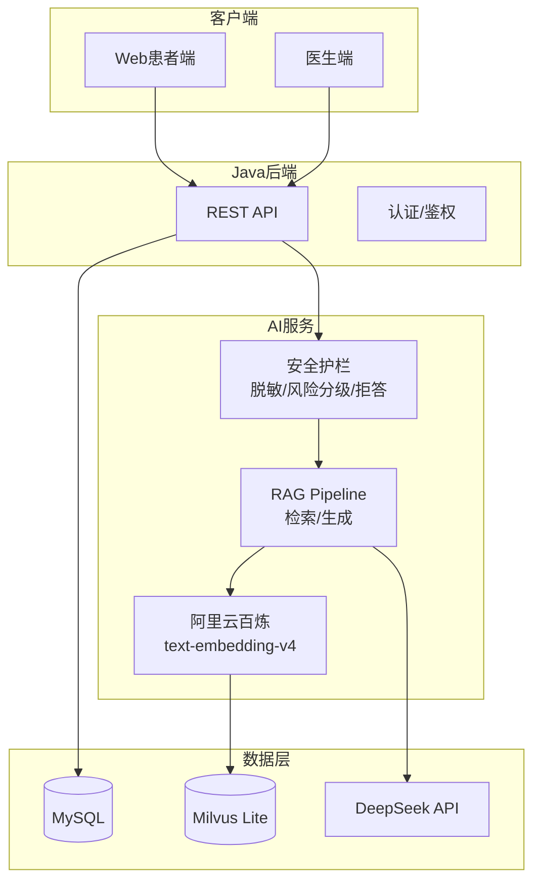
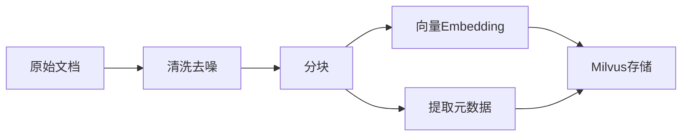

# MediAsk 论文/答辩内容大纲（以开发落地为导向）

> 定位：本文件替代旧的 `ResearchProposal.md`，用于统一"研究目标/创新点/评测口径/合规安全/演示脚本"，让开发与学习更有目的性。

## 1. 课题题目

**基于大语言模型与 RAG 的智能医疗辅助问诊系统设计与实现：面向医疗风险的安全护栏与可追溯审计**

> 说明：题目体现三个核心要素
> 1. LLM + RAG：技术基础
> 2. 智能医疗问诊：应用场景
> 3. 安全护栏 + 可追溯审计：差异化创新点（医疗场景必备）

## 2. 研究目标

1) 构建一个面向患者与医生的"预问诊/导诊 + 医疗知识库问答（RAG）"闭环原型系统。  
2) 在医疗高风险场景下，通过**输入/输出脱敏、风险分级、拒答/降级、强制免责声明、审计日志**，降低错误建议与隐私泄露风险。  
3) 形成可量化的评测与对比实验：检索质量、引用可追溯性、安全性与时延。

## 3. 研究问题与假设

| 编号 | 研究问题 | 对应假设 | 评测方式 |
|------|----------|----------|----------|
| **RQ1** | RAG 能否提升医疗问答的可追溯性与稳定性？ | 引入 RAG 后，引用支撑率 > 80%，回答一致性提升 | 引用支撑率、人工评审 |
| **RQ2** | 规则驱动的安全护栏如何在"安全"与"可用"之间取得平衡？ | 拒答正确率 > 95%，过度拒答率 < 5% | 拒答率/过度拒答率 |
| **RQ3** | 远程 Embedding API（阿里云百炼）在医疗场景下的可行性与成本权衡是什么？ | 在免费额度内稳定运行前提下，检索质量不显著下降 | API 稳定性 + 成本 + 检索质量 |

## 4. 创新点

1. **混合安全护栏机制**：规则驱动（风险分级/拒答）+ LLM 自带能力结合，非纯 Prompt 工程。明确区分高/中/低风险场景，对应不同响应策略。

2. **可追溯引用系统**：RAG 检索结果携带 citations，关联到原始文档的 doc_id/page/section，支持人工复核与审计。

3. **云端 Embedding 集成方案**：基于阿里云百炼 text-embedding-v4，利用其免费额度（100万 tokens）与中文优化，平衡成本与效果。

4. **全链路审计追溯**：trace_id 贯穿输入脱敏、检索、生成、输出全流程，每一步都有记录可查。

## 5. 系统范围与 MVP

### 5.1 In Scope（答辩可演示）
- 患者侧：发起 AI 预问诊（多轮）→ 生成主诉摘要/科室建议 → 预约挂号（可模拟支付）。
- 医生侧：查看预约 → 填写/提交/归档病历 → 开具最小处方（校验与提示即可）。
- AI 能力：RAG 问答（返回 citations）+ 流式 SSE 输出。
- 安全合规：PII 脱敏（入/出）、风险分级与拒答策略、审计字段与链路 trace_id、失败降级。

### 5.2 Out of Scope（论文可写"未来工作"）
- 真实 HIS/EMR 对接、医保结算、真实支付与对账、自动诊断/自动处方作为最终决策。

## 6. 技术路线



### 技术选型说明

| 组件 | 选型 | 理由 |
|------|------|------|
| 后端框架 | Spring Boot 3.5 + Java 21 | 成熟稳定，毕设常用 |
| AI 服务 | FastAPI + LangChain | Python 生态丰富 |
| LLM | DeepSeek（OpenAI 兼容） | 中文效果好，成本低 |
| 向量库 | Milvus Lite | 轻量级向量检索 |
| Embedding | text-embedding-v4（阿里云百炼） | 免费额度 100 万 tokens，中文优化 |

## 7. 数据与知识库

### 7.1 知识来源
- 权威指南/教材/公开标准（明确版本与出处）
- 只入库允许使用的文本片段
- 不得包含真实患者 PII

### 7.2 文档处理流程


- 分块策略：`chunk_size=800-1200`，`overlap=100-200`
- 元数据：`doc_id/source/page/section/title/category/created_at`

### 7.3 隐私边界
- 发送给 LLM 之前：必须脱敏（姓名/电话/身份证/地址等）
- 审计日志：只记录脱敏后的文本、摘要或哈希，不保留原文

## 8. 安全护栏与审计

### 8.1 风险分级策略

| 风险等级 | 典型场景 | 响应策略 |
|----------|----------|----------|
| **高风险** | 自伤/自杀、暴力伤害、非法医疗行为 | 直接拒答 + 紧急求助提示 |
| **中风险** | 诊断结论、处方剂量、用药指导 | 谨慎回答（禁止处方/剂量），建议就医 |
| **低风险** | 科普知识、生活方式建议 | 正常回答 + 免责声明 |

### 8.2 审计字段（最小集）

```json
{
    "trace_id": "uuid",
    "session_id": "uuid",
    "user_id": "可选",
    "risk_level": "high/medium/low",
    "action": "refuse/caution/allow/degrade",
    "model": "deepseek-chat",
    "use_rag": true,
    "retrieved_k": 5,
    "top_score": 0.85,
    "latency_ms": 1500,
    "input_hash": "sha256",
    "output_hash": "sha256"
}
```

### 8.3 降级策略

| 故障场景 | 降级行为 |
|----------|----------|
| Milvus 不可用 | 退化为无检索的保守回答，提示"知识库暂不可用" |
| LLM 不可用 | 返回安全降级响应，提示"服务暂不可用，请稍后重试" |
| Embedding 不可用 | 返回错误提示并触发无检索保守降级 |

## 9. 评测与实验设计

### 9.1 离线检索指标

| 指标 | 定义 | 目标 |
|------|------|------|
| Recall@K | 检索到的相关文档数 / 总相关数 | > 0.8 |
| MRR | 第一个相关文档的排名倒数 | > 0.7 |
| Top-K Score | 最高相似度分数 | > 0.5 |

### 9.2 引用质量指标

| 指标 | 评测方式 |
|------|----------|
| 引用可追溯率 | 回答是否附带 citations |
| 引用支撑率 | 人工评审引用内容是否能支持回答要点 |

### 9.3 安全护栏指标

| 指标 | 目标 |
|------|------|
| 拒答正确率 | > 95% |
| 过度拒答率 | < 5% |
| PII 泄露率 | 0% |

### 9.4 性能指标

| 指标 | 目标 |
|------|------|
| 端到端延迟 | < 5s |
| 首 token 延迟 | < 1s |
| 检索延迟 | < 500ms |

## 10. 演示脚本

1. **正常科普问题**（低风险）：展示 citations 与免责声明
2. **诊断诱导问题**（中风险）：展示"谨慎回答 + 建议就医 + 不给剂量"
3. **自伤/非法行为**（高风险）：展示拒答与提示
4. **断开 Milvus**：展示降级路径与审计字段
5. **输入包含手机号/身份证**：展示脱敏前后（仅展示脱敏结果）

## 11. 时间进度安排

| 阶段 | 周次 | 主要内容 | 交付物 |
|------|------|----------|--------|
| **需求确认** | 第1-2周 | 需求细化、数据库设计、论文大纲 | 需求文档、系统设计 |
| **基础框架搭建** | 第3周 | 项目初始化、Docker环境、CI/CD | 可运行的基础项目 |
| **核心业务开发** | 第4-5周 | Java后端API、预约挂号模块 | 核心API接口 |
| **RAG链路开发** | 第6周 | 文档入库、Embedding、Milvus检索 | RAG端到端流程 |
| **安全护栏开发** | 第7周 | 脱敏、风险分级、拒答、审计 | 安全模块 |
| **联调与测试** | 第8周 | 前后端联调、功能测试 | 可演示系统 |
| **评测与优化** | 第9周 | 评测指标测试、性能优化 | 评测报告 |
| **论文撰写** | 第10-11周 | 整理文档、图表、实验数据 | 初稿 |
| **答辩准备** | 第12周 | 演示脚本优化、模拟答辩 | 终稿 + 答辩 |

## 12. 风险与备选方案

| 风险 | 影响 | 应对措施 |
|------|------|----------|
| API 配额/稳定性 | 阿里云百炼 API 不稳定或配额用尽 | 记录日志、限流重试、提示降级 |
| 数据合规与版权 | 法律风险 | 优先使用公开可引用资料；仅存储必要片段 |
| 医疗安全 | 伦理风险 | 强制免责声明、严格规则驱动、避免"自动诊断"表述 |
| LLM 服务不稳定 | 演示中断 | 降级策略、错误提示、备选模型 |