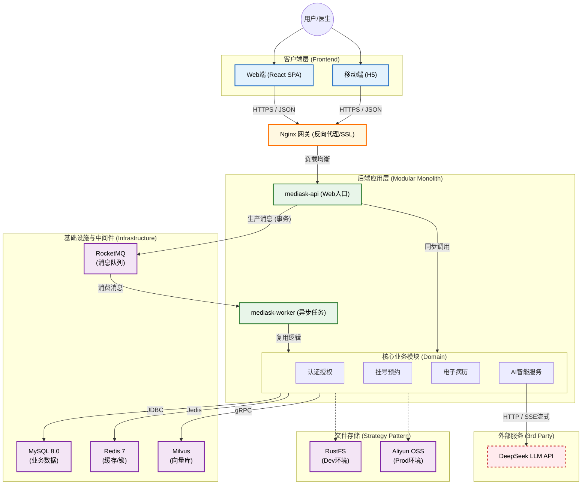
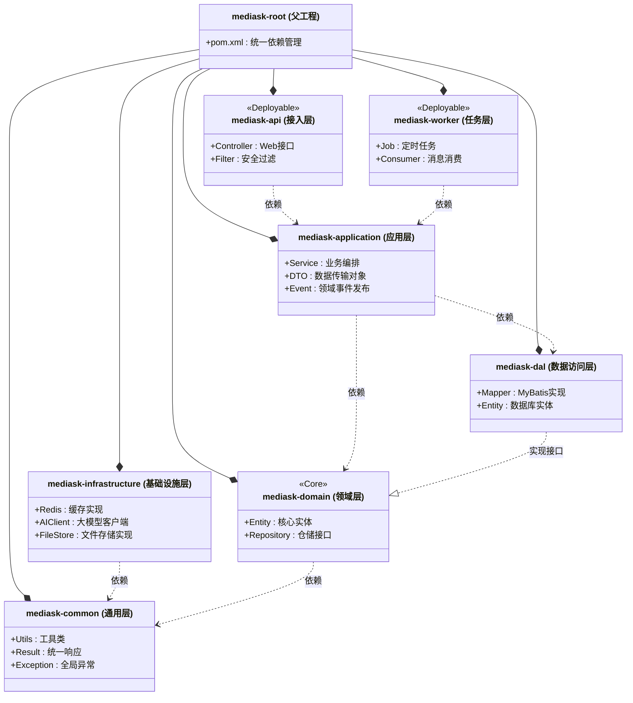

# 智能医疗辅助问诊系统 - 系统架构概览

> 本文档描述系统整体架构设计、技术选型与模块划分

## 1. 架构设计理念

本项目采用 **"适度微服务化" (Modular Monolith)** 的架构设计理念。在单体应用的基础上，通过模块化隔离业务逻辑，既保证了毕设开发的便捷性（易于部署、调试），又保留了向微服务演进的能力。

## 2. 逻辑架构图

## 3. 前端技术选型

采用目前工业界最主流的 **React 生态**，构建纯客户端渲染 (CSR) 的单页应用 (SPA)。

| 技术分类 | 选型方案 | 选型理由 |
|---------|---------|---------|
| **核心框架** | React 19 | Concurrent Mode 优化用户体验 |
| **开发语言** | TypeScript | 强类型约束，减少运行时错误 |
| **构建工具** | Vite | 极速冷启动，秒级热更新 |
| **UI 组件库** | Ant Design 6.0 | 企业级中后台首选，医疗场景组件丰富 |
| **状态管理** | Zustand / React Query | 轻量级状态管理 + 服务端状态缓存 |
| **路由管理** | React Router v6 | React 官方推荐 |
| **HTTP 客户端** | Axios | 统一拦截器处理认证和错误 |
| **样式方案** | Tailwind CSS | 原子化 CSS，开发效率高 |

### 前端部署架构
- **渲染模式**: SPA (Single Page Application)
- **构建产物**: 纯静态 HTML/JS/CSS
- **部署方式**: Nginx 静态托管或对象存储 CDN 加速
- **优势**: 无需 Node.js 运行时，部署简单，安全性高

## 4. 后端技术选型

基于 **Java 21** 新特性构建高性能后端。

| 技术分类 | 选型方案 | 版本 | 选型理由 |
|---------|---------|------|---------|
| **开发语言** | Java | 21 | Virtual Threads 提升高并发性能 |
| **核心框架** | Spring Boot | 3.3.3 | 原生支持 AOT 编译 |
| **ORM 框架** | MyBatis-Plus | 3.5.5 | 简化 CRUD，代码生成器 |
| **数据库** | MySQL | 8.0.33+ | 事务稳定，生态成熟 |
| **缓存** | Redis | 7.x | 分布式锁、号源池管理 |
| **向量数据库** | Milvus | 2.3+ | 专业 RAG 检索 |
| **消息队列** | RocketMQ | 5.0+ | 事务消息保证最终一致性 |
| **AI 框架** | Spring AI / LangChain4j | - | 统一大模型接入 |
| **工具库** | Lombok / MapStruct / Knife4j | - | 简化代码、类型安全、接口文档 |

## 5. 数据存储方案

### 5.1 业务数据库: MySQL 8.0
- **字符集**: utf8mb4
- **主键策略**: Snowflake 雪花算法 (BIGINT)
- **事务隔离级别**: READ-COMMITTED
- **分库分表**: 病历按年分表，挂号按医院哈希分库

### 5.2 向量数据库: Milvus
- **部署模式**: Standalone (开发) / Cluster (生产)
- **索引类型**: HNSW (高性能向量检索)
- **用途**: 医疗知识库 RAG 检索

### 5.3 文件存储: 策略模式切换
- **开发环境**: 本地磁盘 / RustFS
- **生产环境**: 阿里云 OSS + CDN
- **实现**: `@Profile("dev")` / `@Profile("prod")` 自动切换

## 6. 项目模块结构 (DDD 分层)

### 模块职责说明
| 模块 | 职责 | 关键特性 |
|------|------|---------|
| **mediask-api** | Web 流量入口 | 参数校验、JWT 认证、限流 |
| **mediask-worker** | 异步任务处理 | 定时任务、消息消费、物理隔离 |
| **mediask-application** | 业务流程编排 | 事务管理、领域事件发布 |
| **mediask-domain** | 核心业务规则 | 纯 POJO，不依赖框架 |
| **mediask-dal** | 数据库操作 | MyBatis Mapper、实体映射 |
| **mediask-infrastructure** | 外部服务集成 | Redis、AI、文件存储 |
| **mediask-common** | 通用工具 | 异常、工具类、常量 |

## 7. 核心工程化能力

| 能力项 | 实现方案 |
|--------|---------|
| **高并发处理** | Virtual Threads + Redis 分布式锁 + 乐观锁 |
| **异步解耦** | RocketMQ 事务消息 + Spring Event |
| **流式响应** | SSE (Server-Sent Events) 实现 AI 打字机效果 |
| **全链路追踪** | MDC traceId 贯穿日志 |
| **接口防护** | Redis Lua 限流 + Idempotency-Key 防重放 |
| **配置管理** | Jasypt 加密 + 多环境 Profile |
| **监控告警** | Actuator + Prometheus + Grafana |
| **CI/CD** | GitHub Actions + Docker 自动化部署 |

---

## 相关文档
- [代码规范与最佳实践](./02-CODE_STANDARDS.md)
- [配置管理指南](./03-CONFIGURATION.md)
- [部署运维手册](./04-DEVOPS.md)
- [测试策略](./05-TESTING.md)
- [数据库设计](../DATABASE_DESIGN.md)
