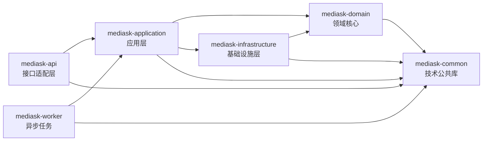
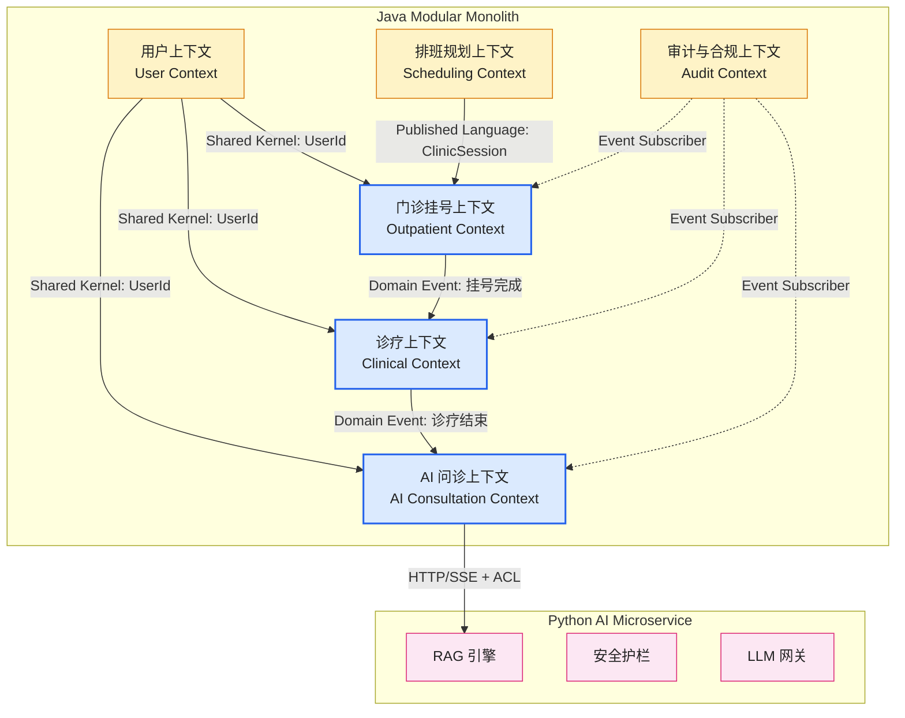
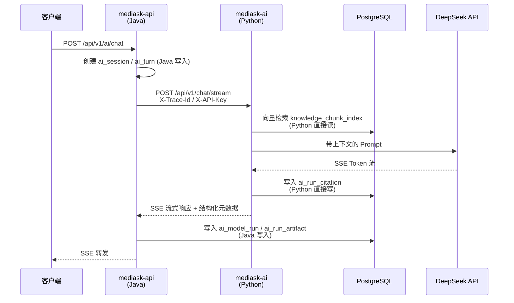
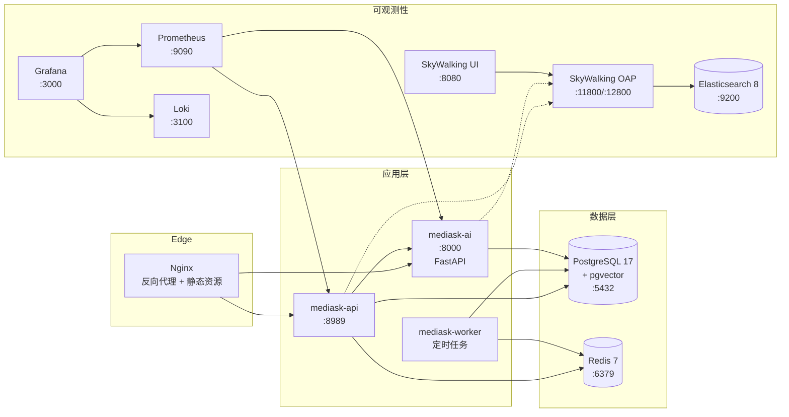
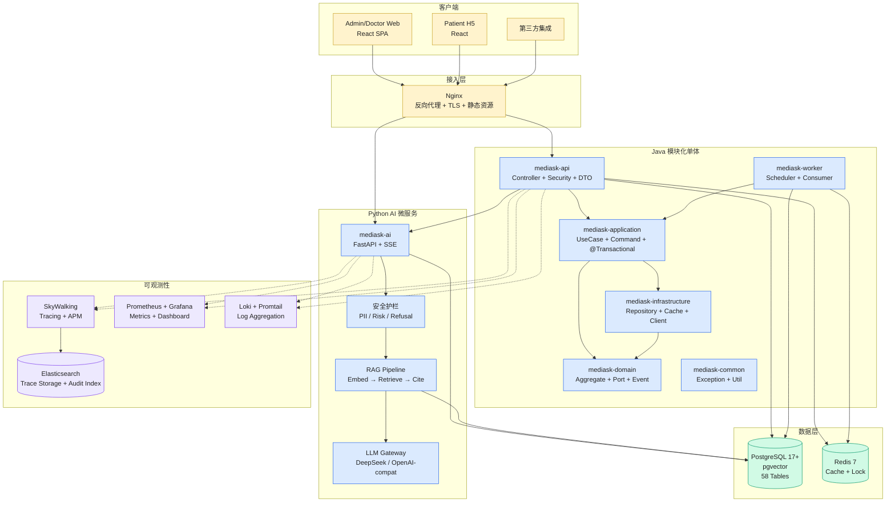

# 系统架构设计

> **设计立场**：本文档为 MediAsk 系统的目标架构设计，不受现有代码约束，完全基于最佳实践从零规划。
>
> **架构决策记录**（ADR）贯穿全文，关键决策以 `[ADR-xxx]` 标注。

---

## 1. 架构定位

| 维度 | 决策 |
|------|------|
| 架构形态 | 模块化单体（Modular Monolith）+ 独立 AI 微服务 `[ADR-001]` |
| 核心语言 | Java 21（后端主体）、Python 3.11+（AI 服务） |
| 设计方法 | 领域驱动设计（DDD）— 战略设计 + 战术设计 |
| 模块风格 | 六边形架构（Hexagonal / Ports & Adapters） `[ADR-002]` |
| 构建工具 | Maven 多模块（Java）、uv（Python） |
| 数据库 | PostgreSQL 17+ 单实例（含 pgvector 扩展）`[ADR-003]` |

### [ADR-001] 为什么选择 Modular Monolith + 独立 AI 微服务

**背景**：系统包含两个技术栈（Java / Python），业务复杂度集中在门诊挂号与 AI 问诊两大领域。

**决策**：
- Java 后端采用**模块化单体**：所有业务域共享一个进程，通过 Maven 模块和包结构实现逻辑隔离。
- Python AI 服务作为**独立可部署的微服务**：拥有自己的 FastAPI 进程，通过 HTTP/SSE 与 Java 后端集成。

**理由**：
1. 单体降低运维复杂度 — 一次部署、一个事务管理器、一次性调试
2. Maven 模块边界 + 编译期依赖检查已足够实现 DDD 限界上下文隔离
3. Python AI 服务必须独立 — LLM 推理、向量检索、文档解析的运行时特征与 Java Web 服务完全不同（长连接、高内存、GPU 亲和）
4. 当业务规模要求拆分时，模块化单体可沿限界上下文边界平滑演化为微服务

### [ADR-002] 为什么选择六边形架构

**决策**：采用 Ports & Adapters（六边形架构）替代传统分层架构。

**理由**：
1. 领域层处于架构中心，**所有依赖指向内部** — 而非传统分层中领域层依赖基础设施
2. 端口（Port）定义业务契约（Repository 接口、外部服务接口），适配器（Adapter）提供技术实现 — 天然支持 DDD 的依赖倒置
3. 可测试性 — 核心业务逻辑可以在不启动任何基础设施的情况下完成单元测试
4. 技术可替换性 — 更换 ORM、缓存、消息队列只需替换适配器，领域层零改动

### [ADR-003] 为什么选择 PostgreSQL 统一数据层

**决策**：全部 58 张表 + 向量索引均运行在 PostgreSQL 17+ 单实例上，pgvector 作为扩展提供向量检索能力。不使用独立向量数据库。

**理由**：详见 [docs/20-RAG_DATABASE_PGVECTOR_DESIGN.md](./20-RAG_DATABASE_PGVECTOR_DESIGN.md)。核心论据：
1. 事务一致性 — 业务数据与向量索引在同一事务边界内，无跨库一致性问题
2. 运维简单 — 一个数据库实例，一套备份恢复策略
3. pgvector HNSW 索引在 10 万级文档规模下性能满足需求（recall@10 > 0.95，P99 < 50ms）
4. 向量检索天然支持 WHERE 条件过滤（知识库 ID、部门 ID、文档状态），无需额外的元数据同步

---

## 2. 设计原则

| 原则 | 说明 | 落地方式 |
|------|------|----------|
| **依赖倒置** | 高层模块不依赖低层模块，二者都依赖抽象 | Domain 定义 Port 接口，Infrastructure 提供 Adapter 实现 |
| **领域核心** | 业务规则集中在 Domain 层，Domain 层无外部依赖 | Domain 模块不依赖 Spring、MyBatis、Redis 等任何框架 |
| **聚合一致性** | 一个聚合根 = 一个事务边界 = 一个 Repository | 跨聚合操作通过领域事件实现最终一致性 |
| **显式边界** | 限界上下文之间通过防腐层（ACL）或发布语言通信 | 跨上下文仅传递 ID，不传递领域对象 |
| **敏感数据分离** | 高敏感字段（EMR 原文、AI 会话原文、审计载荷）独立加密存储 | 索引表 + 密文表分离，列表查询永远不触碰密文 |
| **可观测性优先** | 每个请求全链路可追踪 | request_id / trace_id / span_id 三级标识贯穿 Java → Python → DB |
| **务实 DDD** | 核心域深耕聚合根和状态机；支撑域允许贫血模型 | 门诊挂号 / AI 问诊 = 充血模型；用户管理 / 权限 = 简化 CRUD |

---

## 3. Maven 模块划分 `[ADR-004]`

### [ADR-004] 从 7 模块调整为 6 模块

**变更**：移除 `mediask-dal`（数据访问层），将 `mediask-service` 重命名为 `mediask-application`（明确应用层定位）。

**理由**：
1. `mediask-dal` 的职责（DO 对象、MyBatis Mapper）**合并入 `mediask-infrastructure`** — DO 和 Mapper 本质上是持久化适配器的实现细节，不应独立为顶层模块
2. `mediask-service` **重命名为 `mediask-application`** — 明确其 DDD 应用层定位（用例编排、事务边界、领域对象协调），与 Interface 层（API）解耦
3. `mediask-api` **精简为纯接口适配层** — 仅负责 HTTP 协议适配（Controller、DTO 序列化、Security 过滤），不包含业务编排逻辑。当未来新增 gRPC、WebSocket、CLI 等入口时，所有用例逻辑可直接复用

### 6 模块结构

```
mediask-be/
├── mediask-api              # 接口适配层（Interface Adapter）
│   ├── controller/          # REST 控制器（参数校验、DTO 转换、调用 Application）
│   ├── security/            # Spring Security + JWT 过滤器
│   ├── dto/                 # Request / Response / VO
│   ├── assembler/           # DTO ↔ Domain 转换
│   └── config/              # Spring Boot 自动配置
│
├── mediask-application      # 应用层（Application Layer）
│   ├── outpatient/          # 门诊挂号用例
│   │   ├── command/         # Command 对象（CreateRegistrationCommand）
│   │   ├── query/           # Query 对象（可选，CQRS 预留）
│   │   └── usecase/         # UseCase 实现（RegistrationUseCase）
│   ├── clinical/            # 诊疗用例
│   ├── ai/                  # AI 问诊用例
│   ├── scheduling/          # 排班用例
│   ├── user/                # 用户用例
│   └── audit/               # 审计用例
│
├── mediask-domain           # 领域核心（Hexagon 内核）
│   ├── user/                # 用户上下文
│   ├── outpatient/          # 门诊挂号上下文
│   │   ├── model/           # Entity, VO, Aggregate Root
│   │   ├── event/           # Domain Event
│   │   ├── service/         # Domain Service
│   │   └── port/            # Repository 接口 + 外部服务端口
│   ├── clinical/            # 诊疗上下文
│   ├── ai/                  # AI 问诊上下文
│   ├── scheduling/          # 排班规划上下文
│   └── shared/              # 共享内核（跨上下文的值对象）
│
├── mediask-infrastructure   # 基础设施层（Driven Adapter）
│   ├── persistence/         # MyBatis-Plus 实现
│   │   ├── dataobject/      # DO（数据对象）
│   │   ├── mapper/          # MyBatis Mapper 接口
│   │   ├── converter/       # DO ↔ Domain Entity 转换
│   │   └── repository/      # Repository 接口实现
│   ├── cache/               # Redis + Redisson 适配
│   ├── event/               # 领域事件发布器实现
│   ├── ai/                  # Python AI 服务 HTTP 客户端
│   ├── scheduling/          # 排班算法引擎（OptaPlanner 等）
│   └── observability/       # 追踪、指标上报适配器
│
├── mediask-common           # 技术公共库（无业务逻辑）
│   ├── exception/           # 异常体系（BizException, ErrorCode）
│   ├── result/              # 统一响应包装 R<T>
│   ├── util/                # 工具类（日期、加密、雪花 ID）
│   └── constant/            # 全局常量
│
└── mediask-worker           # 异步任务进程
    ├── scheduler/           # 定时任务（@Scheduled）
    ├── consumer/            # 事件消费者
    └── job/                 # 批量任务
```

### 模块依赖关系



### 依赖规则（编译期强制）

| 规则 | 说明 |
|------|------|
| Domain **不依赖** 任何其他业务模块 | 领域层是纯 Java，不引入 Spring、MyBatis、Redis 等框架依赖 |
| Application **依赖** Domain + Infrastructure | 编排领域对象，管理事务边界，通过 Port 调用基础设施 |
| API **仅依赖** Application | Controller 只调用 UseCase，不直接操作 Domain 或 Infrastructure |
| Infrastructure **依赖** Domain | 实现 Domain 中定义的 Port 接口（Repository、ExternalServicePort） |
| Worker **依赖** Application | 异步任务复用应用层用例，不直接操作 Domain 或 Infrastructure |
| Common 被所有模块依赖 | 仅包含无业务语义的技术工具 |

---

## 4. 限界上下文与集成

### 4.1 上下文地图



### 4.2 上下文职责

| 上下文 | 类型 | 聚合根 | 核心能力 |
|--------|------|--------|----------|
| **用户上下文** | 通用子域 | `User` | 账户生命周期、RBAC、数据权限规则 |
| **排班规划上下文** | 支撑子域 | `ScheduleGenerationJob` | 规则集、医生可用性、排期生成、结果发布 |
| **门诊挂号上下文** | 核心域 | `RegistrationOrder`、`ClinicSession` | 门诊开放、号源管理、挂号/取消/支付/就诊状态机 |
| **诊疗上下文** | 核心域 | `EmrRecord`、`PrescriptionOrder` | 病历创建/修订/加密存储、结构化诊断、处方开具 |
| **AI 问诊上下文** | 核心域 | `AiSession`、`KnowledgeBase` | 会话管理、模型调用记录、护栏事件、知识库管理、反馈审核 |
| **审计与合规上下文** | 通用子域 | `AuditEvent` | 操作审计、敏感数据访问日志、领域事件流 |

### 4.3 跨上下文通信模式

| 模式 | 适用场景 | 实现方式 |
|------|----------|----------|
| **Shared Kernel** | 用户 ID 等不可变标识在所有上下文共享 | `UserId` 值对象放在 `domain/shared/` |
| **Published Language** | 排班 → 门诊挂号：发布 ClinicSession | 排班上下文产出 ClinicSession 数据，门诊上下文消费 |
| **Domain Event** | 挂号完成 → 诊疗；诊疗结束 → AI | Spring ApplicationEventPublisher（进程内） |
| **ACL (Anti-Corruption Layer)** | Java → Python AI 服务 | Infrastructure 层的 `AiServiceClient` 封装 HTTP 调用，将 Python 响应转换为 Java 领域对象 |
| **Event Subscriber** | 审计上下文监听所有业务事件 | 通过领域事件订阅，异步写入审计表 |

---

## 5. 分层架构详解

### 5.1 六边形架构全景

```
                    ┌──────────────────────────────────────────────────────┐
                    │              Driving Side (左侧 — 触发业务)           │
                    │                                                      │
                    │  ┌──────────┐  ┌──────────┐  ┌──────────┐          │
                    │  │ REST API │  │ScheduledJob│ │EventConsumer│          │
                    │  │ (api)    │  │ (worker)  │  │ (worker)  │          │
                    │  └────┬─────┘  └─────┬─────┘  └─────┬─────┘          │
                    │       │              │              │                 │
                    │       ▼              ▼              ▼                 │
                    │  ┌──────────────────────────────────────────────┐    │
                    │  │      Application Layer (应用层)               │    │
                    │  │  UseCase / Command / Query / @Transactional   │    │
                    │  └──────────────────────┬───────────────────────┘    │
                    │                         │                            │
                    │                         ▼                            │
                    │  ┌──────────────────────────────────────────────┐    │
                    │  │          Domain Core (领域核心)               │    │
                    │  │                                              │    │
                    │  │  Aggregate Root ← Entity ← Value Object      │    │
                    │  │  Domain Service / Domain Event                │    │
                    │  │                                              │    │
                    │  └──────────────────────┬───────────────────────┘    │
                    │                         │                            │
                    │                         ▼                            │
                    │  ┌──────────────────────────────────────────────┐    │
                    │  │        Driven Ports (出站端口)                │    │
                    │  │  Repository / ExternalServicePort             │    │
                    │  └──────────────────────┬───────────────────────┘    │
                    │       │              │              │                 │
                    │       ▼              ▼              ▼                 │
                    │  ┌──────────┐  ┌──────────┐  ┌──────────┐          │
                    │  │PostgreSQL│  │  Redis   │  │AI Service │          │
                    │  │ Adapter  │  │ Adapter  │  │  Adapter  │          │
                    │  │ (infra)  │  │ (infra)  │  │ (infra)   │          │
                    │  └──────────┘  └──────────┘  └──────────┘          │
                    │              Driven Side (右侧 — 技术实现)           │
                    └──────────────────────────────────────────────────────┘
```

### 5.2 请求处理流程

以"患者挂号"为例：

```
 1. HTTP Request → REST Controller (mediask-api)
 2. Controller → assembler 将 Request DTO 转为 Command
 3. Controller → registrationUseCase.execute(command) (mediask-application)
 4. UseCase 开启事务 (@Transactional)
 5. UseCase 加载聚合根 → RegistrationOrderRepository.findById() (Driven Port)
 6. 聚合根执行业务规则 → registrationOrder.confirm()
 7. 聚合根产生领域事件 → RegistrationConfirmedEvent
 8. UseCase 保存聚合根 → RegistrationOrderRepository.save() (Driven Port)
 9. UseCase 发布事件 → EventPublisher.publish(event) (Driven Port)
10. 审计上下文异步消费事件 → 写入 audit_event
11. UseCase 返回结果 → Controller → assembler 转为 Response DTO
```

### 5.3 各层映射到 Maven 模块

| 六边形层 | Maven 模块 | 关键类 |
|----------|-----------|--------|
| Interface Adapter | `mediask-api` | `*Controller`、`*Request`、`*Response`、`*Assembler` |
| Application Layer | `mediask-application` | `*UseCase`、`*Command`、`*Query`、`@Transactional` |
| Domain Core | `mediask-domain` | `*`（Entity）、`*Id`（VO）、`*DomainService`、`*Event` |
| Driven Port | `mediask-domain` | `*Repository`（接口）、`*ServicePort`（外部服务接口） |
| Driven Adapter | `mediask-infrastructure` | `*RepositoryImpl`、`*Mapper`、`*DO`、`*Converter`、`*Client` |

---

## 6. 技术栈

### 6.1 Java 后端

| 分类 | 组件 | 版本 | 用途 |
|------|------|------|------|
| 语言 | JDK | 21 | 虚拟线程（Virtual Threads）、Record、Pattern Matching |
| Web | Spring Boot | 3.x | 应用框架、自动配置、Actuator |
| ORM | MyBatis-Plus | 3.5.x | SQL 映射、分页插件、乐观锁插件 |
| DB 驱动 | org.postgresql:postgresql | 42.x | PostgreSQL JDBC |
| 缓存/锁 | Redis + Redisson | 7.x / 3.40.x | 分布式缓存、分布式锁、限流 |
| 安全 | Spring Security + JJWT | 6.x / 0.12.x | 认证（JWT + Refresh Token）、RBAC 鉴权 |
| API 文档 | springdoc-openapi | 2.x | OpenAPI 3.0 自动生成、Swagger UI |
| 连接池 | HikariCP | Spring Boot 默认 | JDBC 连接池 |
| 事件 | Spring ApplicationEvent | -- | 进程内领域事件发布/订阅 |

### 6.2 Python AI 服务

| 分类 | 组件 | 用途 |
|------|------|------|
| 框架 | FastAPI + Uvicorn | 异步 HTTP 服务、SSE 流式输出 |
| LLM | LangChain + LangGraph | LLM 编排、Agent 工作流 |
| 向量 | pgvector (psycopg) | 向量相似度检索 |
| Embedding | Alibaba Bailian text-embedding-v4 | 1536 维文本向量化 |
| DB | psycopg[binary] | PostgreSQL 异步驱动 |
| 包管理 | uv | 快速包管理和虚拟环境 |

### 6.3 数据存储

| 组件 | 用途 |
|------|------|
| PostgreSQL 17+ | 关系数据（58 张表）+ pgvector 向量索引 |
| Redis 7.x | 会话缓存、JWT 黑名单、分布式锁、号源库存热缓存 |

### 6.4 可观测性

| 组件 | 用途 |
|------|------|
| SkyWalking 9.1 | 分布式追踪、拓扑图、APM |
| Prometheus + Micrometer | 指标采集（JVM、HTTP、连接池、Redis） |
| Grafana 10.x | 统一可视化仪表盘 |
| Loki + Promtail | 运行时日志聚合 |
| Elasticsearch 8.x | SkyWalking 存储后端 + 审计事件索引 |

---

## 7. Java 与 Python 集成架构

### 7.1 集成模式 `[ADR-005]`



### 7.2 数据写入边界

| 数据 | 写入方 | 原因 |
|------|--------|------|
| `ai_session`、`ai_turn`、`ai_turn_content` | **Java** | 会话生命周期由业务系统管理 |
| `ai_model_run`、`ai_run_artifact`、`ai_guardrail_event` | **Java** | 从 Python 响应中提取，Java 负责持久化 |
| `ai_feedback_task`、`ai_feedback_review` | **Java** | 人工审核流程完全在 Java 侧 |
| `knowledge_base`、`knowledge_document`、`knowledge_chunk` | **Java** | 知识库元数据属于业务事实层 |
| `knowledge_chunk_index` | **Python** | 向量化与分词在 Python 完成，直接写入检索投影层 |
| `ai_run_citation` | **Python** | 检索命中记录在 Python 检索管道中产生 |

### 7.3 认证与追踪

| 机制 | 实现 |
|------|------|
| 服务间认证 | `X-API-Key` 请求头（Java → Python） |
| 链路追踪 | `X-Trace-Id` 请求头透传，Python 侧注入到所有日志和 DB 操作 |
| 降级策略 | Embedding API 不可用时返回保守无 RAG 响应，`ai_model_run.is_degraded = true` |

---

## 8. 数据架构

### 8.1 数据库总览

PostgreSQL 17+ 单实例，58 张表分布在 7 个 SQL 文件中。详见 [docs/07-DATABASE.md](./07-DATABASE.md)。

| SQL 文件 | 表数量 | 领域 |
|----------|--------|------|
| `01-base-auth.sql` | 8 | 用户、角色、权限、数据权限规则 |
| `02-hospital-org.sql` | 4 | 医院、科室、医生 |
| `03-scheduling.sql` | 10 | 排班规则、生成任务、排期结果 |
| `04-appointment.sql` | 7 | 门诊场次、号源、挂号单、就诊 |
| `05-ai.sql` | 13 | AI 会话、模型调用、知识库、向量索引、引用 |
| `06-medical.sql` | 10 | 病历、诊断、处方、药品 |
| `07-domain-events.sql` | 6 | 审计、访问日志、领域事件、事务发件箱 |

### 8.2 RAG 三层数据模型

```
┌──────────────────────────────────────────────────────────┐
│  第一层：业务事实层（Java 管理）                           │
│  knowledge_base → knowledge_document → knowledge_chunk    │
│  回答：谁拥有知识、有哪些文档、切了哪些块                   │
└──────────────────────┬───────────────────────────────────┘
                       │ chunk_id (稳定锚点)
                       ▼
┌──────────────────────────────────────────────────────────┐
│  第二层：检索投影层（Python 管理）                         │
│  knowledge_chunk_index                                    │
│  VECTOR(1536) + TSVECTOR + authority_score + freshness    │
│  回答：每个块如何被检索（向量 + 关键词 + 排序权重）         │
└──────────────────────┬───────────────────────────────────┘
                       │ chunk_id + run_id
                       ▼
┌──────────────────────────────────────────────────────────┐
│  第三层：引用溯源层（Python 管理）                         │
│  ai_run_citation                                          │
│  run_id + chunk_id + rank + score + used_in_answer        │
│  回答：AI 回答引用了哪些块、排序如何、是否实际使用         │
└──────────────────────────────────────────────────────────┘
```

详见 [docs/20-RAG_DATABASE_PGVECTOR_DESIGN.md](./20-RAG_DATABASE_PGVECTOR_DESIGN.md)。

### 8.3 敏感数据架构

| 策略 | 适用表 | 实现 |
|------|--------|------|
| **索引/密文分离** | `emr_record` + `emr_record_content` | 列表查询只读索引表；查看原文时解密密文表 |
| **独立加密列** | `ai_turn_content`、`audit_payload` | `encrypted_content` 列，应用层 AES-256 加密/解密 |
| **PII 隔离** | `user_pii_profile` | 高敏感身份信息独立存储，按需授权查询 |
| **访问审计** | `data_access_log` | 每次访问敏感数据（EMR 查看、处方导出、AI 原文读取）均记录 |

---

## 9. 安全架构

### 9.1 认证（Authentication）

```
Client → Nginx → mediask-api
                     │
                     ├── POST /api/v1/auth/login → 签发 Access Token (JWT, 30min) + Refresh Token (UUID, 7d)
                     ├── POST /api/v1/auth/refresh → 刷新 Access Token
                     ├── POST /api/v1/auth/logout → Refresh Token 失效 + Access Token 加入 Redis 黑名单
                     │
                     └── 后续请求: Authorization: Bearer <access_token>
                         └── JwtAuthenticationFilter → 验证签名 → 检查黑名单 → 注入 SecurityContext
```

### 9.2 鉴权（Authorization）

| 层级 | 机制 | 实现 |
|------|------|------|
| **接口级** | RBAC（角色 - 权限映射） | `@PreAuthorize("hasAuthority('...')")` |
| **数据级** | 数据权限规则 | `data_scope_rules` 表 + MyBatis 拦截器自动注入 WHERE 条件 |
| **字段级** | 敏感字段脱敏 | 序列化时根据角色决定是否脱敏 |

### 9.3 AI 安全护栏

| 阶段 | 措施 |
|------|------|
| **输入** | PII 检测与掩码、风险分类（低/中/高/极高）、极高风险直接拒绝 |
| **输出** | PII 回扫、医疗建议免责声明注入、幻觉检测（P2） |
| **记录** | 所有护栏触发事件写入 `ai_guardrail_event`（Java 持久化） |

详见 [docs/11-AI_GUARDRAILS_PLAN.md](./11-AI_GUARDRAILS_PLAN.md)。

---

## 10. 可观测性架构

### 10.1 三大支柱

| 支柱 | 工具 | 数据源 |
|------|------|--------|
| **Traces** | SkyWalking 9.1 | Java Agent 自动埋点 + Python 手动 Span + Redis 自定义 Span |
| **Metrics** | Prometheus + Micrometer | Spring Boot Actuator（JVM、HTTP、HikariCP、Redisson） |
| **Logs** | Loki + Promtail | 结构化 JSON 日志（logback-spring.xml），包含 request_id / trace_id |

### 10.2 请求标识体系

| 标识 | 来源 | 范围 |
|------|------|------|
| `request_id` | `X-Request-Id` 请求头（网关生成或自动生成） | 单次 HTTP 请求 |
| `request_trace_id` | `X-Trace-Id` 请求头（跨系统透传） | 跨 Java / Python 服务 |
| `trace_id` | SkyWalking Agent 注入 | APM 追踪维度 |

### 10.3 审计日志双写

```
业务操作 → Domain Event → AuditEventSubscriber
                              │
                              ├── PostgreSQL audit_event + audit_payload (权威存储)
                              └── Elasticsearch mediask-audit-YYYY.MM (查询索引，ILM 管理)
```

详见 [docs/17-OBSERVABILITY.md](./17-OBSERVABILITY.md)。

---

## 11. 部署拓扑

### 11.1 容器化部署



### 11.2 Docker Compose 服务编排

| 服务 | 镜像 | 端口 |
|------|------|------|
| `mediask-api` | 自建 | 8989 |
| `mediask-worker` | 自建 | -- |
| `mediask-ai` | 自建 | 8000 |
| `nginx` | nginx:alpine | 80 / 443 |
| `postgres` | pgvector/pgvector:pg17 | 5432 |
| `redis` | redis:7-alpine | 6379 |
| `skywalking-oap` | apache/skywalking-oap-server:9.1.0 | 11800 / 12800 |
| `skywalking-ui` | apache/skywalking-ui:9.1.0 | 8080 |
| `elasticsearch` | elasticsearch:8.11.0 | 9200 |
| `prometheus` | prom/prometheus:v2.48.0 | 9090 |
| `grafana` | grafana/grafana:10.2.0 | 3000 |
| `loki` | grafana/loki:2.9.0 | 3100 |
| `promtail` | grafana/promtail:2.9.0 | -- |

---

## 12. API 设计

### 12.1 接口前缀规范

| 前缀 | 上下文 | 说明 |
|------|--------|------|
| `/api/v1/auth` | 用户 | 登录、注册、刷新令牌、登出 |
| `/api/v1/users` | 用户 | 用户信息查询与管理 |
| `/api/v1/admin/authz` | 用户 | 角色、权限、数据权限管理 |
| `/api/v1/doctors` | 组织 | 医生档案 CRUD |
| `/api/v1/departments` | 组织 | 科室管理 |
| `/api/v1/schedules` | 排班 | 排班规则、生成任务、排期发布 |
| `/api/v1/clinic-sessions` | 门诊 | 门诊场次管理 |
| `/api/v1/registrations` | 门诊 | 挂号单 CRUD、状态操作 |
| `/api/v1/encounters` | 诊疗 | 就诊记录 |
| `/api/v1/emr` | 诊疗 | 电子病历 |
| `/api/v1/prescriptions` | 诊疗 | 处方管理 |
| `/api/v1/ai` | AI | AI 会话、反馈审核 |
| `/api/v1/knowledge` | AI | 知识库管理、文档上传 |
| `/api/v1/audit` | 审计 | 审计事件查询 |

### 12.2 统一响应格式

```json
{
  "code": 200,
  "message": "success",
  "data": { },
  "requestId": "req-abc-123",
  "timestamp": "2026-03-11T10:30:00+08:00"
}
```

### 12.3 API 文档

- OpenAPI 规范：`GET /v3/api-docs`
- Swagger UI：`GET /swagger-ui/index.html`
- 默认端口：`8989`

---

## 13. 全景架构图

> 以下为系统完整架构。蓝色 = 运行时组件，黄色 = 规划中组件，绿色 = 数据存储，紫色 = 可观测性。



---

## 14. 相关文档

| 文档 | 说明 |
|------|------|
| [02-CODE_STANDARDS.md](./02-CODE_STANDARDS.md) | 代码规范与工程最佳实践 |
| [03-CONFIGURATION.md](./03-CONFIGURATION.md) | 配置管理总纲（含 03A/03B/03C 子文档） |
| [04-DEVOPS.md](./04-DEVOPS.md) | 部署运维手册 |
| [06-DDD_DESIGN.md](./06-DDD_DESIGN.md) | DDD 设计指南（统一语言版） |
| [07-DATABASE.md](./07-DATABASE.md) | 数据库设计（V3 全表） |
| [07B-AI-AUDIT-V3.md](./07B-AI-AUDIT-V3.md) | AI 与审计设计 |
| [10-PYTHON_AI_SERVICE.md](./10-PYTHON_AI_SERVICE.md) | Python AI 服务设计 |
| [14-ARCHITECTURE_REVIEW.md](./14-ARCHITECTURE_REVIEW.md) | 架构评审与优化建议 |
| [17-OBSERVABILITY.md](./17-OBSERVABILITY.md) | 可观测性架构 |
| [19-ERROR_EXCEPTION_RESPONSE_DESIGN.md](./19-ERROR_EXCEPTION_RESPONSE_DESIGN.md) | 错误/异常/响应设计 |
| [20-RAG_DATABASE_PGVECTOR_DESIGN.md](./20-RAG_DATABASE_PGVECTOR_DESIGN.md) | RAG 数据库（pgvector）设计 |
