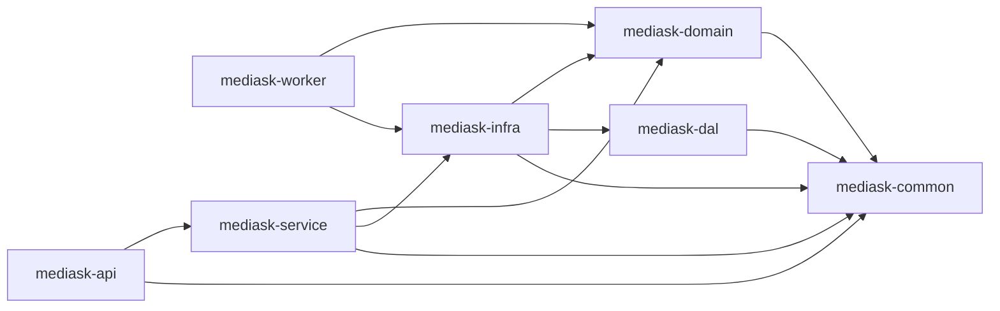

# 系统架构概览（按当前代码）

> 本文档同步当前 `mediask-be` Java 代码实现状态。

## 1. 架构定位

- 架构形态：模块化单体（Modular Monolith）
- 核心语言：Java 21
- 构建方式：Maven 多模块
- 当前可部署模块：`mediask-api`、`mediask-worker`

## 2. 模块划分与依赖



## 3. 当前已落地能力（Java）

- 认证与鉴权：注册、登录、刷新令牌、登出，JWT + Refresh Token。
- 用户与权限：用户查询、角色与权限管理。
- 排班管理：手动创建、自动排班、模板生成、开停诊、号源调整、分页查询、删除。
- 挂号预约：创建、取消、支付、标记就诊/爽约、医生/患者维度查询。
- 医生管理：医生档案的创建、更新、查询。
- AI 反馈指标：AI 复核提交与统计查询（Java 侧数据域已落地）。
- 诊断连接：`/api/test/**` 连接测试能力。

## 4. 当前技术栈（来自 POM）

| 分类 | 组件 | 版本 |
|------|------|------|
| Java | JDK | 21 |
| Web | Spring Boot | 3.5.8 |
| ORM | MyBatis-Plus | 3.5.15 |
| DB | PostgreSQL 驱动 | 42.x |
| Cache/Lock | Redis + Redisson | 7.x / 3.40.2 |
| Security | Spring Security + JJWT | 6.x / 0.12.6 |
| API 文档 | springdoc-openapi | 2.6.0 |

## 5. 运行与访问

- 默认端口：`8989`（`mediask-api/src/main/resources/application.yml`）
- Context Path：`/`
- OpenAPI：`/v3/api-docs`
- Swagger UI：`/swagger-ui/index.html`

## 6. 当前实现边界说明

- 当前代码库仍可见旧版 AI 数据域命名（如 `ai_conversations`、`ai_messages`、`ai_feedback_reviews`）；它们反映的是现阶段 Java 实现状态，不代表 V3 目标数据库口径。
- V3 目标数据库模型已统一切换为 `ai_session`、`ai_turn`、`ai_turn_content`、`ai_model_run`、`ai_guardrail_event`、`ai_feedback_task`、`ai_feedback_review` 等表，详见 `docs/07-DATABASE.md` 与 `docs/07B-AI-AUDIT-V3.md`。
- Python 微服务（FastAPI/LangChain/LangGraph）、pgvector（RAG 向量检索）、OSS 在 `MediAskDocs` 中主要作为规划内容；当前 Java 后端代码未形成完整落地链路。

## 7. 关键接口前缀

- 认证：`/api/v1/auth`
- 用户：`/api/v1/users`
- 权限管理：`/api/v1/admin/authz`
- 医生：`/api/v1/doctors`
- 排班：`/api/v1/schedules`
- 排班模板：`/api/v1/schedule-templates`
- 预约：`/api/v1/appointments`
- AI 指标：`/api/v1/ai`
- 测试：`/api/test`

## 8. 项目架构大观（含规划项）

> 说明：本图用于展示“全局形态”。其中标注为 `planned` 的组件是当前文档规划项，不代表 Java 后端已全部落地。
>
> draw.io 源文件：`MediAskDocs/diagrams/mediask-architecture-panorama.drawio`

```mermaid
flowchart TB
    classDef planned fill:#fff3cd,stroke:#c9a227,stroke-width:1px,color:#222;
    classDef runtime fill:#e8f3ff,stroke:#2b6cb0,stroke-width:1px,color:#222;
    classDef data fill:#eefaf0,stroke:#2f855a,stroke-width:1px,color:#222;
    classDef obs fill:#f6f0ff,stroke:#6b46c1,stroke-width:1px,color:#222;

    subgraph C[Clients]
        WebUser[Admin/Doctor Web\nReact SPA]:::planned
        H5User[Patient H5\nReact]:::planned
        ApiCaller[3rd-party / Scripts]:::planned
    end

    subgraph Edge[Edge]
        Nginx[Nginx\nStatic + Reverse Proxy]:::planned
    end

    subgraph FE[Frontend Deploy]
        WebDist[web dist]:::planned
        H5Dist[h5 dist]:::planned
    end

    subgraph Java[Java Backend (Modular Monolith)]
        Api[mediask-api\nSpring Boot REST]:::runtime
        Worker[mediask-worker\nSchedulers/Consumers]:::runtime
        Service[mediask-service\nApplication services]:::runtime
        Domain[mediask-domain\nDomain model]:::runtime
        Infra[mediask-infra\nRedis/JWT/Clients]:::runtime
        Dal[mediask-dal\nMyBatis-Plus]:::runtime

        Api --> Service --> Domain
        Service --> Infra --> Dal
        Worker --> Infra
        Worker --> Domain
    end

    subgraph AI[Python AI Service]
        AiSvc[mediask-ai\nFastAPI + SSE]:::planned
        Guardrails[Risk/PII Guardrails\n+ Audit fields]:::planned
        RAG[RAG Pipeline\nChunk/Retrieve/Citations]:::planned
        LLM[DeepSeek / OpenAI-compatible\nLLM API]:::planned
    end

    subgraph Stores[Data Stores]
        PG[(PostgreSQL + pgvector)]:::data
        Redis[(Redis)]:::data
    end

    subgraph Obs[Observability]
        ELK[ELK\nElasticsearch + Logstash + Kibana]:::obs
        Trace[Tracing\nSkyWalking/Zipkin]:::planned
    end

    subgraph Deploy[Containerization]
        Docker[Docker\nAPI/Worker/AI/Nginx]:::planned
    end

    WebUser --> Nginx
    H5User --> Nginx
    ApiCaller --> Nginx
    Nginx --> Api
    Nginx --> AiSvc
    Nginx --> WebDist
    Nginx --> H5Dist

    Api --> PG
    Api --> Redis
    Worker --> PG
    Worker --> Redis

    Api --> AiSvc
    AiSvc --> Guardrails --> RAG --> PG
    RAG --> LLM

    Api --> ELK
    Worker --> ELK
    AiSvc --> ELK
    Nginx --> ELK
    Api --> Trace
    AiSvc --> Trace
```

## 9. 相关文档

- [代码规范与最佳实践](./02-CODE_STANDARDS.md)
- [配置管理指南](./03-CONFIGURATION.md)
- [数据库设计](./07-DATABASE.md)
- [部署运维手册](./04-DEVOPS.md)
