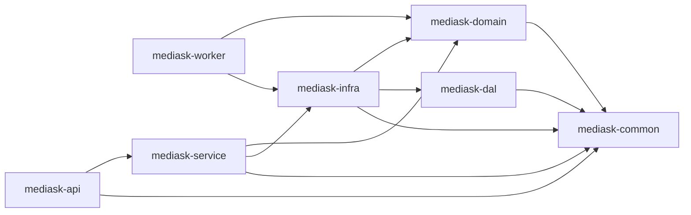

# 系统架构概览（按当前代码）

> 本文档同步当前 `mediask-be` Java 代码实现状态。

## 1. 架构定位

- 架构形态：模块化单体（Modular Monolith）
- 核心语言：Java 21
- 构建方式：Maven 多模块
- 当前可部署模块：`mediask-api`、`mediask-worker`

## 2. 模块划分与依赖

## 3. 当前已落地能力（Java）

- 认证与鉴权：注册、登录、刷新令牌、登出，JWT + Refresh Token。
- 用户与权限：用户查询、角色与权限管理。
- 排班管理：手动创建、自动排班、模板生成、开停诊、号源调整、分页查询、删除。
- 挂号预约：创建、取消、支付、标记就诊/爽约、医生/患者维度查询。
- 医生管理：医生档案的创建、更新、查询。
- AI 反馈指标：AI 复核提交与统计查询（Java 侧数据域已落地）。
- 诊断连接：`/api/test/**` 连接测试能力。

## 4. 当前技术栈（来自 POM）

| 分类 | 组件 | 版本 |
|------|------|------|
| Java | JDK | 21 |
| Web | Spring Boot | 3.5.8 |
| ORM | MyBatis-Plus | 3.5.15 |
| DB | MySQL 驱动 | 8.3.0 |
| Cache/Lock | Redis + Redisson | 7.x / 3.40.2 |
| Security | Spring Security + JJWT | 6.x / 0.12.6 |
| API 文档 | springdoc-openapi | 2.6.0 |

## 5. 运行与访问

- 默认端口：`8989`（`mediask-api/src/main/resources/application.yml`）
- Context Path：`/`
- OpenAPI：`/v3/api-docs`
- Swagger UI：`/swagger-ui/index.html`

## 6. 当前实现边界说明

- 代码库已包含 AI 相关数据域（如 `ai_conversations`、`ai_messages`、`ai_feedback_reviews`）和对应 Java 能力。
- Python 微服务（FastAPI/LangChain/LangGraph）、Milvus、RocketMQ、OSS 在 `MediAskDocs` 中主要作为规划内容；当前 Java 后端代码未形成完整落地链路。

## 7. 关键接口前缀

- 认证：`/api/v1/auth`
- 用户：`/api/v1/users`
- 权限管理：`/api/v1/admin/authz`
- 医生：`/api/v1/doctors`
- 排班：`/api/v1/schedules`
- 排班模板：`/api/v1/schedule-templates`
- 预约：`/api/v1/appointments`
- AI 指标：`/api/v1/ai`
- 测试：`/api/test`

## 8. 相关文档

- [代码规范与最佳实践](./02-CODE_STANDARDS.md)
- [配置管理指南](./03-CONFIGURATION.md)
- [数据库设计](./07-DATABASE.md)
- [部署运维手册](./04-DEVOPS.md)
