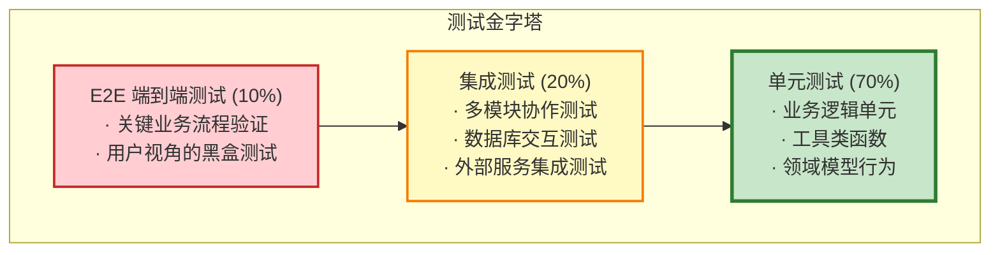

# 测试策略与质量要求

> 本文档定义项目测试的整体策略、质量标准和测试规范

## 1. 测试目标与原则

### 1.1 测试目标

| 目标 | 说明 | 优先级 |
|------|------|--------|
| **功能正确性** | 确保业务逻辑符合需求规格 | P0 |
| **系统稳定性** | 防止新功能引入回归问题 | P0 |
| **性能达标** | 满足响应时间和吞吐量要求 | P1 |
| **安全合规** | 通过安全测试和审计 | P0 |
| **可维护性** | 测试代码清晰易懂，便于后续维护 | P2 |

### 1.2 测试原则

- **左移测试**：测试尽早介入，开发阶段即进行单元测试
- **金字塔模型**：单元测试（70%） > 集成测试（20%） > E2E 测试（10%）
- **自动化优先**：核心业务流程必须有自动化测试覆盖
- **持续集成**：每次提交触发自动化测试，快速反馈
- **测试即文档**：测试用例即业务需求的可执行文档

---

## 2. 测试分层策略

### 2.1 测试金字塔



### 2.2 各层测试职责

| 测试层级 | 测试对象 | 测试范围 | 测试环境 | 执行频率 |
|---------|---------|---------|---------|---------|
| **单元测试** | Service、Domain、Util | 单个类/方法 | Mock 依赖 | 每次代码提交 |
| **集成测试** | Controller、Repository | 跨层交互 | TestContainers | 每次代码提交 |
| **接口测试** | REST API | 接口契约 | 测试环境 | 每日定时 |
| **端到端测试** | 完整业务流程 | 用户场景 | 预发布环境 | 发布前 |
| **性能测试** | 核心接口 | 压力场景 | 性能测试环境 | 每周/发布前 |

---

## 3. 测试覆盖率要求

### 3.1 代码覆盖率标准

| 模块类型 | 行覆盖率 | 分支覆盖率 | 说明 |
|---------|---------|-----------|------|
| **Domain 领域层** | ≥ 90% | ≥ 85% | 核心业务逻辑，必须高覆盖 |
| **Application Service** | ≥ 85% | ≥ 80% | 业务编排层，覆盖主流程 |
| **Controller** | ≥ 75% | ≥ 65% | 接口层，覆盖参数校验 |
| **Repository** | ≥ 70% | ≥ 60% | 数据访问层，覆盖 CRUD |
| **Util/Helper** | ≥ 80% | ≥ 70% | 工具类，覆盖边界条件 |
| **整体项目** | ≥ 80% | ≥ 70% | 全局最低要求 |

### 3.2 业务功能覆盖率要求

| 业务模块 | 必测场景 | 场景覆盖率 |
|---------|---------|-----------|
| **用户认证授权** | 登录、注册、权限校验、Token 刷新 | 100% |
| **挂号预约** | 创建、支付、取消、并发控制 | 100% |
| **医生排班** | 创建、查询、号源扣减 | 100% |
| **电子病历** | 创建、修改、归档、权限控制 | 100% |
| **处方管理** | 开立、审核、发药 | 100% |
| **AI 问诊** | 对话、知识检索、结果生成 | 90% |
| **支付结算** | 支付、退款、对账 | 100% |

### 3.3 异常场景覆盖要求

每个核心业务流程必须覆盖以下异常场景：

- ✅ **参数校验异常**：空值、格式错误、越界
- ✅ **业务规则异常**：状态不合法、权限不足、资源不存在
- ✅ **并发冲突**：乐观锁冲突、库存超卖
- ✅ **外部依赖故障**：数据库连接失败、Redis 不可用、HTTP 超时
- ✅ **限流熔断**：触发限流、熔断降级

---

## 4. 性能测试要求

### 4.1 性能基准指标

| 接口类型 | TPS 要求 | P99 响应时间 | P95 响应时间 | 错误率 |
|---------|---------|-------------|-------------|--------|
| **核心交易接口** | ≥ 500/s | < 500ms | < 300ms | < 0.01% |
| 挂号创建 | ≥ 500/s | < 500ms | < 300ms | < 0.01% |
| 支付接口 | ≥ 300/s | < 800ms | < 500ms | < 0.01% |
| **查询接口** | ≥ 1000/s | < 200ms | < 100ms | < 0.1% |
| 医生列表 | ≥ 1000/s | < 200ms | < 100ms | < 0.1% |
| 排班查询 | ≥ 800/s | < 200ms | < 100ms | < 0.1% |
| **AI 接口** | ≥ 50/s | < 3s | < 2s | < 1% |
| 知识问答 | ≥ 50/s | < 3s | < 2s | < 1% |

### 4.2 压测场景设计

| 场景名称 | 并发用户 | 持续时间 | 目的 |
|---------|---------|---------|------|
| **基线测试** | 100 | 30分钟 | 确定系统基准性能 |
| **压力测试** | 1000 | 1小时 | 验证系统在高负载下的表现 |
| **峰值测试** | 2000 | 15分钟 | 模拟突发流量（抢号场景） |
| **稳定性测试** | 500 | 8小时 | 验证长时间运行的稳定性 |
| **容量测试** | 递增至崩溃 | 2小时 | 确定系统最大容量 |

### 4.3 资源使用率要求

| 资源类型 | 正常负载 | 峰值负载 | 报警阈值 |
|---------|---------|---------|---------|
| **CPU 使用率** | < 50% | < 70% | > 80% |
| **内存使用率** | < 60% | < 80% | > 85% |
| **JVM Heap** | < 70% | < 85% | > 90% |
| **数据库连接池** | < 70% | < 85% | > 90% |
| **Redis 连接** | < 70% | < 85% | > 90% |

---

## 5. 测试环境要求

### 5.1 环境隔离

| 环境 | 用途 | 数据来源 | 部署频率 |
|------|------|---------|---------|
| **本地开发** | 开发者单元测试 | Mock/内存数据库 | 实时 |
| **CI 环境** | 自动化测试 | TestContainers | 每次提交 |
| **测试环境** | 集成测试/手工测试 | 脱敏生产数据 | 每日 |
| **预发布环境** | 上线前验证 | 生产数据副本 | 发布前 |
| **性能测试环境** | 压测专用 | 模拟数据 | 按需 |

### 5.2 测试数据管理规范

**数据准备原则**：
- ✅ 使用脱敏的生产数据（测试环境）
- ✅ 自动化生成测试数据脚本
- ✅ 测试数据具备代表性（覆盖边界值）
- ✅ 每次测试后自动清理数据

**禁止行为**：
- ❌ 在测试环境使用真实用户隐私数据
- ❌ 手工维护测试数据
- ❌ 测试数据污染生产环境
- ❌ 硬编码测试数据在代码中

---

## 6. 测试工具与技术选型

### 6.1 推荐测试框架

| 测试类型 | 工具/框架 | 说明 |
|---------|---------|------|
| **单元测试** | JUnit 5 + Mockito | Spring Boot 官方推荐 |
| **集成测试** | TestContainers | 真实容器环境 |
| **接口测试** | RestAssured / Postman | API 契约测试 |
| **性能测试** | JMeter / Gatling | 压力测试工具 |
| **覆盖率统计** | JaCoCo | Maven 集成 |
| **E2E 测试** | Selenium / Playwright | 前端自动化（可选） |

### 6.2 Mock 策略

| 依赖类型 | Mock 策略 | 说明 |
|---------|---------|------|
| **数据库** | 单元测试 Mock，集成测试真实 | TestContainers 提供真实 MySQL |
| **Redis** | 单元测试 Mock，集成测试真实 | TestContainers 提供真实 Redis |
| **外部 HTTP** | 全部 Mock | WireMock / MockServer |
| **消息队列** | 单元测试 Mock，集成测试内存队列 | Embedded RocketMQ |
| **AI 大模型** | Mock 固定响应 | 避免测试依赖外部服务 |

---

## 7. 测试规范与最佳实践

### 7.1 测试命名规范

**单元测试**：
```
方法名_场景描述_期望结果

示例：
- createAppointment_WhenNoSlots_ThrowException
- payAppointment_WhenStatusPending_Success
- calculateFee_WhenVIPUser_ReturnDiscount
```

**集成测试**：
```
业务流程描述

示例：
- testFullAppointmentFlow_CreatePayVisit
- testConcurrentAppointment_PreventOversell
```

### 7.2 测试代码组织

**包结构**：
```
src/test/java/
├── unit/                    # 单元测试
│   ├── service/
│   ├── domain/
│   └── util/
├── integration/             # 集成测试
│   ├── repository/
│   └── api/
└── performance/             # 性能测试
    └── jmeter/
```

### 7.3 测试编写规范

**AAA 模式**（Arrange-Act-Assert）：
```
// Arrange: 准备测试数据和环境
// Act: 执行被测方法
// Assert: 验证结果
```

**必须包含的测试场景**：
- ✅ 正常路径（Happy Path）
- ✅ 边界值测试
- ✅ 异常场景
- ✅ 并发场景（核心业务）

**禁止的测试反模式**：
- ❌ 测试之间相互依赖
- ❌ 测试顺序敏感
- ❌ 测试过于复杂（超过 30 行）
- ❌ 忽略测试失败
- ❌ 注释掉失败的测试

---

## 8. 质量门禁

### 8.1 代码提交门禁

| 检查项 | 阈值 | 操作 |
|--------|------|------|
| **单元测试通过率** | 100% | 不通过禁止提交 |
| **新增代码覆盖率** | ≥ 80% | 不达标禁止合并 |
| **集成测试通过率** | 100% | 不通过禁止合并 |
| **编译警告** | 0 | 存在警告禁止合并 |
| **代码规范检查** | 0 错误 | Checkstyle 校验 |

### 8.2 发布质量门禁

| 检查项 | 要求 | 说明 |
|--------|------|------|
| **全量测试通过** | 100% | 包括单元、集成、接口测试 |
| **覆盖率报告** | ≥ 80% | 提供 JaCoCo 报告 |
| **性能测试** | 达标 | 核心接口性能基准达标 |
| **安全扫描** | 无高危漏洞 | OWASP Dependency Check |
| **人工回归测试** | 核心流程通过 | 测试人员手工验证 |

---

## 9. 持续集成与测试自动化

### 9.1 CI 流程集成

```
代码提交 → 编译 → 单元测试 → 代码扫描 → 集成测试 → 覆盖率报告 → 通知
```

**关键节点**：
1. **Pre-commit Hook**：代码格式化、Lint 检查
2. **CI Build**：单元测试 + 集成测试
3. **质量报告**：覆盖率、Sonar 分析
4. **测试失败通知**：邮件/钉钉通知责任人

### 9.2 测试报告要求

**每日测试报告包含**：
- ✅ 测试通过率趋势
- ✅ 代码覆盖率变化
- ✅ 失败用例详情
- ✅ 性能指标对比

**发布前测试报告包含**：
- ✅ 全量测试结果
- ✅ 覆盖率报告
- ✅ 性能测试结果
- ✅ 风险评估

---

## 10. 测试责任与流程

### 10.1 角色职责

| 角色 | 测试职责 |
|------|---------|
| **开发工程师** | 编写单元测试、修复测试失败、保证覆盖率达标 |
| **测试工程师** | 设计测试用例、执行集成测试、性能测试、回归测试 |
| **Tech Lead** | 制定测试策略、Review 测试代码、质量把关 |
| **DevOps** | 维护测试环境、CI/CD 流程、测试数据管理 |

### 10.2 测试流程

```
需求评审 → 测试用例设计 → 开发编码+单元测试 → 
提测 → 集成测试 → 性能测试 → 回归测试 → 
质量评审 → 发布
```

**各阶段输出物**：
- 需求评审：测试计划
- 测试用例设计：用例清单
- 开发阶段：单元测试代码
- 集成测试：测试报告
- 性能测试：性能基准报告
- 发布前：质量评估报告

---

## 11. 测试度量指标

### 11.1 过程指标

| 指标 | 计算方式 | 目标值 |
|------|---------|--------|
| **测试通过率** | 通过用例数 / 总用例数 | 100% |
| **缺陷发现率** | 测试发现缺陷数 / 总缺陷数 | > 80% |
| **缺陷修复率** | 已修复缺陷数 / 总缺陷数 | > 95% |
| **自动化率** | 自动化用例数 / 总用例数 | > 80% |

### 11.2 质量指标

| 指标 | 计算方式 | 目标值 |
|------|---------|--------|
| **代码覆盖率** | 已覆盖行数 / 总行数 | ≥ 80% |
| **线上缺陷密度** | 线上缺陷数 / 千行代码 | < 2 个/KLOC |
| **回归缺陷率** | 回归缺陷数 / 总缺陷数 | < 10% |
| **平均修复时间** | 总修复时长 / 缺陷数 | < 2 天 |

---

## 12. 附录：测试检查清单

### 12.1 单元测试检查清单

- [ ] 每个 Service 方法至少有 1 个测试用例
- [ ] 覆盖正常路径和异常路径
- [ ] 边界值测试（0、负数、最大值）
- [ ] 并发测试（涉及共享资源）
- [ ] 测试命名清晰表达意图
- [ ] 使用 Mock 隔离外部依赖
- [ ] 测试执行时间 < 1 秒/用例

### 12.2 集成测试检查清单

- [ ] 完整业务流程覆盖
- [ ] 数据库事务回滚验证
- [ ] 缓存一致性测试
- [ ] 异步消息消费验证
- [ ] 使用 TestContainers 真实环境
- [ ] 测试数据自动清理

### 12.3 发布前检查清单

- [ ] 全量自动化测试通过
- [ ] 代码覆盖率 ≥ 80%
- [ ] 性能测试达标
- [ ] 安全扫描无高危漏洞
- [ ] 核心流程手工回归测试通过
- [ ] 测试报告已归档

---

**关联文档**：
- [系统架构概览](./01-ARCHITECTURE_OVERVIEW.md)
- [代码规范与最佳实践](./02-CODE_STANDARDS.md)
- [部署运维手册](./04-DEVOPS.md)
