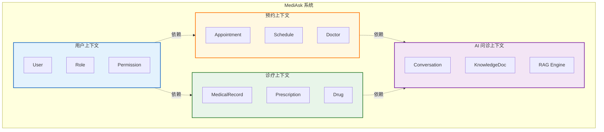
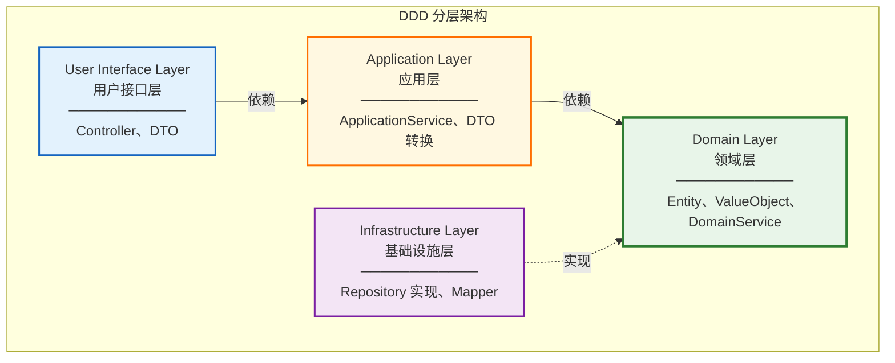

# DDD 领域驱动设计指南

> 本文档详细阐述如何在 MediAsk 智能医疗系统中应用 DDD 设计理念

## 1. DDD 核心概念

### 1.1 什么是 DDD

领域驱动设计（Domain-Driven Design）是一种软件开发方法论，强调：
- **以业务领域为核心**：代码结构反映业务模型
- **统一语言（Ubiquitous Language）**：开发人员与领域专家使用相同术语
- **边界上下文（Bounded Context）**：明确模块边界，避免概念混淆
- **分层架构**：职责清晰，依赖单向

### 1.2 为什么选择 DDD

**医疗业务特点**：
- 业务规则复杂（挂号规则、处方审核、医保结算）
- 领域知识密集（医学术语、诊疗流程）
- 强一致性要求（库存扣减、资金结算）
- 长期演化需求（政策变化、新业务接入）

**DDD 优势**：
- ✅ 业务逻辑内聚在领域层，易于理解和维护
- ✅ 通过聚合根保证数据一致性
- ✅ 清晰的分层架构支持技术栈替换
- ✅ 统一语言降低沟通成本

---

## 2. 战略设计：划分边界上下文

### 2.1 核心域识别

| 子域类型 | 领域名称 | 业务价值 | 技术复杂度 |
|---------|---------|---------|-----------|
| **核心域** | AI 智能问诊 | ⭐⭐⭐⭐⭐ | ⭐⭐⭐⭐⭐ |
| **核心域** | 挂号预约 | ⭐⭐⭐⭐⭐ | ⭐⭐⭐⭐ |
| **支撑域** | 医生排班 | ⭐⭐⭐⭐ | ⭐⭐⭐ |
| **支撑域** | 电子病历 | ⭐⭐⭐⭐ | ⭐⭐⭐⭐ |
| **通用域** | 用户认证 | ⭐⭐⭐ | ⭐⭐ |
| **通用域** | 消息通知 | ⭐⭐ | ⭐⭐ |

### 2.2 边界上下文划分



### 2.3 上下文映射关系

| 上下文 A | 关系 | 上下文 B | 集成方式 |
|---------|------|---------|---------|
| 预约上下文 | Upstream | 用户上下文 | REST API |
| 诊疗上下文 | Upstream | 预约上下文 | Domain Event |
| AI 问诊 | Customer | 诊疗上下文 | REST API |
| 所有上下文 | Conformist | 用户上下文 | Shared Kernel |

---

## 3. 战术设计：DDD 构造块

### 3.1 分层架构



**依赖规则**：
- ✅ 上层依赖下层
- ✅ 领域层独立，不依赖基础设施层
- ✅ 基础设施层实现领域层定义的接口（依赖倒置）

### 3.2 实体（Entity）

实体具有唯一标识，生命周期中属性可变。

**示例：挂号实体**

```java
package me.jianwen.mediask.appointment.domain.entity;

import lombok.Data;
import java.time.LocalDateTime;

/**
 * 挂号实体
 * 聚合根
 */
@Data
public class Appointment {
    
    /**
     * 唯一标识
     */
    private AppointmentId id;
    
    /**
     * 挂号单号（业务标识）
     */
    private AppointmentNo appointmentNo;
    
    /**
     * 患者 ID
     */
    private UserId patientId;
    
    /**
     * 医生排班
     */
    private ScheduleId scheduleId;
    
    /**
     * 挂号状态（值对象）
     */
    private AppointmentStatus status;
    
    /**
     * 挂号时间
     */
    private LocalDateTime appointmentTime;
    
    /**
     * 就诊序号
     */
    private VisitNumber visitNumber;
    
    /**
     * 领域事件集合
     */
    @Transient
    private List<DomainEvent> domainEvents = new ArrayList<>();
    
    // ============ 业务行为 ============
    
    /**
     * 创建挂号
     */
    public static Appointment create(UserId patientId, ScheduleId scheduleId) {
        Appointment appointment = new Appointment();
        appointment.setId(AppointmentId.generate());
        appointment.setAppointmentNo(AppointmentNo.generate());
        appointment.setPatientId(patientId);
        appointment.setScheduleId(scheduleId);
        appointment.setStatus(AppointmentStatus.PENDING);
        appointment.setAppointmentTime(LocalDateTime.now());
        
        // 发布领域事件
        appointment.addDomainEvent(new AppointmentCreatedEvent(appointment.getId()));
        
        return appointment;
    }
    
    /**
     * 支付挂号
     */
    public void pay() {
        if (!this.status.canPayment()) {
            throw new AppointmentException("当前状态不允许支付");
        }
        
        this.status = AppointmentStatus.CONFIRMED;
        this.addDomainEvent(new AppointmentPaidEvent(this.id));
    }
    
    /**
     * 取消挂号
     */
    public void cancel(String reason) {
        if (!this.status.canCancel()) {
            throw new AppointmentException("当前状态不允许取消");
        }
        
        this.status = AppointmentStatus.CANCELLED;
        this.addDomainEvent(new AppointmentCancelledEvent(this.id, reason));
    }
    
    /**
     * 开始就诊
     */
    public void startVisit() {
        if (!this.status.equals(AppointmentStatus.CONFIRMED)) {
            throw new AppointmentException("只有已确认的挂号才能就诊");
        }
        
        this.status = AppointmentStatus.VISITING;
        this.addDomainEvent(new AppointmentVisitStartedEvent(this.id));
    }
    
    /**
     * 完成就诊
     */
    public void completeVisit() {
        if (!this.status.equals(AppointmentStatus.VISITING)) {
            throw new AppointmentException("只有就诊中的挂号才能完成");
        }
        
        this.status = AppointmentStatus.COMPLETED;
        this.addDomainEvent(new AppointmentCompletedEvent(this.id));
    }
    
    /**
     * 添加领域事件
     */
    private void addDomainEvent(DomainEvent event) {
        this.domainEvents.add(event);
    }
    
    /**
     * 清除领域事件
     */
    public void clearDomainEvents() {
        this.domainEvents.clear();
    }
}
```

### 3.3 值对象（Value Object）

值对象无唯一标识，通过属性判断相等性，不可变。

**示例：挂号状态**

```java
package me.jianwen.mediask.appointment.domain.valueobject;

import lombok.Value;

/**
 * 挂号状态值对象
 */
@Value
public class AppointmentStatus {
    
    public static final AppointmentStatus PENDING = new AppointmentStatus("PENDING", "待支付");
    public static final AppointmentStatus CONFIRMED = new AppointmentStatus("CONFIRMED", "已确认");
    public static final AppointmentStatus CANCELLED = new AppointmentStatus("CANCELLED", "已取消");
    public static final AppointmentStatus VISITING = new AppointmentStatus("VISITING", "就诊中");
    public static final AppointmentStatus COMPLETED = new AppointmentStatus("COMPLETED", "已完成");
    
    String code;
    String description;
    
    /**
     * 是否可以支付
     */
    public boolean canPayment() {
        return this.equals(PENDING);
    }
    
    /**
     * 是否可以取消
     */
    public boolean canCancel() {
        return this.equals(PENDING) || this.equals(CONFIRMED);
    }
    
    /**
     * 从代码创建
     */
    public static AppointmentStatus fromCode(String code) {
        return switch (code) {
            case "PENDING" -> PENDING;
            case "CONFIRMED" -> CONFIRMED;
            case "CANCELLED" -> CANCELLED;
            case "VISITING" -> VISITING;
            case "COMPLETED" -> COMPLETED;
            default -> throw new IllegalArgumentException("Unknown status: " + code);
        };
    }
}
```

**示例：挂号单号**

```java
package me.jianwen.mediask.appointment.domain.valueobject;

import lombok.Value;
import java.time.LocalDateTime;
import java.time.format.DateTimeFormatter;
import java.util.concurrent.atomic.AtomicLong;

/**
 * 挂号单号值对象
 */
@Value
public class AppointmentNo {
    
    private static final AtomicLong sequence = new AtomicLong(0);
    private static final DateTimeFormatter formatter = DateTimeFormatter.ofPattern("yyyyMMdd");
    
    String value;
    
    /**
     * 生成挂号单号
     * 规则：APT + 日期(8位) + 序号(6位)
     */
    public static AppointmentNo generate() {
        String date = LocalDateTime.now().format(formatter);
        long seq = sequence.incrementAndGet() % 1000000;
        String value = String.format("APT%s%06d", date, seq);
        return new AppointmentNo(value);
    }
    
    /**
     * 从字符串创建
     */
    public static AppointmentNo of(String value) {
        if (!value.matches("^APT\\d{14}$")) {
            throw new IllegalArgumentException("Invalid appointment number format");
        }
        return new AppointmentNo(value);
    }
}
```

### 3.4 聚合（Aggregate）

聚合是一组相关对象的集合，通过聚合根保证一致性边界。

**示例：挂号聚合**

```java
/**
 * 挂号聚合
 * 
 * 聚合根：Appointment
 * 实体：-
 * 值对象：AppointmentStatus, AppointmentNo, VisitNumber
 * 
 * 一致性边界：
 * 1. 挂号状态流转必须符合业务规则
 * 2. 挂号单号全局唯一
 * 3. 就诊序号在同一排班内递增
 */
public class Appointment {
    // ... 如 3.2 所示
}
```

**聚合设计原则**：
1. ✅ **小聚合优于大聚合**：挂号不包含医生、患者详情，仅保存 ID
2. ✅ **通过 ID 引用其他聚合**：`UserId`、`ScheduleId` 而非完整对象
3. ✅ **在边界内保证一致性**：状态变更通过方法而非直接赋值
4. ✅ **最终一致性**：跨聚合通过领域事件实现

### 3.5 领域服务（Domain Service）

当业务逻辑不属于任何单个实体时，使用领域服务。

**示例：挂号规则服务**

```java
package me.jianwen.mediask.appointment.domain.service;

import org.springframework.stereotype.Service;

/**
 * 挂号规则领域服务
 */
@Service
public class AppointmentRuleService {
    
    /**
     * 检查是否可以挂号
     */
    public void checkCanAppointment(UserId patientId, DoctorSchedule schedule) {
        // 1. 检查排班是否有剩余号源
        if (schedule.getAvailableSlots() <= 0) {
            throw new AppointmentException("号源已满");
        }
        
        // 2. 检查是否在可挂号时间范围内
        if (!schedule.isInAppointmentPeriod()) {
            throw new AppointmentException("不在挂号时间范围内");
        }
        
        // 3. 检查患者是否重复挂号（同一医生同一天）
        if (appointmentRepository.existsByPatientAndSchedule(patientId, schedule.getId())) {
            throw new AppointmentException("您已挂过该医生的号");
        }
        
        // 4. 检查患者是否有未完成的挂号（防止占用号源）
        long pendingCount = appointmentRepository.countPendingByPatient(patientId);
        if (pendingCount >= 3) {
            throw new AppointmentException("您有超过3个未完成的挂号，请先处理");
        }
    }
    
    /**
     * 计算就诊序号
     */
    public VisitNumber calculateVisitNumber(ScheduleId scheduleId) {
        long count = appointmentRepository.countBySchedule(scheduleId);
        return VisitNumber.of((int) count + 1);
    }
}
```

### 3.6 仓储（Repository）

仓储提供聚合的持久化和查询接口，隐藏数据访问细节。

**领域层接口定义**：

```java
package me.jianwen.mediask.appointment.domain.repository;

/**
 * 挂号仓储接口（领域层定义）
 */
public interface AppointmentRepository {
    
    /**
     * 保存挂号
     */
    void save(Appointment appointment);
    
    /**
     * 根据 ID 查询
     */
    Optional<Appointment> findById(AppointmentId id);
    
    /**
     * 根据挂号单号查询
     */
    Optional<Appointment> findByAppointmentNo(AppointmentNo appointmentNo);
    
    /**
     * 检查是否存在
     */
    boolean existsByPatientAndSchedule(UserId patientId, ScheduleId scheduleId);
    
    /**
     * 统计患者待处理挂号数
     */
    long countPendingByPatient(UserId patientId);
    
    /**
     * 统计排班已挂号数
     */
    long countBySchedule(ScheduleId scheduleId);
    
    /**
     * 删除挂号
     */
    void remove(Appointment appointment);
}
```

**基础设施层实现**：

```java
package me.jianwen.mediask.appointment.infrastructure.repository;

import org.springframework.stereotype.Repository;

/**
 * 挂号仓储实现（基础设施层）
 */
@Repository
public class AppointmentRepositoryImpl implements AppointmentRepository {
    
    @Autowired
    private AppointmentMapper appointmentMapper;
    
    @Autowired
    private AppointmentConverter appointmentConverter;
    
    @Override
    public void save(Appointment appointment) {
        AppointmentDO appointmentDO = appointmentConverter.toDataObject(appointment);
        
        if (appointmentDO.getId() == null) {
            appointmentMapper.insert(appointmentDO);
        } else {
            appointmentMapper.updateById(appointmentDO);
        }
        
        // 回填 ID
        appointment.setId(AppointmentId.of(appointmentDO.getId()));
    }
    
    @Override
    public Optional<Appointment> findById(AppointmentId id) {
        AppointmentDO appointmentDO = appointmentMapper.selectById(id.getValue());
        if (appointmentDO == null) {
            return Optional.empty();
        }
        return Optional.of(appointmentConverter.toDomain(appointmentDO));
    }
    
    @Override
    public Optional<Appointment> findByAppointmentNo(AppointmentNo appointmentNo) {
        AppointmentDO appointmentDO = appointmentMapper.selectOne(
            new LambdaQueryWrapper<AppointmentDO>()
                .eq(AppointmentDO::getApptNo, appointmentNo.getValue())
        );
        if (appointmentDO == null) {
            return Optional.empty();
        }
        return Optional.of(appointmentConverter.toDomain(appointmentDO));
    }
    
    @Override
    public boolean existsByPatientAndSchedule(UserId patientId, ScheduleId scheduleId) {
        Long count = appointmentMapper.selectCount(
            new LambdaQueryWrapper<AppointmentDO>()
                .eq(AppointmentDO::getPatientId, patientId.getValue())
                .eq(AppointmentDO::getScheduleId, scheduleId.getValue())
        );
        return count > 0;
    }
    
    @Override
    public long countPendingByPatient(UserId patientId) {
        return appointmentMapper.selectCount(
            new LambdaQueryWrapper<AppointmentDO>()
                .eq(AppointmentDO::getPatientId, patientId.getValue())
                .in(AppointmentDO::getApptStatus, "PENDING", "CONFIRMED")
        );
    }
    
    @Override
    public long countBySchedule(ScheduleId scheduleId) {
        return appointmentMapper.selectCount(
            new LambdaQueryWrapper<AppointmentDO>()
                .eq(AppointmentDO::getScheduleId, scheduleId.getValue())
        );
    }
    
    @Override
    public void remove(Appointment appointment) {
        appointmentMapper.deleteById(appointment.getId().getValue());
    }
}
```

### 3.7 领域事件（Domain Event）

领域事件用于解耦聚合间的依赖，实现最终一致性。

**事件定义**：

```java
package me.jianwen.mediask.appointment.domain.event;

import lombok.Value;
import java.time.LocalDateTime;

/**
 * 挂号已支付事件
 */
@Value
public class AppointmentPaidEvent implements DomainEvent {
    
    AppointmentId appointmentId;
    LocalDateTime occurredOn;
    
    public AppointmentPaidEvent(AppointmentId appointmentId) {
        this.appointmentId = appointmentId;
        this.occurredOn = LocalDateTime.now();
    }
    
    @Override
    public LocalDateTime getOccurredOn() {
        return occurredOn;
    }
}
```

**事件发布**：

```java
package me.jianwen.mediask.appointment.application.service;

import org.springframework.stereotype.Service;
import org.springframework.transaction.annotation.Transactional;

/**
 * 挂号应用服务
 */
@Service
public class AppointmentApplicationService {
    
    @Autowired
    private AppointmentRepository appointmentRepository;
    
    @Autowired
    private DomainEventPublisher eventPublisher;
    
    @Transactional
    public void payAppointment(String appointmentNo) {
        // 1. 加载聚合
        Appointment appointment = appointmentRepository
            .findByAppointmentNo(AppointmentNo.of(appointmentNo))
            .orElseThrow(() -> new AppointmentNotFoundException());
        
        // 2. 执行业务逻辑
        appointment.pay();
        
        // 3. 保存聚合
        appointmentRepository.save(appointment);
        
        // 4. 发布领域事件
        appointment.getDomainEvents().forEach(eventPublisher::publish);
        appointment.clearDomainEvents();
    }
}
```

**事件监听**：

```java
package me.jianwen.mediask.notification.application.listener;

import org.springframework.context.event.EventListener;
import org.springframework.stereotype.Component;

/**
 * 挂号事件监听器
 */
@Component
public class AppointmentEventListener {
    
    @Autowired
    private NotificationService notificationService;
    
    @EventListener
    @Async
    public void handleAppointmentPaid(AppointmentPaidEvent event) {
        // 发送短信通知
        notificationService.sendSms(
            event.getAppointmentId(),
            "您的挂号已支付成功，请按时就诊"
        );
    }
    
    @EventListener
    @Async
    public void handleAppointmentCancelled(AppointmentCancelledEvent event) {
        // 发送退款通知
        notificationService.sendSms(
            event.getAppointmentId(),
            "您的挂号已取消，退款将在3个工作日内到账"
        );
    }
}
```

---

## 4. 完整示例：挂号业务

### 4.1 包结构

```
mediask-api/
└── src/main/java/me/jianwen/mediask/appointment/
    ├── interfaces/               # 用户接口层
    │   ├── controller/
    │   │   └── AppointmentController.java
    │   ├── dto/
    │   │   ├── ApptCreateDTO.java
    │   │   ├── ApptPayDTO.java
    │   │   └── ApptVO.java
    │   └── assembler/
    │       └── ApptAssembler.java
    ├── application/              # 应用层
    │   ├── service/
    │   │   └── AppointmentApplicationService.java
    │   └── listener/
    │       └── AppointmentEventListener.java
    ├── domain/                   # 领域层
    │   ├── entity/
    │   │   └── Appointment.java
    │   ├── valueobject/
    │   │   ├── AppointmentId.java
    │   │   ├── AppointmentNo.java
    │   │   ├── AppointmentStatus.java
    │   │   └── VisitNumber.java
    │   ├── service/
    │   │   └── AppointmentRuleService.java
    │   ├── repository/
    │   │   └── AppointmentRepository.java
    │   └── event/
    │       ├── AppointmentCreatedEvent.java
    │       ├── AppointmentPaidEvent.java
    │       └── AppointmentCancelledEvent.java
    └── infrastructure/           # 基础设施层
        ├── repository/
        │   └── AppointmentRepositoryImpl.java
        ├── converter/
        │   └── AppointmentConverter.java
        └── mapper/
            └── AppointmentMapper.java

mediask-dal/
└── src/main/java/me/jianwen/mediask/dal/
    └── dataobject/
        └── AppointmentDO.java
```

### 4.2 用户接口层

**Controller**：

```java
package me.jianwen.mediask.appointment.interfaces.controller;

import org.springframework.web.bind.annotation.*;
import javax.validation.Valid;

/**
 * 挂号控制器
 */
@RestController
@RequestMapping("/api/v1/appointments")
public class AppointmentController {
    
    @Autowired
    private AppointmentApplicationService appointmentService;
    
    @Autowired
    private ApptAssembler apptAssembler;
    
    /**
     * 创建挂号
     */
    @PostMapping
    public R<String> createAppointment(@Valid @RequestBody ApptCreateDTO dto) {
        String appointmentNo = appointmentService.createAppointment(
            apptAssembler.toCommand(dto)
        );
        return R.ok(appointmentNo);
    }
    
    /**
     * 支付挂号
     */
    @PostMapping("/{appointmentNo}/pay")
    public R<Void> payAppointment(@PathVariable String appointmentNo) {
        appointmentService.payAppointment(appointmentNo);
        return R.ok();
    }
    
    /**
     * 取消挂号
     */
    @PostMapping("/{appointmentNo}/cancel")
    public R<Void> cancelAppointment(
        @PathVariable String appointmentNo,
        @RequestBody ApptCancelDTO dto
    ) {
        appointmentService.cancelAppointment(appointmentNo, dto.getReason());
        return R.ok();
    }
    
    /**
     * 查询挂号详情
     */
    @GetMapping("/{appointmentNo}")
    public R<ApptVO> getAppointment(@PathVariable String appointmentNo) {
        Appointment appointment = appointmentService.getByAppointmentNo(appointmentNo);
        return R.ok(apptAssembler.toVO(appointment));
    }
}
```

### 4.3 应用层

**Application Service**：

```java
package me.jianwen.mediask.appointment.application.service;

import org.springframework.stereotype.Service;
import org.springframework.transaction.annotation.Transactional;

/**
 * 挂号应用服务
 * 职责：
 * 1. 协调多个聚合完成业务用例
 * 2. 管理事务边界
 * 3. 发布领域事件
 */
@Service
public class AppointmentApplicationService {
    
    @Autowired
    private AppointmentRepository appointmentRepository;
    
    @Autowired
    private DoctorScheduleRepository scheduleRepository;
    
    @Autowired
    private AppointmentRuleService ruleService;
    
    @Autowired
    private DomainEventPublisher eventPublisher;
    
    /**
     * 创建挂号
     */
    @Transactional
    public String createAppointment(CreateAppointmentCommand command) {
        // 1. 加载医生排班聚合
        DoctorSchedule schedule = scheduleRepository
            .findById(command.getScheduleId())
            .orElseThrow(() -> new ScheduleNotFoundException());
        
        // 2. 挂号规则校验（领域服务）
        ruleService.checkCanAppointment(command.getPatientId(), schedule);
        
        // 3. 创建挂号聚合
        Appointment appointment = Appointment.create(
            command.getPatientId(),
            command.getScheduleId()
        );
        
        // 4. 计算就诊序号
        VisitNumber visitNumber = ruleService.calculateVisitNumber(schedule.getId());
        appointment.setVisitNumber(visitNumber);
        
        // 5. 扣减号源（修改排班聚合）
        schedule.decreaseSlot();
        
        // 6. 保存聚合
        appointmentRepository.save(appointment);
        scheduleRepository.save(schedule);
        
        // 7. 发布领域事件
        publishEvents(appointment);
        publishEvents(schedule);
        
        return appointment.getAppointmentNo().getValue();
    }
    
    /**
     * 支付挂号
     */
    @Transactional
    public void payAppointment(String appointmentNo) {
        Appointment appointment = appointmentRepository
            .findByAppointmentNo(AppointmentNo.of(appointmentNo))
            .orElseThrow(() -> new AppointmentNotFoundException());
        
        appointment.pay();
        appointmentRepository.save(appointment);
        publishEvents(appointment);
    }
    
    /**
     * 取消挂号
     */
    @Transactional
    public void cancelAppointment(String appointmentNo, String reason) {
        Appointment appointment = appointmentRepository
            .findByAppointmentNo(AppointmentNo.of(appointmentNo))
            .orElseThrow(() -> new AppointmentNotFoundException());
        
        appointment.cancel(reason);
        
        // 归还号源
        DoctorSchedule schedule = scheduleRepository
            .findById(appointment.getScheduleId())
            .orElseThrow(() -> new ScheduleNotFoundException());
        schedule.increaseSlot();
        
        appointmentRepository.save(appointment);
        scheduleRepository.save(schedule);
        
        publishEvents(appointment);
        publishEvents(schedule);
    }
    
    /**
     * 发布领域事件
     */
    private void publishEvents(Object aggregate) {
        if (aggregate instanceof Appointment appointment) {
            appointment.getDomainEvents().forEach(eventPublisher::publish);
            appointment.clearDomainEvents();
        } else if (aggregate instanceof DoctorSchedule schedule) {
            schedule.getDomainEvents().forEach(eventPublisher::publish);
            schedule.clearDomainEvents();
        }
    }
}
```

### 4.4 领域层（已在 3.2-3.7 详细说明）

### 4.5 基础设施层

**DO 转换器**：

```java
package me.jianwen.mediask.appointment.infrastructure.converter;

import org.mapstruct.Mapper;

@Mapper(componentModel = "spring")
public interface AppointmentConverter {
    
    /**
     * 领域对象 -> 数据对象
     */
    default AppointmentDO toDataObject(Appointment appointment) {
        AppointmentDO appointmentDO = new AppointmentDO();
        appointmentDO.setId(appointment.getId() != null ? appointment.getId().getValue() : null);
        appointmentDO.setApptNo(appointment.getAppointmentNo().getValue());
        appointmentDO.setPatientId(appointment.getPatientId().getValue());
        appointmentDO.setScheduleId(appointment.getScheduleId().getValue());
        appointmentDO.setApptStatus(appointment.getStatus().getCode());
        appointmentDO.setApptTime(appointment.getAppointmentTime());
        appointmentDO.setVisitNumber(appointment.getVisitNumber().getValue());
        return appointmentDO;
    }
    
    /**
     * 数据对象 -> 领域对象
     */
    default Appointment toDomain(AppointmentDO appointmentDO) {
        Appointment appointment = new Appointment();
        appointment.setId(AppointmentId.of(appointmentDO.getId()));
        appointment.setAppointmentNo(AppointmentNo.of(appointmentDO.getApptNo()));
        appointment.setPatientId(UserId.of(appointmentDO.getPatientId()));
        appointment.setScheduleId(ScheduleId.of(appointmentDO.getScheduleId()));
        appointment.setStatus(AppointmentStatus.fromCode(appointmentDO.getApptStatus()));
        appointment.setAppointmentTime(appointmentDO.getApptTime());
        appointment.setVisitNumber(VisitNumber.of(appointmentDO.getVisitNumber()));
        return appointment;
    }
}
```

---

## 5. DDD 最佳实践

### 5.1 统一语言

| 业务术语 | 技术实现 | 说明 |
|---------|---------|------|
| 挂号 | Appointment | 患者预约医生的就诊记录 |
| 挂号单号 | AppointmentNo | 唯一业务标识 |
| 排班 | DoctorSchedule | 医生出诊时间安排 |
| 号源 | AvailableSlots | 可预约的挂号数量 |
| 就诊序号 | VisitNumber | 当天就诊的顺序号 |
| 挂号费 | AppointmentFee | 挂号需支付的金额 |

### 5.2 聚合设计清单

✅ **DO**：
- 识别真正的不变量（必须在事务内保证的约束）
- 聚合内部对象通过聚合根访问
- 聚合间通过 ID 引用，避免级联加载
- 使用领域事件解耦聚合

❌ **DON'T**：
- 聚合过大（包含太多实体）
- 跨聚合的事务（应使用最终一致性）
- 在聚合外部修改聚合内部状态
- 聚合间直接依赖对象引用

### 5.3 仓储设计清单

✅ **DO**：
- 接口在领域层定义
- 实现在基础设施层
- 只为聚合根提供仓储
- 使用领域对象而非 DO
- 提供领域查询方法

❌ **DON'T**：
- 仓储返回 DO 对象
- 在仓储中编写业务逻辑
- 为所有实体创建仓储
- 仓储方法过于细粒度

### 5.4 领域服务使用场景

**适合使用领域服务**：
- ✅ 业务规则涉及多个实体（挂号规则校验）
- ✅ 无法归属到某个实体（价格计算策略）
- ✅ 与外部系统交互的领域逻辑（库存检查）

**不适合使用领域服务**：
- ❌ 纯粹的 CRUD 操作（应用服务即可）
- ❌ 技术性操作（日志、缓存）
- ❌ 跨聚合协调（应用服务职责）

### 5.5 防腐层（Anti-Corruption Layer）

当对接外部系统时，使用防腐层保护领域模型。

**示例：对接医保支付**

```java
package me.jianwen.mediask.payment.infrastructure.adapter;

/**
 * 医保支付适配器（防腐层）
 */
@Component
public class HealthInsuranceAdapter {
    
    @Autowired
    private HealthInsuranceClient healthInsuranceClient;
    
    /**
     * 将领域对象转换为医保系统接口参数
     */
    public HealthInsuranceResult submit(Payment payment) {
        // 1. 领域模型 -> 外部系统模型
        HealthInsuranceRequest request = new HealthInsuranceRequest();
        request.setPatientIdCard(payment.getPatient().getIdCard());
        request.setAmount(payment.getAmount().getValue());
        request.setHospitalCode("H001");
        
        // 2. 调用外部接口
        HealthInsuranceResponse response = healthInsuranceClient.submit(request);
        
        // 3. 外部系统模型 -> 领域模型
        return new HealthInsuranceResult(
            response.getCode().equals("0000"),
            response.getMessage()
        );
    }
}
```

---

## 6. 常见问题

### Q1: 贫血模型 vs 充血模型？

**贫血模型**（Anti-Pattern）：
```java
// 实体只有 getter/setter
public class Appointment {
    private Long id;
    private String status;
    // 只有 getter/setter
}

// 业务逻辑在 Service
public class AppointmentService {
    public void pay(Long id) {
        Appointment appt = repository.findById(id);
        appt.setStatus("CONFIRMED"); // 直接修改属性
        repository.save(appt);
    }
}
```

**充血模型**（DDD 推荐）：
```java
// 实体包含业务行为
public class Appointment {
    private AppointmentStatus status;
    
    public void pay() {
        if (!this.status.canPayment()) {
            throw new AppointmentException("不能支付");
        }
        this.status = AppointmentStatus.CONFIRMED;
    }
}
```

### Q2: 何时使用领域事件？

**使用场景**：
- ✅ 解耦聚合间依赖
- ✅ 异步处理（发送通知、更新缓存）
- ✅ 记录审计日志
- ✅ 实现最终一致性

**不使用场景**：
- ❌ 同一聚合内部状态变更
- ❌ 同步强一致性要求（应用服务协调）

### Q3: MyBatis-Plus 如何适配 DDD？

1. **DO 与领域对象分离**：
   ```
   AppointmentDO (数据库表映射) ← Converter → Appointment (领域对象)
   ```

2. **仓储实现使用 Mapper**：
   ```java
   @Repository
   public class AppointmentRepositoryImpl implements AppointmentRepository {
       @Autowired
       private AppointmentMapper mapper; // MyBatis-Plus
       
       public void save(Appointment domain) {
           AppointmentDO dataObject = converter.toDO(domain);
           mapper.insert(dataObject);
       }
   }
   ```

3. **复杂查询仍用 XML**：
   ```xml
   <select id="selectPatientAppointments" resultType="ApptVO">
       SELECT a.*, d.doctor_name, dept.dept_name
       FROM appointments a
       LEFT JOIN doctors d ON a.doctor_id = d.id
       LEFT JOIN departments dept ON d.dept_id = dept.id
       WHERE a.patient_id = #{patientId}
   </select>
   ```

### Q4: 分层之间如何传递数据？

```
Controller ──(DTO)──> Application Service ──(Command)──> Domain
                                           <──(Domain Object)──
           <──(VO)──                      <──(Domain Object)──
```

- **DTO**：前端传参、接口返回
- **Command**：应用层命令对象
- **Domain Object**：领域对象
- **VO**：视图对象（查询结果）

---

## 7. 工具与框架

### 7.1 推荐工具

| 工具 | 用途 | 说明 |
|------|------|------|
| **ArchUnit** | 架构守护 | 强制分层依赖规则 |
| **MapStruct** | 对象转换 | DO/DTO/VO 互转 |
| **Spring Event** | 领域事件 | 进程内事件发布订阅 |
| **RocketMQ** | 跨服务事件 | 进程间事件消息 |
| **Lombok** | 减少样板代码 | @Value、@Data |

### 7.2 架构守护（ArchUnit）

```java
@AnalyzeClasses(packages = "me.jianwen.mediask")
public class ArchitectureTest {
    
    @ArchTest
    static final ArchRule domain_should_not_depend_on_infrastructure =
        classes()
            .that().resideInAPackage("..domain..")
            .should().onlyDependOnClassesThat()
            .resideInAnyPackage("..domain..", "java..");
    
    @ArchTest
    static final ArchRule repositories_should_be_interfaces =
        classes()
            .that().haveSimpleNameEndingWith("Repository")
            .and().resideInAPackage("..domain.repository..")
            .should().beInterfaces();
}
```

---

## 8. 总结

### DDD 核心价值

1. **业务为先**：代码反映业务逻辑，易于沟通
2. **高内聚低耦合**：聚合保证一致性，事件解耦依赖
3. **可演化性**：清晰的边界支持重构和扩展
4. **长期维护性**：统一语言降低认知负担

### 实施路径

1. **战略设计**：识别核心域、划分边界上下文
2. **战术设计**：设计实体、值对象、聚合、仓储
3. **编码实现**：按分层架构组织代码
4. **架构守护**：使用 ArchUnit 强制规则
5. **持续优化**：根据业务变化调整模型

### 学习资源

- 📖 《领域驱动设计》- Eric Evans
- 📖 《实现领域驱动设计》- Vaughn Vernon
- 🎥 [DDD 实战课](https://time.geekbang.org/column/intro/100037301)
- 🌐 [DDD Community](https://github.com/ddd-crew)

---

**关联文档**：
- [系统架构概览](./01-ARCHITECTURE_OVERVIEW.md)
- [代码规范与最佳实践](./02-CODE_STANDARDS.md)
- [数据库设计](../DATABASE_DESIGN.md)
