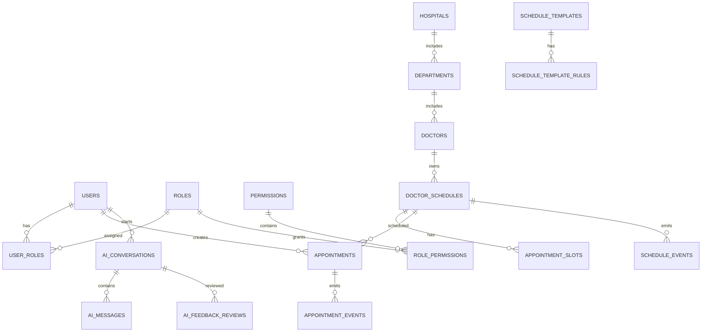

# 数据库设计（按当前代码）

> 本文档以 `mediask-dal/src/main/resources/sql/init-dev.sql` 为数据库结构事实来源。

## 1. 基本约定

- 数据库：MySQL 8
- 字符集：`utf8mb4` + `utf8mb4_unicode_ci`
- 主键：`BIGINT`（业务侧雪花 ID）
- 软删除：多数业务表包含 `deleted_at`
- 时间字段：`DATETIME`

## 2. 表结构总览（init-dev.sql 当前创建）



当前建表清单：

- `test_connections`
- `users`, `roles`, `permissions`, `user_roles`, `role_permissions`
- `hospitals`, `departments`, `doctors`
- `ai_conversations`, `ai_messages`, `ai_feedback_reviews`, `ai_metrics_daily`, `ai_metrics_dept_daily`
- `doctor_schedules`, `appointment_slots`, `appointments`
- `schedule_templates`, `schedule_template_rules`, `schedule_exceptions`
- `appointment_events`, `schedule_events`

## 3. 与 DAL 代码的边界说明

- `mediask-dal` 中存在更多 DO/Mapper（如 `medical_records`、`prescriptions`、`knowledge_documents` 等）。
- 这些表在当前 `init-dev.sql` 中尚未创建，属于后续扩展或未启用能力。
- 若要判定“可直接初始化并运行”的库表范围，请以 `init-dev.sql` 为准。

## 4. 初始化方式

```bash
# 在 MySQL 中执行初始化脚本
source mediask-dal/src/main/resources/sql/init-dev.sql
```

## 5. 索引与约束示例

- `appointments.uk_appt_no`：预约单号唯一
- `appointments.uk_patient_start`：患者同一时间段唯一约束
- `doctor_schedules.uk_doctor_date_period`：医生同日同时段唯一
- `users.uk_users_username`、`users.uk_users_phone`：登录标识唯一

## 6. 文档维护规则

- 修改 SQL 初始化脚本后，必须同步更新本文档的“建表清单”和“约束说明”。
- 不再使用手工维护的过期 DDL 片段，避免与代码漂移。
