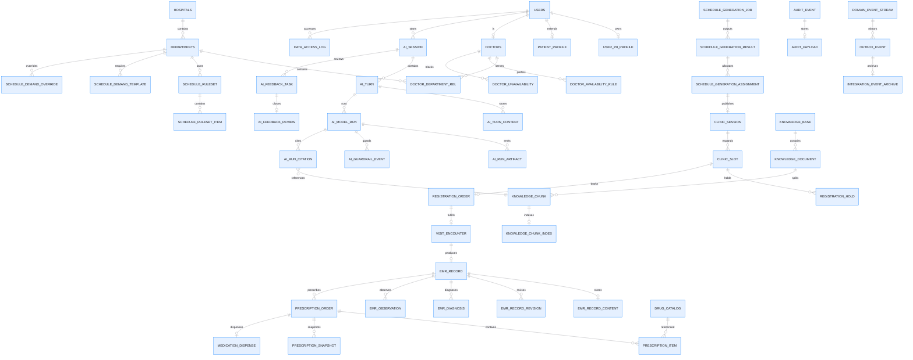

# 数据库设计（V3 — 重构版）

> 本文档为 V3 全量目标数据库设计说明；SQL 落地应与本文档保持同步。
> 当前仓库仍处于本地开发阶段，V3 设计按"无历史数据、允许破坏式更新"原则整体重建。
> 本文描述的是 V3 全量目标架构；毕业设计当前落地范围与实现优先级，以 `docs/07E-DATABASE-PRIORITY.md` 中的 `P0 / P1 / P2` 划分为准。
> RAG 数据库设计（检索投影层、引用追溯层）的完整方案，详见 `docs/20-RAG_DATABASE_PGVECTOR_DESIGN.md`。

## 0. 当前阶段怎么读本文

为避免把 58 张表误读成“当前必须全部实现的开发清单”，先冻结以下口径：

| 层级 | 当前要求 |
|------|----------|
| `P0` | AI/RAG、挂号接诊、病历处方、`audit_event`、`data_access_log`、最小权限相关表 |
| `P1` | `ai_feedback_*`、`ai_run_artifact`、`audit_payload`、轻量排班输入与生成结果 |
| `P2` | `domain_event_stream`、`outbox_event`、`integration_event_archive` 以及更重的排班治理 |

如果本文任一局部描述与 `docs/00A-P0-BASELINE.md`、`docs/07E-DATABASE-PRIORITY.md` 冲突，以这两份执行基线为准。

## 1. 设计目标与原则

- 建立唯一事实源，消除排班、库存、订单等关键状态的重复表达
- 将排班规划、门诊运营、挂号交易彻底分层
- 将高频索引字段与高敏正文内容分层存储
- 将业务事件、审计日志、数据访问日志三类记录彻底分开
- 将核心一致性下沉到数据库层，优先使用外键、唯一约束、检查约束
- 为后续支付、医保、发药、质控、归档、AI 独立服务化预留扩展位

## 2. 基本约定

- 数据库：PostgreSQL 17+（全系统统一，含 `pgvector` 扩展用于 RAG 向量检索）
- 同一实例内对审计与事件采用 schema 隔离：`audit` schema 放监管表，`event` schema 放领域事件与 Outbox；本文默认省略 schema 前缀
- 字符集：UTF-8（PostgreSQL 默认）
- 主键：`BIGINT`（业务侧雪花 ID）
- 时间字段：`TIMESTAMPTZ`
- 核心交易表包含 `version INT NOT NULL DEFAULT 0`
- 高敏正文默认独立分表，按列加密或应用层加密后存储
- 状态字段使用有限枚举（`VARCHAR` + CHECK 约束），不使用自由文本状态
- 核心跨表关系使用外键
- 金额字段统一使用 `NUMERIC(10,2)` 或更高精度
- 对需要逻辑删除的核心业务表统一预留 `deleted_at TIMESTAMPTZ DEFAULT NULL`
- 开发期不保留 V2 兼容表结构；初始化脚本会先清理 V2 旧表

## 3. SQL 文件组织

初始化脚本建议采用模块化方式，`init-dev.sql` 作为 orchestrator：

| 文件 | 职责 | 表数 |
|------|------|------|
| `00-drop-all.sql` | 清理 V3 与 V2 遗留表 | — |
| `01-base-auth.sql` | 认证、身份与数据权限 | 8 |
| `02-hospital-org.sql` | 医院组织与医生主档 | 4 |
| `03-scheduling.sql` | 排班规划域 | 10 |
| `04-appointment.sql` | 门诊运营与挂号交易 | 7 |
| `05-ai.sql` | AI 会话、模型运行与知识库 | 13 |
| `06-medical.sql` | 病历、诊断、处方、发药 | 10 |
| `07-domain-events.sql` | 创建 `audit` / `event` schema 下的审计、访问日志、业务事件、Outbox | 6 |
| `99-seed-data.sql` | 本地最小种子数据 | — |

**共计 58 张表。**

## 4. 核心专题文档

- `MediAskDocs/docs/07A-SCHEDULING-V3.md`：排班设计、发布门诊与挂号衔接专项说明
- `MediAskDocs/docs/07B-AI-AUDIT-V3.md`：AI、审计、访问监管与 Python AI 服务边界专项说明
- `MediAskDocs/docs/20-RAG_DATABASE_PGVECTOR_DESIGN.md`：PostgreSQL + pgvector 的 RAG 数据库设计（检索投影层、引用追溯层、混合检索）

## 5. 毕设最小闭环

围绕毕业设计主线，数据库当前优先支撑以下最小闭环：

1. 患者发起 AI 问诊，会话、轮次、原文与模型调用信息可落库追溯
2. 系统基于知识库完成 RAG 检索与生成，知识文档与 chunk 可管理
3. 患者根据 AI 结果进入挂号与接诊流程，形成 `clinic_session -> clinic_slot -> registration_order -> visit_encounter` 闭环
4. 医生完成病历、诊断、处方录入，形成 `emr_record -> emr_diagnosis -> prescription_order` 闭环
5. 敏感医疗数据受权限与数据范围约束，关键操作写 `audit_event`
6. 查看病历正文、AI 原文等敏感内容时写 `data_access_log`

上述链路对应的实现优先级，以 `docs/07E-DATABASE-PRIORITY.md` 中的 `P0` 为准；其余表结构按 `P1 / P2` 作为亮点增强或扩展设计保留。

## 6. V3 总体关系图



## 7. 表清单（按模块）

### 6.1 认证、身份与数据权限（01-base-auth.sql）

| 表名 | 说明 | V3 变化 |
|------|------|---------|
| `users` | 账号身份主表 | 重构：仅保留认证与账号状态 |
| `user_pii_profile` | 高敏身份资料 | 新增 |
| `patient_profile` | 患者业务档案 | 新增 |
| `roles` | 角色表 | 保留并继续支持继承 |
| `permissions` | 权限表 | 保留树形结构 |
| `user_roles` | 用户角色关联 | 保留有效期与授权来源 |
| `role_permissions` | 角色权限关联 | 保留 |
| `data_scope_rules` | 数据权限规则 | 保留 |

### 6.2 医院组织与医生主档（02-hospital-org.sql）

| 表名 | 说明 | V3 变化 |
|------|------|---------|
| `hospitals` | 医院表 | 保留 |
| `departments` | 科室表 | 增强：`dept_type` |
| `doctors` | 医生主档 | 重构：不再强绑单科室 |
| `doctor_department_rel` | 医生-科室关系 | 新增：支持多科室归属 |

### 6.3 排班规划域（03-scheduling.sql）

| 表名 | 说明 | V3 变化 |
|------|------|---------|
| `schedule_ruleset` | 规则集主表 | 新增 |
| `schedule_ruleset_item` | 规则项明细 | 新增 |
| `doctor_availability_rule` | 医生长期出诊偏好 | 重构 |
| `doctor_unavailability` | 医生禁排时间窗 | 重构 |
| `calendar_day` | 日历属性表 | 保留并增强 `day_type` |
| `schedule_demand_template` | 周期性需求模板 | 重构 |
| `schedule_demand_override` | 特定日期需求覆盖 | 新增 |
| `schedule_generation_job` | 排班生成任务 | 新增 |
| `schedule_generation_result` | 排班生成结果头 | 新增 |
| `schedule_generation_assignment` | 排班生成明细 | 新增 |

> 设计思想详见 `MediAskDocs/docs/07A-SCHEDULING-V3.md`。

### 6.4 门诊运营与挂号交易（04-appointment.sql）

| 表名 | 说明 | V3 变化 |
|------|------|---------|
| `clinic_session` | 正式发布的门诊场次 | 新增，替代 `doctor_schedules` |
| `clinic_slot` | 可交易号源单元 | 新增，替代 `appointment_slots` |
| `registration_hold` | 支付前锁号记录 | 新增 |
| `registration_order` | 挂号订单 | 新增，替代 `appointments` |
| `registration_status_log` | 订单状态流水 | 新增 |
| `slot_inventory_log` | 号源状态流水 | 新增 |
| `visit_encounter` | 实际就诊履约实体，挂号创建成功后预创建，初始状态为 `SCHEDULED` | 新增 |

### 6.5 AI 会话、模型运行与知识库（05-ai.sql）

| 表名 | 说明 | V3 变化 |
|------|------|---------|
| `ai_session` | AI 会话头 | 新增 |
| `ai_turn` | 会话轮次 | 新增 |
| `ai_turn_content` | 高敏原文内容 | 新增 |
| `ai_model_run` | 一次模型调用元数据 | 新增 |
| `ai_run_artifact` | 模型产物，如摘要、路由结果等通用 JSON 产物 | 新增 |
| `ai_guardrail_event` | 护栏命中记录 | 新增 |
| `ai_feedback_task` | 医生复核任务 | 新增 |
| `ai_feedback_review` | 复核结果 | 新增 |
| `knowledge_base` | 知识库主表 | 新增 |
| `knowledge_document` | 文档元数据 | 新增 |
| `knowledge_chunk` | 文档分块（业务主事实层） | 新增 |
| `knowledge_chunk_index` | 检索投影层：向量 + 分词 + 检索权重 | 新增（pgvector） |
| `ai_run_citation` | 引用追溯层：模型运行与 chunk 的强追溯桥 | 新增 |

> AI 与 Python 服务边界、审计分层设计详见 `MediAskDocs/docs/07B-AI-AUDIT-V3.md`。
> 检索投影层与引用追溯层的完整设计详见 `MediAskDocs/docs/20-RAG_DATABASE_PGVECTOR_DESIGN.md`。

### 6.6 病历、诊断、处方与发药（06-medical.sql）

| 表名 | 说明 | V3 变化 |
|------|------|---------|
| `drug_catalog` | 药品主数据 | 重构，替代 `drugs` |
| `emr_record` | 病历索引头 | 新增 |
| `emr_record_content` | 病历正文密文层 | 新增 |
| `emr_record_revision` | 病历修订链 | 新增 |
| `emr_diagnosis` | 结构化诊断 | 新增 |
| `emr_observation` | 检查/体征/观察项 | 新增 |
| `prescription_order` | 处方头 | 新增 |
| `prescription_item` | 处方项 | 新增 |
| `prescription_snapshot` | 处方不可变快照 | 新增 |
| `medication_dispense` | 发药记录 | 新增 |

### 6.7 审计、访问日志、业务事件与 Outbox（07-domain-events.sql）

| 表名 | 说明 | 当前优先级 | V3 变化 |
|------|------|------------|---------|
| `audit_event` | 审计头索引 | `P0` | 新增 |
| `audit_payload` | 审计高敏载荷 | `P1` | 新增 |
| `data_access_log` | 敏感数据访问日志 | `P0` | 新增 |
| `domain_event_stream` | 领域事件流 | `P2` | 新增 |
| `outbox_event` | 可靠事件投递 | `P2` | 新增 |
| `integration_event_archive` | 投递归档 | `P2` | 新增 |

> 物理部署口径：`audit_event`、`audit_payload`、`data_access_log` 落在 `audit` schema；`domain_event_stream`、`outbox_event`、`integration_event_archive` 落在 `event` schema。为方便阅读，本文默认省略 schema 前缀。
>
> 当前毕设主线只要求先做 `audit_event + data_access_log`；其余几张表保留为后续增强设计。

### 6.8 P1 阶段建议补强表

以下表不属于当前 58 张 V3 主表清单，但已确认为 P1 阶段优先补强项：

| 表名 | 说明 | 定位 |
|------|------|------|
| `notification` | 站内通知 | 挂号提醒、AI 复核任务提醒、叫号通知的最小闭环 |
| `sys_dict_type` | 字典类型 | 统一维护可下发到前端的字典类别 |
| `sys_dict_item` | 字典项 | 统一维护枚举值、显示标签与排序 |

## 8. 核心设计要点

### 7.1 排班与挂号边界

- `schedule_generation_assignment` 只是建议结果，不可直接挂号
- `clinic_session` 是正式门诊事实
- `clinic_slot` 是唯一库存事实源
- 挂号系统不依赖排班求解细节，只消费 `clinic_session` 与 `clinic_slot`

### 7.2 病历与处方分层

- `emr_record` 只承担检索与状态，不承载高敏正文
- 正文放在 `emr_record_content`
- 修订与签署链放在 `emr_record_revision`
- 诊断、观察项单独结构化，避免把业务语义塞进 JSON

### 7.3 AI 与 Python 服务边界

- Python AI 服务负责模型调用、RAG 检索、护栏、流式输出等 AI 能力
- Python 服务同时直接写入 PostgreSQL 的检索投影层（`knowledge_chunk_index`）和引用留痕层（`ai_run_citation`），详见 [20-RAG_DATABASE_PGVECTOR_DESIGN.md](./20-RAG_DATABASE_PGVECTOR_DESIGN.md)
- Java 主系统负责：
  - 业务身份与权限
  - AI 会话头、复核任务、知识库业务索引
  - 预创建 `ai_model_run` 供 Python 引用追溯
  - 模型调用的可追溯元数据沉淀
  - 审计、访问日志和监管闭环
- V3 的 AI 表设计遵循“原文、调用、护栏、复核、知识元数据”分层，并通过 `knowledge_chunk_index` 和 `ai_run_citation` 将检索与引用追溯纳入统一 PostgreSQL 事实模型

### 7.4 审计与事件分离

- `audit_event`：谁做了什么，便于检索，位于 `audit` schema，`P0` 必做
- `audit_payload`：高敏请求/前后值，独立密文层，位于 `audit` schema，`P1` 按需补充
- `data_access_log`：谁看了什么，面向合规监管，位于 `audit` schema，`P0` 必做
- `domain_event_stream`：纯业务事件流，位于 `event` schema，`P2` 保留设计
- `outbox_event`：对外集成可靠投递，位于 `event` schema，`P2` 保留设计
- 审计监管与事件投递在物理上做 schema 隔离，但仍共享同一 PostgreSQL 实例与事务边界

### 7.5 已确认修正项

- `clinic_slot.slot_seq` 的 CHECK 约束写为 `CHECK (slot_seq > 0)`（PostgreSQL 标准语法，无需反引号）
- `clinic_session` 仅保留 `(doctor_id, session_date, period_code)` 这一条唯一约束，避免与宽约束重复
- `registration_order.source_ai_session_id` 应补到 `ai_session.id` 的外键关系
- `users`、`patient_profile`、`doctors`、`ai_session`、`registration_order`、`emr_record`、`prescription_order` 等核心表统一采用 `deleted_at` 逻辑删除约定
- `registration_order`、`emr_record`、`audit_event` 需补医生工作台与审计查询所需索引
- `audit_event`、`data_access_log` 建议按 `occurred_at` 做月分区；审计表采用 append-only，归档与清理基于分区完成
- `notification`、`sys_dict_type`、`sys_dict_item` 作为 P1 基础设施表优先补齐

## 9. 关键索引与约束

### 8.1 关键唯一约束

| 表 | 约束 | 字段 |
|------|------|------|
| `users` | `uk_users_username` | `username` |
| `patient_profile` | `uk_patient_profile_no` | `patient_no` |
| `doctors` | `uk_doctors_code` | `doctor_code` |
| `schedule_ruleset` | `uk_schedule_ruleset_code_version` | `(department_id, ruleset_code, version_no)` |
| `schedule_generation_result` | `uk_schedule_generation_result_no` | `(job_id, result_no)` |
| `schedule_generation_result` | `uk_schedule_generation_result_selected` | `selected_job_id` |
| `schedule_generation_result` | `uk_schedule_generation_result_published` | `published_job_id` |
| `schedule_generation_assignment` | `uk_schedule_generation_assignment` | `(result_id, doctor_id, department_id, schedule_date, period_code, clinic_type)` |
| `schedule_generation_assignment` | `uk_schedule_generation_assignment_doctor_period` | `(result_id, doctor_id, schedule_date, period_code)` |
| `clinic_session` | `uk_clinic_session_doctor_period` | `(doctor_id, session_date, period_code)` |
| `clinic_slot` | `uk_clinic_slot_seq` | `(session_id, slot_seq)` |
| `registration_order` | `uk_registration_order_no` | `order_no` |
| `visit_encounter` | `uk_visit_encounter_order` | `order_id` |
| `ai_session` | `uk_ai_session_uuid` | `session_uuid` |
| `ai_turn` | `uk_ai_turn_session_no` | `(session_id, turn_no)` |
| `ai_feedback_review` | `uk_ai_feedback_review_task` | `task_id` |
| `knowledge_document` | `uk_knowledge_document_uuid` | `document_uuid` |
| `knowledge_chunk` | `uk_knowledge_chunk_doc_idx` | `(document_id, chunk_index)` |
| `emr_record` | `uk_emr_record_no` | `record_no` |
| `emr_record` | `uk_emr_record_encounter` | `encounter_id` |
| `emr_record_revision` | `uk_emr_record_revision_no` | `(record_id, revision_no)` |
| `prescription_order` | `uk_prescription_order_no` | `prescription_no` |
| `medication_dispense` | `uk_medication_dispense_prescription` | `prescription_id` |
| `domain_event_stream` | `uk_domain_event_stream_key` | `event_key` |
| `outbox_event` | `uk_outbox_event_key` | `event_key` |

### 8.2 关键外键原则

V3 相比 V2 的重要变化，是把核心链路的一致性下沉到数据库层。重点外键包括：

- `doctor_department_rel.doctor_id -> doctors.id`
- `doctor_department_rel.department_id -> departments.id`
- `schedule_ruleset.department_id -> departments.id`
- `schedule_generation_job.ruleset_id -> schedule_ruleset.id`
- `schedule_generation_result.job_id -> schedule_generation_job.id`
- `schedule_generation_assignment.result_id -> schedule_generation_result.id`
- `clinic_session.source_assignment_id -> schedule_generation_assignment.id`
- `clinic_slot.session_id -> clinic_session.id`
- `registration_order.(slot_id, session_id) -> clinic_slot.(id, session_id)`
- `registration_hold.slot_id -> clinic_slot.id`
- `registration_order.session_id -> clinic_session.id`
- `registration_order.(session_id, doctor_id, department_id) -> clinic_session.(id, doctor_id, department_id)`
- `registration_order.slot_id -> clinic_slot.id`
- `registration_order.source_ai_session_id -> ai_session.id`
- `visit_encounter.order_id -> registration_order.id`
- `visit_encounter.(order_id, patient_id, doctor_id, department_id) -> registration_order.(id, patient_id, doctor_id, department_id)`
- `emr_record.encounter_id -> visit_encounter.id`
- `emr_record.(encounter_id, patient_id, doctor_id, department_id) -> visit_encounter.(id, patient_id, doctor_id, department_id)`
- `prescription_order.record_id -> emr_record.id`
- `prescription_order.(record_id, patient_id, doctor_id) -> emr_record.(id, patient_id, doctor_id)`
- `prescription_item.prescription_id -> prescription_order.id`
- `ai_turn.session_id -> ai_session.id`
- `ai_model_run.turn_id -> ai_turn.id`
- `ai_guardrail_event.run_id -> ai_model_run.id`
- `audit_payload.audit_event_id -> audit_event.id`
- `outbox_event.domain_event_id -> domain_event_stream.id`
- `knowledge_chunk_index.chunk_id -> knowledge_chunk.id`
- `ai_run_citation.model_run_id -> ai_model_run.id`
- `ai_run_citation.chunk_id -> knowledge_chunk.id`

### 8.3 关键检查约束

- `weekday` 只能为 `1..7`
- `period_code` 只能为 `1..3`
- `start_time < end_time`
- `slot_start_time < slot_end_time`
- `slot_seq > 0`
- 金额字段必须 `>= 0`
- `remaining_count <= capacity`
- 订单、场次、号源、病历、AI、审计的状态字段都限定在有限枚举集合内

### 8.4 P0 / P1 关键查询索引

- `registration_order`：`idx_registration_order_doctor (doctor_id, created_at)`
- `emr_record`：`idx_emr_record_doctor (doctor_id, created_at)`
- `audit_event`：`idx_audit_event_action (action_code, occurred_at)`
- `data_access_log`：`idx_data_access_log_resource (resource_type, resource_id, occurred_at)`
- `notification`：`idx_notification_user (user_id, is_read, created_at)`
- `sys_dict_item`：`uk_sys_dict_item (type_id, item_value)`

## 10. V2 -> V3 重构摘要

### 9.1 删除/替换的核心 V2 表

- `doctor_schedules` -> `clinic_session`
- `appointment_slots` -> `clinic_slot`
- `appointments` -> `registration_hold + registration_order + visit_encounter`
- `schedule_plan / schedule_plan_items / schedule_rule_profile` -> `schedule_ruleset + schedule_generation_job/result/assignment`
- `ai_conversations / ai_messages / ai_feedback_reviews` -> `ai_session + ai_turn + ai_model_run + ai_guardrail_event + ai_feedback_task/review`
- `medical_records / medical_record_versions` -> `emr_record + emr_record_content + emr_record_revision`
- `audit_logs / domain_events` -> `audit_event + audit_payload + data_access_log + domain_event_stream + outbox_event`

### 9.2 V3 重构重点

- 排班规划、门诊运营、挂号交易彻底拆分
- 病历正文与病历索引分层
- AI 原文、调用元数据、护栏、复核拆表
- 审计日志、访问日志、业务事件彻底分离
- 通过外键和检查约束把一致性下沉到数据库层

## 11. 初始化方式

```bash
# 方式1：一键初始化（示例路径，按重写后的 SQL 目录调整）
psql -U postgres -d mediask_dev -f sql/init-dev.sql

# 方式2：在 psql 交互模式中执行
mediask_dev=# \i sql/init-dev.sql

# 方式3：按需执行单个模块
mediask_dev=# \i sql/00-drop-all.sql
mediask_dev=# \i sql/01-base-auth.sql
# ... 按需继续

# 方式4：启用 pgvector 扩展（首次初始化时）
mediask_dev=# CREATE EXTENSION IF NOT EXISTS vector;
```

## 12. 文档维护规则

- 修改任何 SQL 子文件后，必须同步更新本文档对应模块描述
- 新增表时更新「SQL 文件组织」「ER 图」「表清单」「关键约束」至少四处
- 删除表时同步更新 `00-drop-all.sql` 与「V2 -> V3 重构摘要」
- 排班与 AI/审计这两个专题发生较大设计变化时，必须同步更新：
  - `MediAskDocs/docs/07A-SCHEDULING-V3.md`
  - `MediAskDocs/docs/07B-AI-AUDIT-V3.md`
