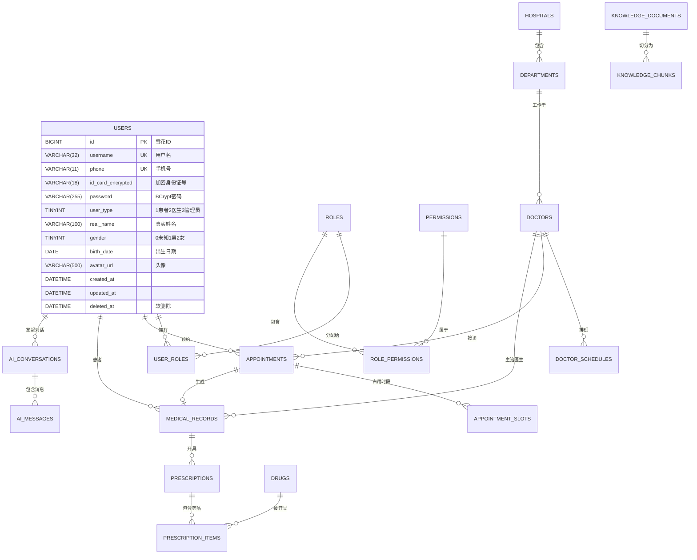

# 数据库设计文档

## 1. 数据库选型与规范

### 1.1 基础规范
- **数据库**: MySQL 8.0.33+
- **字符集**: `utf8mb4` + `utf8mb4_unicode_ci`
- **存储引擎**: InnoDB
- **主键策略**: 使用雪花算法生成 `BIGINT` 类型 ID
- **时间字段**: 统一使用 `DATETIME` 类型，精度到秒
- **软删除**: 所有业务表必须包含 `deleted_at` 字段（医疗数据合规要求）

### 1.2 命名规范
- **表名**: 小写 + 下划线分隔，复数形式（如 `users`, `appointments`）
- **字段名**: 小写 + 下划线，布尔类型以 `is_` 开头
- **索引命名**:
  - 普通索引: `idx_字段名`
  - 唯一索引: `uk_字段名`
  - 外键索引: `fk_当前表_关联表`

---

## 2. 实体关系图 (ER Diagram)



---

## 3. 核心表结构 DDL

### 3.1 用户权限域

```sql
CREATE TABLE `users` (
  `id` BIGINT NOT NULL COMMENT '雪花ID',
  `username` VARCHAR(32) NOT NULL COMMENT '用户名',
  `phone` VARCHAR(11) NOT NULL COMMENT '手机号',
  `password` VARCHAR(255) NOT NULL COMMENT 'BCrypt加密密码',
  `user_type` TINYINT NOT NULL COMMENT '用户类型:1患者2医生3管理员',
  `real_name` VARCHAR(100) DEFAULT NULL COMMENT '真实姓名',
  `gender` TINYINT DEFAULT 0 COMMENT '性别:0未知1男2女',
  `birth_date` DATE DEFAULT NULL COMMENT '出生日期',
  `avatar_url` VARCHAR(500) DEFAULT NULL COMMENT '头像URL',
  `created_at` DATETIME NOT NULL DEFAULT CURRENT_TIMESTAMP,
  `updated_at` DATETIME NOT NULL DEFAULT CURRENT_TIMESTAMP ON UPDATE CURRENT_TIMESTAMP,
  `deleted_at` DATETIME DEFAULT NULL COMMENT '软删除时间',
  PRIMARY KEY (`id`),
  UNIQUE KEY `uk_username` (`username`),
  UNIQUE KEY `uk_phone` (`phone`),
  KEY `idx_user_type` (`user_type`)
) ENGINE=InnoDB DEFAULT CHARSET=utf8mb4 COLLATE=utf8mb4_unicode_ci COMMENT='用户表';
```

### 3.2 挂号预约域

```sql
CREATE TABLE `appointments` (
  `id` BIGINT NOT NULL,
  `appt_no` VARCHAR(32) NOT NULL COMMENT '预约单号',
  `patient_id` BIGINT NOT NULL,
  `doctor_id` BIGINT NOT NULL,
  `schedule_id` BIGINT NOT NULL,
  `appt_date` DATE NOT NULL,
  `time_period` TINYINT NOT NULL,
  `appt_time` TIME DEFAULT NULL,
  `appt_status` TINYINT NOT NULL DEFAULT 1 COMMENT '1待支付2已预约3已就诊4已取消5爽约',
  `chief_complaint` VARCHAR(500) DEFAULT NULL COMMENT 'AI生成主诉',
  `appt_fee` DECIMAL(10,2) DEFAULT 0.00,
  `paid_at` DATETIME DEFAULT NULL,
  `created_at` DATETIME NOT NULL DEFAULT CURRENT_TIMESTAMP,
  `updated_at` DATETIME NOT NULL DEFAULT CURRENT_TIMESTAMP ON UPDATE CURRENT_TIMESTAMP,
  `deleted_at` DATETIME DEFAULT NULL,
  PRIMARY KEY (`id`),
  UNIQUE KEY `uk_appt_no` (`appt_no`),
  KEY `idx_patient_id` (`patient_id`),
  KEY `idx_doctor_schedule` (`doctor_id`, `appt_date`)
) ENGINE=InnoDB DEFAULT CHARSET=utf8mb4 COLLATE=utf8mb4_unicode_ci COMMENT='挂号预约表';
```

### 3.3 电子病历域

```sql
CREATE TABLE `medical_records` (
  `id` BIGINT NOT NULL,
  `record_no` VARCHAR(32) NOT NULL COMMENT '病历号',
  `patient_id` BIGINT NOT NULL,
  `doctor_id` BIGINT NOT NULL,
  `appt_id` BIGINT DEFAULT NULL,
  `chief_complaint` TEXT COMMENT '主诉',
  `present_illness` TEXT COMMENT '现病史',
  `past_history` TEXT COMMENT '既往史',
  `physical_exam` TEXT COMMENT '体格检查',
  `diagnosis` TEXT COMMENT '诊断JSON数组',
  `treatment_plan` TEXT COMMENT '治疗方案',
  `record_status` TINYINT NOT NULL DEFAULT 1 COMMENT '1草稿2已提交3已归档',
  `version` INT NOT NULL DEFAULT 1 COMMENT '版本号',
  `created_at` DATETIME NOT NULL DEFAULT CURRENT_TIMESTAMP,
  `updated_at` DATETIME NOT NULL DEFAULT CURRENT_TIMESTAMP ON UPDATE CURRENT_TIMESTAMP,
  `deleted_at` DATETIME DEFAULT NULL,
  PRIMARY KEY (`id`),
  UNIQUE KEY `uk_record_no` (`record_no`),
  KEY `idx_patient_id` (`patient_id`),
  KEY `idx_doctor_id` (`doctor_id`)
) ENGINE=InnoDB DEFAULT CHARSET=utf8mb4 COLLATE=utf8mb4_unicode_ci COMMENT='电子病历表';
```

---

## 4. 索引策略

| 表名 | 索引 | 说明 |
|------|------|------|
| `appointments` | `idx_doctor_schedule` | 医生当日挂号列表 |
| `appointments` | `idx_patient_id` | 患者历史挂号 |
| `doctor_schedules` | `uk_doctor_date_period` | 防止重复排班 |
| `medical_records` | `idx_patient_id` | 患者病历历史 |

---

## 5. Redis 缓存方案

| 缓存Key | 数据 | 过期时间 |
|---------|------|----------|
| `schedule:doctor:{id}:{date}` | 医生排班JSON | 1天 |
| `slots:schedule:{id}` | 号源池Bitmap | 1天 |
| `drug:code:{code}` | 药品信息 | 永久 |

---

## 6. 初始化数据

```sql
-- 插入默认角色
INSERT INTO `roles` (`id`, `role_code`, `role_name`, `description`) VALUES
(1, 'PATIENT', '患者', '普通患者角色'),
(2, 'DOCTOR', '医生', '医生角色'),
(3, 'ADMIN', '管理员', '系统管理员');
```
