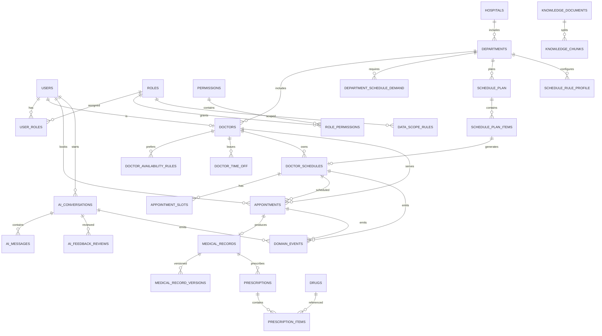

# 数据库设计（V2 — 完整重构版）

> 本文档以 `mediask-dal/src/main/resources/sql/` 目录下的 SQL 文件为数据库结构事实来源。

## 1. 基本约定

- 数据库：MySQL 8
- 字符集：`utf8mb4` + `utf8mb4_unicode_ci`
- 引擎：InnoDB
- 主键：`BIGINT`（业务侧雪花 ID）
- 软删除：业务表包含 `deleted_at DATETIME DEFAULT NULL`
- 时间字段：`DATETIME`（`created_at` / `updated_at` / `deleted_at`）
- 乐观锁：并发写入表使用 `version INT NOT NULL DEFAULT 0`

## 2. SQL 文件组织

初始化脚本已拆分为模块化子文件，`init-dev.sql` 作为 orchestrator 按序 SOURCE：

| 文件 | 职责 | 表数 |
|------|------|------|
| `00-drop-all.sql` | 清除所有表（含旧表兼容清理） | — |
| `01-base-auth.sql` | 认证、授权与审计 | 8 |
| `02-hospital-org.sql` | 医院组织与医生档案 | 3 |
| `03-scheduling.sql` | 排班管理 | 9 |
| `04-appointment.sql` | 预约挂号 | 1 |
| `05-ai.sql` | AI 问诊会话与知识库 | 5 |
| `06-medical.sql` | 病历与处方 | 5 |
| `07-domain-events.sql` | 统一领域事件 | 1 |
| `99-seed-data.sql` | 开发环境测试数据 | — |

**共计 32 张表。**

## 3. ER 关系图



## 4. 表清单（按模块）

### 4.1 认证与授权（01-base-auth.sql）

| 表名 | 说明 | 变更 |
|------|------|------|
| `test_connections` | 连接测试表 | 不变 |
| `users` | 用户表 | 不变 |
| `roles` | 角色表 | **增强**：+parent_id, level, is_system |
| `permissions` | 权限表 | **增强**：+parent_id, perm_type, path, method, sort_order, icon（树形结构） |
| `user_roles` | 用户角色关联 | **增强**：+valid_from, valid_until, grant_reason, grantor_id |
| `role_permissions` | 角色权限关联 | 不变 |
| `data_scope_rules` | 数据权限规则 | **新增** |
| `audit_logs` | 审计日志 | **新增** |

### 4.2 医院组织（02-hospital-org.sql）

| 表名 | 说明 | 变更 |
|------|------|------|
| `hospitals` | 医院表 | 不变 |
| `departments` | 科室表 | 不变 |
| `doctors` | 医生档案表 | 不变 |

### 4.3 排班管理（03-scheduling.sql）

| 表名 | 说明 | 变更 |
|------|------|------|
| `doctor_availability_rules` | 医生可排班规则 | 不变 |
| `doctor_time_off` | 医生请假/停诊 | **增强**：+off_type（LEAVE/CLOSE/SWAP），吸收原 schedule_exceptions |
| `department_schedule_demand` | 科室排班需求 | **重构**：从按日需求改为周模板（weekday 替代 demand_date） |
| `calendar_day` | 法定节假日日历 | 不变 |
| `doctor_schedules` | 医生排班表 | **增强**：source_type/source_id → plan_item_id 精确关联 |
| `appointment_slots` | 号源时段表 | 不变 |
| `schedule_plan` | 排班方案主表 | **增强**：内联 6 个 JSON 快照字段 + conflict_report |
| `schedule_plan_items` | 排班方案明细 | 不变 |
| `schedule_rule_profile` | 排班规则配置版本表 | 不变 |

**已删除**：`schedule_templates`、`schedule_template_rules`、`schedule_exceptions`、`schedule_plan_constraint_snapshot`

### 4.4 预约挂号（04-appointment.sql）

| 表名 | 说明 | 变更 |
|------|------|------|
| `appointments` | 预约挂号表 | **增强**：+conversation_id 关联 AI 问诊会话 |

### 4.5 AI 问诊（05-ai.sql）

| 表名 | 说明 | 变更 |
|------|------|------|
| `ai_conversations` | AI 会话表 | **增强**：+dept_id, chief_complaint, model, total_tokens |
| `ai_messages` | AI 消息表 | **增强**：+citations_json, trace_id, risk_level, model, latency_ms, is_degraded, guardrail_action, matched_rules |
| `ai_feedback_reviews` | AI 复核记录表 | **增强**：+message_id, feedback_type, correction_content；-department_id（冗余） |
| `knowledge_documents` | 知识文档表 | **新增**（RAG 入库元数据） |
| `knowledge_chunks` | 知识分块表 | **新增**（RAG 分块文本 + Milvus 向量关联） |

**已删除**：`ai_metrics_daily`、`ai_metrics_dept_daily`（改为从明细表实时聚合）

### 4.6 病历与处方（06-medical.sql）

| 表名 | 说明 | 变更 |
|------|------|------|
| `medical_records` | 病历表 | **新增** |
| `medical_record_versions` | 病历版本表 | **新增**（审计追溯） |
| `drugs` | 药品字典表 | **新增** |
| `prescriptions` | 处方表 | **新增** |
| `prescription_items` | 处方明细表 | **新增** |

### 4.7 领域事件（07-domain-events.sql）

| 表名 | 说明 | 变更 |
|------|------|------|
| `domain_events` | 统一领域事件表 | **新增**（合并原 appointment_events + schedule_events） |

**已删除**：`appointment_events`、`schedule_events`

## 5. 关键索引与约束

### 唯一约束

| 表 | 约束名 | 字段 |
|------|------|------|
| `users` | `uk_users_username` | `username` |
| `users` | `uk_users_phone` | `phone` |
| `roles` | `uk_roles_code` | `role_code` |
| `permissions` | `uk_permissions_code` | `perm_code` |
| `user_roles` | `uk_user_role` | `(user_id, role_id)` |
| `role_permissions` | `uk_role_permission` | `(role_id, permission_id)` |
| `data_scope_rules` | `uk_role_resource` | `(role_id, resource_type)` |
| `hospitals` | `uk_hospital_code` | `hospital_code` |
| `departments` | `uk_hospital_dept_code` | `(hospital_id, dept_code)` |
| `doctors` | `uk_doctor_user` | `user_id` |
| `doctors` | `uk_doctor_code` | `doctor_code` |
| `doctor_availability_rules` | `uk_doc_weekday_period` | `(doctor_id, weekday, period_code)` |
| `department_schedule_demand` | `uk_dept_demand_weekday_period` | `(department_id, weekday, period_code)` |
| `calendar_day` | `uk_calendar_day_region` | `(calendar_date, region_code)` |
| `doctor_schedules` | `uk_doctor_date_period` | `(doctor_id, schedule_date, time_period)` |
| `appointment_slots` | `uk_schedule_slot` | `(schedule_id, slot_time)` |
| `schedule_plan` | `uk_schedule_plan_code_ver` | `(plan_code, version_no)` |
| `schedule_plan_items` | `uk_plan_slot_doctor` | `(plan_id, schedule_date, period_code, doctor_id)` |
| `schedule_rule_profile` | `uk_rule_profile_code_ver` | `(department_id, profile_code, version_no)` |
| `appointments` | `uk_appt_no` | `appt_no` |
| `appointments` | `uk_patient_start` | `(patient_id, appt_date, appt_time)` |
| `ai_conversations` | `uk_conversation_uuid` | `conversation_uuid` |
| `knowledge_documents` | `uk_doc_uuid` | `doc_uuid` |
| `knowledge_chunks` | `uk_doc_chunk` | `(document_id, chunk_index)` |
| `medical_records` | `uk_record_no` | `record_no` |
| `medical_record_versions` | `uk_record_version` | `(record_id, version_no)` |
| `drugs` | `uk_drug_code` | `drug_code` |
| `prescriptions` | `uk_prescription_no` | `prescription_no` |

## 6. V1 → V2 变更摘要

### 删除的表（8张）
- `schedule_templates` — 与 `doctor_availability_rules` 功能重叠
- `schedule_template_rules` — 同上
- `schedule_exceptions` — 合并入 `doctor_time_off`（新增 off_type）
- `schedule_plan_constraint_snapshot` — 内联入 `schedule_plan` 的 JSON 字段
- `ai_metrics_daily` — 论文规模数据量不需要预聚合，改为实时查询
- `ai_metrics_dept_daily` — 同上
- `appointment_events` — 合并入 `domain_events`
- `schedule_events` — 合并入 `domain_events`

### 新增的表（10张）
- `data_scope_rules` — 数据权限规则
- `audit_logs` — 审计日志
- `knowledge_documents` — RAG 知识文档
- `knowledge_chunks` — RAG 知识分块
- `medical_records` — 病历
- `medical_record_versions` — 病历版本
- `drugs` — 药品字典
- `prescriptions` — 处方
- `prescription_items` — 处方明细
- `domain_events` — 统一领域事件

### 增强的表（9张）
- `roles` — +parent_id, level, is_system
- `permissions` — +parent_id, perm_type, path, method, sort_order, icon
- `user_roles` — +valid_from, valid_until, grant_reason, grantor_id
- `doctor_time_off` — +off_type
- `department_schedule_demand` — demand_date → weekday（周模板模式）
- `doctor_schedules` — source_type/source_id → plan_item_id
- `schedule_plan` — 内联快照 JSON 字段（6个快照 + conflict_report）
- `ai_conversations` — +dept_id, chief_complaint, model, total_tokens
- `ai_messages` — +citations_json, trace_id, risk_level, model, latency_ms, is_degraded, guardrail_action, matched_rules
- `ai_feedback_reviews` — +message_id, feedback_type, correction_content, -department_id
- `appointments` — +conversation_id

## 7. 初始化方式

```bash
# 方式1：一键初始化（从项目根目录执行 MySQL）
mysql -u root -p mediask_dev < mediask-dal/src/main/resources/sql/init-dev.sql

# 方式2：在 MySQL 交互模式中执行
mysql> source mediask-dal/src/main/resources/sql/init-dev.sql

# 方式3：按需执行单个模块
mysql> source mediask-dal/src/main/resources/sql/00-drop-all.sql
mysql> source mediask-dal/src/main/resources/sql/01-base-auth.sql
# ... 按需继续
```

## 8. 文档维护规则

- 修改任何 SQL 子文件后，必须同步更新本文档的对应模块描述。
- 新增表时更新「表清单」「ER 图」「唯一约束」三处。
- 删除表时更新 `00-drop-all.sql` 和本文档的变更摘要。
