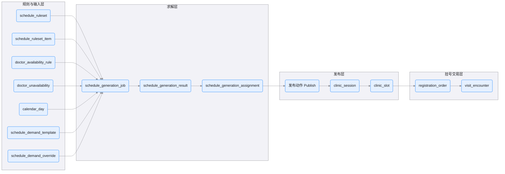
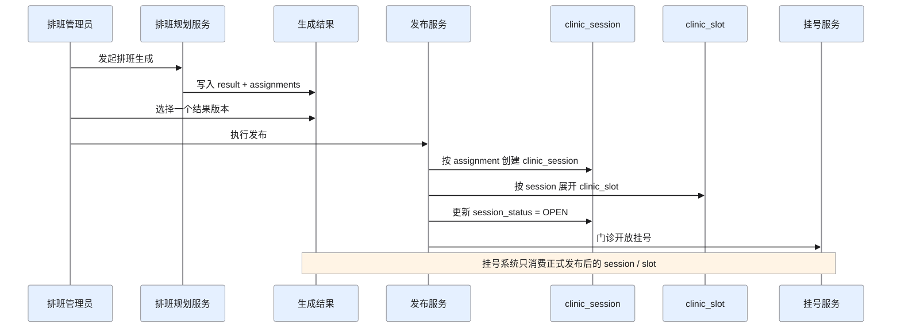
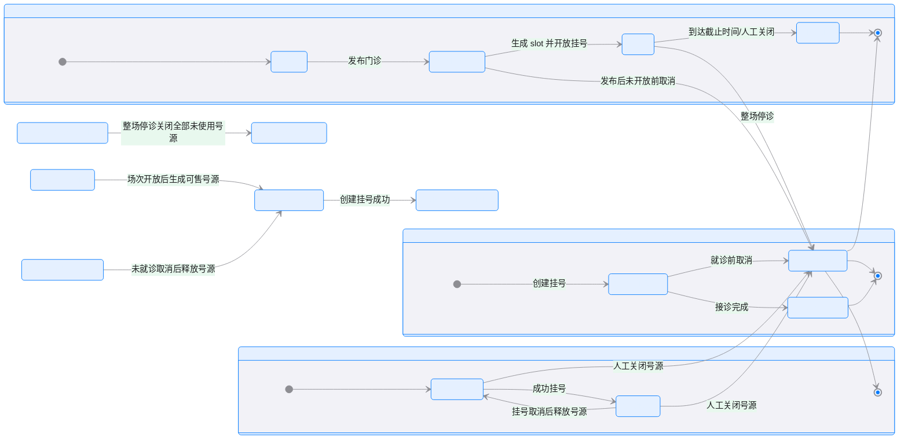

# 排班设计（V3 全量设计 + 当前阶段读法）

> 本文聚焦 V3 中的排班规划域，以及它如何与门诊运营域、挂号交易域衔接。
>
> 核心目标不是“把医生排出来”这么简单，而是把“规划建议”和“可交易门诊”彻底解耦，确保后续挂号、锁号、支付、就诊全链路具备清晰边界和强一致性。
>
> 执行边界说明：本文保留排班全量设计，但毕设当前范围以 `docs/00A-P0-BASELINE.md`、`docs/18-SCHEDULING_CORE_UPGRADE.md`、`docs/07E-DATABASE-PRIORITY.md` 为准。

## 0. 当前阶段怎么读本文

| 层级 | 当前要求 | 相关对象 |
|------|----------|----------|
| `P0` | 先保证有可挂号门诊资源，不要求复杂自动排班 | `clinic_session`、`clinic_slot` |
| `P1` | 增加轻量排班输入和自动生成演示 | `doctor_availability_rule`、`doctor_unavailability`、`calendar_day`、`schedule_demand_template`、`schedule_generation_job/result/assignment` |
| `P2` | 复杂规则治理、覆盖规则、多版本比较、重型求解器 | `schedule_ruleset`、`schedule_ruleset_item`、`schedule_demand_override` 及更复杂求解能力 |

如果时间紧，当前实现可以直接走：`医生/科室维护 -> clinic_session -> clinic_slot -> registration_order`。

## 1. 设计目标

V3 排班设计的核心目标：

- 将“规则输入”“需求输入”“求解结果”“正式运营”拆成清晰阶段
- 将排班规划和挂号交易彻底解耦
- 让排班结果可以反复试算、多版本比较、人工选择后再发布
- 让挂号系统只消费稳定的运营事实，不依赖求解细节
- 为节假日、特殊门诊、临时停诊、专家加班、多科室出诊等真实场景预留表达能力

## 2. 核心设计理念

### 2.1 规划不等于运营

排班引擎产出的只是建议结果，不是最终线上门诊事实。

- `schedule_generation_assignment`：表示“建议某医生某天某时段出诊”
- `clinic_session`：表示“正式发布的一场可运营门诊”

设计上必须经过“发布”动作，不能把求解结果直接暴露给挂号系统。

### 2.2 规则、结果、库存必须分层

V3 严格拆分为：

- 规则层：定义能不能排、优先怎么排
- 需求层：定义某天某时段需要多少门诊能力
- 求解层：根据输入生成建议
- 发布层：把建议转换成正式门诊
- 交易层：基于正式门诊开放挂号和号源库存

这意味着：

- 排班域不负责患者订单
- 挂号域不负责排班求解
- 库存不由排班结果直接承担

### 2.3 正式门诊必须是独立实体

`clinic_session` 不是多余的一层，而是排班域与挂号域之间最重要的边界实体。

它的职责是：

- 作为一场正式门诊的主实体
- 作为号源 `clinic_slot` 的归属头
- 作为前台展示、开放、关闭、停诊的运营锚点
- 作为挂号交易域唯一识别的门诊事实

### 2.4 真实医院需求必须支持“模板 + 覆盖”

V2 只有周模板思路，但真实医院场景远比周模板复杂。

V3 必须支持：

- 稳态周期需求：每周二上午通常要几个医生
- 日期覆盖需求：某个具体日期临时加班、停诊、开放专家门诊
- 特殊日历影响：节假日、调休日、活动日、补班日

因此必须拆成：

- `schedule_demand_template`
- `schedule_demand_override`

### 2.5 交易库存必须只认最小单元

真正被占用的不是“上午门诊”这个抽象概念，而是某个具体时间点的号。

因此：

- `clinic_session` 负责“场”
- `clinic_slot` 负责“号”
- 库存事实源必须是 `clinic_slot.slot_status`

不能再让：

- 排班场次头保存库存主事实
- 场次汇总和 slot 状态同时维护库存
- 订单表和号源表重复表达占用状态

## 3. 排班域总览

V3 的排班相关数据分为两大部分：

### 3.1 排班规划域

用于表达“应该怎么排”：

- `schedule_ruleset`
- `schedule_ruleset_item`
- `doctor_availability_rule`
- `doctor_unavailability`
- `calendar_day`
- `schedule_demand_template`
- `schedule_demand_override`
- `schedule_generation_job`
- `schedule_generation_result`
- `schedule_generation_assignment`

### 3.2 门诊运营域

用于表达“正式发布的门诊能力”：

- `clinic_session`
- `clinic_slot`

排班域到这里结束，挂号交易域再继续消费 `clinic_session` 和 `clinic_slot`。

## 4. 全链路流转图

### 4.1 排班规划 -> 发布门诊 -> 挂号交易

### 4.2 关键边界说明

- `schedule_generation_assignment` 只是建议，不可直接用于挂号
- 发布动作是规划域和运营域的分界线
- `clinic_session` 是正式门诊事实
- `clinic_slot` 是库存事实源
- 挂号系统不读取 `schedule_generation_*`，只读取 `clinic_session` / `clinic_slot`

## 5. 发布过程时序图

### 5.1 从排班结果发布为正式门诊

## 6. 设计分层详解

### 6.1 规则层

这一层回答的是：排班时要遵守什么规则。

包括：

- 某科室当前使用哪一版规则集
- 哪些规则是硬约束
- 哪些规则是偏好项
- 某医生通常哪天哪时段可排
- 某医生在哪些时间窗不能排

这一层的意义是：

- 规则可版本化
- 规则可追溯
- 求解输入清晰稳定
- 后续规则扩展不会破坏主模型

### 6.2 需求层

这一层回答的是：某科室某日期某时段到底需要多少门诊能力。

它分为：

- 基础模板：长期规律
- 覆盖规则：临时变化

这么拆的原因是：

- 医院需求既有规律性，也有临时性
- 只有模板，没有覆盖，会逼业务层不断打补丁
- 只有覆盖，没有模板，则无法支撑周期性批量生成

### 6.3 求解层

这一层回答的是：在当前规则和需求下，系统建议怎么排。

它的特点是：

- 支持多次试算
- 支持多种求解策略
- 支持评分和冲突诊断
- 支持人工比较和选择结果

所以求解层一定要区分：

- 任务：一次计算过程
- 结果：一次计算产物
- 明细：具体医生分配

### 6.4 发布层

这一层回答的是：哪些建议结果正式投产为线上门诊。

发布动作本质上是：

- 从建议结果中选择正式版本
- 将 assignment 转成 `clinic_session`
- 将 `clinic_session` 展开为 `clinic_slot`
- 开放挂号

这一层存在的意义是：

- 把算法结果和运营事实分开
- 给人工审核和业务确认留出口
- 防止后台重算直接扰动前台交易

### 6.5 交易层

这一层回答的是：患者能否挂号、哪个号可挂、哪个号已占用。

这一层完全不依赖排班求解细节。

它只认：

- `clinic_session`
- `clinic_slot`

这保证了：

- 排班算法可自由演进
- 挂号交易链路保持稳定
- 库存判断只基于最小交易单元

## 7. 为什么不再使用 V2 的 `doctor_schedules`

V2 的 `doctor_schedules` 混合了承担以下语义：

- 像排班建议
- 像正式门诊
- 像库存汇总头
- 又是号源上层容器

这会导致几个问题：

- 规划结果和运营事实混在一起
- 容易和 `appointment_slots` 形成双重库存来源
- 后续挂号、停诊、改期、重排难以解耦
- 重算排班时可能冲击已开放门诊

V3 不保留这种“中间态大表”，而是明确拆成：

- `schedule_generation_assignment`：建议
- `clinic_session`：正式门诊
- `clinic_slot`：库存单元

## 8. 为什么 `clinic_session` 必须存在

如果没有 `clinic_session`，只靠 assignment 直接生成 slot，会有几个问题：

- 缺少“这场门诊”的稳定头实体
- slot 只能依赖排班求解结果，不利于交易域解耦
- 无法清晰承接场次级运营动作：
  - 开放挂号
  - 关闭挂号
  - 停诊
  - 手工调价
  - 场次展示

因此 `clinic_session` 是必需的，它负责：

- 作为正式门诊场次头
- 作为 `clinic_slot` 的父实体
- 作为挂号域识别和展示的核心对象

## 9. 为什么库存事实源必须是 `clinic_slot`

真实交易里，被患者占用的是具体号，而不是抽象容量。

因此：

- `clinic_session.capacity` 可以有
- `clinic_session.remaining_count` 也可以冗余保留
- 但库存判断不能依赖这些汇总字段
- 唯一可靠的库存事实必须是 `clinic_slot.slot_status`

这样可以解决以下问题：

- 某个号被锁定但未支付
- 某个号支付超时释放
- 某个号被人工关闭
- 某个号已完成就诊
- 某个号取消后重新释放

这些都必须在 slot 级别表达。

## 10. 发布动作的业务价值

显式发布，而非自动同步，主要解决以下问题：

- 求解结果可以先试算，不立即上线
- 运营和科室负责人可以人工确认
- 新结果不会自动覆盖已开放门诊
- 排班算法变更不会直接影响交易链路
- 可以为发布动作本身留审计记录

所以发布动作不是实现细节，而是业务边界。

## 11. 重新排班时的行为原则

V3 中重新排班不会直接改动已发布的门诊。

建议原则：

- 未发布的建议结果可以自由重算
- 已发布但未开放挂号的 `clinic_session` 可以允许人工替换
- 已开放挂号或已有订单的 `clinic_session` 不允许被新结果直接覆盖
- 必须走停诊、改期、关停等显式运营流程

这样可以确保：

- 规划域灵活
- 运营域稳定
- 交易域安全

## 12. 典型场景举例

以“心内科王医生 2026-03-10 上午门诊”为例：

### 12.1 排班阶段

系统根据以下输入计算：

- 当前科室规则集
- 王医生出诊偏好
- 王医生临时不可排时间
- 2026-03-10 的日历属性
- 心内科该日该时段的需求

得到一条 `schedule_generation_assignment`：

- 医生：王医生
- 科室：心内科
- 日期：2026-03-10
- 时段：上午
- 建议时间：09:00 ~ 12:00
- 建议容量：12

### 12.2 发布阶段

运营人员确认后发布，系统生成：

- 一条 `clinic_session`
- 12 条 `clinic_slot`

### 12.3 挂号阶段

患者挂号时：

- 只选择 `clinic_slot`
- 系统锁定一个 slot
- 创建挂号订单
- 完成支付后确认占用

这时挂号系统不关心：

- 这场门诊是怎么排出来的
- 用的是哪版规则
- 求解得分多少

它只关心：

- 这个 `clinic_session` 是否开放
- 哪些 `clinic_slot` 还可挂

## 13. 设计收益总结

V3 排班设计带来的收益主要有：

- 规则、需求、结果、运营分层清晰
- 支持多版本试算和人工选择
- 支持真实医院中的临时覆盖场景
- 避免规划结果直接污染挂号交易
- 为库存强一致奠定正确边界
- 为后续 AI 导诊推荐门诊、动态放号、停诊改期等扩展提供稳定基础

## 14. `clinic_session / clinic_slot / registration_order` 状态流转

## 15. 一句话总结

V3 的排班设计，本质上是在建立一条清晰链路：

- 用规则和需求描述“应该怎么排”
- 用求解结果表达“系统建议怎么排”
- 用发布动作确认“正式怎么开门诊”
- 用门诊场次和号源支撑“最终怎么挂号”

也就是：

- 规划是可变的
- 运营是稳定的
- 交易是强一致的

这三者必须分开，系统才能长期演进。
