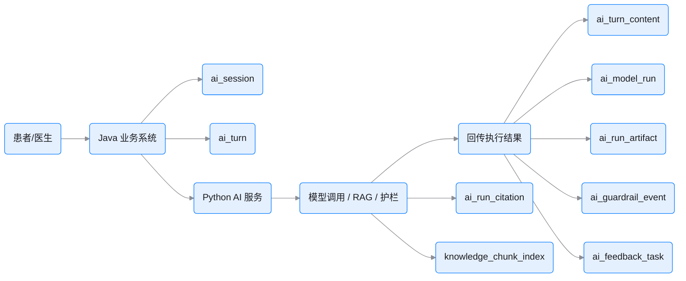
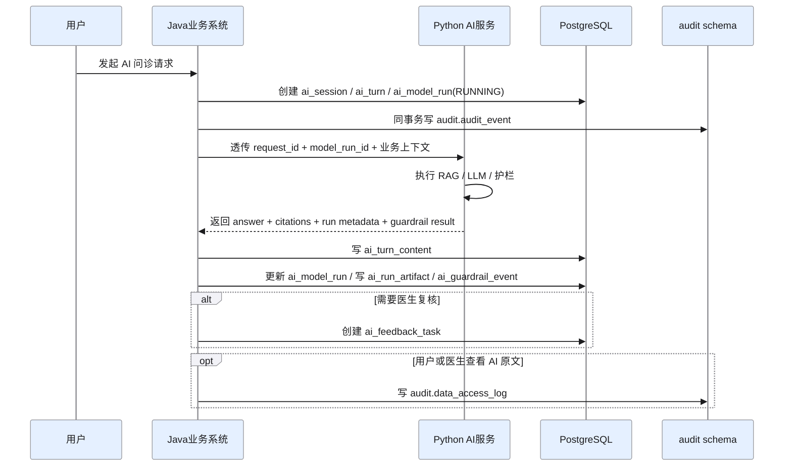
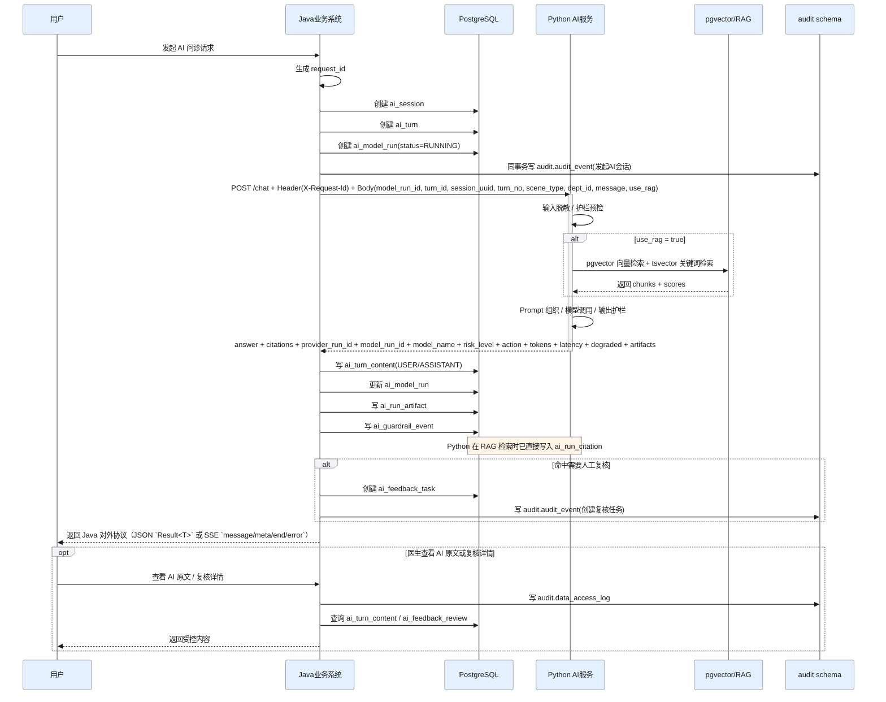

# AI 与审计设计（V3 设计说明）

> 本文聚焦 V3 中的 AI 域、审计域、数据访问监管域，以及它们在“Java 主业务系统 + Python AI 服务”架构下的职责划分。
> 核心目标不是把所有 AI 细节都塞进业务库，而是在保证可追溯、可审计、可复核的前提下，让 Java 与 Python 各自承担最合适的持久化职责。
>
> 读法说明：本文是旧 V3 设计参考。RAG Python 服务的最新 Java/Python 边界以 `docs/proposals/rag-python-service-design/03-java-boundary-and-owned-data.md` 为准；浏览器最终拿到的 AI 对外协议与业务承接，统一以 `docs/10A-JAVA_AI_API_CONTRACT.md` 为准。

## 1. 设计目标

- 让 Python AI 服务专注于 LLM、RAG、护栏、流式输出等能力执行
- 让 Java 主系统专注于业务身份、权限、监管、复核、业务关联与数据留痕
- 将 AI 原文、模型调用元数据、护栏事件、复核任务分层建模
- 将操作审计、敏感数据访问日志、业务领域事件彻底分离
- 避免把高敏正文和大体量运行细节塞进高频业务主表

## 2. 架构前提

当前系统前提是：

- Java/Spring 系统是主业务系统
- Python 服务是独立 AI 微服务
- Python 服务负责：
  - LLM 调用
  - RAG 检索
  - Prompt 组织
  - 护栏执行
  - SSE/流式输出
- Java 系统负责：
  - 用户身份与权限
  - 患者、医生、挂号、病历、审计等主业务事务
  - AI 会话的业务归属
  - AI 复核任务与监管闭环

因此，V3 的核心设计原则是：

- AI 执行在 Python
- AI 业务归档与合规追踪在 Java

## 3. 为什么 AI 表必须重构

V2 的 `ai_conversations + ai_messages + ai_feedback_reviews` 模型有 4 个问题：

- 会话、消息、模型调用、护栏、引用、复核都混在少数几张表里
- `ai_messages` 同时承担原文、上下文、引用、风险级别、模型信息，职责过重
- 对于独立 Python 服务来说，缺少“业务会话”和“执行运行”之间的明确边界
- 高敏原文、调用追踪、护栏事件没有清晰分层，后续审计和访问控制会越来越混乱

V3 重构的核心不是“把 AI 表拆多一点”，而是把原来的一坨事实拆成几类本质不同的数据：

- 业务会话事实
- 对话轮次事实
- 高敏正文内容
- 模型执行事实
- 护栏判断事实
- 医生复核事实
- 知识库索引事实

## 4. AI 域分层模型

V3 的 AI 域建议分为 6 层。

### 4.1 会话层

表：

- `ai_session`
- `ai_turn`

这层回答的问题是：

- 这次 AI 问诊属于谁
- 属于哪个场景
- 属于哪个挂号/科室上下文
- 一共发生了几轮交互

这一层是“业务主视角”，是 Java 主系统最应该掌握的数据。

### 4.2 正文层

表：

- `ai_turn_content`

这层回答的问题是：

- 用户原话是什么
- 模型回复原文是什么
- 哪些内容必须加密存储

之所以单独拆表，是因为：

- 原文是高敏数据
- 高敏正文不应出现在高频查询列表页中
- 不应让所有查询都顺带扫描大文本字段

### 4.3 运行层

表：

- `ai_model_run`
- `ai_run_artifact`

这层回答的问题是：

- Python 服务到底执行了哪次模型调用
- 用了哪个模型
- request_id 是什么
- 是否启用了 RAG
- 延迟、token、降级情况如何
- 模型输出了哪些结构化产物

这层是“执行主视角”，是 Java 和 Python 的关键衔接点。

### 4.4 护栏层

表：

- `ai_guardrail_event`

这层回答的问题是：

- 这次回答被判定为低/中/高风险中的哪种
- 执行的是通过、谨慎回答还是拒答
- 命中了哪些规则

之所以单独建表，是因为护栏不是消息正文的一部分，而是监管事实。

### 4.5 复核层

表：

- `ai_feedback_task`
- `ai_feedback_review`

这层回答的问题是：

- 哪些 AI 结果需要医生复核
- 复核是点赞、纠错还是正式评审
- 谁复核了
- 复核结论是什么

这层天然属于 Java 主业务系统，而不是 Python 服务。

### 4.6 知识层

表：

- `knowledge_base`
- `knowledge_document`
- `knowledge_chunk`

这层回答的问题是：

- 哪些知识库存在
- 哪篇文档已入库
- 文档切成了哪些 chunk
- 向量索引的检索投影（`knowledge_chunk_index`）由 Python 直接写入同一 PostgreSQL 实例

这里刻意只保存“业务索引”和“追溯元数据”，向量检索能力通过 pgvector 扩展在同一 PostgreSQL 实例中提供，无需外部向量数据库。

## 5. Java 与 Python 的持久化边界

这是这套设计里最重要的考量之一。

### 5.1 应由 Java 主系统持久化的数据

建议由 Java 落库：

- `ai_session`
- `ai_turn`
- `ai_feedback_task`
- `ai_feedback_review`
- `knowledge_base`
- `knowledge_document`
- `knowledge_chunk`
- `ai_model_run`（由 Java 预创建并在执行结束后更新）
- `ai_guardrail_event`

原因：

- 这些数据直接参与业务权限与监管
- 需要和患者、科室、挂号、病历等强关联
- 需要被 Java 侧做审计、访问控制、后台检索、医生复核

### 5.2 应由 Python 服务主导生成的数据

建议由 Python 生成，再同步/回传给 Java：

- 模型调用 trace 与 provider run id
- tokens、latency、degraded 标记
- RAG citations、summary、routing artifact
- 护栏匹配规则与动作
- 文档入库后写入 `knowledge_chunk_index` 的向量与关键词索引
- RAG 检索命中记录（`ai_run_citation`）

原因：

- 这些事实产生于 Python 执行现场
- Java 自己推导不准确，也不应二次推测

### 5.3 不建议由 Java 深度持久化的内容

不建议把下面这些“执行细节”长期全量存回 Java 主库：

- 每一步 Prompt 拼装细节
- 检索前所有中间候选结果
- 向量相似度矩阵
- 全量原始请求/响应大包
- SSE 每个分片事件

原因：

- 对主业务价值低
- 数据量膨胀快
- 合规风险高
- 适合留在 Python 侧短期日志、对象存储或专门观测系统中

## 6. 推荐的数据流模式

### 6.1 AI 交互主链路

### 6.2 推荐回传方式

推荐模式是：

- Java 创建 `ai_session` / `ai_turn`
- Java 预创建 `ai_model_run(status=RUNNING)`
- Java 把业务上下文、`request_id`、`model_run_id` 传给 Python
- Python 执行后将结构化结果回传给 Java
- Python 在检索阶段直接写 `ai_run_citation(model_run_id, ...)`
- Java 更新 `ai_model_run` 并统一写其余监管事实，保证口径一致

而不是：

- Python 自己在独立数据库里把业务会话全量维护一份
- Java 再去同步“AI 会话真相”

因为那样会产生双主事实源。

## 6.1 为什么业务会话主事实必须在 Java

`ai_session` 和 `ai_turn` 的主事实必须由 Java 维护，而不是由 Python 单独主导。

原因是这两个实体天然带有业务归属：

- 属于哪个患者
- 属于哪个科室
- 是否关联挂号订单
- 是否需要医生复核
- 是否会进一步生成病历或导诊建议

这些关系都由 Java 主系统掌握。如果让 Python 也维护一套完整会话主事实，很快会出现：

- Java 一套 `session_id`
- Python 一套 `provider_session_id`
- 两边状态不一致
- 权限与审计口径不一致

因此推荐模型是：

- Java 维护业务会话主事实
- Python 只产生执行事实并回传

## 6.2 为什么高敏原文必须独立成正文层

`ai_turn_content` 独立存在，不是为了“拆表而拆表”，而是为了同时满足三件事：

- 高敏内容加密
- 列表查询不扫大文本
- 原文访问单独留痕

AI 问诊原文里经常包含：

- 症状描述
- 家族史
- 既往病史
- 身份线索
- 联系方式类信息

如果把这些内容直接塞进会话主表或运行表，会带来两个后果：

- 普通后台查询天然暴露高敏原文
- 后续做“谁看了什么”时缺少清晰边界

所以 V3 的原则是：

- 会话层存索引和业务关联
- 正文层存密文和必要的 masked 预览

## 6.3 为什么运行层必须和会话层分离

`ai_model_run` 与 `ai_run_artifact` 记录的是 Python 执行现场的事实，而不是业务会话事实。

这一层要解决的问题包括：

- 本轮到底调用了哪个模型
- 由哪个 provider 执行
- request_id 是什么
- 是否启用了 RAG
- 延迟、tokens、降级情况如何
- 本轮产出了哪些结构化结果

会话层回答的是“发生了哪次业务问诊”，运行层回答的是“这次问诊具体怎么执行”。

如果继续把这些字段塞进消息表或会话表：

- 一个 turn 多次模型调用会难以表达
- 失败重试和降级路径无法清晰建模
- 后续模型切换、路由、A/B 实验会越来越难

因此 V3 明确要求：

- 会话是业务主视角
- 运行是执行主视角

## 6.4 为什么护栏必须是独立监管事实

`ai_guardrail_event` 不应只是 `ai_messages` 的几个附属字段。

护栏真正表达的是：

- 风险等级是什么
- 命中了哪条规则
- 执行了什么动作
- 输入输出哈希是什么

这类事实的查询方式和消息原文完全不同。后续你经常会关心：

- 最近 30 天高风险命中率
- 哪类规则最常触发
- 哪个模型最容易触发拒答
- 哪些科室需要加强护栏策略

如果把这类信息继续塞在消息表里，后面分析和监管都会越来越别扭。

## 6.5 为什么复核必须建成任务流

`ai_feedback_task` 与 `ai_feedback_review` 的拆分，是因为“医生复核”本质上是一个工作流，而不是一条评论。

至少要表达：

- 是否需要复核
- 任务是否已分配
- 分配给谁
- 是点赞、纠错还是正式评审
- 最终结论是什么
- 任务是否已经关闭

如果只有一张“复核结果表”，你无法自然表达：

- 待办
- 指派
- 处理中
- 已关闭
- 已取消

因此 V3 的复核设计属于标准的“任务 + 结果”双表模式。

## 7. 为什么 AI 原文、调用、护栏要拆表

### 7.1 原文不是运行元数据

用户原话和模型回复属于高敏内容，重点是：

- 权限控制
- 加密存储
- 谨慎访问

它不应和 tokens、latency、provider_run_id 混在一起。

### 7.2 护栏不是消息属性

风险级别和拒答动作不是消息正文的组成部分，而是一条独立监管事实。

如果把它继续塞在消息表里，后面就会很难回答：

- 某段时间里高风险命中率是多少
- 哪类规则最常触发
- 哪个模型最容易触发拒答

### 7.3 复核不是会话附属字段

医生复核天然是一个工作流，不是“在会话上补一两个字段”就能表达的。

它至少有：

- 待办任务
- 指派
- 复核结论
- 是否关闭

所以必须拆成任务表和结果表。

## 8. 知识库的三层模型（业务事实 + 检索投影 + 引用追溯）

V3 统一迁移至 PostgreSQL 17+ 后，RAG 数据模型从"业务库 + 外部向量库"变为三层统一模型（详见 [20-RAG_DATABASE_PGVECTOR_DESIGN.md](./20-RAG_DATABASE_PGVECTOR_DESIGN.md)）：

**业务主事实层**（Java 主导持久化）：

- `knowledge_base`：知识库归属、可见性
- `knowledge_document`：文档来源、入库状态
- `knowledge_chunk`：chunk 正文、section/page、引用展示

**检索投影层**（Python 直接写入 PostgreSQL）：

- `knowledge_chunk_index`：向量（`VECTOR(1536)`）+ tsvector 关键词索引，由 Python 在 embedding 完成后直接写入同一 PostgreSQL 实例

**引用追溯层**（Python 直接写入 PostgreSQL）：

- `ai_run_citation`：每次 RAG 回答引用了哪些 chunk、相似度分数、排名

Java 与 Python 的分工因此变为：

- Java 负责知识文档与 chunk 的业务落库、可见性控制和引用展示
- Python 负责原始文档解析、文本清洗、chunk 切分算法、`knowledge_chunk_index` 生成、RAG 检索和 `ai_run_citation` 写入

`knowledge_document / knowledge_chunk` 的定位不变：

- 给业务系统看得懂
- 给前端能展示引用
- 给运营后台能做内容治理

向量检索统一通过 pgvector 在同一数据库内完成。

## 9. 审计域为什么必须重构

V2 的 `audit_logs` 和 `domain_events` 问题很典型：

- 审计和业务事件耦合度高
- 审计主表里既放索引字段又放高敏前后值
- 看过什么、导出过什么、打印过什么没有独立记录面

V3 的核心思想是把三种完全不同的事实拆开：

- 操作审计
- 敏感数据访问监管
- 业务领域事件

## 10. 审计、访问日志、业务事件三者的区别

### 10.1 `audit_event`

记录的是：

- 谁做了什么操作
- 操作对象是什么
- 是否成功
- request_id 是什么

它面向的是：

- 运营排查
- 安全审计
- 后台查询

### 10.2 `audit_payload`

记录的是：

- 请求参数
- 修改前值
- 修改后值

这部分天然高敏，所以必须单独拆出密文层。

### 10.3 `data_access_log`

记录的是：

- 谁看了哪份病历
- 谁导出了哪份处方
- 谁查看了哪段 AI 原文

这不是“修改操作审计”，而是“敏感数据访问监管”。

医疗系统里，这张表非常关键。

### 10.4 `domain_event_stream`

记录的是：

- 业务上发生了什么事件
- 例如挂号确认、门诊停诊、病历签署、AI 复核完成

它不是给审计人员看的，而是给业务编排、异步处理、事件驱动架构用的。

### 10.5 `outbox_event`

记录的是：

- 哪些事件需要可靠投递到外部系统

它的职责是工程可靠性，不是业务事实本身。

### 10.6 审计存储基线（本轮定案）

> 当前阶段优先级：`P0 = audit_event + data_access_log`，`P1 = audit_payload`，`P2 = domain_event_stream/outbox/archive`

- 审计监管仍与业务表共享同一个 PostgreSQL 17+ 实例，不额外引入独立审计库
- `audit_event`、`audit_payload`、`data_access_log` 物理落在 `audit` schema
- `domain_event_stream`、`outbox_event`、`integration_event_archive` 物理落在 `event` schema
- 权威审计写入由 Java 在业务事务内同步完成，不依赖异步 subscriber 或 Elasticsearch 双写
- Elasticsearch 仅在 `P2` 作为从 PostgreSQL 异步投影出的检索/报表层，默认不启用

## 11. 审计与 AI 之间的衔接

AI 相关操作需要同时落两类日志：

- 审计日志：谁发起了 AI 会话、谁关闭了复核任务
- 数据访问日志：谁查看了 AI 原文、谁导出了 AI 复核明细

而护栏命中本身，不应混进 `audit_event`，应留在 `ai_guardrail_event`。

因为它是 AI 风险事实，不是用户操作事实。

## 12. 推荐时序：Java + Python + 审计

## 13. Java 调 Python AI 服务的推荐协议与落库策略

### 13.1 推荐调用链

建议采用下面的主链路：

1. Java 创建 `ai_session`
2. Java 创建 `ai_turn`
3. Java 预创建 `ai_model_run`
4. Java 生成并透传 `request_id`
5. Java 把业务上下文和 `model_run_id` 传给 Python
6. Python 执行 RAG / LLM / 护栏，并直接写 `ai_run_citation`
7. Python 回传结构化结果
8. Java 更新 `ai_model_run` 并决定是否创建复核任务

其中最关键的是：

- Java 是业务主事实创建者
- Python 是执行现场事实生产者

### 13.2 推荐请求字段

Java 调 Python 时，建议至少传：

- Header：`X-Request-Id`
- `model_run_id`
- `turn_id`
- `session_uuid`
- `turn_no`
- `patient_id` 或脱敏后的业务主体标识
- `department_id`
- `scene_type`
- `message`
- `use_rag`
- `stream`
- `context_summary`

这些字段的作用是：

- 让 Python 不需要自己理解完整业务数据库
- 让调用具备最小必要上下文
- 让回传结果可以准确归档到 Java 的业务实体

### 13.3 推荐回传字段

Python 回传给 Java 时，建议至少包含：

- `provider_run_id`
- `model_run_id`
- `model_name`
- `answer`
- `answer_masked`（可选）
- `citations`
- `summary`
- `risk_level`
- `guardrail_action`
- `matched_rule_codes`
- `tokens_input`
- `tokens_output`
- `latency_ms`
- `is_degraded`
- `artifacts`

同时响应头回写：

- `X-Request-Id`

Java 收到后，对应落库建议：

- `answer` -> `ai_turn_content`
- `provider_run_id / model_name / latency_ms / tokens_* / is_degraded` -> 更新 `ai_model_run`
- `citations` -> 作为响应展示字段返回；明细已由 Python 写入 `ai_run_citation`
- `summary / routing / rag_context` -> `ai_run_artifact`（通用调试/中间产物）
- `risk_level / guardrail_action / matched_rule_codes` -> `ai_guardrail_event`
- 最终推荐科室、主诉摘要、导诊建议、`triage_stage`、`triage_completion_reason` 等业务真相不再落 `ai_guardrail_event.event_detail_json`，应转入 `ai_model_run.triage_snapshot_json`

### 13.4 不建议的错误模式

不建议这样做：

- Python 自己写一套完整 AI 业务库，Java 再异步同步
- Java 不建 `ai_session`，而是完全依赖 Python 返回一个临时 `session_id`
- Java 只收最终回答，不收运行元数据与护栏结果
- Python 把调试级别的大 payload 全量回灌主业务库

这些做法会导致：

- 主事实源混乱
- trace 不闭环
- 合规链路残缺
- 主库快速膨胀

### 13.5 Java 调 Python AI 服务时序图

## 14. 高风险点与设计考量

### 14.1 不要让 Java 和 Python 各自维护一套会话主事实

推荐：

- Java 维护业务会话主事实
- Python 只产生执行事实并回传

否则你会遇到：

- session_id 双源
- trace 对不上
- 权限校验口径不一致

### 14.2 不要把 AI 高敏原文直接塞进审计主表

推荐：

- 审计索引与审计密文载荷分表
- AI 原文访问单独写 `data_access_log`

否则后面：

- 审计表会变成高敏数据泄露源
- 审计查询会天然带上不必要的大文本

### 14.3 不要把 Python 的全部运行细节无脑落回 Java 主库

推荐：

- Java 保存监管和业务需要的关键元数据
- 低价值、高体量调试细节留在 Python 的日志/对象存储/观测系统

### 14.4 不要把护栏结果只写日志不落库

护栏是医疗 AI 场景的关键监管事实。

至少要能追溯：

- 哪次 run 命中了哪条规则
- 是 caution 还是 refuse
- 输入/输出哈希是什么

### 14.5 不要因为已经有 SkyWalking / Elasticsearch 就默认把审计双写到 ES

推荐：

- 先把权威审计固定在同一 PostgreSQL 实例里的 `audit` schema
- 用分区、索引、访问分级和 append-only 约束先把监管底盘打稳
- 只有在 PostgreSQL 已经无法满足复杂聚合、长留存报表或高频跨维检索时，再从 PG 异步投影到 ES

否则很容易出现：

- 业务事务成功但 ES 写入失败，审计链路口径分叉
- 为了补偿双写引入额外重试、幂等和回灌复杂度
- 因为“反正已经有 ES”而过早放大运维和数据治理成本

## 15. 最终原则总结

- 业务归属在 Java，AI 执行在 Python
- 原文、运行元数据、护栏、复核必须拆表
- 业务审计、访问监管、领域事件必须分表
- 审计基线 = 单 PostgreSQL 实例 + `audit` / `event` schema，ES 仅为可选投影
- 只把“需要监管和追溯”的 AI 事实落到业务库
- 向量检索统一由 PostgreSQL + pgvector 承载，不再依赖外部向量数据库

## 16. 一句话总结

V3 的 AI 与审计设计，本质上是在建立这样一条链路：

- Java 管业务主事实、权限和监管
- Python 管 AI 能力执行与运行现场
- 通过结构化回传把可追溯的关键事实落回业务库
- 再通过审计、访问日志和复核任务形成完整合规闭环

也就是：

- AI 能力可以独立演进
- 业务口径始终统一
- 高敏数据可控
- 审计链路可追溯
