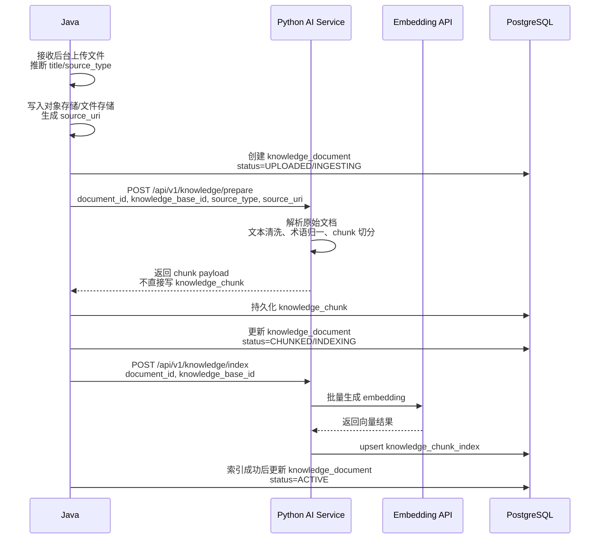

# MediAsk AI 服务 - Python 模块设计与落地清单

> 定位：`mediask-ai` 是 Java 主系统的内部 AI 执行服务。
>
> 当前口径：本文件为重写基线；Python 负责 RAG 检索、LLM 调用、护栏执行、同步结构化输出，以及检索投影/引用追溯写库，不维护业务主事实。
>
> 浏览器经 Java 访问的外部 AI 契约，见 [10A-JAVA_AI_API_CONTRACT.md](./10A-JAVA_AI_API_CONTRACT.md)。

## 1. 定位与边界

`mediask-ai` 只提供 AI 能力，不处理业务事务，不持有患者/挂号/病历等业务主事实。

- 上游：Java 后端 `mediask-be`
- 下游：DeepSeek / OpenAI 兼容 LLM API、阿里百炼 Embedding API、PostgreSQL + pgvector
- 交互：内部 HTTP JSON

边界冻结如下：

- Java 负责：`ai_session`、`ai_turn`、`ai_turn_content`、`ai_model_run`、`knowledge_base`、`knowledge_document`、`knowledge_chunk`
- Python 负责：原始文档解析、文本清洗、chunk 切分算法、`knowledge_chunk_index`、`ai_run_citation`
- Python 不直接维护业务会话主事实
- AI 输出定位为“辅助问诊、风险提示、建议就医/推荐科室”，不输出诊断结论与处方建议

## 2. 目录结构建议

```text
app/
    api/
        v1/
            chat.py              # /api/v1/chat
            knowledge.py         # /api/v1/knowledge/prepare, /api/v1/knowledge/index, /api/v1/knowledge/search
    core/
        settings.py              # Pydantic Settings
        logging.py               # 结构化日志
        errors.py                # 错误码与异常映射
    middleware/
        auth.py                  # 预留：后续如需接入 API Key 鉴权时使用
        request_context.py       # X-Request-Id 透传与日志上下文
    services/
        llm/
            client.py            # OpenAI-compatible LLM client
        rag/
            indexer.py           # knowledge_chunk_index upsert
            retriever.py         # 混合检索 + citations
            pipeline.py          # chat 主流程
            normalize.py         # 术语归一/PII 预处理
    schemas/
        chat.py
        knowledge.py
        common.py
    main.py
```

## 3. 依赖与运行

使用 `uv` 管理依赖，保持与 [09-PYTHON_ENV.md](./09-PYTHON_ENV.md) 一致。

```toml
[project]
name = "mediask-ai"
version = "0.1.0"
description = "MediAsk AI Service"
requires-python = ">=3.11.14"
dependencies = [
    "fastapi[standard]>=0.128.1",
    "openai>=2.17.0",
    "httpx>=0.28.0",
    "pydantic-settings>=2.0.0",
    "psycopg[binary]>=3.2.0",
    "pgvector>=0.3.0",
]

[tool.uv]
dev-dependencies = [
    "pytest>=8.0.0",
    "pytest-asyncio>=0.23.0",
    "httpx>=0.26.0",
    "pytest-cov>=7.0.0",
    "ruff>=0.15.0",
]
```

说明：

- `P0` 不强依赖 LangChain/LangGraph；优先使用轻量、自控的 `Retriever + RagPipeline`
- 如果后续进入 `P1/P2` 需要多步 Agent 编排，再评估是否引入更重的框架

## 4. 配置项

### 4.1 多环境切换规则

加载优先级（从高到低）：

1. `ENV_FILE`
2. `APP_ENV`
3. `.env.dev` / `.env`

```bash
# .env.dev
APP_ENV=dev
API_KEY=mediask-ai-secret-key
LOG_LEVEL=INFO

LLM_MODEL=deepseek-chat
LLM_BASE_URL=https://api.deepseek.com/v1
LLM_API_KEY=sk-xxx

EMBEDDING_PROVIDER=openai_compatible
EMBEDDING_MODEL=text-embedding-v4
EMBEDDING_BASE_URL=<阿里百炼兼容端点>
EMBEDDING_API_KEY=<你的百炼API Key>
EMBEDDING_DIM=1536

PG_HOST=127.0.0.1
PG_PORT=5432
PG_DB=mediask_dev
PG_USER=mediask_ai
PG_PASSWORD=

RAG_TOP_K=5
RAG_VECTOR_TOP_K=30
RAG_KEYWORD_TOP_K=30
RAG_SCORE_THRESHOLD=0.20
READY_CACHE_TTL_SECONDS=15
```

说明：

- Python 数据库账号只需要所有表 `SELECT` 权限，以及 `knowledge_chunk_index`、`ai_run_citation` 的写权限
- `model_run_id` 由 Java 预分配并通过请求显式传入，Python 不自行生成业务运行主键

### 4.2 本地启动与部署

```bash
uv sync
make dev
```

```bash
APP_ENV=prod make run
```

## 5. API 设计

> 这些接口是 **Java → Python 的内部服务契约**，不是浏览器直连接口。

### 5.1 健康检查

```http
GET /health
GET /ready
```

### 5.2 Request ID 规范

- 若请求头包含 `X-Request-Id`，直接透传
- 若无 `X-Request-Id` 但有兼容旧头 `X-Trace-Id`，接受并规范化为 `request_id`
- 两者都没有时，内部生成 UUID v4
- `request_id` 通过 Header 传递，不作为 `/chat` 请求体必填字段

### 5.3 对话接口

```http
POST /api/v1/chat
```

请求：

Header：

```http
X-Request-Id: req_01hrx6m5q4x5v2f6k4w4x1c7pz
X-API-Key: <java-to-python-service-key>
```

```json
{
  "model_run_id": 9001001,
  "turn_id": 8002001,
  "session_uuid": "ai-sess-001",
  "department_id": 101,
  "hospital_scope": "default-hospital",
  "department_catalog_version": "deptcat-v20260416-01",
  "patient_turn_no_in_active_cycle": 3,
  "force_finalize": false,
  "scene_type": "PRE_CONSULTATION",
  "message": "头痛三天，伴有低烧，应该先看什么科？",
  "context_summary": "患者女性，28岁，无已知慢病",
  "use_rag": true,
  "knowledge_base_ids": [5001001]
}
```

约束：

- `use_rag=true` 时，`knowledge_base_ids` 必填且至少包含一个知识库
- `use_rag=false` 时，不执行检索，`knowledge_base_ids` 可省略
- `hospital_scope` 表示本次问诊允许使用的候选科室范围；当前单医院部署时可等价于默认医院
- 当前单医院部署默认使用 `default-hospital`；Java 必须显式传该值，不允许由 Python 自行猜测
- `department_catalog_version` 表示该 scope 下候选科室目录版本
- Python 不直查业务库；若本地该 scope 的目录不存在或版本不匹配，应先向 Java 拉取最新目录再继续推理
- `recommended_departments.department_id` 必须来自当前 `hospital_scope` 对应的目录缓存
- `patient_turn_no_in_active_cycle` 表示当前 active triage cycle 内的患者发言轮次，从 1 开始递增
- `force_finalize=true` 表示当前回合必须收口，Python 不允许再返回 `COLLECTING`
- `X-API-Key` 用于 Java -> Python 服务鉴权；这是目标契约，不要求当前代码已实现
- `triage_stage` 由 Python 明确判定，Java 不根据 `recommended_departments`、`chief_complaint_summary` 是否为空来反推 READY/BLOCKED

响应：

```json
{
  "model_run_id": 9001001,
  "turn_id": 8002001,
  "session_uuid": "ai-sess-001",
  "provider_run_id": "deepseek-run-abc",
  "answer": "建议尽快线下就医，优先考虑神经内科或发热门诊分诊。",
  "triage_stage": "READY",
  "triage_completion_reason": "SUFFICIENT_INFO",
  "chief_complaint_summary": "头痛三天伴低烧",
  "recommended_departments": [
    {
      "department_id": 101,
      "department_name": "神经内科",
      "priority": 1,
      "reason": "头痛伴低烧，优先排查神经系统相关风险"
    }
  ],
  "care_advice": "建议尽快线下就医，优先考虑神经内科或发热门诊分诊。",
  "citations": [
    {
      "chunk_id": 7003001,
      "retrieval_rank": 1,
      "fusion_score": 0.82,
      "snippet": "持续头痛伴发热应结合感染风险进行线下评估。"
    }
  ],
  "risk_level": "medium",
  "guardrail_action": "caution",
  "matched_rule_codes": ["medical_triage_only"],
  "tokens_input": 502,
  "tokens_output": 168,
  "latency_ms": 1860,
  "is_degraded": false
}
```

说明：`request_id` 由响应头 `X-Request-Id` 回写，不要求重复放入业务响应体。

补充说明：

- `/chat` 是 Python 对 Java 的唯一正式问诊接口；Python 不再提供 `/api/v1/chat/stream`
- Java 或前端如需“流式体验”，只允许基于完整 `answer` 做展示层伪流式，不从 Python 请求 token/SSE
- `recommended_departments` 是本次成功问诊的最终结构化输出，不区分 preview / final
- Java 会在持久化导诊快照成功后，才把该结构化结果对外暴露给浏览器
- `triage_stage = COLLECTING` 时，只返回 `follow_up_questions`；不返回 `recommended_departments`、`care_advice`
- `triage_stage = READY / BLOCKED` 时，返回 `recommended_departments`、`care_advice`；不返回 `follow_up_questions`
- `department_recommendation_confidence`、`risk_blockers`、`missing_critical_info` 只作为 Python 内部判定材料，不再作为稳定对外契约字段
- `FAILED` 不属于成功业务响应中的 `triage_stage`；执行异常、目录同步失败、结构化响应解析失败都应直接以失败响应结束请求
- Python 不以“是否猜到病因”判定 `READY`，而以“推荐方向是否已足够稳定可交付”判定
- `triage_completion_reason` 固定表达本次收口原因；`READY` 只能来自 `SUFFICIENT_INFO` 或 `MAX_TURNS_REACHED`
- `triage_stage = COLLECTING` 时，`triage_completion_reason` 固定为 `null`

响应头：

```http
X-Request-Id: req_01hrx6m5q4x5v2f6k4w4x1c7pz
```

### 5.4 伪流式约定

- Python 不提供 `/api/v1/chat/stream`，也不承担 SSE/token streaming 职责
- Java 或前端若需要聊天逐字显示效果，应在拿到完整 `/chat` 响应后，仅对 `answer` 做展示层切片
- 结构化字段必须在完整响应返回后一次性消费，不得从伪流式文本里反解析推荐科室、风险状态或页面跳转
- Python 的对外职责固定为：一次同步调用返回完整 `answer + 当前轮结构化状态`

`triage_stage` 固定值：

- `COLLECTING`
- `READY`
- `BLOCKED`

判定规则：

- Python 是导诊阶段判定者
- Python 正常响应先生成判定材料，再在服务内部映射 `triage_stage`
- `BLOCKED`：`risk_blockers` 非空，或 `triage_completion_reason = HIGH_RISK_BLOCKED`
- `COLLECTING`：未达到强制收口条件，且仍存在关键缺口
- `READY`：`triage_completion_reason = SUFFICIENT_INFO` 或 `MAX_TURNS_REACHED`

判定材料固定为：

- `risk_blockers`
- `missing_critical_info`
- `follow_up_questions`
- `department_recommendation_confidence`

服务层控制字段固定为：

- `patient_turn_no_in_active_cycle`
- `force_finalize`
- `triage_completion_reason`

字段语义：

- `risk_blockers`：已识别出的阻断普通导诊的危险信号列表
- `missing_critical_info`：当前仍缺失、且会影响分诊方向的关键信息列表
- `follow_up_questions`：下一轮必须追问的问题列表，最多 2 个
- `department_recommendation_confidence`：当前推荐方向是否已足够稳定可交付

`triage_completion_reason` 固定值：

- `SUFFICIENT_INFO`
- `MAX_TURNS_REACHED`
- `HIGH_RISK_BLOCKED`

`department_recommendation_confidence` 固定值：

- `UNSTABLE`
- `STABLE`

保守型 READY 门槛固定为：

- 只要还有一个可能明显改变推荐方向的关键问题没问清，且 `force_finalize = false`，就继续 `COLLECTING`
- 不要求病因正确
- 不要求医学事实完整
- 只要求当前推荐方向已经足够稳定，继续多问一轮也不太会发生明显翻转

强制收口规则固定为：

- Java 在每个 active triage cycle 内维护 `patient_turn_no_in_active_cycle`
- 到第 5 个患者回合时，Java 必须传 `force_finalize = true`
- `force_finalize = true` 时，Python 不允许再返回 `COLLECTING`
- `force_finalize = true` 且未命中危险信号时，必须返回 `READY + MAX_TURNS_REACHED`
- `MAX_TURNS_REACHED` 时，`follow_up_questions` 必须为空
- `MAX_TURNS_REACHED` 时，`answer` / `care_advice` 必须显式说明“基于当前有限信息先建议……”

`BLOCKED` 首版只依赖少量高价值危险信号集合，不建设全病种风险模板库。危险信号集合至少包括：

- 意识障碍或明显意识改变
- 明显呼吸困难
- 持续或剧烈胸痛
- 大出血
- 抽搐
- 中风样表现
- 严重过敏反应
- 婴幼儿 / 孕产妇 / 高龄 / 严重基础病人群合并明显危险信号

### 5.4A Prompt 合同

Python 的 Prompt 合同必须冻结到“输出稳定、不会无限追问”的程度。最小要求：

- system prompt 明确限制：只输出导诊建议，不输出诊断结论、处方、确定性病因
- 输出必须遵守固定 JSON schema，不能自由发挥字段
- `COLLECTING` 时最多提出 2 个最高信息增益问题，不重复、不发散
- `follow_up_questions` 与 `answer` 中的追问语义必须一致
- `BLOCKED` 时停止普通追问，直接输出紧急线下就医文案
- `MAX_TURNS_REACHED` 时禁止继续追问，必须给 best-effort 推荐
- 推荐科室只能从 Java 下发目录中选择，不得臆造科室 ID

### 5.4B 候选科室目录同步

定位：

- 这是 Java 和 Python 之间的内部主数据同步接口
- Java 是 `TriageDepartmentCatalog` 真相来源
- Python 只维护本地推理缓存，不拥有主数据 ownership

```http
GET /api/v1/internal/triage-department-catalogs/{hospital_scope}
```

请求头：

```http
X-Request-Id: req_01hrx6m5q4x5v2f6k4w4x1c7pz
X-API-Key: <python-to-java-service-key>
```

响应至少包含：

```json
{
  "hospital_scope": "default-hospital",
  "department_catalog_version": "deptcat-v20260416-01",
  "department_candidates": [
    {
      "department_id": 101,
      "department_name": "神经内科",
      "routing_hint": "headache, dizziness, neurologic symptoms",
      "aliases": ["神内"],
      "sort_order": 10
    },
    {
      "department_id": 102,
      "department_name": "发热门诊",
      "routing_hint": "fever, infection screening",
      "aliases": ["发热"],
      "sort_order": 20
    }
  ]
}
```

约束：

- 仅面向内网服务间调用，不面向浏览器开放
- Java 只返回该 `hospital_scope` 下可导诊目录中的科室，不等价于原始 `departments` 全量临床科室
- 目录版本只要内容变化就必须变化，但不在接口层写死具体版本算法
- Python 可按 `hospital_scope -> triage department catalog` 维护本地内存缓存或本地持久缓存
- `X-API-Key` 用于 Python -> Java 服务鉴权；这是目标契约，不要求当前代码已实现

状态码语义：

- `200`：成功返回完整目录
- `401/403`：服务鉴权失败
- `404`：`hospital_scope` 不存在
- `409`：目录版本或 scope 状态异常，当前目录不可用
- `5xx`：Java 内部错误

缓存协商规则：

- Python 收到 chat 请求后，若本地 `hospital_scope` 对应目录缺失或版本不匹配，必须先调用该接口拉取全量目录
- 本轮不设计“只查版本”的探针接口
- 本轮不设计增量同步接口
- 目录同步失败时，当前 chat 直接失败，不做静默降级

### 5.5 知识检索

```http
POST /api/v1/knowledge/search
```

定位：

- 内部 RAG retrieval 接口，不面向终端用户直接暴露搜索能力
- 主要供 `chat` 在生成前执行检索，也允许 Java/Python 联调或后台试搜复用
- `model_run_id` 仅控制是否写入 `ai_run_citation`，不改变检索排序逻辑

请求：

```json
{
  "model_run_id": 9001001,
  "query": "高血压饮食注意事项",
  "top_k": 5,
  "knowledge_base_ids": [1001]
}
```

响应：

```json
{
  "query": "高血压饮食注意事项",
  "items": [
    {
      "chunk_id": 7001001,
      "score": 0.0323,
      "vector_score": 0.812,
      "keyword_score": 0.426,
      "document_id": 6001001,
      "knowledge_base_id": 1001,
      "content_preview": "高血压患者应减少钠盐摄入。",
      "citation_label": "高血压指南 / 生活方式管理 / P3",
      "section_title": "生活方式管理",
      "page_no": 3
    }
  ],
  "is_degraded": false
}
```

约束：

- `knowledge_base_ids` 必填，且至少包含一个知识库
- `model_run_id` 可选；传入时写 `ai_run_citation`，不传时只返回结果
- `score` 为融合排序分数；`vector_score` / `keyword_score` 仅用于解释命中来源
- 命中结果除满足 chunk/index 有效条件外，还必须满足 `knowledge_document.document_status = ACTIVE` 且 `deleted_at IS NULL`
- 当前 `chat` 已直接复用这一步 retrieval 构建上下文、返回 citations，并在传入 `model_run_id` 时写入 `ai_run_citation`
- `search` 仍可独立用于内部联调、检索验证和试搜场景

### 5.6 文档预处理与切块准备

```http
POST /api/v1/knowledge/prepare
```

请求：

```json
{
  "document_id": 6001001,
  "document_uuid": "550e8400-e29b-41d4-a716-446655440000",
  "knowledge_base_id": 5001001,
  "title": "高血压指南",
  "source_type": "PDF",
  "source_uri": "oss://mediask/knowledge-documents/4001/20260410/pdf-550e8400-e29b-41d4-a716-446655440000.pdf"
}
```

响应：

```json
{
  "document_id": 6001001,
  "chunks": [
    {
      "content": "高血压患者应减少钠盐摄入。",
      "content_preview": "高血压患者应减少钠盐摄入。",
      "page_no": 3,
      "section_title": "生活方式管理",
      "char_start": 1200,
      "char_end": 1238,
      "token_count": 18,
      "citation_label": "高血压指南 / 生活方式管理 / P3"
    }
  ]
}
```

说明：

- 前端先将原始文件上传给 Java；Java 写入对象存储/文件存储并生成 `source_uri` 后，再向 Python 传递 `source_type / source_uri`
- Python 负责原始文档解析、清洗、术语归一和 chunk 切分，但不直接写 `knowledge_chunk`
- Java 根据返回的 chunk payload 持久化 `knowledge_chunk`，再进入索引阶段
- 当前上传文件类型由 Java 从文件名/Content-Type 推断，支持 `MARKDOWN / DOCX / PDF`
- `dev` 环境可使用本地共享目录并生成 `file://...`，默认目录可放在项目根目录下的 `var/knowledge-storage`；`prod` 环境目标为 OSS URI

### 5.7 知识索引

```http
POST /api/v1/knowledge/index
```

请求：

```json
{
  "document_id": 6001001,
  "knowledge_base_id": 5001001
}
```

说明：

- `knowledge_document` 与 `knowledge_chunk` 必须先由 Java 持久化
- `knowledge/index` 不再由 Java 回传整批 chunk 文本
- Python 根据 `document_id` 自行读取 `knowledge_chunk`，并为这些稳定 `chunk_id` 生成索引投影

## 6. 请求上下文与安全现状

- 当前代码已实现 `X-Request-Id` 透传；若缺失则兼容 `X-Trace-Id`，两者都没有时由服务端生成 UUID v4
- 当前代码会在响应头中回写 `X-Request-Id`
- 当前代码尚未实现 `X-API-Key` 鉴权中间件；如需补齐，应作为后续安全治理项单独落地，而不是视为现状契约
- 失败响应统一为 `{code, msg, requestId, timestamp}`，详见 [19-ERROR_EXCEPTION_RESPONSE_DESIGN.md](./19-ERROR_EXCEPTION_RESPONSE_DESIGN.md)
- 输入/输出 PII 脱敏、风险分级、拒答策略与 `request_id` 串联仍是本服务的设计约束

## 7. RAG 流程

### 7.1 索引流程

1. Java 创建 `knowledge_document(status=UPLOADED/INGESTING)`
2. Java 调用 Python `/api/v1/knowledge/prepare`
3. Python 完成原始文档解析、清洗与分块，返回 chunk payload
4. Java 写入 `knowledge_chunk`
5. Java 调用 Python `/api/v1/knowledge/index`
6. Python 调用百炼 Embedding
7. Python 写入 `knowledge_chunk_index`

对应时序如下：



补充约束：

- `knowledge_document` 和 `knowledge_chunk` 属于业务主事实，必须由 Java 持久化
- Python 负责生成 chunk payload，但不直接写 `knowledge_chunk`
- Python 在 `knowledge/index` 阶段根据 `document_id` 自行读取已持久化的 `knowledge_chunk`，但仅为 `chunk_status=ACTIVE 且 deleted_at IS NULL` 的 chunk 建立或更新检索投影
- Python 直接写库的范围仅限检索投影 `knowledge_chunk_index`，与 AI 运行期的 `ai_run_citation`
- Python 写 `ai_run_citation.id` 时必须使用与 Java 一致的雪花 ID 规则，不能使用仅进程内唯一的本地计数器

### 7.2 查询流程

1. Java 预创建 `ai_model_run`
2. Java 在运行期传入 `model_run_id`；联调/试搜场景可省略
3. Python 做查询归一、PII 预处理
4. Query 向量化
5. pgvector 向量检索 + tsvector 关键词检索
6. RRF 融合与阈值过滤
7. Python 在提供 `model_run_id` 时写入 `ai_run_citation(model_run_id, chunk_id, ...)`
8. 调用 LLM
9. 返回 answer + citations + guardrail + run metadata

补充约束：

- 检索命中结果必须同时满足 `knowledge_chunk_index.is_active = TRUE` 与 `knowledge_chunk.chunk_status = ACTIVE AND deleted_at IS NULL`
- `knowledge_chunk_index` 是检索投影，不得替代 `knowledge_chunk` 作为业务主事实判断依据

### 7.3 输出边界

Python 输出应固定在以下范围：

- 症状整理
- 风险提示
- 建议就医
- 推荐科室/就诊方向
- 引用依据

不输出：

- 诊断结论
- 处方建议
- 具体药物剂量

## 8. 统一错误与日志

### 8.1 错误格式

成功响应保持端点自有载荷；失败响应统一返回错误封装：

```json
{"code": 6001, "msg": "AI service unavailable", "requestId": "req_01hrx6m5q4x5v2f6k4w4x1c7pz", "timestamp": 1761234567890}
```

### 8.2 日志要求

- 结构化 JSON 日志
- 必须包含：`request_id`、`model_run_id`、`turn_id`、`latency_ms`、`is_degraded`
- 不记录未脱敏的患者原文

## 9. 测试策略

- 单元测试：`Retriever`、`RagPipeline`、护栏规则、降级路径
- 接口测试：`httpx.AsyncClient`
- 关键覆盖：`model_run_id` 透传、`request_id` 透传、`ai_run_citation` 写入、`COLLECTING/READY/BLOCKED` 分阶段字段裁剪
- 联调覆盖：成功、超时、异常映射、无检索结果降级

## 10. Makefile 约定

```makefile
HOST ?= 127.0.0.1
PORT ?= 8000
APP ?= app.main:app

run:
	uv run uvicorn $(APP) --host $(HOST) --port $(PORT)

dev:
	uv run uvicorn $(APP) --reload --host $(HOST) --port $(PORT)

test:
	uv run pytest -v --cov=app

lint:
	uv run ruff check app/ tests/

clean:
	rm -rf .pytest_cache .coverage .ruff_cache __pycache__
```

## 11. 待办清单

- [ ] `model_run_id` 预创建与回传协议
- [ ] `knowledge/prepare` 返回稳定 chunk payload
- [ ] `knowledge/index` 批量 upsert
- [ ] `ai_run_citation` 写库与幂等
- [ ] `chat/stream` 的 `meta` 事件
- [ ] Java ↔ Python 统一错误响应与 `request_id` 透传
- [ ] 最小黄金问答集
