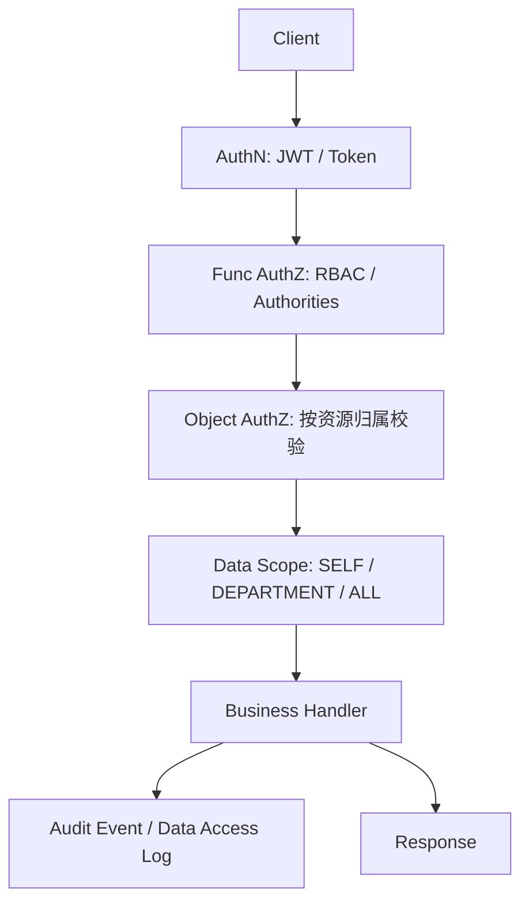

# 权限与审计设计：架构与范围

> 执行边界说明：`P0` 只做最小 RBAC、对象级授权、数据范围控制、敏感访问留痕。审批流、break-glass、ABAC、黑白名单与复杂风控统一后置到 `P2`。

## 1. 目标

医疗系统的权限与合规模块，当前阶段只需先回答四个问题：

- 谁能访问系统功能
- 谁能查看哪些医疗数据
- 谁查看了敏感内容
- 谁修改了关键业务对象

## 2. 当前项目语境

本项目当前主线是：AI 辅助问诊 -> 推荐科室/建议就医 -> 挂号 -> 医生接诊 -> 病历/处方 -> 权限与审计。

因此权限设计必须优先服务以下对象：

- 患者查看自己的 AI 会话、挂号、病历和处方
- 医生查看自己职责范围内的接诊与病历数据
- 管理员查看最小审计结果并维护基础权限关系

## 3. 范围与非目标

### 3.1 当前范围

- API 请求进入后的认证、功能鉴权、对象级授权、数据范围控制
- 患者/医生/管理员的最小角色与权限关系
- 病历正文、AI 原文、审计密文等敏感内容的访问留痕
- AI 数据域、挂号域、诊疗域的统一 `request_id` 审计口径

### 3.2 当前非目标

- 复杂审批流
- break-glass 紧急授权平台
- ABAC 规则引擎
- 黑白名单与高阶频率限制平台
- 电子签名、WORM、外部合规平台对接

## 4. P0 设计原则

- 最小权限：默认拒绝，按角色和数据范围授予
- 先对象、后功能：所有按 ID 查询/查看接口必须做对象级校验，不能只看角色
- 先审计、后增强：先把 `audit_event` 和 `data_access_log` 做实，再考虑更重治理
- 数据最小化：日志和审计默认不记录病历原文、AI 原文、PII 原文

## 5. P0 授权链路

说明：

- `P0` 不把审批流、ABAC、blacklist、break-glass 放进主链路
- 只有当前主链路稳定后，再按 `P2` 引入更重治理能力

## 6. 与其他文档的关系

- 角色与权限：`docs/15-PERMISSIONS/02-RBAC_AND_ROLE_MODEL.md`
- 数据范围与密级：`docs/15-PERMISSIONS/03-DATA_SCOPE_AND_CONFIDENTIALITY.md`
- 敏感操作保护：`docs/15-PERMISSIONS/04-SENSITIVE_OPERATIONS.md`
- 审计与完整性：`docs/15-PERMISSIONS/05-AUDIT_AND_INTEGRITY.md`
- 分阶段路线：`docs/15-PERMISSIONS/06-ROADMAP.md`

## 7. 一句话结论

当前权限文档的目标不是先做成“医院级权限治理平台”，而是先把患者自有数据、医生职责范围、敏感查看留痕和统一审计口径做实。
