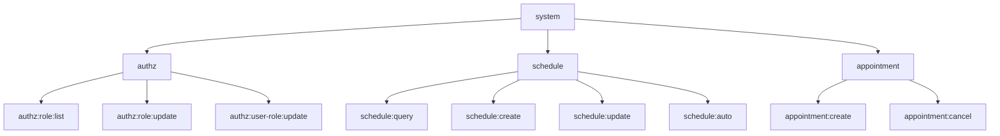

# A3. 样例

## 1. 权限树（示意）



## 2. ABAC 策略样例（JSON 示意）

```json
{
  "rule": "doctor-view-record",
  "condition": {
    "and": [
      { "subject.role": "DOCTOR" },
      { "resource.type": "MEDICAL_RECORD" },
      { "action": "READ" }
    ]
  },
  "dataFilter": {
    "or": [
      { "patient.attendingDoctorId": "${subject.userId}" },
      { "record.departmentId": "${subject.departmentId}" },
      { "record.isEmergency": true }
    ]
  },
  "audit": true
}
```

## 3. 审计事件样例（JSON 示意）

```json
{
  "event": "audit_log",
  "trace_id": "t-abc",
  "user_id": 100,
  "action": "ROLE_ASSIGN",
  "resource_type": "USER",
  "resource_id": "200",
  "success": true,
  "timestamp": "2026-02-13T22:00:00"
}
```
