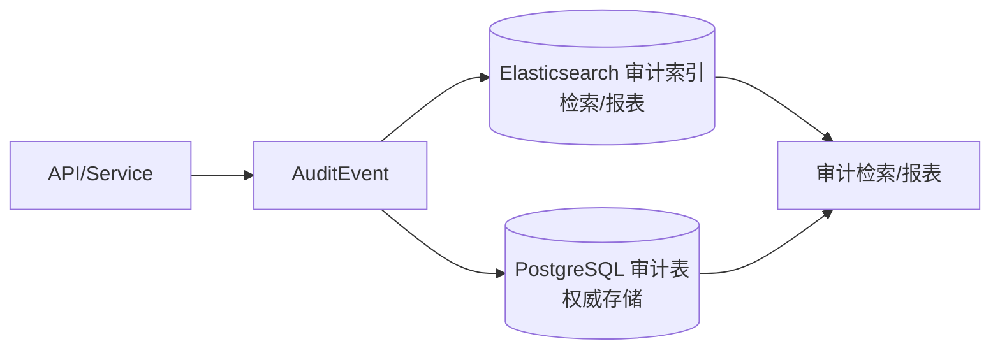
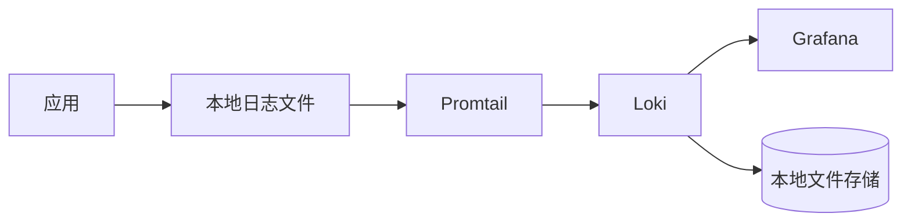

# 工业级日志设计规范（mediask-be）

> 目标：用一套可落地、可运维、可合规的日志体系，覆盖排障、审计追溯、风控与安全事件响应，并与现有权限/审计与 AI 护栏文档口径一致。
>
> 关联文档：
> - `MediAskDocs/docs/02-CODE_STANDARDS.md`（关键业务操作需 INFO，异常需带上下文）
> - `MediAskDocs/docs/15-PERMISSIONS/05-AUDIT_AND_INTEGRITY.md`（审计字段与最小事件集）
> - `MediAskDocs/docs/11-AI_GUARDRAILS_PLAN.md`（AI 护栏审计字段与"只记录脱敏/哈希"原则）
> - `MediAskDocs/docs/16-LOGGING_DESIGN/appendix/`（附录：代码实现与配置片段）

---

## 1. 日志分层与边界（必须区分）

### 1.1 四类日志

1. **访问日志（Access Log）**
   - 目的：请求级可观测性（URI、状态码、延迟、IP、UA）。
   - 位置：网关/Ingress 或应用 HTTP 层（建议两者至少其一）。
2. **应用日志（Application Log）**
   - 目的：排障与运行状态；"发生了什么、为什么失败"。
   - 位置：业务代码（Service/Infra）、框架拦截器、异常处理器。
3. **审计日志（Audit Log，合规日志）**
   - 目的：合规追溯与举证；"谁对什么资源做了什么操作，结果如何"。
   - 位置：独立审计事件写入链路（推荐结构化事件 + 持久化 + 访问控制）。
4. **安全日志（Security Log）**
   - 目的：检测攻击与滥用（认证失败、越权尝试、风控命中、黑名单/限流触发）。
   - 位置：认证/鉴权/风控组件。

### 1.2 必须遵守的边界

- **应用日志不等于审计日志**：应用日志可采样、可滚动删除；审计日志必须完整、可查询、可控留存。
- **访问日志不承载业务细节**：只记录请求维度的摘要字段。
- **任何日志默认不记录 PII/病历原文**：需要时用脱敏结果、摘要或哈希替代。

---

## 2. 统一字段规范（结构化日志）

### 2.1 统一格式

- **一行一个事件**（JSON Lines），UTF-8，LF。
- **严禁多行拼接业务对象**（避免解析/检索困难）。

### 2.2 通用字段（所有日志类型至少具备）

> 说明：下文用 `http.status`、`client.ip` 这种形式表示“字段路径”（JSON Path 语义）。实际 JSON 可以用嵌套对象（推荐）或扁平 key（不推荐，易混淆）。

| 字段 | 类型 | 说明 |
|---|---|---|
| `ts` | string | ISO8601 时间（含时区） |
| `level` | string | `DEBUG/INFO/WARN/ERROR` |
| `service` | string | 服务名：`mediask-api`/`mediask-worker` |
| `env` | string | `dev/test/prod` |
| `request_id` | string | 必须：请求 ID（透传/生成 `X-Request-Id`，用于排障/审计对齐） |
| `request_trace_id` | string | 建议：应用侧“请求链路 ID”（透传/生成 `X-Trace-Id`，用于 Java ↔ Python 等跨系统日志串联） |
| `trace_id` | string | 必须：链路追踪 ID（启用 SkyWalking 时来自 `tid`；否则用 `request_trace_id` 回填） |
| `span_id` | string | 可选（有链路系统时） |
| `logger` | string | 类名/日志器名 |
| `msg` | string | 人类可读简述（短句） |

### 2.3 HTTP 字段（Access Log + 处理 HTTP 的 App Log）

| 字段 | 类型 | 说明 |
|---|---|---|
| `http.method` | string | GET/POST/... |
| `http.path` | string | 路径（不要带敏感 query） |
| `http.status` | int | 状态码 |
| `http.latency_ms` | int | 耗时 |
| `client.ip` | string | 客户端 IP（真实 IP 口径统一） |
| `client.ua` | string | User-Agent（可截断） |
| `user.id` | number/string | 已登录用户 ID（无则空） |
| `user.type` | string/int | 管理员/医生/患者等口径（与系统一致） |

### 2.4 业务与错误字段（App/Security/Audit 按需）

| 字段 | 类型 | 说明 |
|---|---|---|
| `event` | string | 事件名：如 `appointment.create`、`auth.login_failed` |
| `action` | string | 动作码（审计用）：如 `ROLE_ASSIGN`、`RECORD_VIEW` |
| `resource.type` | string | 资源类型 |
| `resource.id` | string | 资源 ID |
| `result` | string | `success/fail/deny` |
| `error.code` | string | 业务错误码（如 `ErrorCode`） |
| `error.msg` | string | 错误摘要（不含敏感原文） |
| `exception.type` | string | 异常类名（ERROR 级别） |
| `exception.stack` | string | 堆栈（可配置仅非 prod 或截断） |

---

## 3. 链路追踪与请求上下文（必须落地）

### 3.1 trace_id 生成与传递

- **trace_id 口径（优先级）**：
  1. **启用 SkyWalking Agent 时**：以 SkyWalking 注入的 `tid` 作为日志中的 `trace_id`（用于全链路追踪对齐）。
  2. **未启用 Agent 时**：若请求头存在 `X-Trace-Id` 则沿用；若无 `X-Trace-Id` 但有 `X-Request-Id` 则使用 `X-Request-Id`；两者都没有再生成新值作为 `trace_id`；如实现了该机制，响应头回传 `X-Trace-Id`。
- **request_id**：若请求头存在 `X-Request-Id` 则沿用；否则生成并回传。`request_id` 用于“同一次请求”的稳定标识（即使没有链路系统也能串起 access/app/audit）。
- **跨线程传播（必须）**：异步任务/线程池需要传播 MDC（否则日志断链）。
- **写审计必须带 trace_id**：保证"审计事件 ↔ 请求 ↔ 应用错误"可对齐查询。
- **清理**：请求结束必须清理 MDC（避免线程复用导致上下文串号）。

### 3.2 请求上下文（必须）

对所有处理 HTTP 请求的日志（access/app/security/audit），请求上下文至少要能被检索到：

- `trace_id`：链路追踪主键（启用 SkyWalking 时来自 `tid`；否则由 `request_trace_id` 回填）
- `request_id`：请求 ID（从 `X-Request-Id` 读取或生成）
- `request_trace_id`：应用侧请求链路 ID（从 `X-Trace-Id` 读取或生成，建议始终存在）
- `http.method`：HTTP 方法
- `http.path`：请求路径（不包含敏感 query）
- `http.status`：响应状态码（access log 必须）
- `http.latency_ms`：耗时（access log 必须）
- `client.ip`：客户端 IP（统一"真实 IP"口径）
- `client.ua`：User-Agent（允许截断）

约束：

- query 参数默认不入日志；如必须记录，仅允许白名单字段，并先脱敏。
- 请求/响应 body 默认不入日志；如为调试需要，仅允许在 `dev` 打开且必须脱敏。

### 3.3 用户上下文口径

- `user.id/user.type/department` 等必须来自"已认证主体"，不得信任客户端自报字段。
- 未登录请求不写 `user.*`，但仍写 `client.ip`、`trace_id`。

### 3.4 MDC 映射（与代码口径一致）

项目内建议使用 MDC 保存请求级上下文，字段命名与代码常量保持一致：

- `tid`：SkyWalking 自动注入（启用 Agent 时存在），对应日志字段 `trace_id`
- `traceId`：应用侧“请求链路 ID”（未启用 Agent 或需要双链路对齐时使用），对应日志字段 `request_trace_id`
- `requestId`：对应日志字段 `request_id`
- `userId`：对应 `user.id`
- `requestUri`：对应 `http.path`

说明：MDC key 使用 camelCase（如 `traceId`），日志字段建议使用 snake_case（如 `trace_id`）。输出时通过日志格式化层做映射即可。

### 3.5 异步线程池的 MDC 传播（必须）

MDC（Mapped Diagnostic Context）是线程本地（ThreadLocal）上下文：只在**当前线程**生效。

因此当代码使用以下任意异步机制时，都会发生"换线程"，导致异步日志默认丢失 `traceId/userId/requestUri`：

- Spring `@Async`
- `CompletableFuture` / 自建 `ExecutorService`
- 定时任务触发后再异步分发执行

**要求**：

- 提交任务到线程池时，把"提交线程"的 MDC 上下文复制到任务中。
- 任务开始前 `MDC.setContextMap(...)`，任务结束后 `MDC.clear()`，避免线程复用导致串号。

**实现建议（Spring）**：

- 线程池配置 `TaskDecorator`，统一对 `Runnable` 做 MDC copy/restore（推荐）。
- 不在业务代码里散落手写 `MDC.put/clear`，避免漏清理与污染。

---

## 4. 应用日志规范（用于排障）

### 4.1 级别约定

- `INFO`：关键业务动作开始/结束（带结果与关键 ID）。
- `WARN`：可恢复但异常的路径（重试、降级、外部依赖慢、风控命中但允许）。
- `ERROR`：请求失败/不可恢复错误（必须带 `trace_id` + 业务关键 ID + `error.code`）。

### 4.2 应该记录什么

- 业务关键 ID：`appointmentId/scheduleId/conversationId` 等。
- 外部依赖调用：目标系统、耗时、结果（不落敏感 payload）。
- 异常：错误码、摘要、堆栈（按环境策略）。

### 4.3 禁止记录什么

- 密码/验证码/Refresh Token/JWT 原文。
- 病历原文、处方详情原文（必要时用脱敏摘要）。
- 身份证/手机号/地址等 PII 原文（用脱敏或哈希）。

---

## 5. 审计日志设计（合规核心）

与 `MediAskDocs/docs/15-PERMISSIONS/05-AUDIT_AND_INTEGRITY.md` 口径一致：审计事件完整、可检索、可控访问、数据最小化。

### 5.1 审计事件模型（最小字段集合）

- 主体：`user_id/username/user_role/user_department`
- 行为：`action/action_name`
- 客体：`resource_type/resource_id`
- 上下文：`client_ip/user_agent/trace_id`
- 结果：`success/fail_reason`
- 时间：`timestamp/created_at`
- 变更详情：`old_value/new_value/request_params`（必须脱敏后存储或用哈希/摘要替代）

### 5.2 审计事件命名建议

- `action` 用稳定枚举（如 `ROLE_ASSIGN`、`APPOINTMENT_CANCEL`）。
- `event` 可作为检索友好名（如 `authz.role.assign`），但审计以 `action` 为主键。

### 5.3 脱敏与最小化（必须）

- 仅记录脱敏文本、摘要或哈希；与 `MediAskDocs/docs/11-AI_GUARDRAILS_PLAN.md` 的 "只记录脱敏/哈希" 保持一致。
- 所有脱敏规则按 `action` 配置化（可审计规则命中 ID）。

### 5.4 防篡改（推荐路线）

1. 链式哈希（`previous_hash`）+ 周期性校验与告警
2. 重要审计写入不可变存储/WORM（P3+ 可选）

---

## 6. 安全日志（检测与响应）

### 6.1 必记安全事件

- 登录失败（含原因类别：密码错误/账号锁定/验证码错误）
- Token 校验失败、权限不足（功能鉴权 deny）
- 对象级授权失败（BOLA/IDOR 尝试）
- 黑名单命中、限流命中
- 紧急授权（break-glass）触发与到期

### 6.2 安全日志字段补充

- `security.rule_id`：命中规则（如 `rate_limit_sensitive_op`）
- `security.decision`：`deny/allow/challenge`
- `security.reason`：原因摘要

---

## 7. 存储、留存、访问控制（运维可落地）

### 7.1 存储建议

- **Trace 数据**：Elasticsearch（SkyWalking 存储）
- **审计日志**：PostgreSQL（持久化）+ Elasticsearch（快速检索）
- **应用/安全日志**：Loki（多实例聚合）
- **单实例场景**：本地日志文件 + Docker 日志驱动

#### 7.1.1 为什么“审计日志 = PostgreSQL + Elasticsearch”，而不是直接上 ELK

- **PostgreSQL 是权威存储**：满足“完整性、强一致、可审计修改、可做权限隔离”的核心诉求（审计查询本身也应再审计）。
- **Elasticsearch 是检索/报表索引**：用于复杂条件检索、聚合统计、趋势分析、按维度钻取（`action/resource/user/department/result`）。
- **Loki 更适合运行日志排障**：按时间线 + 关键 label（`service/env/level/trace_id/request_id`）快速定位问题；不适合作为合规审计的主存储。

> 说明：这里的“加 Elasticsearch”指给审计事件建索引（可用于 Kibana/Grafana 统计），并不等同于把所有应用日志都迁移到 ELK。

#### 7.1.2 审计数据流（推荐）



#### 7.1.3 Elasticsearch 索引设计要点（审计检索/复杂报表/长留存）

- **索引命名**：建议按月/按天分片，例如 `mediask-audit-YYYY.MM`（长留存更建议按月）。
- **Mapping（关键字段）**：
  - `action`、`user.role`、`resource.type`、`result`：`keyword`（用于聚合/分组统计）
  - `msg`、`note`：`text` + `keyword`（需要全文检索时才保留 `text`，否则尽量用 `keyword`）
  - `ts`：`date`
  - `trace_id/request_id/request_trace_id`：`keyword`（用于串联查询）
  - `client.ip`：按需要选择 `ip` 类型（便于 CIDR/范围查询）
- **脱敏与最小化**：
  - ES 索引同样必须遵循“只记录脱敏/哈希/摘要”，严禁把病历原文或 PII 原文直接入索引。
  - 变更详情建议存：`old_hash/new_hash/field_mask` 或结构化差异摘要，而非原文。
- **留存与 ILM（长留存必备）**：
  - 热/温/冷策略：热数据用于近 7～30 天高频检索；冷数据用于举证与历史回溯。
  - 必须配置 ILM（或定期清理任务）保证索引可控增长。
  - 重要数据建议配合快照（Snapshot）做离线归档。
- **权限与合规**：
  - 审计检索必须做权限分级（按角色/部门/敏感动作控制），并记录“谁查了什么审计”。
  - 如使用 Kibana/Grafana 做可视化，也必须加访问控制与导出审计。

### 7.2 留存策略（建议口径，按合规要求可调整）

| 日志类型 | 建议留存 | 存储位置 |
|---------|---------|---------|
| Trace | 7～30 天 | ES |
| 审计日志 | 1～6 年 | PostgreSQL + ES |
| 应用日志 | 7～30 天 | Loki |
| 安全日志 | 90～180 天 | Loki |

### 7.3 访问控制

- 审计日志查询权限分级（登录/操作/权限变更/敏感访问/"查询审计日志"本身也审计）。
- 审计日志导出属于敏感操作：走审批/二次确认并审计。

---

## 8. Loki 日志采集方案（多实例场景）

### 8.1 方案概述

针对单体多实例部署场景，推荐使用 **Loki + Promtail + Grafana** 方案：



**优势**：
- 资源占用低：Loki 比 ELK 轻量得多
- 与 Grafana 集成好：复用现有 Grafana 实例
- 毕设场景友好：本地文件存储足够，无需额外存储系统

### 8.2 数据流向

| 场景 | 数据流向 |
|------|---------|
| 单实例 | 应用 → 本地日志文件（通过 Docker log driver 可直接采集） |
| 多实例 | 应用 → 本地日志文件 → Promtail → Loki → Grafana |

### 8.3 相关配置

- **Docker Compose 配置**：见 `MediAskDocs/docs/16-LOGGING_DESIGN/appendix/01-LOKI_CONFIG.md`
- **Promtail 配置**：见 `MediAskDocs/docs/16-LOGGING_DESIGN/appendix/01-LOKI_CONFIG.md`
- **Logback 配置**：见 `MediAskDocs/docs/16-LOGGING_DESIGN/appendix/02-LOGBACK_CONFIG.md`

---

## 9. 监控与告警（从日志到动作）

### 9.1 最小告警集合（建议）

- `ERROR` 率突增、5xx 突增、延迟 P95/P99 异常（access/app）
- 登录失败激增、同 IP 高频失败（security）
- 对象级授权失败激增（疑似扫库/BOLA）
- 大量导出/查询敏感审计日志行为（audit）

---

## 10. 示例

### 10.1 日志格式示例

详见 `MediAskDocs/docs/16-LOGGING_DESIGN/appendix/03-EXAMPLE_LOGS.md`

### 10.2 JSON Lines 格式

```json
{"ts":"2026-02-13T22:00:00Z","level":"INFO","service":"mediask-api","env":"prod","request_id":"r-123","request_trace_id":"rt-001","trace_id":"t-abc","logger":"http.access","msg":"request completed","http":{"method":"GET","path":"/api/v1/schedules","status":200,"latency_ms":34},"client":{"ip":"203.0.113.10","ua":"Mozilla/5.0"},"user":{"id":100,"type":"patient"}}
```

---

## 11. 落地清单（按优先级）

1. 统一 `trace_id`：入口生成 + MDC 贯穿 + 进入审计事件
2. 结构化日志字段规范：access/app/security/audit 共用字段一致
3. 审计日志最小事件集 + 脱敏最小化 + 访问分级（查询/导出也审计）
4. 审计检索/报表：PostgreSQL 权威存储 + Elasticsearch 索引 + ILM/快照归档
5. 对象级授权失败、安全事件、限流/黑名单命中纳入 security log
6. 留存/归档/导出审批闭环

---

## 附录

- `01-LOKI_CONFIG.md`：Loki + Promtail Docker Compose 配置
- `02-LOGBACK_CONFIG.md`：Logback 日志配置（含 traceId 注入）
- `03-EXAMPLE_LOGS.md`：日志格式示例与审计事件样例
