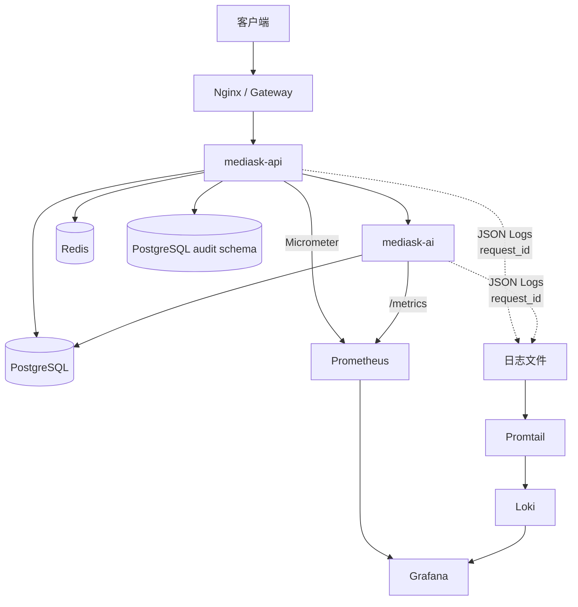
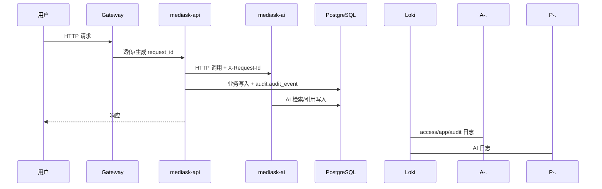
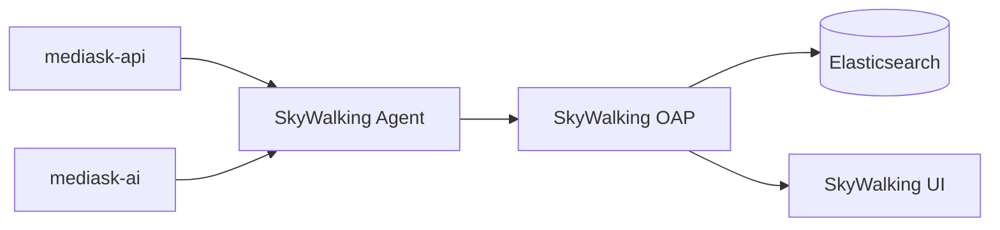

# 可观测性架构设计

> 执行边界说明：`P0` 的最小要求是 `request_id + 结构化日志 + 健康/就绪检查 + 基础 metrics`。端点口径统一为：Java 使用 `/actuator/health` 与 `/actuator/health/readiness`，Python 使用 `/health` 与 `/ready`。Prometheus/Grafana/Loki 属于推荐增强，不应阻塞主链路开发；SkyWalking/Elasticsearch 继续保持 `P2`。

## 1. 背景与需求

### 1.1 毕设背景

本系统 MediAsk（智能医疗辅助问诊系统）采用模块化单体 + 独立 AI 服务架构，涉及 Java 后端（api/application/domain/infrastructure/common/worker）、Python AI 服务、PostgreSQL 数据库（含 pgvector 扩展）、Redis 缓存等多个组件。

在答辩与论文中，需要展示：
- 系统架构的可观测性设计
- 性能监控与问题定位能力
- 对"为什么当前阶段不把 APM 平台做成基线"的取舍能力

### 1.2 选型原则

毕设场景下选择可观测性方案需考虑：

| 考量因素 | 选择倾向 |
|---------|---------|
| 部署复杂度 | 越简单越好，优先本地可控 |
| 与论文关联度 | 方案新颖、有技术含量 |
| 实现工作量 | 不影响核心业务开发 |
| 展示效果 | 界面友好、可视化直观 |

## 2. 技术选型

### 2.1 方案对比

| 方案 | 优点 | 缺点 | 适合场景 |
|------|------|------|---------|
| **Prometheus + Grafana + Loki** | 轻量、易落地、适合单体多实例、足够覆盖 P0/P1 指标与日志排障 | 没有完整 APM 拓扑图 | ✅ **当前基线** |
| SkyWalking + Elasticsearch | 全链路追踪、拓扑图和 APM 展示能力强 | 需要 Agent/OAP/ES，部署和运维复杂度明显上升 | P2 性能诊断/答辩增强 |
| OpenTelemetry + Tempo/Jaeger + Loki + Prometheus | 云原生扩展性好，标准化程度高 | 体系更散、更重，超出当前项目实现边界 | 后续平台化演进 |

### 2.2 最终选择

**P0/P1 基线采用 Prometheus + Grafana + Loki + 统一请求标识；SkyWalking + Elasticsearch 下降为 P2 可选能力**

选择理由：
1. **符合现状**：当前是模块化单体多实例 + 独立 Python AI 服务，不需要一开始就引入完整 APM 平台
2. **优先解决真实问题**：P0/P1 更需要指标、结构化日志、请求串联和审计闭环，而不是拓扑图
3. **部署更轻**：不引入 OAP、Agent、ES，环境更简单，答辩演示也更稳定
4. **口径更统一**：`request_id` 先作为跨网关、Java、Python、审计的统一串联主线
5. **保留升级位**：如果后续确实需要 APM，再把 SkyWalking + ES 作为 P2 增强追加，不推翻现有日志与指标口径

### 2.3 组件职责划分

| 组件 | 职责 | 数据类型 |
|------|------|---------|
| **Request ID** | 串联一次请求在网关、Java、Python、审计中的上下文 | Correlation ID |
| **Loki** | 日志聚合与存储（多实例场景） | Logs |
| **Promtail** | 日志采集（读取本地日志文件） | Logs |
| **Prometheus** | 指标采集（JVM、HTTP、Redisson） | Metrics (Counter/Gauge/Histogram) |
| **Grafana** | 统一可视化面板（指标+日志） | Dashboard |
| **Micrometer** | Spring Boot 指标桥接 | Spring Boot Actuator |
| **SkyWalking（P2）** | 端到端链路追踪、拓扑图、APM | Optional Traces |
| **Elasticsearch（P2）** | SkyWalking Trace 存储；审计投影可选存储 | Optional Trace/Audit Projection |

> Kibana/ES SQL 等仍可作为“审计报表展示层”的可选项，但不再是审计基线依赖。

### 2.4 基线覆盖范围

| 关注点 | P0/P1 基线做法 |
|------|---------------|
| 单次请求串联 | `request_id` |
| Java ↔ Python 跨服务串联 | `request_id` |
| 指标监控 | Prometheus + Micrometer |
| 多实例日志聚合 | Loki + Promtail |
| 审计检索 | PostgreSQL `audit` schema |
| APM / 拓扑图 | 不作为基线；P2 再启用 SkyWalking |

### 2.5 Loki vs Elasticsearch（按日志类型分工）

- **运行日志（access/app/security）**：Loki 更适合排障（时间线 + label 过滤 + 低成本聚合）。
- **审计日志（audit）**：PostgreSQL 同实例 `audit` schema 做权威存储；只有复杂聚合、趋势报表、长周期留存确实需要时才追加 Elasticsearch 投影。
- **可选 APM**：若后续启用 SkyWalking，应只作为增强诊断能力，而不是替代现有日志/指标基线。

## 3. 实施方案

### 3.0 请求标识（强烈建议先定口径）

为避免“应用串联 ID”和“APM trace ID”混用，建议在所有结构化日志里固定输出：

- `request_id`：每个 HTTP 请求必有（透传/生成 `X-Request-Id`），用于 access/app/audit/security 四类日志对齐，也是 Java ↔ Python 的默认串联主键
- `trace_id`：仅在启用 SkyWalking 等 APM 时输出；P0/P1 不把它当作默认串联主键

完整命名与透传规则见：`MediAskDocs/docs/17A-REQUEST_CONTEXT_IMPLEMENTATION.md`

详细字段规范见：`MediAskDocs/docs/16-LOGGING_DESIGN/00-INDEX.md`

### 3.1 Java 侧最小依赖

在 `mediask-api/pom.xml` 中至少添加：

```xml
<!-- Spring Boot Actuator（指标暴露） -->
<dependency>
    <groupId>org.springframework.boot</groupId>
    <artifactId>spring-boot-starter-actuator</artifactId>
</dependency>

<!-- Micrometer Prometheus Registry -->
<dependency>
    <groupId>io.micrometer</groupId>
    <artifactId>micrometer-registry-prometheus</artifactId>
</dependency>
```

> 结构化日志与 MDC 字段规范见：`MediAskDocs/docs/16-LOGGING_DESIGN/00-INDEX.md`

### 3.2 请求标识落地要求

P0/P1 阶段不依赖 SkyWalking Agent，也必须把以下口径先定死：

- 入口统一生成或透传 `X-Request-Id`
- Java 调 Python 时统一透传 `X-Request-Id`
- access/app/security/audit 四类日志统一输出 `request_id`
- 如果启用 P2 APM，再额外输出 `trace_id` / `span_id`
- 审计表写入必须带 `request_id`

请求上下文类名、Header 命名、Filter/Middleware/Interceptor 代码骨架，详见：`MediAskDocs/docs/17A-REQUEST_CONTEXT_IMPLEMENTATION.md`

### 3.3 Docker Compose 本地环境（P0/P1 基线）

#### 3.3.1 完整配置（Prometheus + Grafana + Loki）

```yaml
# docker-compose.observability.yml
version: '3'

services:
  prometheus:
    image: prom/prometheus:v2.48.0
    container_name: prometheus
    ports:
      - "9090:9090"
    volumes:
      - ./prometheus.yml:/etc/prometheus/prometheus.yml
      - prometheus_data:/prometheus
    command:
      - '--config.file=/etc/prometheus/prometheus.yml'
      - '--storage.tsdb.path=/prometheus'
      - '--web.enable-lifecycle'

  grafana:
    image: grafana/grafana:10.2.0
    container_name: grafana
    ports:
      - "3000:3000"
    environment:
      - GF_SECURITY_ADMIN_USER=admin
      - GF_SECURITY_ADMIN_PASSWORD=admin123
    volumes:
      - grafana_data:/var/lib/grafana
      - ./grafana/provisioning:/etc/grafana/provisioning

  loki:
    image: grafana/loki:2.9.0
    container_name: loki
    ports:
      - "3100:3100"
    volumes:
      - ./loki/loki-config.yml:/etc/loki/loki-config.yml
      - loki-data:/loki
    command: -config.file=/etc/loki/loki-config.yml

  promtail:
    image: grafana/promtail:2.9.0
    container_name: promtail
    volumes:
      - ./promtail-local-config.yaml:/etc/promtail/promtail-config.yaml
      - ./logs:/var/log/mediask:ro
    command: -config.file=/etc/promtail/promtail-config.yaml
    depends_on:
      - loki

volumes:
  prometheus_data:
  grafana_data:
  loki-data:

networks:
  default:
    name: observability-network
```

> Loki 详细配置见：`MediAskDocs/docs/16-LOGGING_DESIGN/appendix/01-LOKI_CONFIG.md`

#### 3.3.2 启动命令

```bash
# 启动可观测性平台
docker-compose -f docker-compose.observability.yml up -d

# 启动应用
java -jar mediask-api.jar
```

#### 3.3.3 访问地址汇总

| 服务 | 地址 | 说明 |
|------|------|------|
| Loki | http://localhost:3100 | 日志聚合 |
| Prometheus | http://localhost:9090 | 指标查询 |
| Grafana | http://localhost:3000 | 可视化面板 |
| 应用 metrics | http://localhost:8989/actuator/prometheus | 指标端点 |

### 3.4 Prometheus + Grafana 详细配置

#### 3.4.1 依赖补齐

```xml
<!-- Spring Boot Actuator（指标暴露） -->
<dependency>
    <groupId>org.springframework.boot</groupId>
    <artifactId>spring-boot-starter-actuator</artifactId>
</dependency>

<!-- Micrometer Prometheus Registry（Prometheus 采集端） -->
<dependency>
    <groupId>io.micrometer</groupId>
    <artifactId>micrometer-registry-prometheus</artifactId>
</dependency>
```

#### 3.4.2 配置 Actuator

```yaml
management:
  endpoints:
    web:
      exposure:
        include: health,info,prometheus,metrics
  metrics:
    export:
      prometheus:
        enabled: true
    tags:
      application: ${spring.application.name}
  endpoint:
    health:
      show-details: always
```

暴露的指标端点：`http://localhost:8989/actuator/prometheus`

#### 3.4.3 配置 Prometheus 采集

创建 `prometheus.yml`：

```yaml
# prometheus.yml
global:
  scrape_interval: 15s
  evaluation_interval: 15s

scrape_configs:
  # Prometheus 自身监控
  - job_name: 'prometheus'
    static_configs:
      - targets: ['localhost:9090']

  # Java 应用监控
  - job_name: 'mediask-api'
    metrics_path: '/actuator/prometheus'
    static_configs:
      - targets: ['localhost:8989']
    relabel_configs:
      - source_labels: [__address__]
        target_label: instance
        regex: 'localhost:8989'
        replacement: 'mediask-api'

  # Spring Boot 应用默认指标
  - job_name: 'springboot'
    metrics_path: '/actuator/prometheus'
    static_configs:
      - targets: ['localhost:8989']
```

### 3.5 Grafana 面板配置

#### 3.5.1 添加数据源

1. 访问 http://localhost:3000
2. Configuration → Data Sources → Add data source
3. 添加 Prometheus：`http://prometheus:9090`
4. 添加 Loki：`http://loki:3100`

#### 3.5.2 推荐面板模板

```json
// JVM 监控面板（可从 Grafana Labs 导入）
// https://grafana.com/grafana/dashboards/4701-jvm-micrometer/
```

常用指标查询示例：

```promql
# HTTP 请求速率
rate(http_server_requests_seconds_count{application="mediask-api"}[5m])

# JVM 内存使用
jvm_memory_used_bytes{area="heap",application="mediask-api"}

# 接口响应时间 P99
histogram_quantile(0.99, rate(http_server_requests_seconds_bucket{application="mediask-api"}[5m]))

# 错误率
rate(http_server_requests_seconds_count{application="mediask-api",status=~"5.."}[5m])
```

#### 3.5.3 Loki 日志查询（LogQL）

```logql
# 查询特定服务的日志
{job="mediask"}

# 按 request_id 串联一次请求的所有日志（推荐展示用）
{job="mediask"} | json | request_id="r-123"

# 启用 P2 APM 后，可按 trace_id 过滤
{job="mediask"} | json | trace_id="t-abc123"

# 查询 ERROR 级别日志
{job="mediask", level="ERROR"}
```

### 3.6 Redisson 指标监控

Redisson 3.40.x+ 内置 Micrometer 支持，启用后可采集分布式锁/连接等相关指标（与 RedisTemplate 缓存链路相互独立）：

```java
@Configuration
public class RedissonConfig {

    @Bean
    public RedissonClient redissonClient(RedissonProperties properties) {
        Config config = new Config();
        // ... 你的 Redisson 配置

        // 启用 Micrometer 指标（Redisson 3.40+）
        config.setUseScriptCacheMetrics(true);
        config.setReadMode(RedisConfig.ReadMode.MASTER);
        config.setSubscriptionMode(RedisConfig.SubscriptionMode.MASTER);

        return Redisson.create(config);
    }
}
```

配置后监控的指标：
- `redisson.commands.active`：活跃命令数
- `redisson.commands.pending`：等待命令数
- `redisson.netty.pool.size`：连接池大小

### 3.7 审计检索/报表（PostgreSQL 基线，Elasticsearch 为 P2 可选）

审计监管的默认链路应先收敛为同一 PostgreSQL 实例内的专用 schema：

- **`audit` schema（权威存储）**：`audit_event`、`audit_payload`、`data_access_log`，负责完整留存、严格权限控制、导出审批、访问再审计
- **`event` schema（事件侧）**：`domain_event_stream`、`outbox_event`、`integration_event_archive`，与监管表分离但共享同一 PG 实例
- **分区与索引**：`audit_event`、`data_access_log` 按月分区；列表查询走索引头表，详情页二次鉴权后再查 `audit_payload`

当 PostgreSQL 已无法满足复杂聚合、趋势报表或高频跨维检索时，再追加 Elasticsearch 审计投影。

若启用 ES，关键要点（论文可写）：
- ES 索引只存“可检索字段 + 脱敏/哈希后的变更摘要”，不存病历原文/PII 原文
- ES 只能从 PostgreSQL 异步投影，不能反向变成审计主写入源
- 审计查询本身也要审计（谁在什么时间查询/导出过什么）
- 必须配套 ILM（冷热分层/删除/归档）与快照策略，保证 1～6 年留存可控

详细索引设计见：`MediAskDocs/docs/16-LOGGING_DESIGN/00-INDEX.md`

## 4. SkyWalking 扩展位（P2 可选）

### 4.1 问题分析

如果后续启用 SkyWalking，Redis 往往是最容易断链的一段。

SkyWalking 对 Spring Data Redis（RedisTemplate）链路追踪通常无法“开箱即用”，因此需要手动埋点把缓存操作纳入调用链。

### 4.2 手动埋点实现

在 `mediask-infra` 模块可创建 `TracingRedisTemplate` 工具类（封装 RedisTemplate）：

```java
package me.jianwen.mediask.infrastructure.common.tracing;

import org.apache.skywalking.apm.toolkit.trace.Tracing;
import org.springframework.data.redis.core.RedisTemplate;

import java.time.Duration;

/**
 * Redis 追踪封装工具
 *
 * <p>解决 SkyWalking 不原生支持 Redis 链路追踪的问题，
 * 通过手动埋点将 Redis 缓存操作纳入全链路追踪体系。</p>
 */
public class TracingRedisTemplate {

    private final RedisTemplate<String, Object> delegate;
    private final String redisPeer;

    public TracingRedisTemplate(RedisTemplate<String, Object> delegate, String redisPeer) {
        this.delegate = delegate;
        this.redisPeer = redisPeer;
    }

    /**
     * 写入缓存（带链路追踪）
     */
    public void set(String key, Object value, Duration ttl) {
        Tracing.createExitSpan("redis-set", redisPeer);
        try {
            delegate.opsForValue().set(key, value, ttl);
        } finally {
            Tracing.closeSpan();
        }
    }

    /**
     * 读取缓存（带链路追踪）
     */
    public Object get(String key) {
        Tracing.createExitSpan("redis-get", redisPeer);
        try {
            return delegate.opsForValue().get(key);
        } finally {
            Tracing.closeSpan();
        }
    }
    // ... 其他方法类似
}
```

> 注意：不建议把 `key` 拼到 remotePeer（可能泄露业务标识/PII，且 remotePeer 应保持稳定的 `host:port` 语义）。如确需排障，可对 key 做哈希/截断后作为 tag（或仅在 dev 环境记录）。

### 4.3 使用示例

```java
@Service
public class CacheService {

    private final TracingRedisTemplate redisTemplate;

    @Autowired
    public CacheService(RedisTemplate<String, Object> redisTemplate) {
        this.redisTemplate = new TracingRedisTemplate(redisTemplate, "redis://localhost:6379");
    }

    public UserDTO getUser(String userId) {
        Object cached = redisTemplate.get("user:" + userId);
        if (cached != null) {
            return (UserDTO) cached;
        }
        UserDTO user = userRepository.findById(userId);
        redisTemplate.set("user:" + userId, user, Duration.ofMinutes(30));
        return user;
    }
}
```

### 4.4 论文写作要点（仅在启用 SkyWalking 时使用）

> **针对 SkyWalking 不原生支持 Redis 追踪的问题，本文设计了 TracingRedisTemplate 封装组件。该组件在 Redis 缓存操作的关键路径上埋入追踪点，将原本孤立的缓存操作纳入完整的调用链路中，实现了从用户请求 → 业务逻辑 → 数据库操作 → 缓存读写的全链路可视化。**

## 5. 架构设计（用于论文配图）

### 5.1 P0/P1 可观测性基线图



### 5.2 请求串联与排障流向



### 5.3 P2 扩展位（仅在需要 APM 时启用）



## 6. 毕设答辩展示建议

### 6.1 展示内容

| 展示项 | 说明 | 截图位置 |
|-------|------|---------|
| Grafana 指标面板 | JVM、HTTP、连接池、Redis 指标 | Dashboard 页面 |
| Loki 日志检索 | 按 `request_id` 查询 | Grafana Explore |
| 审计检索 | PostgreSQL `audit` schema 中按 action/资源/时间查询 | 后台审计页 / SQL 查询页 |
| Java ↔ Python 串联 | 展示一次请求在 Java、Python、审计中的同一 `request_id` | 控制台 / Loki |
| P2 预留说明 | 说明为何 SkyWalking/ES 暂不作为基线 | 论文设计章节 |

### 6.2 演示脚本

1. **启动环境**：docker-compose 启动 Prometheus、Grafana、Loki、Promtail
2. **启动应用**：正常启动 `mediask-api` 与 `mediask-ai`
3. **触发请求**：访问任意 API 接口，最好经过一次 Java → Python AI 调用
4. **展示日志**：用 `request_id` 串联本次请求以及 Java ↔ Python 调用
5. **展示指标**：Grafana 中查看 JVM、HTTP、连接池、Redis 指标
6. **展示审计**：查看 `audit.audit_event` / `audit.data_access_log` 对应记录
7. **解释取舍**：说明当前阶段不用 SkyWalking/ES，是为了降低部署复杂度，把精力集中在业务闭环与可落地观测能力上

### 6.3 论文中可以写的亮点

1. **分阶段设计能力**：P0/P1 采用轻量可落地基线，P2 再追加 APM 能力
2. **多实例可观测**：通过 Loki + Promtail 聚合多实例日志
3. **跨服务串联**：通过 `request_id` 将 Java、Python、审计查询统一对齐
4. **指标与日志协同定位**：先看 Prometheus/Grafana 指标，再回到 Loki 与审计定位问题
5. **审计闭环**：业务日志、应用日志与 `audit` schema 互相对齐，不依赖外部搜索引擎
6. **工程务实性**：明确说明为何在单体多实例阶段不把 SkyWalking/ES 设为默认基线

## 7. 常见问题与解决方案

### 7.1 Prometheus + Grafana 相关

| 问题 | 原因 | 解决方案 |
|-----|------|---------|
| 指标不显示 | Actuator 端点未暴露 | 配置 `management.endpoints.web.exposure.include: prometheus` |
| JVM 指标缺失 | 未引入 Micrometer | 添加 `micrometer-registry-prometheus` 依赖 |
| Grafana 面板空白 | 数据源配置错误 | 检查 Prometheus URL 是否可访问 |
| 指标延迟 | `scrape_interval` 设置过长 | 调低 `global.scrape_interval` |

### 7.2 Loki 相关

| 问题 | 原因 | 解决方案 |
|-----|------|---------|
| Promtail 未启动 | 配置文件路径错误 | 检查日志文件路径是否正确挂载 |
| 日志不显示 | Loki 未运行 | 先启动 Loki，再启动 Promtail |
| 标签缺失 | Promtail pipeline 未配置 | 添加 labels 配置 |
| 无法跨服务串联 | 未透传 `X-Request-Id` | 统一在 Java → Python 调用中透传 `request_id` |

### 7.3 P2 可选 SkyWalking 相关

| 问题 | 原因 | 解决方案 |
|-----|------|---------|
| traceId 显示 N/A | Java Agent 未正确加载 | 确认 `-javaagent` 参数在 `-jar` 之前 |
| Redis 无追踪 | SkyWalking 不自动支持 RedisTemplate | 使用 `TracingRedisTemplate` 手动埋点 |
| 链路断裂 | 跨服务调用未传递上下文 | 确保 HTTP Client 正确透传上下文 |
| 数据未上报 | OAP 未启动 | 先启动 SkyWalking，再启动应用 |

### 7.4 Docker Compose 常见问题

```bash
# 端口冲突
# 解决：修改 docker-compose.yml 中的端口映射

# 数据持久化问题
# 解决：确保 volumes 已正确挂载

# Promtail 读不到日志
# 解决：检查宿主机/容器中的日志目录挂载与权限
```

## 8. 参考资料

### 8.1 Prometheus
- [Prometheus 官方文档](https://prometheus.io/docs/introduction/overview/)
- [Micrometer 官方文档](https://micrometer.io/docs)

### 8.2 Grafana
- [Grafana 官方文档](https://grafana.com/docs/grafana/)
- [Grafana Dashboards](https://grafana.com/grafana/dashboards/)

### 8.3 Loki
- [Loki 官方文档](https://grafana.com/docs/loki/latest/)
- [Promtail 配置](https://grafana.com/docs/loki/latest/clients/promtail/)
- [LogQL 查询语言](https://grafana.com/docs/loki/latest/logql/)

### 8.4 SkyWalking（P2 可选）
- [Apache SkyWalking 官方文档](https://skywalking.apache.org/docs/)
- [SkyWalking GitHub](https://github.com/apache/skywalking)
- [SkyWalking Java Agent 配置](https://skywalking.apache.org/docs/main/latest/en/setup/service-agent/java-agent/config/)

### 8.5 相关文档
- [项目日志设计](./16-LOGGING_DESIGN/00-INDEX.md)
- [DevOps 配置](./04-DEVOPS.md)
- [测试规范](./05-TESTING.md)
