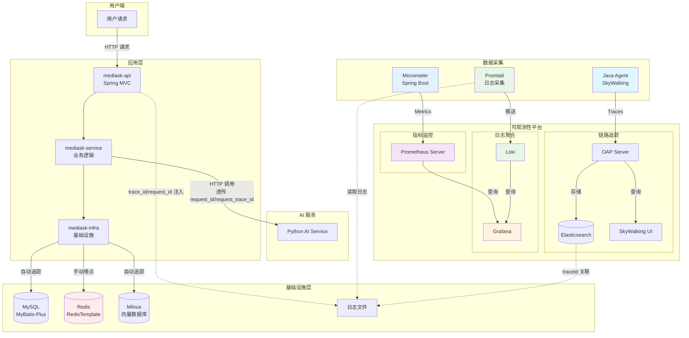
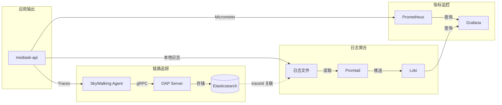
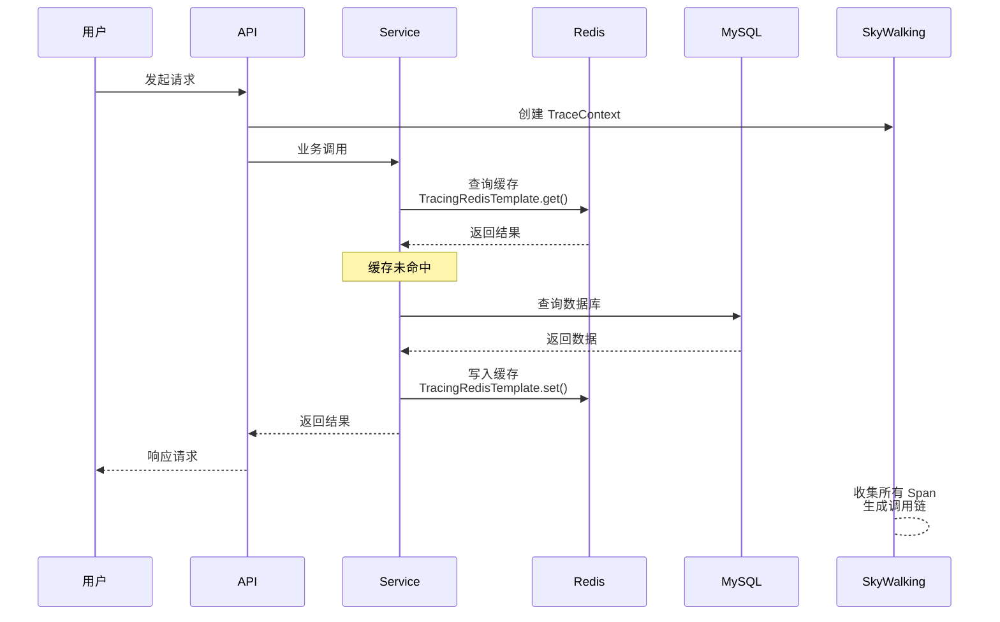

# 可观测性架构设计

## 1. 背景与需求

### 1.1 毕设背景

本系统 MediAsk（智能医疗辅助问诊系统）采用单体多实例架构，涉及 Java 后端（API/Service/Domain/Infra/DAL）、Python AI 服务、MySQL 数据库、Redis 缓存、Milvus 向量数据库等多个组件。

在答辩与论文中，需要展示：
- 系统架构的可观测性设计
- 全链路追踪能力
- 性能监控与问题定位能力

### 1.2 选型原则

毕设场景下选择可观测性方案需考虑：

| 考量因素 | 选择倾向 |
|---------|---------|
| 部署复杂度 | 越简单越好，优先本地可控 |
| 与论文关联度 | 方案新颖、有技术含量 |
| 实现工作量 | 不影响核心业务开发 |
| 展示效果 | 界面友好、可视化直观 |

## 2. 技术选型

### 2.1 方案对比

| 方案 | 优点 | 缺点 | 适合场景 |
|------|------|------|---------|
| **SkyWalking** | 全链路+日志+APM一体化；国产开源认可度高；界面专业 | Redis 追踪需手动埋点 | ✅ 毕设推荐 |
| Prometheus + Grafana | 指标监控成熟；生态丰富；企业级 | 链路追踪需另装 Jaeger | 有经验的团队 |
| **SkyWalking + Prometheus + Grafana** | 链路 + 指标一体化；技术栈完整 | 部署稍复杂 | ✅ **毕设+学习双赢** |

### 2.2 最终选择

**SkyWalking + Prometheus + Grafana + Loki + Elasticsearch（审计索引）共存方案**

选择理由：
1. **学习价值**：实习中已接触 Prometheus，毕设深入学习可提升工作能力
2. **技术完整**：链路追踪（SkyWalking）+ 指标监控（Prometheus）+ 日志聚合（Loki）+ 可视化（Grafana）
3. **论文加分**：展示对可观测性三支柱（Traces/Metrics/Logs）的整体理解
4. **工作助力**：掌握 Prometheus + Grafana 是后端开发必备技能
5. **审计亮点**：审计事件采用 MySQL 权威存储 + Elasticsearch 检索/聚合，用于复杂审计检索、报表统计与长留存（不把全部运行日志搬到 ELK）

### 2.3 组件职责划分

| 组件 | 职责 | 数据类型 |
|------|------|---------|
| **SkyWalking** | 链路追踪、拓扑图、日志关联、APM | Traces, Spans, Logs |
| **Loki** | 日志聚合与存储（多实例场景） | Logs |
| **Promtail** | 日志采集（读取本地日志文件） | Logs |
| **Prometheus** | 指标采集（JVM、HTTP、Redisson） | Metrics (Counter/Gauge/Histogram) |
| **Grafana** | 统一可视化面板（指标+日志） | Dashboard |
| **Micrometer** | Spring Boot 指标桥接 | Spring Boot Actuator |
| **Elasticsearch** | SkyWalking Trace 存储；审计事件索引（检索/报表/长留存） | Traces, Audit Index |

> Kibana/ES SQL 等可作为“审计报表展示层”的可选项；毕设也可以直接使用 Grafana 的 Elasticsearch 数据源做统计面板。

### 2.5 Loki vs Elasticsearch（按日志类型分工）

- **运行日志（access/app/security）**：Loki 更适合排障（时间线 + label 过滤 + 低成本聚合）。
- **审计日志（audit）**：MySQL 做权威存储；Elasticsearch 做检索/聚合（复杂条件、分组统计、趋势报表、长周期留存）。
- **避免误区**：不是“有 ES 就把所有日志都上 ES”。在毕设/单体多实例场景，分层存储更清晰、更可控，也更符合合规审计的思路。

### 2.4 组件追踪支持情况

| 组件 | SkyWalking | Prometheus (Micrometer) |
|------|-----------|------------------------|
| Spring MVC | ✅ 自动追踪 | ✅ HTTP 请求指标 |
| MyBatis-Plus / JDBC | ✅ 自动追踪 | ✅ JDBC 连接池指标 |
| **Spring Data Redis（RedisTemplate）** | ❌ 手动埋点 | ✅（基础 JVM/HTTP 指标开箱即用；Redis 客户端指标按能力补齐） |
| JVM 内存 | ❌ | ✅ 内存/GC 指标 |
| 日志 traceId | ✅ Logback 集成 | ❌ |

## 3. 实施方案

### 3.0 请求标识（强烈建议先定口径）

为避免“有 APM 时用一套 traceId、没 APM 或跨语言时又用另一套”的混乱，建议在所有结构化日志里固定输出：

- `request_id`：每个 HTTP 请求必有（透传/生成 `X-Request-Id`），用于 access/app/audit/security 四类日志对齐
- `request_trace_id`：应用侧请求链路 ID（透传/生成 `X-Trace-Id`），用于 Java ↔ Python AI 服务等跨系统日志串联
- `trace_id`：启用 SkyWalking Agent 时取 SkyWalking 注入的 `tid`；否则用 `request_trace_id` 回填

详细字段规范见：`MediAskDocs/docs/16-LOGGING_DESIGN/00-INDEX.md`

### 3.1 添加依赖

在 `mediask-api/pom.xml` 中添加：

```xml
<!-- SkyWalking Logback 工具包（用于日志注入 traceId） -->
<dependency>
    <groupId>org.apache.skywalking</groupId>
    <artifactId>apm-toolkit-logback-1.x</artifactId>
    <version>9.1.0</version>
</dependency>
```

> 详细配置见：`MediAskDocs/docs/16-LOGGING_DESIGN/appendix/02-LOGBACK_CONFIG.md`

### 3.2 启动 Java Agent

#### 3.2.1 下载 SkyWalking Agent

```bash
curl -O https://archive.apache.org/dist/skywalking/9.1.0/apache-skywalking-apm-9.1.0.tar.gz
tar -xzf apache-skywalking-apm-9.1.0.tar.gz
```

#### 3.2.2 本地启动命令

```bash
java -javaagent:/path/to/skywalking-agent/skywalking-agent.jar \
     -DSW_AGENT_NAME=mediask-api \
     -DSW_OAP_SERVER_ADDRESS=localhost:11800 \
     -jar mediask-api.jar
```

**毕设答辩展示时**，建议预先启动 SkyWalking，确保 Agent 能正确连接上报数据。

### 3.3 Docker Compose 本地环境

#### 3.3.1 完整配置（SkyWalking + Prometheus + Grafana + Loki）

```yaml
# docker-compose.observability.yml
version: '3'

services:
  # ============ SkyWalking ============
  skywalking-oap:
    image: apache/skywalking-oap-server:9.1.0
    container_name: skywalking-oap
    ports:
      - "11800:11800"   # gRPC（Agent 数据上报）
      - "12800:12800"   # HTTP（UI API）
    environment:
      TZ: Asia/Shanghai
      SW_STORAGE: elasticsearch
      SW_STORAGE_ES_CLUSTER_NAME: docker-cluster
      SW_STORAGE_ES_NODE_NODES: http://elasticsearch:9200

  skywalking-ui:
    image: apache/skywalking-ui:9.1.0
    container_name: skywalking-ui
    ports:
      - "8080:8080"
    environment:
      TZ: Asia/Shanghai
      SW_OAP_ADDRESS: http://skywalking-oap:12800
    depends_on:
      - skywalking-oap

  # ============ Loki + Promtail ============
  loki:
    image: grafana/loki:2.9.0
    container_name: loki
    ports:
      - "3100:3100"
    volumes:
      - ./loki/loki-config.yml:/etc/loki/loki-config.yml
      - loki-data:/loki
    command: -config.file=/etc/loki/loki-config.yml

  promtail:
    image: grafana/promtail:2.9.0
    container_name: promtail
    volumes:
      - ./promtail-local-config.yaml:/etc/promtail/promtail-config.yaml
      - ./logs:/var/log/mediask:ro
    command: -config.file=/etc/promtail/promtail-config.yaml
    depends_on:
      - loki

  # ============ Prometheus + Grafana ============
  prometheus:
    image: prom/prometheus:v2.48.0
    container_name: prometheus
    ports:
      - "9090:9090"
    volumes:
      - ./prometheus.yml:/etc/prometheus/prometheus.yml
      - prometheus_data:/prometheus
    command:
      - '--config.file=/etc/prometheus/prometheus.yml'
      - '--storage.tsdb.path=/prometheus'
      - '--web.enable-lifecycle'

  grafana:
    image: grafana/grafana:10.2.0
    container_name: grafana
    ports:
      - "3000:3000"
    environment:
      - GF_SECURITY_ADMIN_USER=admin
      - GF_SECURITY_ADMIN_PASSWORD=admin123
    volumes:
      - grafana_data:/var/lib/grafana
      - ./grafana/provisioning:/etc/grafana/provisioning

  # ============ 数据存储 ============
  elasticsearch:
    image: elasticsearch:8.11.0
    container_name: skywalking-es
    ports:
      - "9200:9200"
    environment:
      TZ: Asia/Shanghai
      discovery.type: single-node
      ES_JAVA_OPTS: "-Xms512m -Xmx512m"
      xpack.security.enabled: false

  # 说明：
  # - 该 Elasticsearch 既可作为 SkyWalking 的 Trace 存储，也可以承载“审计索引”（mediask-audit-*）。
  # - 若你更强调“审计长留存/复杂报表”，建议在论文中说明：审计索引与 SkyWalking 索引在命名空间与 ILM 策略上隔离，
  #   或者在资源允许时使用独立 ES 集群，避免相互影响。

volumes:
  prometheus_data:
  grafana_data:
  loki-data:

networks:
  default:
    name: observability-network
```

> Loki 详细配置见：`MediAskDocs/docs/16-LOGGING_DESIGN/appendix/01-LOKI_CONFIG.md`

#### 3.3.2 启动命令

```bash
# 启动可观测性平台
docker-compose -f docker-compose.observability.yml up -d

# 启动应用（带 SkyWalking Agent）
java -javaagent:/path/to/skywalking-agent/skywalking-agent.jar \
     -DSW_AGENT_NAME=mediask-api \
     -DSW_OAP_SERVER_ADDRESS=localhost:11800 \
     -jar mediask-api.jar
```

#### 3.3.3 访问地址汇总

| 服务 | 地址 | 说明 |
|------|------|------|
| SkyWalking UI | http://localhost:8080 | 链路追踪 |
| Loki | http://localhost:3100 | 日志聚合 |
| Prometheus | http://localhost:9090 | 指标查询 |
| Grafana | http://localhost:3000 | 可视化面板 |
| 应用 metrics | http://localhost:8989/actuator/prometheus | 指标端点 |

### 3.4 Prometheus + Grafana 集成

#### 3.4.1 添加依赖

```xml
<!-- Spring Boot Actuator（指标暴露） -->
<dependency>
    <groupId>org.springframework.boot</groupId>
    <artifactId>spring-boot-starter-actuator</artifactId>
</dependency>

<!-- Micrometer Prometheus Registry（Prometheus 采集端） -->
<dependency>
    <groupId>io.micrometer</groupId>
    <artifactId>micrometer-registry-prometheus</artifactId>
</dependency>
```

#### 3.4.2 配置 Actuator

```yaml
management:
  endpoints:
    web:
      exposure:
        include: health,info,prometheus,metrics
  metrics:
    export:
      prometheus:
        enabled: true
    tags:
      application: ${spring.application.name}
  endpoint:
    health:
      show-details: always
```

暴露的指标端点：`http://localhost:8989/actuator/prometheus`

#### 3.4.3 配置 Prometheus 采集

创建 `prometheus.yml`：

```yaml
# prometheus.yml
global:
  scrape_interval: 15s
  evaluation_interval: 15s

scrape_configs:
  # Prometheus 自身监控
  - job_name: 'prometheus'
    static_configs:
      - targets: ['localhost:9090']

  # Java 应用监控
  - job_name: 'mediask-api'
    metrics_path: '/actuator/prometheus'
    static_configs:
      - targets: ['localhost:8989']
    relabel_configs:
      - source_labels: [__address__]
        target_label: instance
        regex: 'localhost:8989'
        replacement: 'mediask-api'

  # Spring Boot 应用默认指标
  - job_name: 'springboot'
    metrics_path: '/actuator/prometheus'
    static_configs:
      - targets: ['localhost:8989']
```

### 3.5 Grafana 面板配置

#### 3.5.1 添加数据源

1. 访问 http://localhost:3000
2. Configuration → Data Sources → Add data source
3. 添加 Prometheus：`http://prometheus:9090`
4. 添加 Loki：`http://loki:3100`

#### 3.5.2 推荐面板模板

```json
// JVM 监控面板（可从 Grafana Labs 导入）
// https://grafana.com/grafana/dashboards/4701-jvm-micrometer/
```

常用指标查询示例：

```promql
# HTTP 请求速率
rate(http_server_requests_seconds_count{application="mediask-api"}[5m])

# JVM 内存使用
jvm_memory_used_bytes{area="heap",application="mediask-api"}

# 接口响应时间 P99
histogram_quantile(0.99, rate(http_server_requests_seconds_bucket{application="mediask-api"}[5m]))

# 错误率
rate(http_server_requests_seconds_count{application="mediask-api",status=~"5.."}[5m])
```

#### 3.5.3 Loki 日志查询（LogQL）

```logql
# 查询特定服务的日志
{job="mediask"}

# 按 traceId 过滤
{job="mediask"} | json | trace_id="t-abc123"

# 按 request_id 串联一次请求的所有日志（推荐展示用）
{job="mediask"} | json | request_id="r-123"

# 查询 ERROR 级别日志
{job="mediask", level="ERROR"}
```

### 3.6 Redisson 指标监控

Redisson 3.40.x+ 内置 Micrometer 支持，启用后可采集分布式锁/连接等相关指标（与 RedisTemplate 缓存链路相互独立）：

```java
@Configuration
public class RedissonConfig {

    @Bean
    public RedissonClient redissonClient(RedissonProperties properties) {
        Config config = new Config();
        // ... 你的 Redisson 配置

        // 启用 Micrometer 指标（Redisson 3.40+）
        config.setUseScriptCacheMetrics(true);
        config.setReadMode(RedisConfig.ReadMode.MASTER);
        config.setSubscriptionMode(RedisConfig.SubscriptionMode.MASTER);

        return Redisson.create(config);
    }
}
```

配置后监控的指标：
- `redisson.commands.active`：活跃命令数
- `redisson.commands.pending`：等待命令数
- `redisson.netty.pool.size`：连接池大小

### 3.7 审计检索/报表（Elasticsearch）

如果你的重点是“审计检索/复杂报表/长留存”，建议把 **审计事件** 单独做成两条链路：

- **MySQL（权威存储）**：完整留存、严格权限控制、导出审批、支持防篡改字段（如 `previous_hash`）
- **Elasticsearch（索引）**：为检索与统计服务（按 `action/resource/user/department/result` 聚合，按时间趋势分析）

推荐索引名：`mediask-audit-YYYY.MM`（长留存场景下更易做 ILM/归档）。

关键要点（论文可写）：
- ES 索引只存“可检索字段 + 脱敏/哈希后的变更摘要”，不存病历原文/PII 原文
- 审计查询本身也要审计（谁在什么时间查询/导出过什么）
- 必须配套 ILM（冷热分层/删除/归档）与快照策略，保证 1～6 年留存可控

详细索引设计见：`MediAskDocs/docs/16-LOGGING_DESIGN/00-INDEX.md`

## 4. Redis 追踪方案（论文亮点）

### 4.1 问题分析

SkyWalking 对 Spring Data Redis（RedisTemplate）链路追踪通常无法“开箱即用”，这是**技术难点**，也是论文的**创新点**——通过手动埋点把缓存操作纳入调用链。

### 4.2 手动埋点实现

在 `mediask-infra` 模块创建 `TracingRedisTemplate` 工具类（封装 RedisTemplate）：

```java
package me.jianwen.mediask.infra.common.tracing;

import org.apache.skywalking.apm.toolkit.trace.Tracing;
import org.springframework.data.redis.core.RedisTemplate;

import java.time.Duration;

/**
 * Redis 追踪封装工具
 *
 * <p>解决 SkyWalking 不原生支持 Redis 链路追踪的问题，
 * 通过手动埋点将 Redis 缓存操作纳入全链路追踪体系。</p>
 */
public class TracingRedisTemplate {

    private final RedisTemplate<String, Object> delegate;
    private final String redisPeer;

    public TracingRedisTemplate(RedisTemplate<String, Object> delegate, String redisPeer) {
        this.delegate = delegate;
        this.redisPeer = redisPeer;
    }

    /**
     * 写入缓存（带链路追踪）
     */
    public void set(String key, Object value, Duration ttl) {
        Tracing.createExitSpan("redis-set", redisPeer);
        try {
            delegate.opsForValue().set(key, value, ttl);
        } finally {
            Tracing.closeSpan();
        }
    }

    /**
     * 读取缓存（带链路追踪）
     */
    public Object get(String key) {
        Tracing.createExitSpan("redis-get", redisPeer);
        try {
            return delegate.opsForValue().get(key);
        } finally {
            Tracing.closeSpan();
        }
    }
    // ... 其他方法类似
}
```

> 注意：不建议把 `key` 拼到 remotePeer（可能泄露业务标识/PII，且 remotePeer 应保持稳定的 `host:port` 语义）。如确需排障，可对 key 做哈希/截断后作为 tag（或仅在 dev 环境记录）。

### 4.3 使用示例

```java
@Service
public class CacheService {

    private final TracingRedisTemplate redisTemplate;

    @Autowired
    public CacheService(RedisTemplate<String, Object> redisTemplate) {
        this.redisTemplate = new TracingRedisTemplate(redisTemplate, "redis://localhost:6379");
    }

    public UserDTO getUser(String userId) {
        Object cached = redisTemplate.get("user:" + userId);
        if (cached != null) {
            return (UserDTO) cached;
        }
        UserDTO user = userRepository.findById(userId);
        redisTemplate.set("user:" + userId, user, Duration.ofMinutes(30));
        return user;
    }
}
```

### 4.4 论文写作要点

> **针对 SkyWalking 不原生支持 Redis 追踪的问题，本文设计了 TracingRedisTemplate 封装组件。该组件在 Redis 缓存操作的关键路径上埋入追踪点，将原本孤立的缓存操作纳入完整的调用链路中，实现了从用户请求 → 业务逻辑 → 数据库操作 → 缓存读写的全链路可视化。**

## 5. 架构设计（用于论文配图）

### 5.1 可观测性架构图



### 5.2 数据流向图



### 5.3 链路追踪流程图



## 6. 毕设答辩展示建议

### 6.1 展示内容

| 展示项 | 说明 | 截图位置 |
|-------|------|---------|
| SkyWalking UI 主界面 | 整体仪表盘 | 首页 |
| 拓扑图 | 服务间调用关系 | Topology 页面 |
| 链路追踪详情 | 一次请求的完整调用链 | Trace 页面 |
| 日志关联 | 含 `request_id/trace_id` 的业务日志 | 控制台/日志文件 |
| Redis 埋点 | 展示缓存操作的 span | Trace 详情页 |
| Grafana 面板 | JVM 监控、HTTP 指标 | Dashboard 页面 |
| Loki 日志 | 多实例日志聚合查询 | Grafana Explore |
| 审计检索/报表 | 审计事件按 action/资源/角色聚合统计 | Elasticsearch + Grafana（或 Kibana） |

### 6.2 演示脚本

1. **启动环境**：docker-compose 启动可观测性全家桶
2. **启动应用**：带 -javaagent 参数启动 mediask-api
3. **触发请求**：访问任意 API 接口（如登录）
4. **展示追踪**：在 SkyWalking UI 中找到对应 trace
5. **展示日志**：优先用 `request_id` 串联一次请求的 access/app/audit/security；再用 `trace_id` 对齐 SkyWalking trace
6. **展示指标**：Grafana 中查看 JVM/HTTP 监控面板
7. **展示审计**：在 Elasticsearch（Grafana/Kibana）中按 `action/resource/result` 检索与聚合统计（体现长留存与合规检索能力）

### 6.3 论文中可以写的亮点

1. **全链路追踪**：从 HTTP 请求到 SQL 执行、缓存读写的完整链路
2. **零侵入式设计**：Java Agent 方式，对业务代码无侵入
3. **日志链路关联**：通过 Logback MDC 实现日志与链路的自动关联
4. **Redis 追踪方案**：针对 SkyWalking 的不足，设计了 TracingRedisTemplate
5. **多实例日志聚合**：使用 Loki + Promtail 方案，轻量高效
6. **多维度监控**：链路追踪（SkyWalking）+ 指标监控（Prometheus）+ 日志聚合（Loki）+ 可视化（Grafana）
7. **技术体系完整性**：展示对可观测性三支柱（Traces/Metrics/Logs）的整体理解
8. **学以致用**：结合实习经验，将 Prometheus + Grafana 实践应用于毕设，提升工作能力

## 7. 常见问题与解决方案

### 7.1 SkyWalking 相关

| 问题 | 原因 | 解决方案 |
|-----|------|---------|
| traceId 显示 N/A | Java Agent 未正确加载 | 确认 -javaagent 参数在 -jar 之前 |
| Redis 无追踪 | SkyWalking 不自动支持 RedisTemplate | 使用 TracingRedisTemplate 手动埋点 |
| 链路断裂 | 跨服务调用未传递上下文 | 优先使用 SkyWalking 的自动探针；如自建 HTTP Client/Feign，确保已启用对应插件并正确透传上下文 |
| 数据未上报 | OAP Server 未启动 | 先启动 SkyWalking，再启动应用 |

### 7.2 Prometheus + Grafana 相关

| 问题 | 原因 | 解决方案 |
|-----|------|---------|
| 指标不显示 | Actuator 端点未暴露 | 配置 `management.endpoints.web.exposure.include: prometheus` |
| JVM 指标缺失 | 未引入 Micrometer | 添加 `micrometer-registry-prometheus` 依赖 |
| Grafana 面板空白 | 数据源配置错误 | 检查 Prometheus URL 是否可访问 |
| 指标延迟 | scrape_interval 设置过长 | 调低 `global.scrape_interval` |

### 7.3 Loki 相关

| 问题 | 原因 | 解决方案 |
|-----|------|---------|
| Promtail 未启动 | 配置文件路径错误 | 检查日志文件路径是否正确挂载 |
| 日志不显示 | Loki 未运行 | 先启动 Loki，再启动 Promtail |
| 标签缺失 | Promtail pipeline 未配置 | 添加 labels 配置 |

### 7.4 Docker Compose 常见问题

```bash
# Elasticsearch 启动失败（内存不足）
# 解决：增加 Docker 内存限制或调低 ES_JAVA_OPTS

# 端口冲突
# 解决：修改 docker-compose.yml 中的端口映射

# 数据持久化问题
# 解决：确保 volumes 已正确挂载
```

## 8. 参考资料

### 8.1 SkyWalking
- [Apache SkyWalking 官方文档](https://skywalking.apache.org/docs/)
- [SkyWalking GitHub](https://github.com/apache/skywalking)
- [SkyWalking Java Agent 配置](https://skywalking.apache.org/docs/main/latest/en/setup/service-agent/java-agent/config/)

### 8.2 Prometheus
- [Prometheus 官方文档](https://prometheus.io/docs/introduction/overview/)
- [Micrometer 官方文档](https://micrometer.io/docs)

### 8.3 Grafana
- [Grafana 官方文档](https://grafana.com/docs/grafana/)
- [Grafana Dashboards](https://grafana.com/grafana/dashboards/)

### 8.4 Loki
- [Loki 官方文档](https://grafana.com/docs/loki/latest/)
- [Promtail 配置](https://grafana.com/docs/loki/latest/clients/promtail/)
- [LogQL 查询语言](https://grafana.com/docs/loki/latest/logql/)

### 8.5 相关文档
- [项目日志设计](./16-LOGGING_DESIGN/00-INDEX.md)
- [DevOps 配置](./04-DEVOPS.md)
- [测试规范](./05-TESTING.md)
