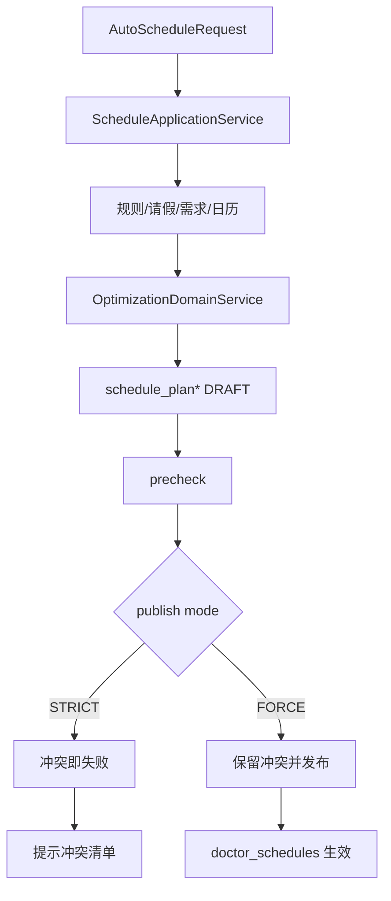

# 排班核心升级设计说明（V2）

> 更新时间：2026-02-16  
> 目标：让排班能力与现实医疗场景同步，并具备工程化可追溯能力。

## 1. 当前已实现什么

## 1.1 数据模型升级（已落库）

新增并接入以下表结构：

1. `calendar_day`
   - 作用：表达法定节假日与调休工作日，不再把日历逻辑写死在代码里。
2. `doctor_availability_rules`
   - 作用：表达医生长期可排/偏好规则（周几+时段）。
3. `doctor_time_off`
   - 作用：表达请假、培训等临时停诊约束。
4. `department_schedule_demand`
   - 作用：表达科室按日期+时段的供给需求。
5. `schedule_plan`
   - 作用：保存方案头（版本、状态、策略、评分）。
6. `schedule_plan_items`
   - 作用：保存方案明细（某日某时段由哪位医生承担）。
7. `schedule_plan_constraint_snapshot`
   - 作用：保存当次求解输入快照（规则、请假、需求、日历、参数）。

## 1.2 自动排班主链路升级（已接入）

`POST /api/v1/schedules/auto` 现在执行逻辑：

1. 读取医生池、可排规则、请假、需求、节假日日历。
2. 执行多医生联合排班优化（软硬约束+解释信息）。
3. 仅生成并落库为 `DRAFT` 方案（不直接生效）。
4. 返回方案评分、解释、未排满信息和 `planId`。

该设计避免算法结果直接改动线上排班，符合医疗场景的“先审后发”流程。

## 1.3 方案发布与回滚（已接入）

新增方案接口：

1. `GET /api/v1/schedule-plans/{planCode}/versions`：查看方案版本。
2. `GET /api/v1/schedule-plans/{planId}/precheck`：发布前预检（不落库）。
3. `POST /api/v1/schedule-plans/{planId}/publish`：发布方案。
4. `POST /api/v1/schedule-plans/{planId}/rollback`：回滚到指定历史版本（本质是重新发布该版本）。

发布模式支持：

1. `STRICT`：存在有效预约冲突即拒绝发布。
2. `FORCE`：保留冲突排班并继续发布，同时返回冲突清单。

## 2. 为什么这么做

## 2.1 与现实同步

医院在法定节假日通常是“降载排班”，不是“全停诊”。因此节假日策略改为可配置：

1. `CLOSE`：节假日停排。
2. `REDUCED`：节假日降载排班（推荐默认）。
3. `NORMAL`：节假日按平日排班。

并且调休工作日（`is_makeup_workday=1`）优先级高于节假日标记，避免“调休当天仍停排”的业务错误。

## 2.2 架构清晰

采取“求解”和“生效”分离：

1. 自动排班负责“生成方案”。
2. 发布接口负责“应用方案”。

收益：

1. 可审核：可先看预检和冲突再发布。
2. 可追溯：可复盘某版本方案为何生成。
3. 可回滚：旧版本可快速重发布。

## 2.3 质量可控

发布前预检可提前暴露风险：

1. 会阻断的冲突数（`wouldBlock`）。
2. 预计新建排班数（`toCreateSchedules`）。
3. 预计关闭排班数（`toCloseSchedules`）。

## 3. 关键流程

## 4. 当前边界与后续建议

当前已覆盖核心闭环，但仍有可增强点：

1. 发布接口增加“干跑差异详情”（新增/关闭/保持不变明细）。
2. 方案明细增加医生负载统计字段，便于管理端可视化。
3. 增加审计日志（谁在何时以何种模式发布/回滚）。

## 5. 结论

当前排班能力已从“朴素自动排班”升级为“现实可用、可审计、可回滚”的方案系统，满足毕设核心模块对业务真实性和工程完整性的要求。
