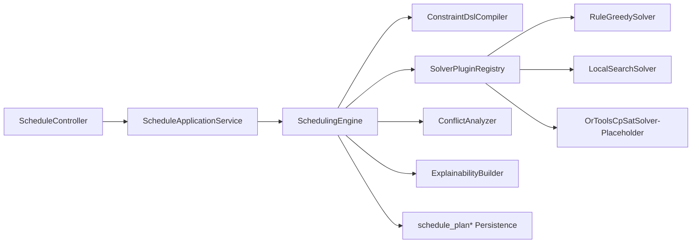

# 排班引擎升级实施方案（V3.1）

> 更新时间：2026-02-19  
> 版本目标：在不引入 OR-Tools 运行依赖的前提下，完成插件化求解架构、JSON DSL 约束、可解释输出、可复现执行与性能增强。  
> 当前范围：单租户（`DEFAULT` 命名空间），多租户隔离延后。

## 1. 升级背景与核心问题

当前排班能力已具备「DRAFT 生成 + 预检 + 发布/回滚」闭环，但仍存在以下工程问题：

1. 求解层抽象不统一，`solverConfig.strategy` 与实际求解流程耦合较弱。
2. 约束规则多为代码内嵌，配置化能力不足，扩展成本高。
3. 对「无解原因、冲突最小集、规则级扣分」的结构化输出不完整。
4. 可复现性（同输入 + seed）与并行评估控制有提升空间。
5. 规则运行时更新、缓存与多实例一致性机制未形成标准实现。

## 2. V3.1 设计目标

### 2.1 功能目标

1. 引入统一抽象：`Constraint`、`Objective`、`Solver`、`SchedulingEngine`。
2. 支持插件化求解器：`RuleGreedySolver`（baseline）+ `LocalSearchSolver` + `OrToolsCpSatSolver`（预留）。
3. 支持约束 JSON DSL：硬约束/软约束、规则参数、权重、AND/OR/NOT 组合。
4. 支持可复现执行：同输入与同随机种子输出稳定。
5. 支持无解诊断：冲突报告与简化版最小冲突集。
6. 支持可解释输出：每条规则触发证据、罚分与分配原因。
7. 支持增量重排入口（基础版）：受影响窗口重排。

### 2.2 非目标（本期明确不做）

1. 不接入 OR-Tools 实际求解，仅提供 `CP_SAT` 插件接口与自动回退。
2. 不实现真实多租户字段与隔离策略，统一以 `DEFAULT` 命名空间运行。
3. 不引入 Spring Cloud 或微服务治理组件。

## 3. 总体架构



## 4. 核心抽象设计

### 4.1 Constraint（约束）

1. 约束分类：`HARD`（必须满足）与 `SOFT`（尽量满足）。
2. 约束结构：`id/type/params/enabled/weight/priority`。
3. 约束执行结果：`satisfied/penalty/reason/evidence`。

### 4.2 Objective（目标函数）

1. 默认采用加权和（weighted-sum）目标。
2. 目标分项：公平性、偏好匹配、连续性、资深覆盖、周末均衡。
3. 支持规则级分解输出，便于论文对比实验。

### 4.3 Solver（求解器）

1. 统一插件接口 `SolverPlugin`，对上暴露一致输入输出。
2. `RuleGreedySolver` 作为基线实现（可解释、稳定、快速）。
3. `LocalSearchSolver` 作为增强实现（局部迭代优化）。
4. `OrToolsCpSatSolver` 先占位，`available=false`。

### 4.4 SchedulingEngine（编排器）

职责：

1. 编译 DSL。
2. 选择 solver（策略、可用性、回退）。
3. 执行求解。
4. 生成可解释结果与冲突诊断。
5. 返回运行元信息（requested/actual solver、seed、fallback reason）。

## 5. JSON DSL 规范（本期）

### 5.1 顶层结构

```json
{
  "version": "1.0",
  "rules": [],
  "hardExpr": {},
  "softExpr": {},
  "objective": {}
}
```

### 5.2 规则定义

```json
{
  "id": "H_MAX_CONSEC",
  "kind": "HARD",
  "type": "MAX_CONSECUTIVE_DAYS",
  "enabled": true,
  "weight": 1.0,
  "params": {
    "maxDays": 5
  }
}
```

### 5.3 组合表达式

支持：

1. `AND`
2. `OR`
3. `NOT`
4. `RULE_REF`

示例：

```json
{
  "op": "AND",
  "children": [
    { "ref": "H_MAX_CONSEC" },
    {
      "op": "OR",
      "children": [
        { "ref": "H_MIN_REST" },
        { "ref": "H_ALT_REST" }
      ]
    }
  ]
}
```

## 6. 可复现性设计

1. 随机源统一为 `SplittableRandom(seed)`，禁止 `Math.random()`。
2. 医生、日期、时段、规则执行顺序统一稳定排序。
3. 并行评估采用稳定归并策略与确定性 tie-break。
4. 快照保存：`inputHash + seed + solverCode + dslHash`。

## 7. 无解诊断与可解释性

### 7.1 无解诊断

输出内容：

1. 冲突时段列表（日期/时段/缺口）。
2. 冲突规则计数（按规则 ID 聚合）。
3. 简化最小冲突集（贪心近似）。

### 7.2 可解释性

输出内容：

1. 每条排班分配的 `reasons` 与 `penalties`。
2. 规则级得分分解。
3. 软约束扣分明细与命中证据。

## 8. 性能与缓存策略

### 8.1 并行评估

1. 新增独立 `scheduleSolverExecutor` 线程池。
2. 候选医生评估在阈值以上并行执行。
3. 小规模问题保持串行以避免线程开销。

### 8.2 增量重排（基础版）

1. 支持按时间窗口与医生集合重排。
2. 默认冻结存在有效预约的已发布排班。
3. 输出差异结果（新增/替换/保留）。

### 8.3 DSL 编译缓存

1. L1：Guava 本地缓存（编译后的约束模型）。
2. L2：Redis 版本键（多实例失效协调）。
3. 缓存键：`namespace + profileKey + version + dslHash`。
4. 失效方式：版本递增 + 本地 TTL 双保险。

## 9. Solver 策略与回退机制

1. 策略枚举：`AUTO`、`RULE_GREEDY`、`LOCAL_SEARCH`、`CP_SAT`。
2. 当请求 `CP_SAT` 且插件不可用时：自动回退 `RULE_GREEDY`。
3. 回退信息进入：`warnings`、运行元数据、快照。

## 10. 数据与接口改造范围

### 10.1 接口改造

`POST /api/v1/schedules/auto` 新增可选字段：

1. `constraintDslJson`：JSON DSL 原文。

兼容策略：

1. 若未传 DSL，则由现有 `hardConstraints + softGoals` 自动生成默认 DSL。

### 10.2 快照增强

`schedule_plan_constraint_snapshot` 增加写入类型：

1. `DSL_SOURCE`
2. `SOLVER_RUN_META`
3. `CONFLICT_REPORT`

## 11. 分阶段实施计划

### 阶段 A（架构骨架）

1. 引入 `SchedulingEngine` 与 `SolverPlugin` 抽象。
2. 接入 `RuleGreedySolver` 与 `CP_SAT` 占位插件。
3. 保持现有业务流程可用。

### 阶段 B（DSL + 编译 + 缓存）

1. 实现 JSON DSL 解析、校验、编译。
2. 完成 Guava 编译缓存与 Redis 版本校验。

### 阶段 C（可解释与诊断）

1. 输出规则级解释。
2. 输出冲突报告与简化最小冲突集。

### 阶段 D（性能与增量重排）

1. 并行候选评估。
2. 增量重排入口与差异输出。

## 12. 验收标准

1. 同输入 + 同 seed 在 20 次运行中结果一致。
2. 求解器可插拔，切换策略不影响上层调用协议。
3. `CP_SAT` 不可用时自动回退并返回可观测告警。
4. 每条分配具备可解释信息，冲突场景输出诊断报告。
5. JSON DSL 支持 HARD/SOFT、权重、AND/OR/NOT。
6. 编译缓存生效，且多实例版本失效策略可用。

## 13. 当前实现结论（V3.1）

本方案在单租户前提下，完整覆盖「高抽象、插件化、可解释、可复现、可扩展」核心诉求；后续若有时间，可在该架构上平滑演进至真实多租户与 OR-Tools 实求解。
