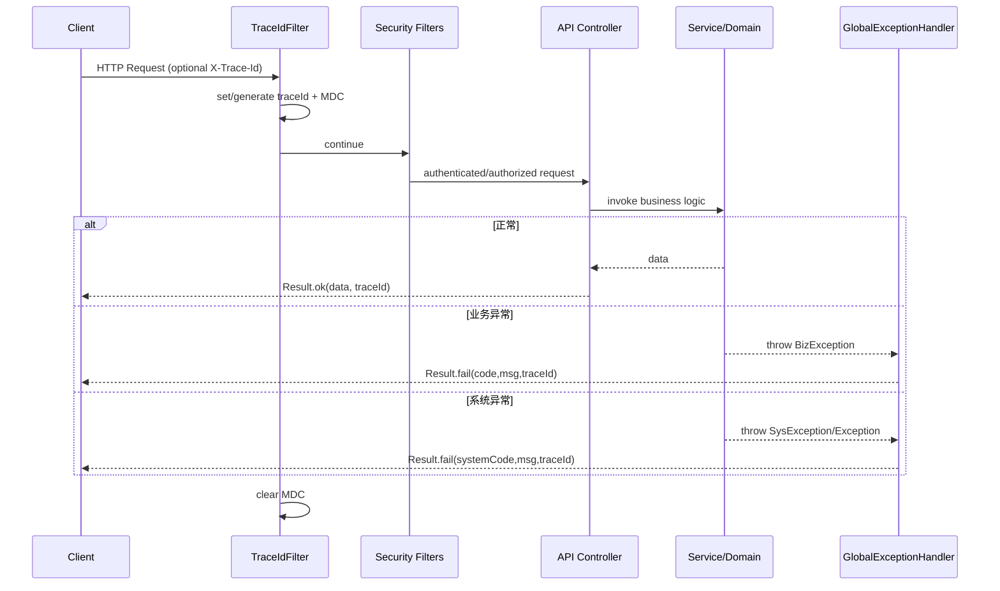

# 19-错误码、异常与统一响应设计说明

> 更新时间：2026-02-25  
> 适用范围：`mediask-api`、`mediask-common`、`mediask-service`、`mediask-infra`、Python AI 服务

---

## 1. 背景与目标

MediAsk 后端采用统一响应体 + 业务异常机制，但随着模块增多，逐步出现以下典型问题：

- 异常语义在部分场景存在错配（例如跨业务域复用错误码）
- 参数异常覆盖不完整，部分错误会落入通用系统异常
- `traceId` 已在响应结构中预留，但链路注入不完整
- 系统异常类存在但落地不充分，分层边界不够清晰

本次设计升级目标：

1. 建立稳定、可观测、可演进的错误处理主链路
2. 确保前后端对错误语义理解一致
3. 提升线上排障效率（traceId + 错误码 + 日志统一）
4. 在不破坏现有 API 契约的前提下平滑升级

---

## 2. 设计原则

### 2.1 语义一致性

- 同一类业务问题使用同一错误码
- 错误码与业务域强关联，禁止跨域误用
- `code` 是机器可判定语义，`msg` 是用户/开发者可读语义

### 2.2 分层职责清晰

- `ErrorCode`：统一错误语义字典
- `BizException`：业务规则错误（可预期）
- `SysException`：系统故障错误（技术异常）
- `GlobalExceptionHandler`：异常到响应的统一映射层
- `Result<T>`：统一响应结构承载层

### 2.3 可观测性优先

- 每个请求具备稳定 `traceId`
- `traceId` 同时出现在：请求头、响应头、响应体、日志上下文（MDC）
- 业务日志必须带 code + 关键上下文

### 2.4 向后兼容

- 维持既有统一响应结构：`code/msg/data/traceId/timestamp`
- 不修改既有接口路径与 DTO 契约

### 2.5 跨语言一致性（Java + Python）

- Java 主服务与 Python AI 服务必须共享同一套响应语义
- Python 服务不另造“第二套错误码体系”，避免前端/网关双重适配
- 统一 `traceId` 透传规则，保证跨进程排障可串联

---

## 3. 当前实现总览（升级后）

### 3.1 错误码模型

- 核心文件：`mediask-common/src/main/java/me/jianwen/mediask/common/constant/ErrorCode.java`
- 采用分段编码（0、1xxx、2xxx...9xxx）
- 已验证无重复编码

建议：新增错误码时必须遵循分段语义，并同步文档。

### 3.2 统一响应体

- 核心文件：`mediask-common/src/main/java/me/jianwen/mediask/common/result/Result.java`
- 固定字段：
  - `code`：业务码（0 成功，非 0 失败）
  - `msg`：提示信息
  - `data`：业务数据
  - `traceId`：链路追踪标识
  - `timestamp`：响应时间戳

### 3.3 异常体系

- 业务异常：`BizException`
- 系统异常：`SysException`
- 全局映射：`GlobalExceptionHandler`

本次增强后，`GlobalExceptionHandler` 已覆盖：

- `BizException`
- `SysException`
- 参数校验与反序列化异常
- 缺参异常
- 参数类型不匹配异常
- `ConstraintViolationException`
- `IllegalArgumentException`
- `IllegalStateException`
- 兜底 `Exception`
- 鉴权拒绝异常（403）

### 3.4 traceId 链路

新增过滤器：

- `mediask-api/src/main/java/me/jianwen/mediask/api/filter/TraceIdFilter.java`

接入点：

- `SecurityConfig` 中将 `TraceIdFilter` 挂入过滤链

行为：

1. 优先读取请求头 `X-Trace-Id`
2. 若无则自动生成（UUID 去横线）
3. 写入 MDC：`traceId`、`requestUri`
4. 回写响应头 `X-Trace-Id`
5. 响应体 `Result.traceId` 自动读取 MDC 值

---

## 4. 请求处理时序（异常与响应）



---

## 5. 本次关键改动记录

### 5.1 可观测性增强

- 新增 `TraceIdFilter`
- `Result` 使用 `CommonConstants.MDC_TRACE_ID` 读取 traceId，去除硬编码字符串
- 安全链路与业务链路响应都能携带 traceId

### 5.2 异常分类增强

`GlobalExceptionHandler` 新增了参数与状态异常的精细映射，显著减少“所有错误都变 9999”的情况。

### 5.3 语义修正

- 预约取消权限不足错误码由 `EMR_ACCESS_DENIED` 修正为 `ACCESS_DENIED`
- 角色编码参数错误从 `IllegalArgumentException` 统一为 `BizException + ErrorCode`

---

## 6. 使用规范（团队约定）

### 6.1 何时抛 `BizException`

用于可预期、可提示的业务错误：

- 参数业务校验失败
- 状态机不允许迁移
- 资源不存在/重复
- 权限不足（业务层）

### 6.2 何时抛 `SysException`

用于不可预期、需运维介入的系统故障：

- 外部依赖不可用（DB/Redis/RPC）
- 基础设施异常
- 技术框架异常封装上抛

### 6.3 错误码选择规范

- 先选“业务域专属码”，再选“通用码”
- 禁止“为了省事”复用其他业务域错误码
- 自定义 `message` 不得泄露敏感实现细节（账号密钥、SQL、堆栈等）

### 6.4 Controller 层规范

- 成功统一 `Result.ok(...)`
- 失败通过异常机制交给 `GlobalExceptionHandler`
- 避免在 Controller 手写失败 `Result.fail(...)`（诊断类/工具类接口除外）

---

## 7. 测试与验证策略

建议最少覆盖以下测试场景：

1. 无 `X-Trace-Id` 时自动生成并透传
2. 有 `X-Trace-Id` 时原值透传
3. `@Valid` 校验失败 -> `PARAM_INVALID`
4. 缺失必填参数 -> `PARAM_MISSING`
5. 参数类型错误 -> `PARAM_INVALID`
6. `BizException` -> 对应业务码
7. `SysException` -> 对应系统码
8. 401/403 场景返回体结构完整且带 traceId

## 8. 跨服务统一协议（Java ↔ Python AI）

### 8.1 为什么必须统一

如果 Java 与 Python 返回结构/错误码不统一，会出现：

- Java 侧需要为 Python 单独写一套适配转换
- 前端收到同类错误但 `code/msg` 语义不一致
- 链路追踪断裂，出现“Java 有 traceId，Python 无法关联”的排障断点

结论：**必须统一**，且建议以 Java 现有 `Result<T>` 语义为主协议。

### 8.2 推荐统一响应契约（服务间）

Python AI 服务对 Java 的 HTTP 返回，建议固定如下结构：

```json
{
    "code": 0,
    "msg": "success",
    "data": {},
    "traceId": "5c28b9f7c79e4f9fb9400f0f9bcaf5d2",
    "timestamp": 1761234567890
}
```

字段约束：

- `code`: 整型，0 成功，非 0 失败
- `msg`: 文本，面向可读性
- `data`: 任意对象或 `null`
- `traceId`: 必填；优先透传 `X-Trace-Id`
- `timestamp`: 毫秒时间戳

### 8.3 错误码分层建议

为避免与 Java 核心业务码冲突，建议：

- 通用码沿用现有语义（`0/1xxx/9xxx`）
- AI 子域码固定在 `6xxx`
- Python 内部技术错误统一映射到：
    - 超时：`6002`
    - AI 响应异常：`6003`
    - 服务不可用：`6001`
    - 兜底系统故障：`9999`

### 8.4 traceId 透传规范

- Java -> Python：请求头带 `X-Trace-Id`
- Python -> Java：响应头回写 `X-Trace-Id`
- Python 日志：每条业务日志必须包含 `traceId`

建议 Python 中间件实现：

1. 读取 `X-Trace-Id`，无则生成
2. 注入 logger context
3. 响应体与响应头同时回写

### 8.5 Java 侧集成策略

当 Java 调用 Python AI 服务时，建议：

- 优先信任 Python 返回的 `code/msg/traceId`
- 对网络错误、反序列化错误做兜底映射（`6001/6003/9999`）
- 保持 Java 对外响应结构不变，避免把 Python 特有错误泄露给前端

### 8.6 迁移落地步骤

1. **定义契约**：冻结上述 JSON 协议字段与类型
2. **Python 实现**：补统一响应封装和异常中间件
3. **Java 适配**：新增 Python Client 的错误映射层
4. **联调验证**：覆盖成功/超时/异常/熔断场景
5. **可观测性验收**：随机抽样确认 traceId 可跨服务追踪

---

## 9. 后续演进建议

### 9.1 P0（短期）

- 补齐 API 层异常与 traceId 的自动化测试（MockMvc）
- 梳理所有 `IllegalArgumentException/IllegalStateException` 抛出点，逐步业务化

### 9.2 P1（中期）

- 建立“错误码注册表”与 CI 校验（重复码、跨域误用、未引用检测）
- 将高频错误码纳入监控看板（按 code 聚合）

### 9.3 P2（长期）

- 引入错误码国际化消息模板（面向多语言前端）
- 基于 OpenAPI 增强错误响应规范（按接口声明常见错误码）

---

## 10. 关联代码位置

- 错误码：`mediask-common/src/main/java/me/jianwen/mediask/common/constant/ErrorCode.java`
- 统一响应：`mediask-common/src/main/java/me/jianwen/mediask/common/result/Result.java`
- 业务异常：`mediask-common/src/main/java/me/jianwen/mediask/common/exception/BizException.java`
- 系统异常：`mediask-common/src/main/java/me/jianwen/mediask/common/exception/SysException.java`
- 全局异常处理：`mediask-api/src/main/java/me/jianwen/mediask/api/advice/GlobalExceptionHandler.java`
- traceId 过滤器：`mediask-api/src/main/java/me/jianwen/mediask/api/filter/TraceIdFilter.java`
- 安全配置：`mediask-api/src/main/java/me/jianwen/mediask/api/config/SecurityConfig.java`

---

## 11. 结论

本次升级在不破坏既有 API 的前提下，完成了错误处理体系从“可用”到“可治理”的提升：

- 语义更清晰
- 响应更一致
- 排障更高效
- 可扩展性更强

后续建议以自动化测试与错误码治理工具为抓手，持续降低异常处理的维护成本与线上风险。
