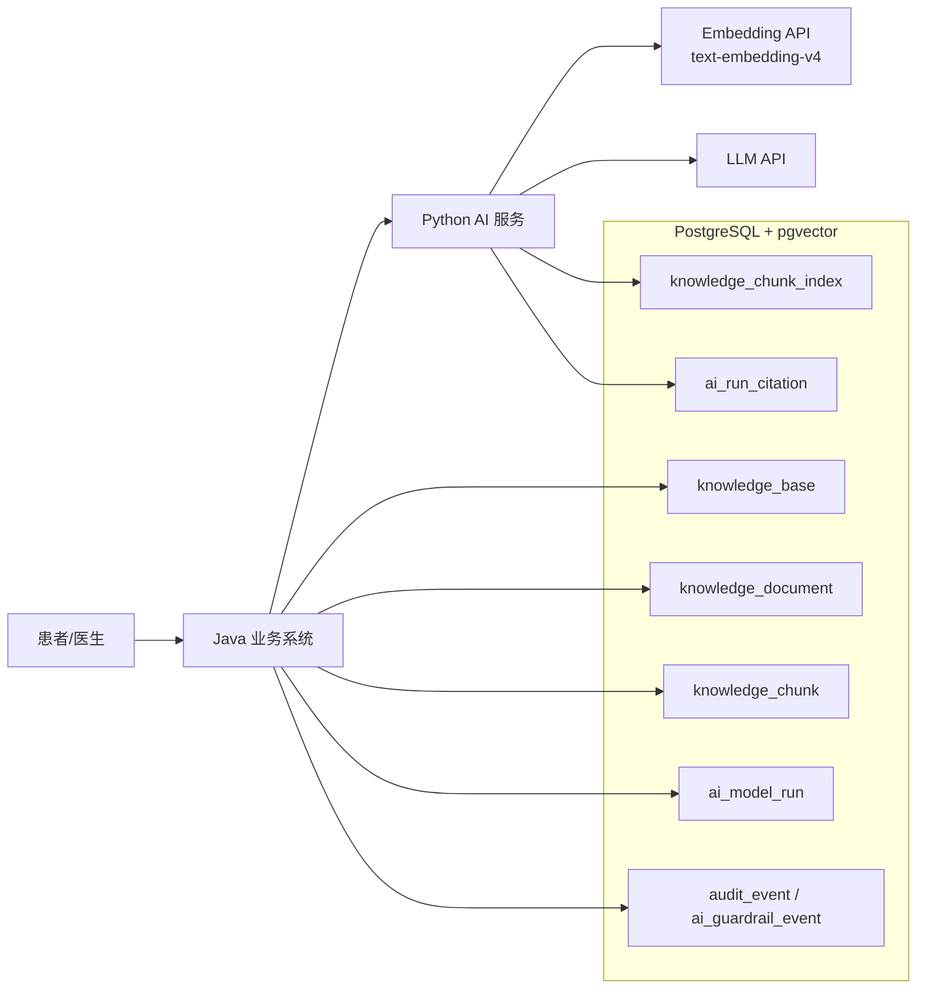

# PostgreSQL + pgvector RAG 数据库设计（Baseline）

> 状态：Authoritative Baseline
>
> 适用阶段：毕业设计 `P0 / P1`
>
> 核心前提：本项目当前允许破坏式更新、无历史数据迁移负担，AI / RAG 是第一核心，数据库设计优先服务于“可检索、可引用、可审计、可复核”的智能医疗辅助问诊主链路。

## 1. 结论

本项目 RAG 主方案建议统一为：

- 关系数据库：`PostgreSQL 17+`
- 向量能力：`pgvector`
- 业务主系统：Java / Spring Boot
- AI 执行侧：Python 微服务
- Embedding：阿里云百炼 `text-embedding-v4`

当前 `P0 / P1` RAG 数据底座统一采用 `PostgreSQL + pgvector`。

这一定案的目标不是“减少一个中间件”这么简单，而是把以下能力统一到一套数据库事实模型中：

- 文档入库状态
- chunk 正文与引用展示
- 向量检索
- 关键词检索
- 混合检索融合
- 检索命中追溯
- AI 回答引用留痕

## 2. 设计目标

### 2.1 核心目标

- 让 RAG 成为系统一等公民，而不是外挂式向量检索
- 保证知识库、chunk、索引、引用之间可以稳定追溯
- 支持混合检索：向量召回 + 关键词召回 + 融合重排
- 支持医疗场景常见过滤条件：科室、知识库、文档状态、版本、可见性
- 支持 AI 结果引用展示、人工抽查、医生复核、审计留痕

### 2.2 约束原则

- 业务主事实与检索投影分层
- 入库与索引更新以同作业闭环和幂等重试为目标，不假设跨 Java/Python 的分布式事务
- 不把调试垃圾和全量中间态塞进主业务表
- 中文语料检索质量优先，不迷信数据库默认分词
- 先保证召回质量与可追溯，再逐步优化检索性能

## 3. 总体架构



## 4. 分层模型

### 4.1 业务主事实层

保留现有 V3 设计中的核心业务表：

- `ai_session`
- `ai_turn`
- `ai_turn_content`
- `ai_model_run`
- `ai_guardrail_event`
- `knowledge_base`
- `knowledge_document`
- `knowledge_chunk`

这一层回答“谁、在什么场景、用了哪些知识、最终产生了什么 AI 结果”。

### 4.2 检索投影层

新增：

- `knowledge_chunk_index`

这一层回答“某个 chunk 当前如何被检索系统表示”，包括：

- 向量表示
- 关键词检索表示
- 当前索引版本
- 当前是否可参与检索

### 4.3 引用追溯层

建议新增：

- `ai_run_citation`

这一层回答“某次模型运行最终引用了哪些 chunk，以及这些 chunk 是如何被选中的”。

### 4.4 P1 可选增强层

如需把 RAG 可追溯做得更深，可在 `P1` 增加：

- `ai_retrieval_run`
- `ai_retrieval_hit`

前者记录一次检索执行，后者记录每个候选命中及其分数。

## 5. 核心表设计

### 5.1 `knowledge_base`

定位：知识库治理入口。

建议关键字段：

- `id BIGINT`：主键，继续沿用业务雪花 ID
- `kb_code VARCHAR(64)`：稳定编码
- `name VARCHAR(128)`：知识库名称
- `owner_type VARCHAR(32)`：`SYSTEM / DEPARTMENT / TOPIC`
- `owner_dept_id BIGINT`：科室私库时使用
- `visibility VARCHAR(16)`：`PUBLIC / DEPT / PRIVATE`
- `status VARCHAR(16)`：`ENABLED / DISABLED / ARCHIVED`
- `embedding_model VARCHAR(64)`：默认 `text-embedding-v4`
- `embedding_dim INT`：默认 `1536`
- `chunk_strategy_json JSONB`：分块策略快照
- `retrieval_strategy_json JSONB`：检索策略快照

### 5.2 `knowledge_document`

定位：文档治理单元。

建议关键字段：

- `id BIGINT`
- `knowledge_base_id BIGINT`
- `document_uuid UUID` 或应用层生成稳定 UUID
- `title VARCHAR(255)`
- `source_type VARCHAR(32)`：`MARKDOWN / PDF / MANUAL / WEB`
- `source_uri TEXT`
- `content_hash VARCHAR(128)`：去重和重入库判断
- `language_code VARCHAR(16)`：默认 `zh-CN`
- `version_no INT`
- `document_status VARCHAR(16)`：`DRAFT / UPLOADED / PARSING / CHUNKED / INDEXING / ACTIVE / FAILED / ARCHIVED`
- `published_at TIMESTAMPTZ`
- `last_error_code VARCHAR(64)`
- `last_error_message TEXT`
- `doc_metadata JSONB`

状态建议：

- `UPLOADED`：Java 已接收文档，尚未开始解析
- `PARSING`：Python 正在解析和切块
- `CHUNKED`：Java 已持久化 `knowledge_chunk`
- `INDEXING`：Python 正在构建 `knowledge_chunk_index`
- `ACTIVE`：索引完成，可参与检索
- `FAILED`：解析或索引失败；具体失败阶段由错误字段和 `doc_metadata` 记录

### 5.3 `knowledge_chunk`

定位：引用与展示层的稳定事实。

建议关键字段：

- `id BIGINT`
- `knowledge_base_id BIGINT`
- `document_id BIGINT`
- `chunk_index INT`
- `section_title VARCHAR(255)`
- `page_no INT`
- `char_start INT`
- `char_end INT`
- `token_count INT`
- `content TEXT`
- `content_preview TEXT`
- `citation_label VARCHAR(255)`：如“高血压指南 / 第 3 节 / P12”
- `chunk_metadata JSONB`
- `chunk_status VARCHAR(16)`：`ACTIVE / INACTIVE / DELETED`

说明：

- `knowledge_chunk` 保留正文，是为了 citations 展示、医生抽查、后台治理。
- 不再依赖 `vector_ref_id` 作为外部桥接主键，`chunk_id` 本身就是稳定引用锚点。

### 5.4 `knowledge_chunk_index`

定位：检索投影层，是本草案最关键的新表。

建议关键字段：

- `chunk_id BIGINT PRIMARY KEY`
- `knowledge_base_id BIGINT`
- `document_id BIGINT`
- `embedding VECTOR(1536)`
- `embedding_model VARCHAR(64)`
- `embedding_version INT`
- `search_text TEXT`：归一化后的全文
- `search_lexemes TEXT`：Python 分词后的词项串，建议用空格连接
- `search_tsv TSVECTOR`
- `authority_score NUMERIC(6,3)`：知识权威度权重
- `freshness_score NUMERIC(6,3)`：时效性权重
- `is_active BOOLEAN`
- `indexed_at TIMESTAMPTZ`
- `updated_at TIMESTAMPTZ`

设计要点：

- `embedding` 负责 dense retrieval
- `search_tsv` 负责 sparse / keyword retrieval
- `authority_score` 和 `freshness_score` 为融合排序预留业务加权位
- `search_tsv` 建议由 `search_lexemes` 生成，而不是直接吃原始中文文本

### 5.5 `ai_run_citation`

定位：模型运行与知识引用的强追溯桥。

建议关键字段：

- `id BIGINT`
- `model_run_id BIGINT`
- `chunk_id BIGINT`
- `retrieval_rank INT`
- `vector_score DOUBLE PRECISION`
- `keyword_score DOUBLE PRECISION`
- `fusion_score DOUBLE PRECISION`
- `rerank_score DOUBLE PRECISION`
- `used_in_answer BOOLEAN`
- `snippet TEXT`
- `created_at TIMESTAMPTZ`

设计要点：

- `model_run_id` 必须引用 Java 预创建的 `ai_model_run.id`
- `ai_run_artifact` 仍可保留，用于通用 JSON 产物
- `citations` 不建议只做 JSON，应该显式建表，便于统计、审计、抽查和复盘

### 5.6 `ai_retrieval_run`（P1）

定位：一次检索执行事实。

建议字段：

- `id BIGINT`
- `turn_id BIGINT`
- `query_text_masked TEXT`
- `query_hash VARCHAR(128)`
- `query_lexemes TEXT`
- `retrieval_mode VARCHAR(32)`：`VECTOR / KEYWORD / HYBRID`
- `vector_top_k INT`
- `text_top_k INT`
- `fusion_top_k INT`
- `rerank_provider VARCHAR(64)`
- `latency_ms INT`
- `result_count INT`
- `is_degraded BOOLEAN`

### 5.7 `ai_retrieval_hit`（P1）

定位：检索候选命中明细。

建议字段：

- `id BIGINT`
- `retrieval_run_id BIGINT`
- `chunk_id BIGINT`
- `source_type VARCHAR(16)`：`VECTOR / TEXT / FUSED`
- `raw_rank INT`
- `vector_score DOUBLE PRECISION`
- `keyword_score DOUBLE PRECISION`
- `fusion_score DOUBLE PRECISION`
- `rerank_score DOUBLE PRECISION`
- `selected BOOLEAN`

## 6. PostgreSQL DDL 草图

```sql
CREATE EXTENSION IF NOT EXISTS vector;

CREATE TABLE knowledge_chunk_index (
    chunk_id BIGINT PRIMARY KEY REFERENCES knowledge_chunk(id) ON DELETE CASCADE,
    knowledge_base_id BIGINT NOT NULL REFERENCES knowledge_base(id),
    document_id BIGINT NOT NULL REFERENCES knowledge_document(id),
    embedding VECTOR(1536) NOT NULL,
    embedding_model VARCHAR(64) NOT NULL DEFAULT 'text-embedding-v4',
    embedding_version INT NOT NULL DEFAULT 1,
    search_text TEXT NOT NULL,
    search_lexemes TEXT NOT NULL,
    search_tsv TSVECTOR GENERATED ALWAYS AS (
        to_tsvector('simple', COALESCE(search_lexemes, ''))
    ) STORED,
    authority_score NUMERIC(6,3) NOT NULL DEFAULT 1.000,
    freshness_score NUMERIC(6,3) NOT NULL DEFAULT 1.000,
    is_active BOOLEAN NOT NULL DEFAULT TRUE,
    indexed_at TIMESTAMPTZ NOT NULL DEFAULT CURRENT_TIMESTAMP,
    updated_at TIMESTAMPTZ NOT NULL DEFAULT CURRENT_TIMESTAMP
);

CREATE INDEX idx_kci_vector_hnsw
    ON knowledge_chunk_index
    USING hnsw (embedding vector_cosine_ops)
    WITH (m = 16, ef_construction = 128)
    WHERE is_active = TRUE;

CREATE INDEX idx_kci_search_tsv
    ON knowledge_chunk_index
    USING gin (search_tsv);

CREATE INDEX idx_kci_kb_active
    ON knowledge_chunk_index (knowledge_base_id, is_active);

CREATE INDEX idx_kci_doc_active
    ON knowledge_chunk_index (document_id, is_active);
```

补充建议：

- 当前阶段默认使用 `HNSW`
- 若数据量进一步增大，再评估 `IVFFlat`
- 若经常按科室过滤，可在 `knowledge_chunk_index` 冗余 `owner_dept_id`

## 7. 中文检索策略

这是本方案的关键工程点。

### 7.1 P0 建议

不把中文分词寄托在 PostgreSQL 默认配置上，而是由 Python 入库链路负责：

- 文本归一化
- 医疗术语规范化
- 中文分词
- 同义词扩展
- 生成 `search_lexemes`

随后在 PostgreSQL 中用：

- `to_tsvector('simple', search_lexemes)`
- `plainto_tsquery('simple', query_lexemes)`

完成关键词检索链路。

### 7.2 原因

- 部署更简单，不强依赖 `zhparser` 或其他数据库插件
- 中文医疗术语归一更适合在 Python 应用层做
- 本地、测试、演示环境一致性更强

## 8. 检索链路建议

### 8.1 入库链路

1. Java 创建 `knowledge_document(status=UPLOADED)` 并保存原始文件位置
2. Java 将 `knowledge_document` 推进到 `PARSING`，调用 Python `knowledge/prepare`
3. Python 解析原始文档，完成文本清洗、术语归一和 chunk 切分，返回 chunk payload
4. Java 持久化 `knowledge_chunk`，并把 `knowledge_document` 推进到 `CHUNKED`
5. Java 调用 Python 索引接口，并把 `knowledge_document` 推进到 `INDEXING`
6. Python 调用 Embedding API，生成 `search_lexemes/search_tsv`
7. Python 以 `chunk_id` 为幂等键 upsert `knowledge_chunk_index`
8. Java 更新 `knowledge_document.document_status=ACTIVE`

失败原则：

- 解析失败时，Java 将 `knowledge_document` 标记为 `FAILED`，不得生成半套 `knowledge_chunk`
- 索引失败时，`knowledge_chunk` 可保留，但 `knowledge_document` 不得标为 `ACTIVE`
- 重建索引默认复用既有 `knowledge_chunk`，不重新生成业务主事实，除非文档版本号变化

### 8.2 查询链路

1. 对查询做术语归一和 PII 脱敏
2. 使用 Java 预创建的 `model_run_id`
3. 生成 query embedding
4. 向量召回 `top 30~50`
5. 关键词召回 `top 30~50`
6. 用 `RRF` 融合
7. 可选：对融合后的 `top 10` 做 rerank
8. 选出最终 `top 5`
9. 写入 `ai_run_citation(model_run_id, chunk_id, ...)`
10. 将最终上下文送入 LLM 生成

### 8.3 过滤条件

检索阶段至少支持：

- `knowledge_base_id`
- `owner_dept_id`
- `document_status=ACTIVE`
- `chunk_status=ACTIVE`
- 可见性范围

这类过滤在 PostgreSQL 中更容易与业务事实统一表达。

## 9. 与现有 V3 文档的衔接建议

### 9.1 保留

- `ai_session`
- `ai_turn`
- `ai_turn_content`
- `ai_model_run`
- `ai_guardrail_event`
- `knowledge_base`
- `knowledge_document`
- `knowledge_chunk`

### 9.2 新增

- `knowledge_chunk_index`
- `ai_run_citation`

### 9.3 P1 可新增

- `ai_retrieval_run`
- `ai_retrieval_hit`

### 9.4 建议废弃或降级的字段

- `knowledge_chunk.vector_ref_id`
  - 使用 PostgreSQL 后，不再需要外部向量库引用 ID 作为主桥接字段
- `knowledge_base.vector_backend`
  - 可保留，但默认值直接收敛为 `PGVECTOR`

## 10. 实施顺序

### 10.1 第一阶段

- 完成 PostgreSQL 数据库基线
- 建立 `knowledge_base / document / chunk / chunk_index`
- 跑通文本入库、向量化、向量召回

### 10.2 第二阶段

- 增加 `search_lexemes + search_tsv`
- 跑通 hybrid retrieval
- 引入 `RRF`

### 10.3 第三阶段

- 增加 `ai_run_citation`
- 前端展示引用来源、页码、章节、片段
- 支撑医生复核与人工抽查

### 10.4 第四阶段

- 增加 `ai_retrieval_run / ai_retrieval_hit`
- 建立黄金集评测
- 比较不同 chunk 策略、阈值、融合策略

## 11. 适合答辩的表达

可对外表述为：

- 本系统将关系事实、检索表示、AI 引用追溯三层显式分离
- 采用 `PostgreSQL + pgvector` 实现统一数据底座，降低双库同步复杂度
- 采用“向量检索 + 关键词检索 + 融合重排”的混合检索链路
- 通过 `ai_run_citation` 保证 AI 回答的引用可追溯、可抽查、可复核

## 12. 一句话总结

这版设计的本质，是把 RAG 从外挂能力改造成数据库层、检索层、引用层都可解释的核心能力。
