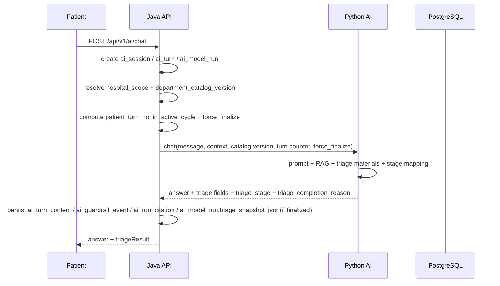
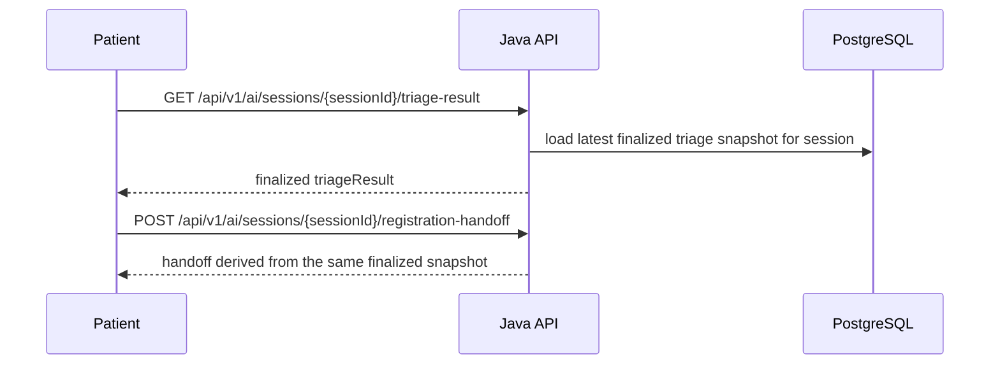
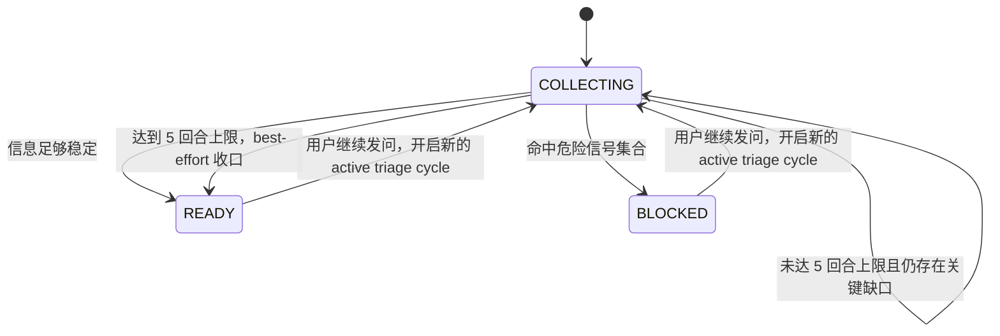

# AI 导诊链路单真相与结果页准入设计

> 状态：Design Draft / For Implementation
>
> 目标：把 AI 导诊链路重构为“有限收集 + 必然收口 + 单一最终结果”模型，确保患者不会卡死在无限追问中，同时让 `chat`、`triage-result`、`registration-handoff` 在职责上清晰分层。
>
> 约束：本文描述目标设计，不代表当前代码已实现；当前实现快照以 [../playbooks/00G-P0-CURRENT-API-CONTRACT.md](../playbooks/00G-P0-CURRENT-API-CONTRACT.md) 为准。本文优先服从 [10A-JAVA_AI_API_CONTRACT.md](./10A-JAVA_AI_API_CONTRACT.md)、[10-PYTHON_AI_SERVICE.md](./10-PYTHON_AI_SERVICE.md)、[07C-AI-TABLES-V3.md](./07C-AI-TABLES-V3.md)。

## 1. 为什么要改

此前设计虽然已经解决了“结果真相唯一”，但仍有 4 个关键缺口：

- `COLLECTING` 可以无限自循环，患者可能永远到不了结果页
- `GET /triage-result` 读取“当前最新成功 run”时，会和“历史已有结果不可被新收集中轮次覆盖”冲突
- `READY` 之后既能进结果页，又能直接跳挂号页，前端流转不稳定
- Python 虽然定义了状态字段和判定材料，但没有把 Prompt 责任、追问收敛规则、强制收口规则写死

因此本次重构要同时解决：

1. 导诊收集必须有限且必然收口
2. 最终结果只保留一份，并且能被稳定回读
3. 聊天页、结果页、挂号承接三段链路职责明确
4. 候选科室不能直接来自原始科室表，而要来自 Java 维护的可导诊目录

## 2. 设计结论

### 2.1 单真相模型

本方案继续保留 `Triage Snapshot`，但把它明确为：

- 一次成功 `ai_model_run` 的 finalized 导诊结果
- 挂在 `ai_model_run.triage_snapshot_json`
- 只有 `READY / BLOCKED` 对应的 run 才允许写入

固定规则：

- 当前正在进行中的 `COLLECTING` 轮次不产生 finalized snapshot
- 一个 session 的“当前结果页真相” = 最近一次 `READY / BLOCKED` finalized snapshot
- `registration-handoff` 只消费这份 finalized snapshot
- 新的 `COLLECTING` 轮次不会覆盖历史 finalized snapshot
- 只有新的 `READY / BLOCKED` finalized snapshot 才能替换旧结果

### 2.2 两层状态模型

本方案冻结两层状态：

1. 技术执行状态

- `session_status`
- `turn_status`
- `run_status`

2. 导诊业务状态

- `triageStage = COLLECTING / READY / BLOCKED`

语义固定为：

- `COLLECTING`：仍需继续追问，不能进入结果页，不写 `triage_snapshot_json`
- `READY`：当前信息已足够形成一个可接受、低风险、方向稳定的下一步导诊建议，可进入结果页，可写 `triage_snapshot_json`
- `BLOCKED`：高风险或其他必须阻断普通导诊的情形，可进入阻断结果页，可写阻断型 `triage_snapshot_json`

执行失败态单独处理：

- `FAILED`：仅表示当前 turn / run 执行失败，不属于 Python 正常业务输出的 `triageStage`

### 2.3 Active Triage Cycle 与强制收口

为了避免无限 `COLLECTING`，本方案新增业务概念：`active triage cycle`。

定义：

- 从 session 开始或上一次 finalized snapshot 之后，重新开始一个新的 active triage cycle
- 一个 active triage cycle 以患者发言轮次计数
- `patient_turn_no_in_active_cycle` 从 1 开始递增

硬规则：

- 每个 active triage cycle 最多允许 5 个患者回合
- 前 4 个患者回合，Python 可以返回 `COLLECTING`
- 到第 5 个患者回合时，Python 不允许继续返回 `COLLECTING`
- 第 5 个患者回合必须收口为：
  - `BLOCKED`：命中危险信号
  - `READY`：否则输出 best-effort 导诊结果

这条规则优先级高于模型主观判断，不允许例外。

### 2.4 `triageStage` 与 `nextAction`

`triageStage` 是业务语义，`nextAction` 是前端动作语义，两者不能互相替代。

固定映射：

- `COLLECTING` -> `CONTINUE_TRIAGE`
- `READY` -> `VIEW_TRIAGE_RESULT`
- `BLOCKED` -> `EMERGENCY_OFFLINE` 或 `MANUAL_SUPPORT`

明确约束：

- `GO_REGISTRATION` 从聊天态 `nextAction` 中删除
- `READY` 后聊天链路统一先进入结果页
- 挂号入口由结果页 CTA 承接，而不是聊天页直接跳转

### 2.5 Python 判定材料与完成原因

Python 不应直接“凭感觉”输出 `triageStage`。正常成功响应应先生成一组判定材料，再由 Python 服务内部规则映射成 `COLLECTING / READY / BLOCKED`。

判定材料最小集合固定为：

- `chief_complaint_summary`
- `risk_blockers`
- `missing_critical_info`
- `follow_up_questions`
- `department_recommendation_confidence`
- `recommended_departments`
- `care_advice`

字段语义固定为：

- `risk_blockers`：已识别出的阻断普通导诊的危险信号列表
- `missing_critical_info`：当前仍缺失、且会影响分诊方向的关键信息列表
- `follow_up_questions`：下一轮必须追问的问题列表，最多 2 个
- `department_recommendation_confidence`：当前推荐方向是否已足够稳定可交付，只作为 Python 内部判定材料，不对前端暴露

同时新增内部字段：

- `triage_completion_reason`

固定值：

- `SUFFICIENT_INFO`
- `MAX_TURNS_REACHED`
- `HIGH_RISK_BLOCKED`

Python 内部最终映射规则固定为：

- `BLOCKED`：`risk_blockers` 非空，或 `triage_completion_reason = HIGH_RISK_BLOCKED`
- `COLLECTING`：`risk_blockers` 为空，`missing_critical_info` 非空或 `follow_up_questions` 非空，且 `force_finalize = false`
- `READY`：`triage_completion_reason = SUFFICIENT_INFO` 或 `MAX_TURNS_REACHED`
- `FAILED`：仅表示执行失败、解析失败、目录同步失败、内部异常，不作为成功业务响应中的 `triageStage`

补充约束：

- `triageStage = COLLECTING` 时，`triage_completion_reason = null`

### 2.6 READY 的判定原则

`READY` 的定义固定为：

> 当前信息已足够形成一个可接受、低风险、方向稳定的下一步导诊建议，或已达到收集轮次上限而必须输出 best-effort 导诊结果。

保守型门槛固定为：

- 只要还有一个可能明显改变推荐方向的关键问题没问清，且未达到 5 回合上限，就继续 `COLLECTING`
- 不要求病因正确
- 不要求医学事实完整
- 只要求当前推荐方向已经足够稳定，或在上限触发时已给出 best-effort 建议

`MAX_TURNS_REACHED` 触发时：

- 不再继续追问
- `follow_up_questions` 为空
- `answer` / `care_advice` 必须显式说明“基于当前有限信息先建议……”

### 2.7 BLOCKED 的判定原则

`BLOCKED` 的定义：

> 当前信息已足以触发高风险阻断，不再继续普通导诊链路。

`BLOCKED` 首版只依赖少量高价值危险信号集合，不建设全病种风险模板库。危险信号集合至少包括：

- 意识障碍或明显意识改变
- 明显呼吸困难
- 持续或剧烈胸痛
- 大出血
- 抽搐
- 中风样表现
- 严重过敏反应
- 婴幼儿 / 孕产妇 / 高龄 / 严重基础病人群合并明显危险信号

### 2.8 Prompt 合同

Prompt 合同必须单独写进 Python 文档，并冻结以下规则：

- 不输出诊断结论、处方、确定性病因
- `COLLECTING` 时最多问 2 个最高信息增益问题，不重复、不发散
- `follow_up_questions` 与 `answer` 中的追问语义必须一致
- `BLOCKED` 时停止普通追问，输出紧急线下就医文案
- `MAX_TURNS_REACHED` 时禁止继续追问，必须给 best-effort 推荐
- 推荐科室只能从 Java 下发目录中选择，不得臆造科室 ID

## 3. 端到端链路

### 3.1 非流式问诊

语义：

- `COLLECTING` 时只返回当前轮结构化状态，不写真正的结果页真相
- `READY / BLOCKED` 时才写 finalized snapshot
- `READY` 只会返回 `VIEW_TRIAGE_RESULT`

### 3.2 伪流式展示

- Python 侧只提供同步 `chat` 接口，不承担正式 SSE/token streaming
- Java 或前端如需流式展示效果，应在拿到完整 `chat` 响应后，仅对 `answer` 做展示层伪流式切片
- 结构化状态仍只来自一次完整 `chat` 响应，不能从伪流式文本里反解析推荐科室或跳转状态

### 3.3 会话回看与挂号承接

语义：

- `triage-result` 永远读取最近一次 finalized snapshot
- 如果历史上已有旧结果，而当前新一轮仍 `COLLECTING`，结果页继续显示旧结果
- `registration-handoff` 只消费同一份 finalized snapshot

### 3.4 结果版本语义

为了避免“能看到老结果，但用户误以为它就是当前聊天最新状态”，结果页必须同时表达两类事实：

1. 当前可执行的 finalized 结果是什么
2. 当前是否存在新的 active triage cycle 仍在进行中

因此 `GET /triage-result` 增加独立的结果版本语义：

- `resultStatus = CURRENT`
  - 当前展示的是最新 finalized 结果
  - 当前没有新的 active triage cycle 在收集
- `resultStatus = UPDATING`
  - 当前展示的是上一版 finalized 结果
  - 但当前存在新的 active triage cycle，且仍处于 `COLLECTING`
- `resultStatus = NOT_READY`
  - 当前还没有任何 finalized 结果可展示
  - 仅作为业务语义存在；HTTP 传输层仍返回 `409`

为支撑这层语义，`GET /triage-result` 在成功响应中至少补充：

- `resultStatus`
- `finalizedTurnId`
- `finalizedAt`
- `hasActiveCycle`
- `activeCycleTurnNo`

固定规则：

- `CURRENT`：展示正常结果页
- `UPDATING`：展示上一版 finalized 结果，并明确提示“系统正在基于你新补充的信息重新评估”
- `NOT_READY`：不展示正式结果页真相，提示继续问诊

## 4. 职责边界

### 4.1 Java 负责

- `ai_session`、`ai_turn`、`ai_model_run`、`ai_turn_content`、`ai_guardrail_event`、`ai_run_citation` 的业务持久化
- `active triage cycle` 计数
- `patient_turn_no_in_active_cycle` 与 `force_finalize` 计算
- finalized snapshot 持久化与回读
- `triageStage` 到 `nextAction` 的映射
- `triage-result` 查询组装
- `registration-handoff` 承接逻辑
- `TriageDepartmentCatalog` 的主数据维护与版本管理
- 目录合法性校验

### 4.2 Python 负责

- 基于消息、上下文、可导诊目录缓存生成结构化导诊结果
- Prompt 组织与结构化输出约束
- 生成判定材料并映射 `triageStage`
- 返回：
  - `triage_stage`
  - `triage_completion_reason`
  - `chief_complaint_summary`
  - `risk_blockers`
  - `missing_critical_info`
  - `follow_up_questions`
  - `department_recommendation_confidence`
  - `recommended_departments`
  - `care_advice`
  - `risk_level`
  - `guardrail_action`
  - `citations`

### 4.3 明确禁止

- Python 直连业务库查询 `departments`
- Python 直接使用原始 `departments` 全量临床科室作为导诊目录
- 前端从聊天文本推断推荐科室
- `registration-handoff` 从聊天文本或 `ai_guardrail_event.event_detail_json` 临时拼装推荐科室
- Java 根据 `recommendedDepartments`、`chiefComplaintSummary` 是否为空自行推 READY/BLOCKED

## 5. 可导诊目录与同步机制

### 5.1 `TriageDepartmentCatalog`

候选科室不再直接来自原始 `departments` 表，而是来自 Java 维护的独立业务概念：`TriageDepartmentCatalog`。

固定原则：

- Java 是 `TriageDepartmentCatalog` 真相来源
- Python 同步的是“可导诊目录”，不是“医院所有临床科室”
- 目录只包含明确允许被 AI 推荐给患者的科室

目录项最小字段固定为：

- `department_id`
- `department_name`
- `routing_hint`
- `aliases` 或 `keywords`
- `sort_order`
- `catalog_version`

### 5.2 同步接口

普通 `chat` 请求不再内联完整候选集，而是只传：

- `hospital_scope`
- `department_catalog_version`

Python 本地维护 `{hospital_scope -> triage department catalog}` 缓存。处理规则固定为：

- 本地该 scope 的目录版本命中：直接使用缓存
- 本地目录缺失或版本不匹配：先向 Java 拉取该 scope 的最新目录，再继续推理

内部接口协议固定为：

- 路径：`GET /api/v1/internal/triage-department-catalogs/{hospital_scope}`
- 仅面向内网服务间调用，不对浏览器开放
- 鉴权方式：固定服务鉴权头，不引入签名、时间戳、防重放
- 推荐请求头：
  - `X-Request-Id`
  - `X-API-Key`

响应至少包含：

- `hospital_scope`
- `department_catalog_version`
- `department_candidates`

`department_candidates` 每项至少包含：

- `department_id`
- `department_name`
- `routing_hint`
- `aliases` 或 `keywords`
- `sort_order`

失败语义固定为：

- `401/403`：内部鉴权失败
- `404`：`hospital_scope` 不存在
- `409`：目录版本或 scope 状态异常，导致当前目录不可用
- `5xx`：Java 内部错误

Python 在目录同步失败时，本次问诊失败，不做静默降级。

## 6. 导诊阶段与结果页准入

### 6.1 `triage_snapshot_json` 写入时机

固定规则：

- `COLLECTING`：不写 `triage_snapshot_json`
- `READY`：写入 finalized 普通导诊结果
- `BLOCKED`：写入 finalized 阻断型结果
- `FAILED`：执行失败，不写 `triage_snapshot_json`

### 6.2 对外可见性规则

- `chat`
  - 返回当前轮的结构化状态
  - `COLLECTING` 时必须包含 `followUpQuestions`
  - `READY / BLOCKED` 时不返回追问列表
- `GET /triage-result`
  - 只返回最近一次 finalized snapshot
  - 如果存在旧 finalized snapshot，而当前最新轮仍在 `COLLECTING`，继续返回旧结果
  - 只有从未产出过 finalized snapshot 且当前仍 `COLLECTING` 时，返回 `409`

固定规则：

- 存在 finalized snapshot，且当前无进行中 active cycle -> `200 + resultStatus=CURRENT`
- 存在 finalized snapshot，且当前有进行中 active cycle -> `200 + resultStatus=UPDATING`
- 无 finalized snapshot 且当前 session 仍 `COLLECTING` -> `409`
- 无 finalized snapshot 且当前 session 不在 `COLLECTING` -> `404 + 6019`

## 7. 数据模型

### 7.1 `ai_model_run.triage_snapshot_json`

`Triage Snapshot` 不单独建表，直接挂在 `ai_model_run`。

最小内容集合固定为：

- `triage_stage`
- `triage_completion_reason`
- `chief_complaint_summary`
- `recommended_departments`
- `care_advice`

说明：

- `risk_level`、`guardrail_action` 不重复存，仍来自 `ai_guardrail_event`
- `citations` 不重复存，仍来自 `ai_run_citation`
- `follow_up_questions` 不进 snapshot，因为 snapshot 只表示 finalized 结果
- `summary` 仍是会话级摘要，不与 `Triage Snapshot` 混用

### 7.2 查询口径

`GET /api/v1/ai/sessions/{sessionId}/triage-result` 的查询口径改为：

1. 优先定位该 session 最近一次 finalized snapshot 对应的 `ai_model_run`
2. 读取该 run 的 `triage_snapshot_json`
3. 再按 `model_run_id` 查询对应的 `ai_guardrail_event`
4. 再按 `model_run_id` 查询对应的 `ai_run_citation`
5. 在 Java 侧组装对外 `triageResult`

## 8. 对外接口语义

浏览器外部接口路径保持不变，但语义统一如下：

| 接口 | 语义 |
|------|------|
| `POST /api/v1/ai/chat` | 返回当前 turn 的结构化导诊状态 |
| `GET /api/v1/ai/sessions/{sessionId}/triage-result` | 返回最近一次 finalized 结果页真相，以及它与当前对话状态的关系 |
| `POST /api/v1/ai/sessions/{sessionId}/registration-handoff` | 只消费最近一次 finalized snapshot |

补充规则：

- `triageResult` 中保留 `triageStage`
- `nextAction` 仅取值：
  - `CONTINUE_TRIAGE`
  - `VIEW_TRIAGE_RESULT`
  - `EMERGENCY_OFFLINE`
  - `MANUAL_SUPPORT`
- `followUpQuestions` 只出现在 `chat` 的 `COLLECTING` 阶段
- `GET /triage-result` 成功响应新增：
  - `resultStatus`
  - `finalizedTurnId`
  - `finalizedAt`
  - `hasActiveCycle`
  - `activeCycleTurnNo`
- `GET /triage-result` 成功返回时，`triageStage` 只允许 `READY` 或 `BLOCKED`
- 不新增浏览器对外 finalize API

## 9. 失败语义

### 9.1 通用失败

- Python 或 Java 在 chat 过程中失败：该 turn 失败，不写 `triage_snapshot_json`
- 目录同步失败：当前问诊失败，不做静默降级
- 未写入 `triage_snapshot_json` 的结构化结果不得对外冒充 finalized 真相

### 9.2 `triage-result`

- 存在 finalized snapshot：返回 `200`
- 若 `resultStatus = UPDATING`，前端必须明确提示“当前展示的是上一版已完成结果，新的问诊仍在进行中”
- 不存在 finalized snapshot，且当前 session 仍处于 `COLLECTING`：返回 `409 + triage result not ready`
- 不存在 finalized snapshot，且当前 session 不在 `COLLECTING`：返回 `404 + 6019`
- 不允许从聊天文本、旧临时字段或 `event_detail_json` 兜底反推结果

### 9.3 `registration-handoff`

- 有 finalized snapshot 且 `riskLevel = high`：返回阻断结果，`blockedReason = EMERGENCY_OFFLINE`
- 有 finalized snapshot 但 `recommendedDepartments` 为空且非高风险：返回 `409 + 6020`
- 不允许把“无快照”与“高风险阻断”混成同一种失败语义

## 10. 需要同步冻结的接口与模型

本文同时冻结以下后续实现方向：

- Java -> Python `chat` 请求新增：
  - `hospital_scope`
  - `department_catalog_version`
  - `patient_turn_no_in_active_cycle`
  - `force_finalize`
- Java <- Python `chat` 响应新增：
  - `triage_stage`
  - `triage_completion_reason`
  - `risk_blockers`
  - `missing_critical_info`
  - `follow_up_questions`
  - `department_recommendation_confidence`
- 浏览器对外 `chat` 的 `triageResult` 新增：
  - `followUpQuestions`
- 浏览器对外 `GET /triage-result` 成功响应新增：
  - `resultStatus`
  - `finalizedTurnId`
  - `finalizedAt`
  - `hasActiveCycle`
  - `activeCycleTurnNo`
- 新增仅内部使用的 triage catalog 拉取接口
- 新增独立业务概念 `TriageDepartmentCatalog`
- `GET /triage-result` 的数据来源改为 `latest finalized ai_model_run.triage_snapshot_json + guardrail + citations`

## 11. 状态流转

补充约束：

- `COLLECTING -> READY/BLOCKED` 才能首次产生 finalized snapshot
- 已有 `READY / BLOCKED` 结果后，新的 `COLLECTING` 不得覆盖旧 snapshot
- 新的 active triage cycle 只有在再次进入 `READY / BLOCKED` 时才会替换旧结果
- `FAILED` 不属于 `triageStage`，只体现在 `turn_status / run_status`

## 12. 测试关注点

后续实现至少覆盖：

1. 首轮仅“有点发热”时，返回 `COLLECTING`，`followUpQuestions` 非空，且不写 snapshot
2. `COLLECTING` 时 `answer` 与 `followUpQuestions` 语义一致
3. 未命中高风险且仍缺信息时，最多允许进入第 5 个患者回合；第 5 回合后必须 `READY` 或 `BLOCKED`
4. 任一回合命中危险信号集合时，立即 `BLOCKED`
5. 已有旧 `READY` 结果后，新一轮进入 `COLLECTING`，`GET /triage-result` 继续返回旧结果
6. 已有旧结果且当前新一轮仍 `COLLECTING` 时，`GET /triage-result` 返回 `200 + resultStatus=UPDATING`
7. `UPDATING` 结果页必须展示“正在重新评估”的提示，不得把旧结果伪装成当前最新状态
8. 从未有 finalized snapshot 且当前仍 `COLLECTING` 时，`GET /triage-result` 返回 `409`
9. `READY` 后聊天链路一律 `VIEW_TRIAGE_RESULT`
10. 结果页触发 `registration-handoff` 时，只消费最近一次 finalized snapshot
11. `MAX_TURNS_REACHED` 的 best-effort 结果中，不再返回追问
12. Python 返回目录外 `department_id` 时，Java 校验失败，整次 run 失败，不写 snapshot
13. triage 目录同步只下发 Java 维护的独立可导诊目录，不再等价于原始 `departments`
14. Prompt/contract 测试需要覆盖：
   - `COLLECTING` 只产出 1-2 个高价值追问
   - `BLOCKED` 不继续普通问答
   - `MAX_TURNS_REACHED` 必须收口
   - 不输出诊断/处方/目录外科室 ID

## 13. 本轮默认前提

- 本轮只改文档，不改代码、不改 SQL、不写迁移脚本
- 接受对原设计做整体替换，不保留双阶段 finalize 兼容设计
- 浏览器外部接口路径和主要字段尽量保持不变
- 后续代码落地不新增 `ai_triage_snapshot` 表
- 后续代码落地通过 `ai_model_run.triage_snapshot_json` 承接导诊业务真相
