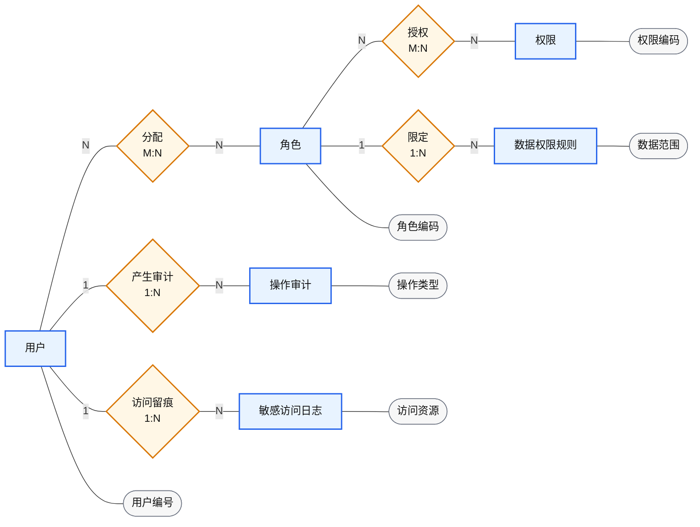

# 毕设论文传统 ER 图

> 本图面向本科毕业设计论文的数据库设计章节，采用传统 ER 图表达方式：矩形表示实体，椭圆表示属性，菱形表示联系，连线标注 `1`、`N` 表示联系基数。
>
> `query_run`、`ai_turn`、`knowledge_chunk_index`、`answer_citation` 等表属于 AI/RAG 执行追踪、检索投影和引用留痕层，不放入主 ER 图，避免工程实现细节干扰业务模型表达。

## 主 ER 图

```mermaid
flowchart LR
    %% Entities
    USER[用户]
    PATIENT[患者档案]
    DOCTOR[医生]
    DEPT[科室]
    AISESSION[AI问诊会话]
    TRIAGE[导诊结果]
    SESSION[门诊场次]
    SLOT[号源]
    ORDER[挂号订单]
    ENCOUNTER[就诊记录]
    EMR[病历]
    DIAG[诊断]
    RX[处方]
    RXITEM[处方明细]

    %% Relationships
    R_PROFILE{"拥有<br/>1:1"}
    R_DOCTOR_ACCOUNT{"对应<br/>1:1"}
    R_DEPT_DOCTOR{"归属<br/>M:N"}
    R_START_AI{"发起<br/>1:N"}
    R_PRODUCE_TRIAGE{"生成<br/>1:N"}
    R_PUBLISH_SESSION{"发布<br/>1:N"}
    R_ATTEND_SESSION{"出诊<br/>1:N"}
    R_PROVIDE_SLOT{"提供<br/>1:N"}
    R_BOOK_ORDER{"预约<br/>1:N"}
    R_GUIDE_ORDER{"辅助挂号<br/>1:N"}
    R_SELECT_SESSION{"选择场次<br/>1:N"}
    R_OCCUPY_SLOT{"占用号源<br/>1:0..1"}
    R_CREATE_ENCOUNTER{"形成就诊<br/>1:1"}
    R_CREATE_EMR{"生成病历<br/>1:0..1"}
    R_INCLUDE_DIAG{"包含诊断<br/>1:N"}
    R_CREATE_RX{"开具处方<br/>1:N"}
    R_INCLUDE_ITEM{"包含明细<br/>1:N"}

    %% Entity relationship edges with cardinality
    USER ---|1| R_PROFILE
    R_PROFILE ---|0..1| PATIENT

    USER ---|1| R_DOCTOR_ACCOUNT
    R_DOCTOR_ACCOUNT ---|0..1| DOCTOR

    DOCTOR ---|N| R_DEPT_DOCTOR
    R_DEPT_DOCTOR ---|N| DEPT

    USER ---|1| R_START_AI
    R_START_AI ---|N| AISESSION

    AISESSION ---|1| R_PRODUCE_TRIAGE
    R_PRODUCE_TRIAGE ---|N| TRIAGE

    DEPT ---|1| R_PUBLISH_SESSION
    R_PUBLISH_SESSION ---|N| SESSION

    DOCTOR ---|1| R_ATTEND_SESSION
    R_ATTEND_SESSION ---|N| SESSION

    SESSION ---|1| R_PROVIDE_SLOT
    R_PROVIDE_SLOT ---|N| SLOT

    USER ---|1| R_BOOK_ORDER
    R_BOOK_ORDER ---|N| ORDER

    AISESSION ---|0..1| R_GUIDE_ORDER
    R_GUIDE_ORDER ---|N| ORDER

    SESSION ---|1| R_SELECT_SESSION
    R_SELECT_SESSION ---|N| ORDER

    SLOT ---|1| R_OCCUPY_SLOT
    R_OCCUPY_SLOT ---|0..1| ORDER

    ORDER ---|1| R_CREATE_ENCOUNTER
    R_CREATE_ENCOUNTER ---|1| ENCOUNTER

    ENCOUNTER ---|1| R_CREATE_EMR
    R_CREATE_EMR ---|0..1| EMR

    EMR ---|1| R_INCLUDE_DIAG
    R_INCLUDE_DIAG ---|N| DIAG

    EMR ---|1| R_CREATE_RX
    R_CREATE_RX ---|N| RX

    RX ---|1| R_INCLUDE_ITEM
    R_INCLUDE_ITEM ---|N| RXITEM

    %% User attributes
    USER_ID([用户编号])
    USER_NAME([用户名])
    USER_TYPE([用户类型])
    USER_STATUS([账号状态])
    USER --- USER_ID
    USER --- USER_NAME
    USER --- USER_TYPE
    USER --- USER_STATUS

    %% Patient attributes
    PATIENT_ID([患者档案编号])
    PATIENT_NO([患者编号])
    PATIENT_GENDER([性别])
    PATIENT_BIRTH([出生日期])
    PATIENT --- PATIENT_ID
    PATIENT --- PATIENT_NO
    PATIENT --- PATIENT_GENDER
    PATIENT --- PATIENT_BIRTH

    %% Doctor and department attributes
    DOCTOR_ID([医生编号])
    DOCTOR_CODE([医生工号])
    DOCTOR_TITLE([职称])
    DOCTOR --- DOCTOR_ID
    DOCTOR --- DOCTOR_CODE
    DOCTOR --- DOCTOR_TITLE

    DEPT_ID([科室编号])
    DEPT_CODE([科室编码])
    DEPT_NAME([科室名称])
    DEPT_TYPE([科室类型])
    DEPT --- DEPT_ID
    DEPT --- DEPT_CODE
    DEPT --- DEPT_NAME
    DEPT --- DEPT_TYPE

    %% AI attributes
    AISESSION_ID([会话编号])
    AISESSION_STAGE([当前阶段])
    AISESSION_SCENE([场景类型])
    AISESSION --- AISESSION_ID
    AISESSION --- AISESSION_STAGE
    AISESSION --- AISESSION_SCENE

    TRIAGE_ID([导诊结果编号])
    TRIAGE_STAGE([导诊阶段])
    TRIAGE_RISK([风险等级])
    TRIAGE_DEPT([推荐科室])
    TRIAGE --- TRIAGE_ID
    TRIAGE --- TRIAGE_STAGE
    TRIAGE --- TRIAGE_RISK
    TRIAGE --- TRIAGE_DEPT

    %% Outpatient attributes
    SESSION_ID([场次编号])
    SESSION_DATE([出诊日期])
    SESSION_PERIOD([时段])
    SESSION_STATUS([场次状态])
    SESSION --- SESSION_ID
    SESSION --- SESSION_DATE
    SESSION --- SESSION_PERIOD
    SESSION --- SESSION_STATUS

    SLOT_ID([号源编号])
    SLOT_TIME([号源时间])
    SLOT_STATUS([号源状态])
    SLOT --- SLOT_ID
    SLOT --- SLOT_TIME
    SLOT --- SLOT_STATUS

    ORDER_ID([订单编号])
    ORDER_NO([订单号])
    ORDER_STATUS([订单状态])
    ORDER --- ORDER_ID
    ORDER --- ORDER_NO
    ORDER --- ORDER_STATUS

    %% Clinical attributes
    ENCOUNTER_ID([就诊编号])
    ENCOUNTER_STATUS([就诊状态])
    ENCOUNTER_TIME([接诊时间])
    ENCOUNTER --- ENCOUNTER_ID
    ENCOUNTER --- ENCOUNTER_STATUS
    ENCOUNTER --- ENCOUNTER_TIME

    EMR_ID([病历编号])
    EMR_NO([病历号])
    EMR_STATUS([病历状态])
    EMR_SUMMARY([主诉摘要])
    EMR --- EMR_ID
    EMR --- EMR_NO
    EMR --- EMR_STATUS
    EMR --- EMR_SUMMARY

    DIAG_ID([诊断编号])
    DIAG_NAME([诊断名称])
    DIAG_TYPE([诊断类型])
    DIAG --- DIAG_ID
    DIAG --- DIAG_NAME
    DIAG --- DIAG_TYPE

    RX_ID([处方编号])
    RX_NO([处方号])
    RX_STATUS([处方状态])
    RX --- RX_ID
    RX --- RX_NO
    RX --- RX_STATUS

    RXITEM_ID([处方明细编号])
    RXITEM_DRUG([药品名称])
    RXITEM_DOSAGE([用法用量])
    RXITEM_QTY([数量])
    RXITEM --- RXITEM_ID
    RXITEM --- RXITEM_DRUG
    RXITEM --- RXITEM_DOSAGE
    RXITEM --- RXITEM_QTY

    classDef entity fill:#E8F3FF,stroke:#2563EB,stroke-width:2px,color:#111;
    classDef relation fill:#FFF7E6,stroke:#D97706,stroke-width:2px,color:#111;
    classDef attr fill:#F7F7F7,stroke:#6B7280,stroke-width:1px,color:#111;

    class USER,PATIENT,DOCTOR,DEPT,AISESSION,TRIAGE,SESSION,SLOT,ORDER,ENCOUNTER,EMR,DIAG,RX,RXITEM entity;
    class R_PROFILE,R_DOCTOR_ACCOUNT,R_DEPT_DOCTOR,R_START_AI,R_PRODUCE_TRIAGE,R_PUBLISH_SESSION,R_ATTEND_SESSION,R_PROVIDE_SLOT,R_BOOK_ORDER,R_GUIDE_ORDER,R_SELECT_SESSION,R_OCCUPY_SLOT,R_CREATE_ENCOUNTER,R_CREATE_EMR,R_INCLUDE_DIAG,R_CREATE_RX,R_INCLUDE_ITEM relation;
    class USER_ID,USER_NAME,USER_TYPE,USER_STATUS,PATIENT_ID,PATIENT_NO,PATIENT_GENDER,PATIENT_BIRTH,DOCTOR_ID,DOCTOR_CODE,DOCTOR_TITLE,DEPT_ID,DEPT_CODE,DEPT_NAME,DEPT_TYPE,AISESSION_ID,AISESSION_STAGE,AISESSION_SCENE,TRIAGE_ID,TRIAGE_STAGE,TRIAGE_RISK,TRIAGE_DEPT,SESSION_ID,SESSION_DATE,SESSION_PERIOD,SESSION_STATUS,SLOT_ID,SLOT_TIME,SLOT_STATUS,ORDER_ID,ORDER_NO,ORDER_STATUS,ENCOUNTER_ID,ENCOUNTER_STATUS,ENCOUNTER_TIME,EMR_ID,EMR_NO,EMR_STATUS,EMR_SUMMARY,DIAG_ID,DIAG_NAME,DIAG_TYPE,RX_ID,RX_NO,RX_STATUS,RXITEM_ID,RXITEM_DRUG,RXITEM_DOSAGE,RXITEM_QTY attr;
```

## 权限与审计补充关系

权限与审计属于医疗系统的约束能力，可以在论文文字中说明，不建议塞进主 ER 图，否则主图会过于复杂。

## 论文说明口径

本系统实际数据库中包含 AI 执行过程追踪、RAG 检索投影和引用追溯相关表，例如 `ai_turn`、`query_run`、`query_result_snapshot`、`knowledge_base`、`knowledge_document`、`knowledge_chunk`、`knowledge_chunk_index`、`answer_citation` 等。这些表主要服务于模型调用追踪、知识检索、回答引用留痕和系统排障，不属于论文主 ER 图中的核心业务实体。

因此，论文主 ER 图只保留与业务流程直接相关的问诊会话、导诊结果、挂号、接诊、病历、处方等实体。权限与审计作为医疗场景的约束能力单独说明，避免主图过度复杂。

## 关系说明

- 用户与患者档案为 `1:1` 关系；一个用户至多对应一份患者档案。
- 用户与医生档案为 `1:1` 关系；一个医生账号对应一份医生档案。
- 医生与科室为 `M:N` 关系；通过医生-科室关系实体表达多科室归属。
- 用户与 AI 问诊会话为 `1:N` 关系；一个用户可以发起多次 AI 问诊。
- AI 问诊会话与导诊结果为 `1:N` 关系；一次会话可产生多轮或多次导诊结果记录。
- 科室与门诊场次为 `1:N` 关系，医生与门诊场次为 `1:N` 关系。
- 门诊场次与号源为 `1:N` 关系；一个门诊场次包含多个号源。
- 用户与挂号订单为 `1:N` 关系；一个用户可以预约多个挂号订单。
- AI 问诊会话与挂号订单为 `1:N` 关系；一个挂号订单至多关联一次 AI 问诊会话。
- 门诊场次与挂号订单为 `1:N` 关系；号源与挂号订单为 `1:0..1` 关系。
- 挂号订单与就诊记录为 `1:1` 关系。
- 就诊记录与病历为 `1:0..1` 关系；未完成接诊时可以尚未生成病历。
- 病历与诊断为 `1:N` 关系，病历与处方为 `1:N` 关系。
- 处方与处方明细为 `1:N` 关系。

## 文字说明

- 一个用户可以拥有一个患者档案，也可以对应一个医生档案。
- 一个医生可以归属多个科室，一个科室也可以包含多个医生。
- 一个患者用户可以发起多次 AI 问诊会话，一次问诊会话可以生成多条导诊结果记录。
- 一个科室和一个医生可以发布多个门诊场次，一个门诊场次包含多个号源。
- 一个用户可以预约多个挂号订单，一个挂号订单对应一个门诊场次和一个号源。
- 一个挂号订单形成一条就诊记录，就诊记录可以生成一份病历。
- 一份病历可以包含多个诊断，也可以开具多张处方。
- 一张处方包含多条处方明细。
