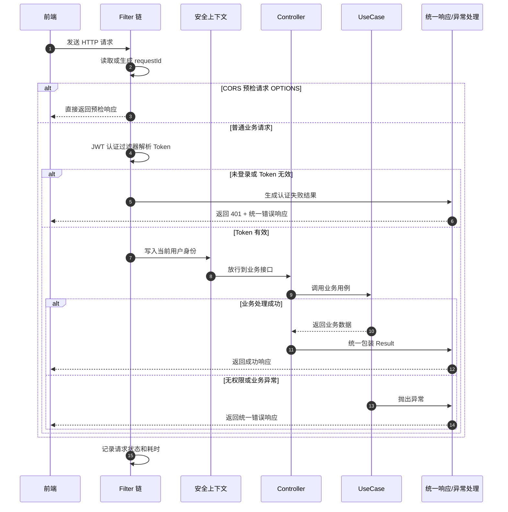

# 接口 Filter 与统一处理简化时序图

> 本图用于论文“接口与服务交互设计”小节，简化描述前端请求进入 Java 后端后，经过请求编号、跨域与认证、安全上下文、业务接口、统一响应和异常处理的大致流程。

## 说明

- Filter 链中主要包含请求编号处理、CORS 处理和 JWT 认证处理。
- requestId 会写入请求上下文、日志上下文和响应头，便于定位一次完整请求。
- JWT 认证成功后，当前用户身份会写入 Spring Security 上下文。
- 控制器只负责接收请求和调用业务用例，统一响应和异常转换由全局处理机制完成。
- 未登录、无权限、参数错误和业务异常都会返回统一格式的 JSON 结果。
