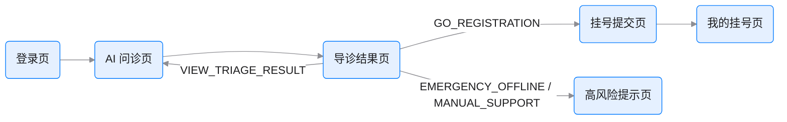
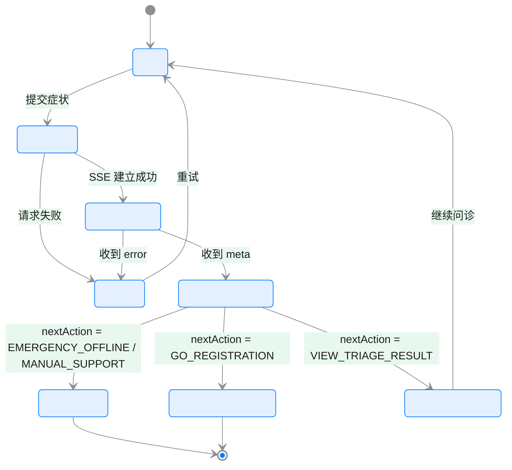

# P0 前端页面原型清单与状态流转图

> 状态：Frontend Prototype Checklist
>
> 目标：把 `P0` 前端页面进一步具体化为原型块清单和状态流转图，方便直接画页面和排前端任务。

## 1. 使用方式

- 页面任务拆分以 [00D-P0-FRONTEND-TASKS.md](./00D-P0-FRONTEND-TASKS.md) 为准
- 页面接口口径以 [../docs/10A-JAVA_AI_API_CONTRACT.md](../docs/10A-JAVA_AI_API_CONTRACT.md) 为准
- `nextAction` 的解释只看结构化字段，不从文案里猜测

## 2. 患者 H5 原型清单

## 2.1 登录页

| 区块 | 最少内容 |
|------|----------|
| 顶部区 | 系统名、简短说明 |
| 表单区 | 用户名、密码、登录按钮 |
| 状态区 | 登录失败提示、加载态 |

## 2.2 AI 问诊页

| 区块 | 最少内容 |
|------|----------|
| 头部区 | 当前会话标题、返回按钮 |
| 对话区 | 用户消息、AI 消息、流式加载占位 |
| 引用区 | 引用片段列表、来源摘要 |
| 风险区 | `riskLevel`、免责声明、下一步动作提示 |
| 输入区 | 文本框、发送按钮、发送中禁用态 |

## 2.3 导诊结果页

| 区块 | 最少内容 |
|------|----------|
| 摘要卡片 | 主诉摘要、风险结果 |
| 科室推荐卡 | 推荐科室、推荐理由 |
| 引用卡 | 引用片段和依据 |
| CTA 区 | 继续问诊、去挂号、返回首页 |

## 2.4 高风险提示页

| 区块 | 最少内容 |
|------|----------|
| 风险卡 | 高风险提示标题、紧急说明 |
| 行动卡 | 紧急就医提示、人工求助入口占位 |
| 说明卡 | 系统边界与免责声明 |

## 2.5 挂号提交页

| 区块 | 最少内容 |
|------|----------|
| 推荐摘要区 | 推荐科室、AI 来源摘要 |
| 门诊列表区 | `clinic_session` 列表 |
| 号源选择区 | `clinic_slot` 选择 |
| 提交区 | 确认挂号按钮、提交结果提示 |

## 2.6 我的挂号页

| 区块 | 最少内容 |
|------|----------|
| 列表区 | 挂号号单、状态、时间 |
| 来源区 | 是否来自 AI 导诊 |
| 详情入口 | 查看接诊进度或基础详情 |

## 3. 医生 Web 原型清单

## 3.1 工作台页

| 区块 | 最少内容 |
|------|----------|
| 顶部导航 | 工作台、接诊、病历、处方 |
| 待办区 | 今日待接诊数量、快捷入口 |
| 列表入口区 | 进入接诊列表 |

## 3.2 接诊列表/详情页

| 区块 | 最少内容 |
|------|----------|
| 列表区 | 患者、挂号时间、状态 |
| 基本信息区 | 患者基础信息、挂号信息 |
| AI 摘要区 | 主诉摘要、风险等级、引用摘要 |
| 操作区 | 去写病历、去写处方 |

## 3.3 病历编辑页

| 区块 | 最少内容 |
|------|----------|
| 患者信息区 | 患者与接诊信息 |
| 病历表单区 | 主诉、现病史、查体摘要 |
| 诊断区 | 诊断项录入 |
| 提交区 | 保存按钮、保存结果反馈 |

## 3.4 处方编辑页

| 区块 | 最少内容 |
|------|----------|
| 患者信息区 | 患者与接诊信息 |
| 处方头区 | 处方基本信息 |
| 处方项区 | 药品项列表 |
| 提交区 | 保存按钮、保存结果反馈 |

## 4. 管理员审计页原型清单

| 区块 | 最少内容 |
|------|----------|
| 查询区 | 时间范围、用户、资源类型筛选 |
| 审计列表区 | `audit_event` 列表 |
| 访问日志区 | `data_access_log` 列表 |

## 5. 患者主链路页面流转图

## 6. AI 问诊页状态流转图

## 7. 医生主链路页面流转图

## 8. 页面实现顺序

1. 登录页
2. AI 问诊页
3. 导诊结果页
4. 高风险提示页
5. 挂号提交页
6. 我的挂号页
7. 工作台
8. 接诊列表/详情页
9. 病历编辑页
10. 处方编辑页
11. 审计查询页

## 9. 设计约束

- AI 结果页必须展示结构化结果，不只是一段对话文本
- 高风险页必须与普通导诊结果页分开，避免用户误以为还能继续普通问答
- 医生页默认只显示 AI 摘要，不默认暴露 AI 原文
- 页面所有成功/失败判断都以 `code` 和 `nextAction` 为准

## 10. 一句话结论

前端真正需要先定下来的不是组件库细节，而是每一页最少要承接什么信息、下一页往哪里走，以及高风险分支如何和普通流程彻底分开。
