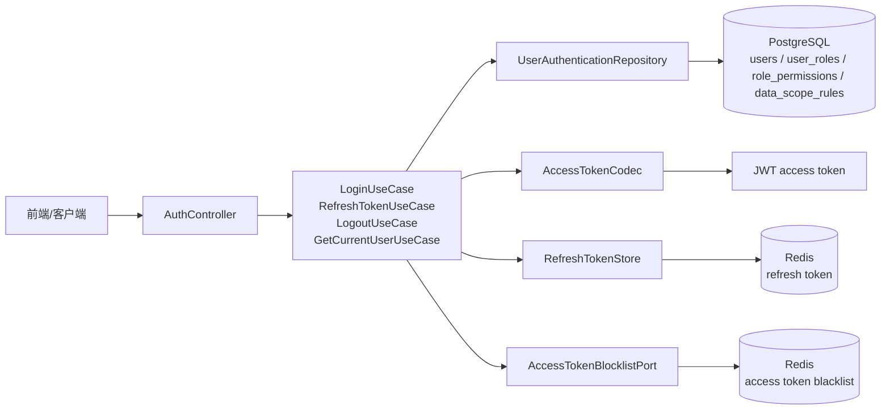
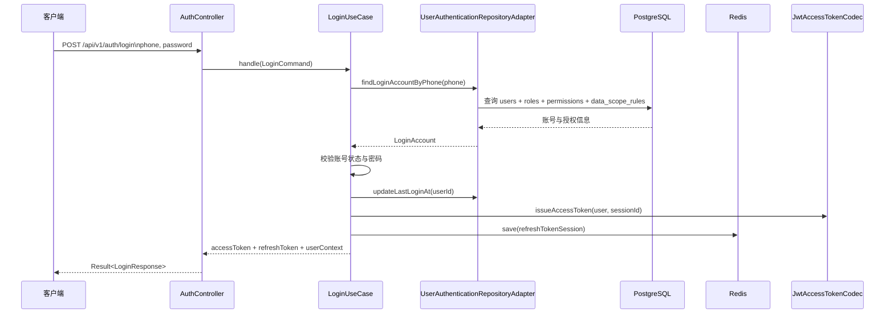
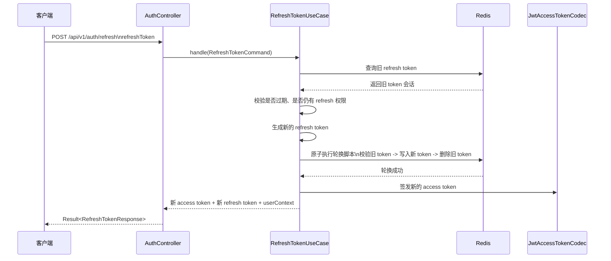
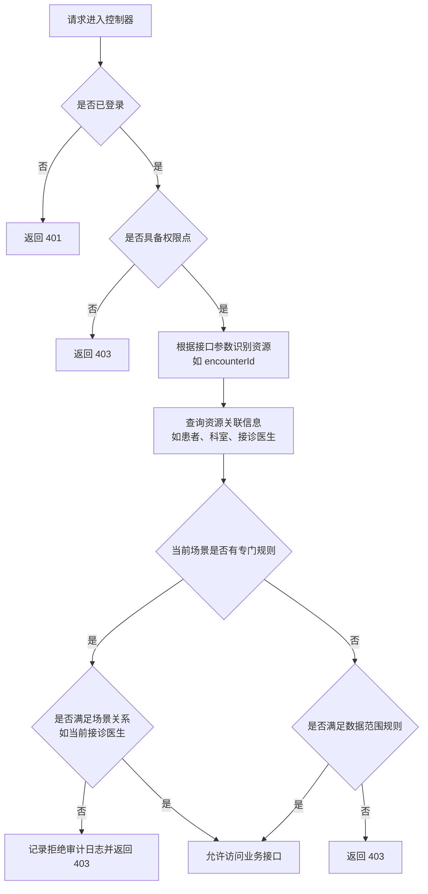

# 4.1 用户认证与授权模块设计与实现

本系统的用户认证与授权模块主要解决三个问题：第一，系统要先确认“当前访问者是谁”；第二，系统要判断“他具有什么身份和权限”；第三，系统还要进一步判断“他能不能访问当前这条具体业务数据”。结合本课题的实际场景，系统中既有患者、医生，也有管理员，不同角色可访问的功能差异较大，如果只做简单登录校验，后续的病历查看、处方查看和后台管理都会存在越权风险。因此，本系统在实现上采用了“登录认证 + 角色权限控制 + 数据范围控制”的组合方式，其中登录态由 Java 后端统一负责，Python 侧 AI 服务不单独处理用户登录，而是由 Java 完成认证后再作为网关转发请求，这样可以避免两套身份体系并存，减少系统复杂度。

从整体结构上看，该模块依然遵循系统的分层设计思路：`mediask-api` 负责接口入口和 Spring Security 过滤链，`mediask-application` 负责登录、刷新、退出和授权判定等用例编排，`mediask-domain` 定义认证用户、令牌、权限规则等核心模型，`mediask-infra` 负责 JWT 编解码、Redis 存储以及数据库查询。系统只将 `POST /api/v1/auth/login` 和 `POST /api/v1/auth/refresh` 设为公开接口，其他 `/api/**` 请求默认都需要登录，这一点在 `SecurityConfig` 中通过 `SessionCreationPolicy.STATELESS` 和公开路径白名单完成配置，说明本系统采用的是无状态认证方式，不依赖传统服务端 Session。其结构如图 4-1 所示。

在认证实现上，系统提供了登录、刷新、退出和获取当前用户四个核心接口。登录时，`AuthController` 接收手机号和密码，请求进入 `LoginUseCase` 后，系统先根据手机号到 `users` 表查询账号，再加载该用户的角色、权限和数据范围规则，随后使用 Spring Security 提供的 `BCryptPasswordEncoder` 校验密码。若账号被禁用、锁定，或者没有分配角色，系统会直接拒绝登录；校验通过后，系统会更新最近登录时间，并签发一对新的令牌。其中 access token 采用 JWT，内部保存 `userId`、`tokenId` 和 `sessionId` 等信息；refresh token 则采用自定义格式 `rt.userId.tokenId.tokenSecret`，并存入 Redis。登录成功后，接口除了返回 access token 和 refresh token，还会返回 `userContext`，其中包含 `userId`、`roles`、`permissions`、`dataScopeRules` 以及患者或医生对应的业务身份标识。这样做的好处是，前端拿到令牌的同时，也能立即知道当前用户属于患者、医生还是管理员。登录时序如图 4-2 所示。

为了避免用户频繁重新登录，系统引入了 refresh token 机制。当前 access token 失效后，客户端可以调用 `/api/v1/auth/refresh`，系统先去 Redis 中查找 refresh token，会校验它是否存在、是否过期，以及当前用户是否仍然具有 `auth:refresh` 权限；检查通过后，系统会生成新的 refresh token，并通过 Redis 原子轮换旧 token，随后重新签发新的 access token。这里所谓“原子轮换”，可以理解为“旧 token 删除”和“新 token 写入”必须一次性完成，中间不能被其他请求打断。因为如果先删旧 token、再存新 token，或者先存新 token、旧 token 还没来得及删掉，就可能在短时间内出现并发刷新问题，例如同一个旧 refresh token 被连续提交两次，导致系统错误地签发多组新令牌。当前实现中，这一步不是分两次普通写入，而是通过 Redis 脚本在一次操作中同时校验旧 token、写入新 token、删除旧 token，这样可以保证同一个 refresh token 成功刷新后就立即失效，避免重复使用，提高登录态轮换的安全性和一致性。退出登录时，系统并不是只删除 refresh token，而是同时检查 access token 和 refresh token 是否属于同一用户、同一会话，如果匹配成功，就把 access token 的 `tokenId` 放入 Redis 黑名单，并删除对应 refresh token。这样做的目的，是防止用户退出后旧 access token 在有效期内仍被继续使用。与此同时，`/api/v1/auth/me` 不直接返回 token 中的静态内容，而是重新从数据库读取当前用户上下文，因此当管理员调整了用户角色或权限后，系统可以更快反映最新授权状态。refresh token 轮换流程如图 4-3 所示。

本系统的授权控制可以概括为三层。第一层是角色和身份限制，用来判断用户能不能进入某一类功能，例如患者、医生和管理员能访问的接口并不相同，这一部分一方面依赖 `roles`、`user_roles` 等表确定用户身份，另一方面也会结合当前登录用户上下文中的患者 ID、医生 ID 等业务身份字段进行限制。第二层是权限点控制，用来判断用户能不能执行某个具体操作，例如查看病历、创建处方、更新接诊状态等，这一部分主要由 `permissions` 和 `role_permissions` 实现。除此之外，系统还会通过 `data_scope_rules` 给用户附加一个通用的数据范围边界，例如 `SELF` 表示只能查看自己的数据，`DEPARTMENT` 表示可以查看本科室范围内的数据，`ALL` 表示可以查看更大范围的数据。第三层才是对象级授权，它解决的是“当前这一条具体记录到底能不能访问”的问题。到了这一层，系统关心的已经不只是“你是不是医生”或者“你有没有读取权限”，而是要进一步判断这条记录和当前用户之间是否存在有效业务关系。也正因为如此，`data_scope_rules` 更适合表达一般性的范围规则，但不能覆盖所有具体场景。例如，医生查看患者历史病历时，系统真正关心的往往不是这份历史病历原来属于哪个科室，而是当前医生是不是这次接诊的接诊医生。因此，对象级授权不能简单理解为对 `data_scope_rules` 再做一次判断，而是要结合请求参数、业务对象归属以及当前场景一起分析。

在具体实现上，系统通过 `@AuthorizeScenario` 注解标记需要进行场景授权的接口。这个注解的作用不是简单区分患者接口或医生接口，而是声明“这个接口对应哪个授权场景”，再由 `ScenarioAuthorizationAspect` 在方法执行前统一拦截，并交给 `AuthorizationDecisionService` 完成后续判断。处理过程中，系统会先检查当前用户是否具备该场景要求的权限点，再根据接口参数识别目标资源，例如病历和处方接口会从 `encounterId` 中定位具体业务对象；随后，资源解析器会查询这个对象关联的患者、科室以及接诊医生等信息，并把结果统一封装成授权上下文对象。需要说明的是，这个授权上下文本身是统一的，但不同资源会有各自的解析实现，也就是说病历、处方等接口虽然最终都进入同一套授权判断流程，但它们的归属信息提取方式并不完全相同。最后，系统再按当前场景决定是否允许访问。对于一般场景，系统会参考权限点和 `data_scope_rules`；而对于“查看接诊患者历史病历”这类场景，系统会优先依据接诊关系判断当前医生是否有权访问，而不是机械地按科室范围进行拦截。如果权限不足，系统直接返回 `403`，并对敏感访问失败进行审计留痕。其判定流程如图 4-4 所示。

从数据存储设计来看，本模块的基础表主要包括 `users`、`roles`、`permissions`、`user_roles`、`role_permissions` 和 `data_scope_rules`。其中，`users` 表保存账号、密码散列、账号状态和最后登录时间；`user_roles` 和 `role_permissions` 负责角色与权限点的映射；`data_scope_rules` 则负责描述某个角色对哪类资源具有什么范围的数据访问能力。代码实现中，`UserAuthenticationRepositoryAdapter` 会在用户登录或鉴权时，一次性组装出 `AuthenticatedUser` 对象，把角色、权限、数据范围、患者 ID、医生 ID、主科室 ID 一并带出，这样后续接口无需重复查询零散信息，既保证了结构清晰，也能减少业务代码中的判断分支。

另外，本系统在安全细节上还做了几项较为务实的处理。其一，认证失败和权限不足分别返回 `401` 和 `403`，并统一使用 `Result<T>` 包装响应，保证前后端交互格式一致。其二，系统会在安全异常响应中回写 `requestId`，便于排查问题和串联日志。其三，登录和退出等关键动作会写入审计日志，而对病历、处方等敏感资源的拒绝访问也会保留记录，这对于医疗场景下的责任追踪是有必要的。总体来看，本系统的用户认证与授权模块没有追求过度复杂的安全框架，而是在 Spring Security、JWT、Redis 和数据库 RBAC 之上，结合患者、医生、管理员三类角色的实际业务需求，完成了一套较完整且便于实现的访问控制方案，能够满足本课题在门诊挂号、医生接诊、病历处方以及 AI 辅助问诊等场景中的基本安全要求。
