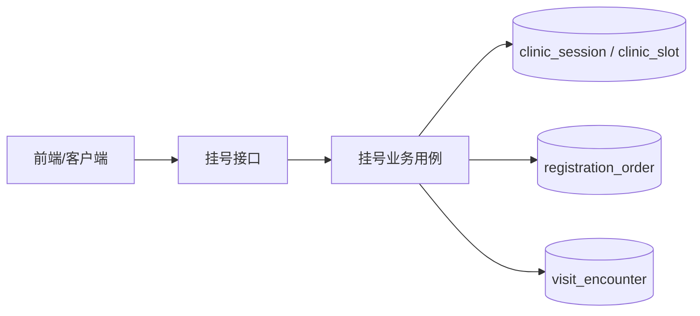
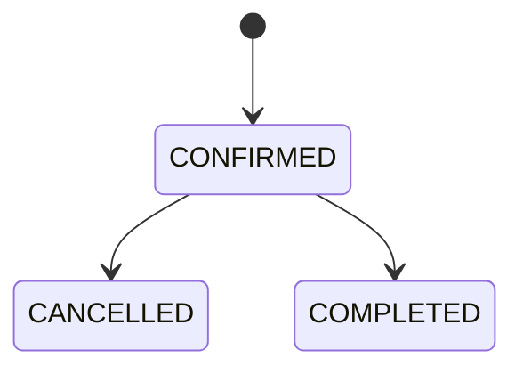
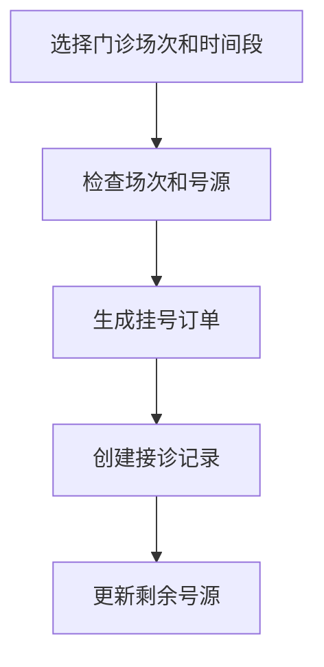

# 4.3 门诊挂号模块设计与实现

门诊挂号模块位于本系统业务流程的中间位置，前面承接患者的导诊结果，后面连接医生接诊、病历和处方等功能。它的主要作用是让患者查询可用门诊、选择具体时间段并完成挂号，同时保证挂号结果能够继续流转到后续就诊环节。结合本系统的实现，挂号成功后不会只生成一条订单记录，还会同步生成对应的接诊记录，这样医生端后续可以直接进入接诊流程。

从功能上看，本模块主要包括门诊场次查询、可用时段查询、创建挂号、挂号记录查询和取消挂号几个部分。患者先查询开放的门诊场次，再查看某个场次下可预约的具体时间段，最后提交挂号请求。当前代码中，挂号相关接口需要用户先登录，而真正的创建挂号和取消挂号操作只允许患者身份访问，这样可以避免非患者用户误用挂号功能。

在领域建模上，系统以 `RegistrationOrder` 作为挂号核心对象，保存患者、医生、科室、场次、时间槽、费用和状态等信息。当前实现中的挂号状态主要有 `CONFIRMED`、`CANCELLED` 和 `COMPLETED` 三种，分别表示已挂号、已取消和已完成接诊。这样设计的好处是，挂号模块不仅能描述预约行为，也能和后续接诊状态保持一致。其状态变化如图 4-6 所示。

挂号创建时，系统会先检查门诊场次是否开放，再检查所选时间槽是否可用，只有通过后才会写入挂号订单，并同步创建一条待接诊记录。同时，系统会更新剩余号源数量，避免同一时间段被重复占用。取消挂号时，系统则会先确认这条挂号属于当前患者，并判断是否仍处于可取消状态；若允许取消，就会更新挂号状态并释放对应号源。挂号流程如图 4-7 所示。

从数据库设计来看，本模块主要涉及 `clinic_session`、`clinic_slot`、`registration_order` 和 `visit_encounter` 四张表，分别对应门诊场次、具体时间槽、挂号订单和接诊记录。这样的设计把“可挂号资源”和“挂号结果”分开保存，结构比较清晰，也便于后续扩展。此外，当前实现还支持在挂号时记录 `sourceAiSessionId`，用于把患者此前的 AI 导诊结果和后续线下接诊流程关联起来。

总体来说，本系统的门诊挂号模块实现较为直接，重点放在号源管理、挂号状态流转以及和后续接诊流程的衔接上。通过门诊场次与具体时间槽的建模，系统能够较准确地控制号源；通过挂号后同步生成接诊记录，又保证了后续诊疗流程可以顺利接续，能够满足本课题对门诊挂号功能的基本需求。
